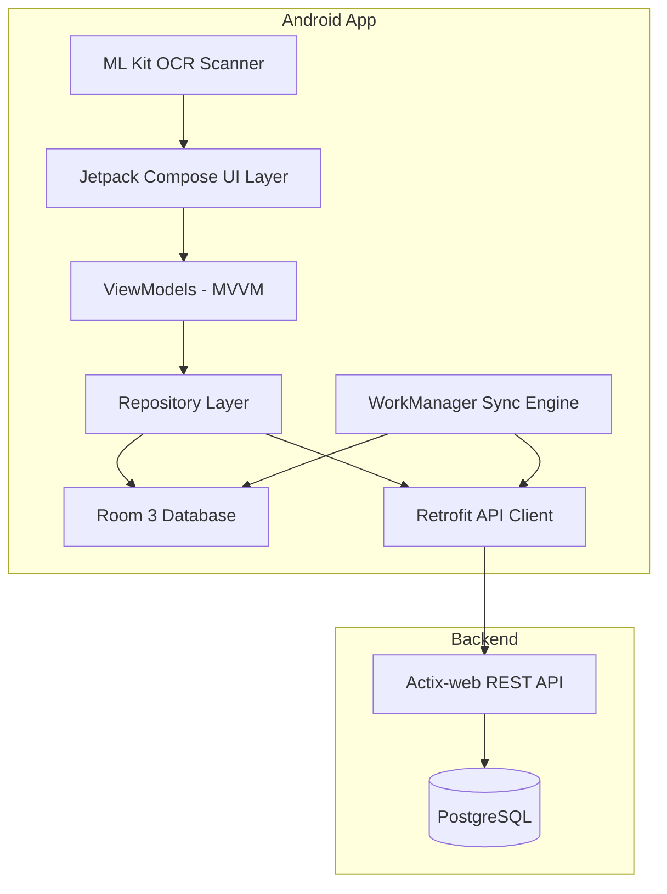
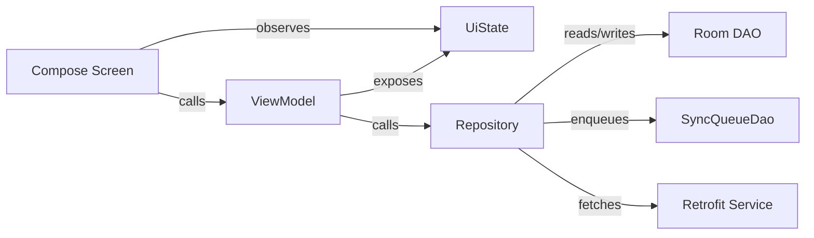

# Design Document: PropManager Android App

## Overview

Native Kotlin Android application for the PropManager property management system. The app targets the gerente (manager) role in the Dominican Republic, providing full CRUD on properties, tenants, contracts, payments, expenses, and maintenance requests. It consumes the existing Actix-web REST API (`/api/*` endpoints) with JWT Bearer authentication.

The architecture follows Google's official Android guidance: multi-module Gradle project, MVVM with Jetpack Compose UI, Room 3 for offline-first local persistence, Hilt for dependency injection, Retrofit + OkHttp for networking, WorkManager for background sync, and ML Kit for on-device OCR. All UI is in Spanish with Dominican locale conventions (DD/MM/YYYY, RD$/US$ currency formatting).

The backend API uses camelCase JSON field names, UUIDs for all primary keys, YYYY-MM-DD for dates, ISO8601 for datetimes, and DECIMAL strings for monetary values. The Android app must serialize/deserialize accordingly and convert to DD/MM/YYYY for display only.

## Architecture

### High-Level Architecture



### Data Flow Pattern

The app follows an offline-first strategy:

1. All reads go through Room first (single source of truth for offline-capable entities)
2. Writes are persisted to Room immediately, then enqueued in a sync queue
3. WorkManager processes the sync queue when connectivity is available
4. Background refresh pulls server data at configurable intervals (default 15 min)
5. Online-only features (dashboard, reports, documents, audit log, import) fetch directly from the API with local caching where appropriate

### MVVM Pattern



Each feature screen observes a sealed `UiState` class from its ViewModel. The ViewModel calls repository methods that coordinate between Room and the API. Form validation happens in the ViewModel before any persistence.


### Multi-Module Architecture

Following Google's official Android modularization guidance:

```
android/
├── build.gradle.kts              # Root build with plugin aliases
├── settings.gradle.kts           # Module includes + dependency resolution
├── app/                          # :app — Application module
│   ├── build.gradle.kts
│   └── src/main/kotlin/com/propmanager/
│       ├── PropManagerApp.kt     # @HiltAndroidApp Application class
│       ├── MainActivity.kt       # Single-activity host
│       └── navigation/           # Navigation3 graph + NavHost
├── core/
│   ├── data/                     # :core:data — Repositories, sync engine
│   ├── database/                 # :core:database — Room DB, DAOs, entities
│   ├── network/                  # :core:network — Retrofit services, OkHttp, auth interceptor
│   ├── model/                    # :core:model — Shared domain models (pure Kotlin)
│   ├── common/                   # :core:common — Formatters, validators, constants
│   └── ui/                       # :core:ui — Shared Compose components, theme, strings
├── feature/
│   ├── auth/                     # :feature:auth — Login screen + ViewModel
│   ├── dashboard/                # :feature:dashboard — Dashboard screen
│   ├── propiedades/              # :feature:propiedades — List, detail, form
│   ├── inquilinos/               # :feature:inquilinos — List, detail, form
│   ├── contratos/                # :feature:contratos — List, detail, form, renew, terminate
│   ├── pagos/                    # :feature:pagos — List, form, receipt
│   ├── gastos/                   # :feature:gastos — List, form, category summary
│   ├── mantenimiento/            # :feature:mantenimiento — List, detail, form, notes
│   ├── reportes/                 # :feature:reportes — Report viewer + export
│   ├── documentos/               # :feature:documentos — Upload + list
│   ├── notificaciones/           # :feature:notificaciones — Overdue payments list
│   ├── auditoria/                # :feature:auditoria — Audit log viewer
│   ├── perfil/                   # :feature:perfil — Profile + password change
│   ├── configuracion/            # :feature:configuracion — Currency config
│   ├── importacion/              # :feature:importacion — CSV/XLSX import
│   └── scanner/                  # :feature:scanner — ML Kit OCR camera
└── gradle/
    └── libs.versions.toml        # Version catalog
```

Module dependency rules:
- `:feature:*` modules depend on `:core:data`, `:core:model`, `:core:ui`, `:core:common`
- `:core:data` depends on `:core:database`, `:core:network`, `:core:model`
- `:core:database` depends on `:core:model`
- `:core:network` depends on `:core:model`
- Feature modules never depend on each other
- `:core:model` has zero Android dependencies (pure Kotlin)

## Components and Interfaces

### Core Network — Retrofit Services

The API client layer mirrors the backend route structure. All services return `Response<T>` to allow the repository layer to handle HTTP errors uniformly.

```kotlin
// :core:network

interface AuthApiService {
    @POST("api/auth/login")
    suspend fun login(@Body request: LoginRequest): Response<LoginResponse>
}

interface PropiedadesApiService {
    @GET("api/propiedades")
    suspend fun list(@QueryMap filters: Map<String, String>): Response<PaginatedResponse<PropiedadDto>>

    @GET("api/propiedades/{id}")
    suspend fun getById(@Path("id") id: String): Response<PropiedadDto>

    @POST("api/propiedades")
    suspend fun create(@Body request: CreatePropiedadRequest): Response<PropiedadDto>

    @PUT("api/propiedades/{id}")
    suspend fun update(@Path("id") id: String, @Body request: UpdatePropiedadRequest): Response<PropiedadDto>

    @DELETE("api/propiedades/{id}")
    suspend fun delete(@Path("id") id: String): Response<Unit>
}

// Same pattern for InquilinosApiService, ContratosApiService, PagosApiService,
// GastosApiService, MantenimientoApiService, DashboardApiService, ReportesApiService,
// DocumentosApiService, NotificacionesApiService, AuditoriaApiService,
// ConfiguracionApiService, ImportacionApiService, PerfilApiService
```

### Auth Interceptor

```kotlin
class AuthInterceptor @Inject constructor(
    private val tokenProvider: TokenProvider
) : Interceptor {
    override fun intercept(chain: Interceptor.Chain): okhttp3.Response {
        val token = tokenProvider.getToken()
        val request = if (token != null) {
            chain.request().newBuilder()
                .addHeader("Authorization", "Bearer $token")
                .build()
        } else {
            chain.request()
        }
        return chain.proceed(request)
    }
}
```

### Token Provider — EncryptedSharedPreferences

```kotlin
interface TokenProvider {
    fun getToken(): String?
    fun saveToken(token: String)
    fun clearToken()
    fun saveUserProfile(user: UserProfile)
    fun getUserProfile(): UserProfile?
    fun clearAll()
}

class EncryptedTokenProvider @Inject constructor(
    @ApplicationContext context: Context
) : TokenProvider {
    private val prefs = EncryptedSharedPreferences.create(
        context,
        "propmanager_secure_prefs",
        MasterKey.Builder(context).setKeyScheme(MasterKey.KeyScheme.AES256_GCM).build(),
        EncryptedSharedPreferences.PrefKeyEncryptionScheme.AES256_SIV,
        EncryptedSharedPreferences.PrefValueEncryptionScheme.AES256_GCM
    )
    // Implementation stores token, user id, nombre, email, rol as individual keys
}
```

### Core Database — Room DAOs

Each offline-capable entity has a DAO exposing Flow-based queries for reactive UI updates and suspend functions for writes.

```kotlin
// :core:database

@Dao
interface PropiedadDao {
    @Query("SELECT * FROM propiedades ORDER BY titulo ASC")
    fun observeAll(): Flow<List<PropiedadEntity>>

    @Query("SELECT * FROM propiedades WHERE id = :id")
    fun observeById(id: String): Flow<PropiedadEntity?>

    @Query("SELECT * FROM propiedades WHERE (:ciudad IS NULL OR ciudad = :ciudad) AND (:estado IS NULL OR estado = :estado) AND (:tipoPropiedad IS NULL OR tipo_propiedad = :tipoPropiedad)")
    fun observeFiltered(ciudad: String?, estado: String?, tipoPropiedad: String?): Flow<List<PropiedadEntity>>

    @Upsert
    suspend fun upsert(entity: PropiedadEntity)

    @Upsert
    suspend fun upsertAll(entities: List<PropiedadEntity>)

    @Query("UPDATE propiedades SET is_deleted = 1 WHERE id = :id")
    suspend fun markDeleted(id: String)

    @Query("DELETE FROM propiedades")
    suspend fun deleteAll()
}

// Same pattern for InquilinoDao, ContratoDao, PagoDao, GastoDao, SolicitudMantenimientoDao
```

### Sync Queue DAO

```kotlin
@Dao
interface SyncQueueDao {
    @Query("SELECT * FROM sync_queue ORDER BY created_at ASC")
    suspend fun getAllPending(): List<SyncQueueEntry>

    @Insert
    suspend fun enqueue(entry: SyncQueueEntry)

    @Delete
    suspend fun remove(entry: SyncQueueEntry)

    @Query("SELECT COUNT(*) FROM sync_queue")
    fun observePendingCount(): Flow<Int>
}
```

### Repository Pattern

Each feature repository coordinates between the local database and remote API:

```kotlin
class PropiedadesRepository @Inject constructor(
    private val propiedadDao: PropiedadDao,
    private val syncQueueDao: SyncQueueDao,
    private val apiService: PropiedadesApiService,
    private val networkMonitor: NetworkMonitor
) {
    fun observeAll(): Flow<List<Propiedad>> =
        propiedadDao.observeAll().map { entities -> entities.filter { !it.isDeleted }.map { it.toDomain() } }

    suspend fun create(request: CreatePropiedadRequest): Result<Propiedad> {
        val entity = request.toEntity(id = UUID.randomUUID().toString())
        propiedadDao.upsert(entity)
        syncQueueDao.enqueue(SyncQueueEntry(
            entityType = "propiedad",
            entityId = entity.id,
            operation = "CREATE",
            payload = Json.encodeToString(request),
            createdAt = Instant.now().toEpochMilli()
        ))
        return Result.success(entity.toDomain())
    }

    suspend fun refreshFromServer(): Result<Unit> {
        // Fetch all pages from API, upsertAll into Room
    }
}
```

### Sync Engine — WorkManager

```kotlin
@HiltWorker
class SyncWorker @AssistedInject constructor(
    @Assisted context: Context,
    @Assisted params: WorkerParameters,
    private val syncQueueDao: SyncQueueDao,
    private val apiServiceMap: Map<String, Any>, // entity type -> api service
    private val repositoryMap: Map<String, Any>  // entity type -> repository
) : CoroutineWorker(context, params) {

    override suspend fun doWork(): Result {
        val pending = syncQueueDao.getAllPending()
        for (entry in pending) {
            try {
                processEntry(entry)
                syncQueueDao.remove(entry)
            } catch (e: HttpException) {
                if (e.code() == 409) {
                    handleConflict(entry)
                    syncQueueDao.remove(entry)
                } else {
                    return Result.retry() // exponential backoff via WorkManager
                }
            } catch (e: IOException) {
                return Result.retry()
            }
        }
        return Result.success()
    }
}
```

### Periodic Refresh Worker

```kotlin
@HiltWorker
class PeriodicRefreshWorker @AssistedInject constructor(
    @Assisted context: Context,
    @Assisted params: WorkerParameters,
    private val repositories: List<RefreshableRepository>
) : CoroutineWorker(context, params) {

    override suspend fun doWork(): Result {
        repositories.forEach { it.refreshFromServer() }
        return Result.success()
    }
}
```

Scheduled via `PeriodicWorkRequestBuilder<PeriodicRefreshWorker>(15, TimeUnit.MINUTES)` with network-connected constraint.

### OCR Scanner — ML Kit

```kotlin
class CedulaOcrExtractor @Inject constructor() {
    suspend fun extractFromImage(image: InputImage): CedulaOcrResult {
        val recognizer = TextRecognition.getClient(TextRecognizerOptions.DEFAULT_OPTIONS)
        val visionText = recognizer.process(image).await()
        return parseCedulaText(visionText)
    }

    private fun parseCedulaText(text: Text): CedulaOcrResult {
        // Parse Dominican cédula format: extract nombre, apellido, cédula number
        // using regex patterns for the standard cédula layout
    }
}

class ReceiptOcrExtractor @Inject constructor() {
    suspend fun extractFromImage(image: InputImage): ReceiptOcrResult {
        val recognizer = TextRecognition.getClient(TextRecognizerOptions.DEFAULT_OPTIONS)
        val visionText = recognizer.process(image).await()
        return parseReceiptText(visionText)
    }

    private fun parseReceiptText(text: Text): ReceiptOcrResult {
        // Extract monto (currency patterns), fecha, proveedor, numero_factura
    }
}

data class CedulaOcrResult(
    val nombre: String?,
    val apellido: String?,
    val cedula: String?,
    val confidence: Float
)

data class ReceiptOcrResult(
    val monto: BigDecimal?,
    val fecha: LocalDate?,
    val proveedor: String?,
    val numeroFactura: String?,
    val confidence: Float
)
```

### Network Monitor

```kotlin
class NetworkMonitor @Inject constructor(
    @ApplicationContext context: Context
) {
    val isOnline: StateFlow<Boolean> // backed by ConnectivityManager.NetworkCallback
}
```

### Localization Utilities

```kotlin
// :core:common

object DateFormatter {
    private val displayFormat = DateTimeFormatter.ofPattern("dd/MM/yyyy")
    private val apiFormat = DateTimeFormatter.ISO_LOCAL_DATE // yyyy-MM-dd

    fun toDisplay(date: LocalDate): String = date.format(displayFormat)
    fun toApi(date: LocalDate): String = date.format(apiFormat)
    fun fromApi(dateString: String): LocalDate = LocalDate.parse(dateString, apiFormat)
    fun fromDisplay(dateString: String): LocalDate = LocalDate.parse(dateString, displayFormat)
}

object CurrencyFormatter {
    fun format(amount: BigDecimal, currency: String): String {
        val symbol = when (currency) {
            "DOP" -> "RD$"
            "USD" -> "US$"
            else -> currency
        }
        val formatted = NumberFormat.getNumberInstance(Locale("es", "DO")).apply {
            minimumFractionDigits = 2
            maximumFractionDigits = 2
        }.format(amount)
        return "$symbol $formatted"
    }
}
```

### Form Validation

```kotlin
// :core:common

sealed class ValidationResult {
    data object Valid : ValidationResult()
    data class Invalid(val message: String) : ValidationResult()
}

object PropiedadValidator {
    fun validateCreate(
        titulo: String,
        direccion: String,
        ciudad: String,
        provincia: String,
        tipoPropiedad: String,
        precio: String
    ): Map<String, ValidationResult> {
        return mapOf(
            "titulo" to requireNotBlank(titulo, "El título es requerido"),
            "direccion" to requireNotBlank(direccion, "La dirección es requerida"),
            "ciudad" to requireNotBlank(ciudad, "La ciudad es requerida"),
            "provincia" to requireNotBlank(provincia, "La provincia es requerida"),
            "tipoPropiedad" to requireNotBlank(tipoPropiedad, "El tipo de propiedad es requerido"),
            "precio" to requirePositiveDecimal(precio, "El precio debe ser mayor a cero")
        )
    }
}

// Same pattern for InquilinoValidator, ContratoValidator, PagoValidator,
// GastoValidator, SolicitudValidator
```

### Navigation — Navigation3

```kotlin
// :app navigation

@Composable
fun PropManagerNavHost(navController: NavController) {
    NavHost(navController) {
        authGraph(navController)
        dashboardGraph(navController)
        propiedadesGraph(navController)
        inquilinosGraph(navController)
        contratosGraph(navController)
        pagosGraph(navController)
        gastosGraph(navController)
        mantenimientoGraph(navController)
        reportesGraph(navController)
        documentosGraph(navController)
        notificacionesGraph(navController)
        auditoriaGraph(navController)
        perfilGraph(navController)
        configuracionGraph(navController)
        importacionGraph(navController)
        scannerGraph(navController)
    }
}
```

Bottom navigation with 5 items: Dashboard, Propiedades, Inquilinos, Contratos, Más (overflow menu for remaining features).


## Data Models

### Room Database Schema

The Room database mirrors the backend entity structure. All IDs are stored as strings (UUID text representation). Monetary values use `String` storage with `BigDecimal` conversion via TypeConverters. Timestamps use `Long` (epoch millis).

```kotlin
@Database(
    entities = [
        PropiedadEntity::class,
        InquilinoEntity::class,
        ContratoEntity::class,
        PagoEntity::class,
        GastoEntity::class,
        SolicitudMantenimientoEntity::class,
        NotaMantenimientoEntity::class,
        SyncQueueEntry::class,
        DashboardCache::class
    ],
    version = 1,
    exportSchema = true
)
@TypeConverters(Converters::class)
abstract class PropManagerDatabase : RoomDatabase() {
    abstract fun propiedadDao(): PropiedadDao
    abstract fun inquilinoDao(): InquilinoDao
    abstract fun contratoDao(): ContratoDao
    abstract fun pagoDao(): PagoDao
    abstract fun gastoDao(): GastoDao
    abstract fun solicitudDao(): SolicitudMantenimientoDao
    abstract fun notaDao(): NotaMantenimientoDao
    abstract fun syncQueueDao(): SyncQueueDao
    abstract fun dashboardCacheDao(): DashboardCacheDao
}
```

### Room Entities

```kotlin
@Entity(tableName = "propiedades")
data class PropiedadEntity(
    @PrimaryKey val id: String,
    val titulo: String,
    val descripcion: String?,
    val direccion: String,
    val ciudad: String,
    val provincia: String,
    @ColumnInfo(name = "tipo_propiedad") val tipoPropiedad: String,
    val habitaciones: Int?,
    val banos: Int?,
    @ColumnInfo(name = "area_m2") val areaM2: String?,       // BigDecimal as String
    val precio: String,                                        // BigDecimal as String
    val moneda: String,
    val estado: String,
    val imagenes: String?,                                     // JSON array as String
    @ColumnInfo(name = "created_at") val createdAt: Long,
    @ColumnInfo(name = "updated_at") val updatedAt: Long,
    @ColumnInfo(name = "is_deleted") val isDeleted: Boolean = false,
    @ColumnInfo(name = "is_pending_sync") val isPendingSync: Boolean = false
)

@Entity(tableName = "inquilinos")
data class InquilinoEntity(
    @PrimaryKey val id: String,
    val nombre: String,
    val apellido: String,
    val email: String?,
    val telefono: String?,
    val cedula: String,
    @ColumnInfo(name = "contacto_emergencia") val contactoEmergencia: String?,
    val notas: String?,
    @ColumnInfo(name = "created_at") val createdAt: Long,
    @ColumnInfo(name = "updated_at") val updatedAt: Long,
    @ColumnInfo(name = "is_deleted") val isDeleted: Boolean = false,
    @ColumnInfo(name = "is_pending_sync") val isPendingSync: Boolean = false
)

@Entity(
    tableName = "contratos",
    foreignKeys = [
        ForeignKey(entity = PropiedadEntity::class, parentColumns = ["id"], childColumns = ["propiedad_id"]),
        ForeignKey(entity = InquilinoEntity::class, parentColumns = ["id"], childColumns = ["inquilino_id"])
    ],
    indices = [Index("propiedad_id"), Index("inquilino_id")]
)
data class ContratoEntity(
    @PrimaryKey val id: String,
    @ColumnInfo(name = "propiedad_id") val propiedadId: String,
    @ColumnInfo(name = "inquilino_id") val inquilinoId: String,
    @ColumnInfo(name = "fecha_inicio") val fechaInicio: String,   // yyyy-MM-dd
    @ColumnInfo(name = "fecha_fin") val fechaFin: String,         // yyyy-MM-dd
    @ColumnInfo(name = "monto_mensual") val montoMensual: String, // BigDecimal as String
    val deposito: String?,                                         // BigDecimal as String
    val moneda: String,
    val estado: String,
    @ColumnInfo(name = "created_at") val createdAt: Long,
    @ColumnInfo(name = "updated_at") val updatedAt: Long,
    @ColumnInfo(name = "is_deleted") val isDeleted: Boolean = false,
    @ColumnInfo(name = "is_pending_sync") val isPendingSync: Boolean = false
)

@Entity(
    tableName = "pagos",
    foreignKeys = [ForeignKey(entity = ContratoEntity::class, parentColumns = ["id"], childColumns = ["contrato_id"])],
    indices = [Index("contrato_id")]
)
data class PagoEntity(
    @PrimaryKey val id: String,
    @ColumnInfo(name = "contrato_id") val contratoId: String,
    val monto: String,
    val moneda: String,
    @ColumnInfo(name = "fecha_pago") val fechaPago: String?,
    @ColumnInfo(name = "fecha_vencimiento") val fechaVencimiento: String,
    @ColumnInfo(name = "metodo_pago") val metodoPago: String?,
    val estado: String,
    val notas: String?,
    @ColumnInfo(name = "created_at") val createdAt: Long,
    @ColumnInfo(name = "updated_at") val updatedAt: Long,
    @ColumnInfo(name = "is_deleted") val isDeleted: Boolean = false,
    @ColumnInfo(name = "is_pending_sync") val isPendingSync: Boolean = false
)

@Entity(
    tableName = "gastos",
    foreignKeys = [ForeignKey(entity = PropiedadEntity::class, parentColumns = ["id"], childColumns = ["propiedad_id"])],
    indices = [Index("propiedad_id")]
)
data class GastoEntity(
    @PrimaryKey val id: String,
    @ColumnInfo(name = "propiedad_id") val propiedadId: String,
    @ColumnInfo(name = "unidad_id") val unidadId: String?,
    val categoria: String,
    val descripcion: String,
    val monto: String,
    val moneda: String,
    @ColumnInfo(name = "fecha_gasto") val fechaGasto: String,
    val estado: String,
    val proveedor: String?,
    @ColumnInfo(name = "numero_factura") val numeroFactura: String?,
    val notas: String?,
    @ColumnInfo(name = "created_at") val createdAt: Long,
    @ColumnInfo(name = "updated_at") val updatedAt: Long,
    @ColumnInfo(name = "is_deleted") val isDeleted: Boolean = false,
    @ColumnInfo(name = "is_pending_sync") val isPendingSync: Boolean = false
)

@Entity(
    tableName = "solicitudes_mantenimiento",
    foreignKeys = [ForeignKey(entity = PropiedadEntity::class, parentColumns = ["id"], childColumns = ["propiedad_id"])],
    indices = [Index("propiedad_id")]
)
data class SolicitudMantenimientoEntity(
    @PrimaryKey val id: String,
    @ColumnInfo(name = "propiedad_id") val propiedadId: String,
    @ColumnInfo(name = "unidad_id") val unidadId: String?,
    @ColumnInfo(name = "inquilino_id") val inquilinoId: String?,
    val titulo: String,
    val descripcion: String?,
    val estado: String,
    val prioridad: String,
    @ColumnInfo(name = "nombre_proveedor") val nombreProveedor: String?,
    @ColumnInfo(name = "telefono_proveedor") val telefonoProveedor: String?,
    @ColumnInfo(name = "email_proveedor") val emailProveedor: String?,
    @ColumnInfo(name = "costo_monto") val costoMonto: String?,
    @ColumnInfo(name = "costo_moneda") val costoMoneda: String?,
    @ColumnInfo(name = "fecha_inicio") val fechaInicio: Long?,
    @ColumnInfo(name = "fecha_fin") val fechaFin: Long?,
    @ColumnInfo(name = "created_at") val createdAt: Long,
    @ColumnInfo(name = "updated_at") val updatedAt: Long,
    @ColumnInfo(name = "is_deleted") val isDeleted: Boolean = false,
    @ColumnInfo(name = "is_pending_sync") val isPendingSync: Boolean = false
)

@Entity(
    tableName = "notas_mantenimiento",
    foreignKeys = [ForeignKey(entity = SolicitudMantenimientoEntity::class, parentColumns = ["id"], childColumns = ["solicitud_id"])],
    indices = [Index("solicitud_id")]
)
data class NotaMantenimientoEntity(
    @PrimaryKey val id: String,
    @ColumnInfo(name = "solicitud_id") val solicitudId: String,
    @ColumnInfo(name = "autor_id") val autorId: String,
    val contenido: String,
    @ColumnInfo(name = "created_at") val createdAt: Long
)
```

### Sync Queue Entity

```kotlin
@Entity(tableName = "sync_queue")
data class SyncQueueEntry(
    @PrimaryKey(autoGenerate = true) val id: Long = 0,
    @ColumnInfo(name = "entity_type") val entityType: String,   // "propiedad", "inquilino", etc.
    @ColumnInfo(name = "entity_id") val entityId: String,
    val operation: String,                                       // "CREATE", "UPDATE", "DELETE"
    val payload: String,                                         // JSON-serialized request body
    @ColumnInfo(name = "created_at") val createdAt: Long,
    @ColumnInfo(name = "retry_count") val retryCount: Int = 0
)
```

### Dashboard Cache Entity

```kotlin
@Entity(tableName = "dashboard_cache")
data class DashboardCache(
    @PrimaryKey val key: String,        // "stats", "pagos_proximos", etc.
    val data: String,                    // JSON-serialized response
    @ColumnInfo(name = "cached_at") val cachedAt: Long
)
```

### Network DTOs (Kotlinx Serialization)

All DTOs use `@SerialName` for camelCase mapping to match the backend API.

```kotlin
@Serializable
data class LoginRequest(
    val email: String,
    val password: String
)

@Serializable
data class LoginResponse(
    val token: String,
    val user: UserDto
)

@Serializable
data class UserDto(
    val id: String,
    val nombre: String,
    val email: String,
    val rol: String,
    val activo: Boolean,
    @SerialName("createdAt") val createdAt: String
)

@Serializable
data class PropiedadDto(
    val id: String,
    val titulo: String,
    val descripcion: String? = null,
    val direccion: String,
    val ciudad: String,
    val provincia: String,
    @SerialName("tipoPropiedad") val tipoPropiedad: String,
    val habitaciones: Int? = null,
    val banos: Int? = null,
    @SerialName("areaM2") val areaM2: String? = null,
    val precio: String,
    val moneda: String,
    val estado: String,
    val imagenes: JsonElement? = null,
    @SerialName("createdAt") val createdAt: String,
    @SerialName("updatedAt") val updatedAt: String
)

@Serializable
data class PaginatedResponse<T>(
    val data: List<T>,
    val total: Long,
    val page: Long,
    @SerialName("perPage") val perPage: Long
)

@Serializable
data class ApiError(
    val error: String,
    val message: String
)
```

Similar DTOs exist for `InquilinoDto`, `ContratoDto`, `PagoDto`, `GastoDto`, `SolicitudDto`, `NotaDto`, and all dashboard/report response types, each mirroring the backend `*Response` models with camelCase `@SerialName` annotations.

### Domain Models (Pure Kotlin — :core:model)

```kotlin
data class Propiedad(
    val id: String,
    val titulo: String,
    val descripcion: String?,
    val direccion: String,
    val ciudad: String,
    val provincia: String,
    val tipoPropiedad: String,
    val habitaciones: Int?,
    val banos: Int?,
    val areaM2: BigDecimal?,
    val precio: BigDecimal,
    val moneda: String,
    val estado: String,
    val imagenes: List<String>,
    val createdAt: Instant,
    val updatedAt: Instant,
    val isPendingSync: Boolean
)

// Same pattern for Inquilino, Contrato, Pago, Gasto, SolicitudMantenimiento, NotaMantenimiento
// Each domain model uses proper Kotlin types: BigDecimal for money, LocalDate for dates,
// Instant for timestamps, and includes isPendingSync for UI sync indicators
```

### Type Converters

```kotlin
class Converters {
    @TypeConverter
    fun fromTimestamp(value: Long?): Instant? = value?.let { Instant.ofEpochMilli(it) }

    @TypeConverter
    fun toTimestamp(instant: Instant?): Long? = instant?.toEpochMilli()
}
```

### Mapping Strategy

Three-layer mapping: `DTO ↔ Entity ↔ Domain`

- `DTO → Entity`: After API fetch, convert network DTOs to Room entities for local storage
- `Entity → Domain`: When reading from Room, convert entities to domain models for ViewModel consumption
- `Domain → DTO`: When creating/updating, convert form data to network DTOs for API requests

Extension functions in each module handle these conversions (e.g., `PropiedadDto.toEntity()`, `PropiedadEntity.toDomain()`).


## Correctness Properties

*A property is a characteristic or behavior that should hold true across all valid executions of a system — essentially, a formal statement about what the system should do. Properties serve as the bridge between human-readable specifications and machine-verifiable correctness guarantees.*

### Property 1: Login response extraction round-trip

*For any* valid `LoginResponse` DTO containing a user profile with arbitrary id, nombre, email, and rol values, extracting and persisting the profile via `TokenProvider.saveUserProfile()` then reading it back via `TokenProvider.getUserProfile()` SHALL produce a `UserProfile` with identical field values.

**Validates: Requirements 1.2**

### Property 2: Auth interceptor attaches Bearer token

*For any* OkHttp request and any non-null stored JWT token string, passing the request through `AuthInterceptor.intercept()` SHALL produce a request whose `Authorization` header equals `"Bearer {token}"`.

**Validates: Requirements 1.7**

### Property 3: Sync queue records complete entries

*For any* entity type (propiedad, inquilino, contrato, pago, gasto, solicitud), any valid entity ID, and any operation type (CREATE, UPDATE, DELETE), performing the corresponding repository operation while offline SHALL insert a `SyncQueueEntry` into the sync queue containing the correct `entityType`, `entityId`, `operation`, a non-empty JSON `payload`, and a `createdAt` timestamp.

**Validates: Requirements 2.3**

### Property 4: Sync queue chronological processing order

*For any* set of `SyncQueueEntry` items with distinct `createdAt` timestamps inserted in arbitrary order, `SyncQueueDao.getAllPending()` SHALL return them sorted in ascending `createdAt` order.

**Validates: Requirements 2.4**

### Property 5: Successful sync removes entry and updates local DB

*For any* `SyncQueueEntry` and a corresponding successful API response, processing the entry through the `SyncWorker` SHALL remove the entry from the sync queue and upsert the server response data into the corresponding Room DAO, such that reading the entity back from Room yields field values matching the server response.

**Validates: Requirements 2.5**

### Property 6: Conflict resolution applies server-wins

*For any* entity where the local version differs from the server version and the sync operation returns HTTP 409, the `Conflict_Resolution` handler SHALL overwrite the local Room entity with the server version, such that reading the entity back from Room yields field values matching the server response, not the local version.

**Validates: Requirements 2.6**

### Property 7: Entity filtering returns only matching results

*For any* entity list (propiedades, pagos, gastos, solicitudes de mantenimiento) stored in Room and any combination of filter criteria, applying the filter query SHALL return only entities where every active filter criterion matches, and SHALL not exclude any entity that matches all active criteria.

**Validates: Requirements 3.2, 6.2, 7.2, 8.2**

### Property 8: Inquilino text search matches nombre, apellido, or cédula

*For any* list of inquilinos stored in Room and any non-empty search term, the search query SHALL return only inquilinos where `nombre`, `apellido`, or `cedula` contains the search term (case-insensitive), and SHALL not exclude any inquilino that matches in at least one of those fields.

**Validates: Requirements 4.2**

### Property 9: Contracts-expiring date range filter

*For any* set of contratos stored in Room and any positive integer day threshold, querying for expiring contracts SHALL return exactly those contratos whose `fecha_fin` falls between today (inclusive) and today + threshold days (inclusive), and SHALL exclude contratos with `fecha_fin` outside that range.

**Validates: Requirements 5.6**

### Property 10: Entity form validation rejects blank required fields

*For any* entity type (propiedad, inquilino, contrato, pago, gasto, solicitud) and any form input where at least one required field is blank or whitespace-only, the corresponding validator SHALL return an `Invalid` result for that field. Conversely, *for any* form input where all required fields contain non-blank valid values, the validator SHALL return `Valid` for all fields.

**Validates: Requirements 3.7, 4.6, 5.7, 6.7, 7.7, 8.8**

### Property 11: Contrato date ordering validation

*For any* pair of dates (`fechaInicio`, `fechaFin`), the contrato validator SHALL return `Invalid` when `fechaFin` is on or before `fechaInicio`, and SHALL return `Valid` when `fechaFin` is strictly after `fechaInicio`.

**Validates: Requirements 5.8**

### Property 12: Date formatting round-trip

*For any* valid `LocalDate`, formatting to display format (DD/MM/YYYY) then parsing back SHALL yield the original date. Likewise, formatting to API format (YYYY-MM-DD) then parsing back SHALL yield the original date. The display format string SHALL match the regex `\d{2}/\d{2}/\d{4}` and the API format string SHALL match `\d{4}-\d{2}-\d{2}`.

**Validates: Requirements 15.2, 15.4, 15.5**

### Property 13: Currency formatting correctness

*For any* non-negative `BigDecimal` amount and currency code in {"DOP", "USD"}, `CurrencyFormatter.format(amount, currency)` SHALL produce a string that starts with "RD$" for DOP or "US$" for USD, contains the amount with exactly 2 decimal places, and uses proper thousands separators.

**Validates: Requirements 15.3**

### Property 14: Cédula OCR text parsing

*For any* text block following the Dominican cédula layout pattern (containing a formatted cédula number, nombre, and apellido in expected positions), `CedulaOcrExtractor.parseCedulaText()` SHALL extract a `CedulaOcrResult` where the `cedula`, `nombre`, and `apellido` fields match the values present in the input text.

**Validates: Requirements 14.1**

### Property 15: Receipt OCR text parsing

*For any* text block containing a currency amount pattern (e.g., "RD$ 1,500.00" or "$1500"), a date pattern, and a provider name, `ReceiptOcrExtractor.parseReceiptText()` SHALL extract a `ReceiptOcrResult` where the `monto` matches the numeric value from the amount pattern and the `fecha` matches the date in the text.

**Validates: Requirements 14.3**

### Property 16: API error message extraction

*For any* JSON string conforming to the backend error format `{"error": "<type>", "message": "<msg>"}`, the error parser SHALL extract the `message` field value exactly as provided, regardless of the error type or message content.

**Validates: Requirements 19.1**

## Error Handling

### Network Errors

| Scenario | Behavior |
|---|---|
| Connection timeout / no internet | Display Snackbar: "Sin conexión a internet. Los cambios se guardarán localmente." Write operations persist to Room + sync queue. |
| HTTP 401 Unauthorized | Clear token via `TokenProvider.clearAll()`, navigate to login screen. |
| HTTP 409 Conflict | Server-wins: overwrite local entity with server version, show notification describing the conflict. |
| HTTP 422 Validation | Parse `message` from JSON error body, display associated with the relevant form field. |
| HTTP 500 Internal | Display Snackbar: "Error interno del servidor. Intente nuevamente más tarde." |
| Other HTTP errors | Extract `message` from JSON error body, display in Snackbar. |

### Sync Engine Errors

| Scenario | Behavior |
|---|---|
| Network error during sync | Retain entry in sync queue, return `Result.retry()` for WorkManager exponential backoff. |
| HTTP 409 during sync | Apply server-wins conflict resolution, remove entry from queue, notify user. |
| Repeated failures (>5 retries) | Mark entry as failed, surface in UI for manual resolution. |

### Form Validation Errors

All validation happens in the ViewModel before any persistence. Invalid fields are highlighted with a red outline and a descriptive Spanish error message below the field. The form submit button remains enabled but re-validates on tap.

### OCR Errors

If ML Kit fails to extract readable text, display: "No se pudo leer el documento. Intente tomar la foto con mejor iluminación o ángulo." The user can retake the photo or dismiss and enter data manually.

### Offline Behavior by Feature

| Feature | Offline Behavior |
|---|---|
| Properties, Tenants, Contracts, Payments, Expenses, Maintenance | Full CRUD from Room. Changes queued for sync. |
| Dashboard | Show cached data with staleness indicator ("Última actualización: {timestamp}"). |
| Reports | Show message: "Los reportes requieren conexión a internet." |
| Documents | Show message: "Los documentos requieren conexión a internet." |
| Audit Log | Show message: "El registro de auditoría requiere conexión a internet." |
| Import | Show message: "La importación requiere conexión a internet." |
| Profile / Password | Show cached profile. Updates require connectivity. |
| Notifications | Show cached overdue payments if available. |

## Testing Strategy

### Property-Based Testing

The project uses [Kotest](https://kotest.io/) with its property-based testing module (`kotest-property`) for Kotlin. Each correctness property maps to a single property-based test with a minimum of 100 iterations.

Test tag format: `Feature: android-mobile-app, Property {number}: {title}`

Property tests target the pure logic layers:
- `:core:common` — DateFormatter, CurrencyFormatter, validators
- `:core:data` — Repository sync queue logic, conflict resolution, entity mapping
- `:core:network` — AuthInterceptor, error parsing
- `:feature:scanner` — OCR text parsers

Each property test uses Kotest's `Arb` (arbitrary) generators to produce random inputs:
- `Arb.string()` for text fields
- `Arb.localDate()` for dates
- `Arb.bigDecimal()` for monetary amounts
- `Arb.uuid()` for entity IDs
- Custom `Arb` generators for domain-specific types (e.g., `Arb.propiedad()`, `Arb.inquilino()`, `Arb.syncQueueEntry()`)

### Unit Testing

Unit tests complement property tests for specific examples and edge cases:
- ViewModel state transitions (loading → success → error)
- Navigation routing logic
- Specific API response parsing (empty lists, null fields, malformed JSON)
- Edge cases: empty strings, maximum-length fields, boundary dates
- OCR edge cases: blurry text, partial extraction, non-standard cédula formats

### Integration Testing

- Room database tests using `Room.inMemoryDatabaseBuilder()` for DAO query verification
- Retrofit service tests with MockWebServer for API contract verification
- WorkManager tests using `TestListenableWorkerBuilder` for sync worker behavior
- Hilt integration tests for dependency injection graph validation

### UI Testing

- Compose UI tests using `createComposeRule()` for screen rendering verification
- Navigation tests verifying correct screen transitions
- Accessibility tests verifying content descriptions and touch targets

### Test Organization

```
feature/auth/src/test/          # Unit + property tests for auth logic
feature/propiedades/src/test/   # Unit + property tests for propiedad logic
core/common/src/test/           # Property tests for formatters + validators
core/data/src/test/             # Property tests for repositories + sync
core/network/src/test/          # Property tests for interceptor + error parsing
core/database/src/test/         # Room DAO tests (in-memory DB)
app/src/androidTest/            # UI + integration tests
```
