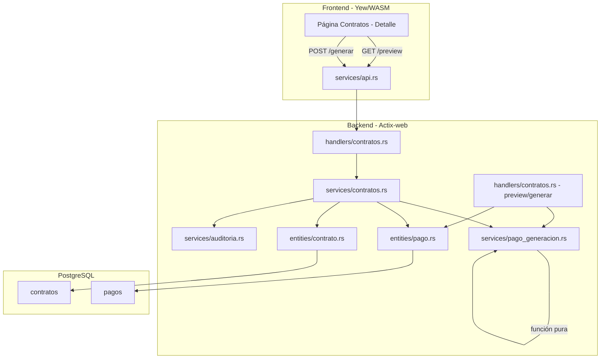
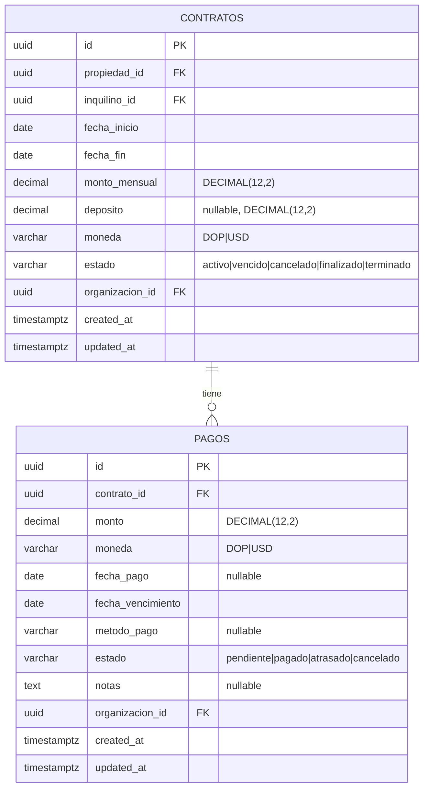

# Diseño — Auto-Generación de Pagos desde Contratos

## Overview

Este módulo automatiza la generación de registros de pago mensuales a partir de contratos. Actualmente los pagos se crean manualmente uno por uno; este diseño introduce una función pura de generación que calcula las fechas de vencimiento para cada mes del período contractual y crea pagos con estado "pendiente" en la tabla `pagos` existente.

El diseño se integra en los flujos existentes de contratos:
- **Crear contrato activo** → genera pagos automáticamente dentro de la misma transacción.
- **Renovar contrato** → genera pagos para el nuevo período dentro de la misma transacción.
- **Terminar contrato** → cancela pagos pendientes futuros dentro de la misma transacción.

Adicionalmente, se exponen dos endpoints nuevos bajo `/contratos/{id}/pagos/`:
- `GET /preview` — previsualiza los pagos que se generarían sin crear registros.
- `POST /generar` — dispara la generación manual para cubrir meses faltantes.

No se crean tablas nuevas. Todos los pagos generados se insertan en la tabla `pagos` existente con `organizacion_id` del contrato.

## Architecture



El flujo sigue el patrón existente handlers → services → entities:

1. **`services/pago_generacion.rs`** — Módulo nuevo con una función pura `calcular_pagos` que recibe los datos del contrato (fecha_inicio, fecha_fin, monto_mensual, moneda, dia_vencimiento) y retorna un `Vec<PagoGenerado>` con las fechas de vencimiento calculadas. No toca la base de datos.
2. **`services/contratos.rs`** — Las funciones `create`, `renovar`, y `terminar` existentes se modifican para llamar a la lógica de generación/cancelación dentro de sus transacciones existentes.
3. **`handlers/contratos.rs`** — Se agregan dos handlers nuevos (`preview_pagos` y `generar_pagos`) que se registran como sub-rutas de `/contratos/{id}/pagos/`.
4. **Frontend** — Se agrega un botón "Generar Pagos" en la vista de detalle del contrato que muestra un preview y solicita confirmación.

### Decisiones de diseño

- **Función pura para cálculo**: `calcular_pagos` es una función pura sin I/O que facilita testing exhaustivo con property-based tests. La inserción en BD se hace por separado.
- **Sin tabla nueva**: Los pagos generados usan la tabla `pagos` existente. Se distinguen por tener `estado = "pendiente"`, `metodo_pago = None`, y `fecha_pago = None`.
- **Dentro de la transacción existente**: La generación al crear/renovar ocurre dentro del `txn` que ya existe en `contratos::create` y `contratos::renovar`, garantizando atomicidad.
- **Deduplicación por año-mes**: Al generar manualmente, se comparan las fechas de vencimiento existentes por (año, mes) para evitar duplicados.
- **Día de vencimiento configurable**: Por defecto día 1. Si el día excede los días del mes (ej. 31 en febrero), se usa el último día del mes. Se valida que esté entre 1 y 31.

## Components and Interfaces

### Nuevo módulo: `services/pago_generacion.rs`

Función pura de cálculo:

```rust
/// Datos de un pago a generar (sin ID ni timestamps).
pub struct PagoGenerado {
    pub monto: Decimal,
    pub moneda: String,
    pub fecha_vencimiento: NaiveDate,
}

/// Calcula los pagos mensuales para un período contractual.
/// Función pura: no accede a la base de datos.
pub fn calcular_pagos(
    fecha_inicio: NaiveDate,
    fecha_fin: NaiveDate,
    monto_mensual: Decimal,
    moneda: &str,
    dia_vencimiento: u32,  // 1-31, default 1
) -> Vec<PagoGenerado>
```

Lógica de cálculo:
1. Itera mes a mes desde el mes de `fecha_inicio` hasta el mes de `fecha_fin` (inclusive).
2. Para cada mes, calcula `fecha_vencimiento` como `(año, mes, dia_vencimiento)`. Si `dia_vencimiento` excede los días del mes, usa el último día.
3. Cada pago tiene el mismo `monto_mensual` y `moneda` del contrato.
4. Meses parciales (inicio no en día 1, fin no en último día) generan un pago completo igualmente — el monto no se prorratea.

Función de filtrado de duplicados:

```rust
/// Filtra pagos ya existentes comparando por (año, mes) de fecha_vencimiento.
pub fn filtrar_existentes(
    pagos_calculados: &[PagoGenerado],
    fechas_existentes: &[NaiveDate],
) -> Vec<PagoGenerado>
```

Función de validación:

```rust
/// Valida que dia_vencimiento esté entre 1 y 31.
pub fn validar_dia_vencimiento(dia: u32) -> Result<(), AppError>
```

### Función de inserción en `services/contratos.rs` (o invocada desde ahí)

```rust
/// Inserta los pagos generados en la BD dentro de una transacción.
async fn insertar_pagos_generados<C: ConnectionTrait>(
    db: &C,
    contrato_id: Uuid,
    organizacion_id: Uuid,
    pagos: &[PagoGenerado],
) -> Result<usize, AppError>
```

### Función de cancelación en `services/contratos.rs`

```rust
/// Cancela pagos pendientes con fecha_vencimiento posterior a fecha_terminacion.
async fn cancelar_pagos_futuros<C: ConnectionTrait>(
    db: &C,
    contrato_id: Uuid,
    fecha_terminacion: NaiveDate,
) -> Result<usize, AppError>
```

Usa `update_many` para cambiar `estado` de `"pendiente"` a `"cancelado"` donde `contrato_id` coincide y `fecha_vencimiento > fecha_terminacion`.

### Modificaciones a funciones existentes

**`contratos::create`** — Después de insertar el contrato y antes de `txn.commit()`:
- Si `estado == "activo"`, llama a `calcular_pagos` y luego `insertar_pagos_generados`.
- Agrega `pagos_generados: usize` a la respuesta.

**`contratos::renovar`** — Después de insertar el nuevo contrato y antes de `txn.commit()`:
- Llama a `calcular_pagos` con los datos del nuevo contrato y luego `insertar_pagos_generados`.
- Agrega `pagos_generados: usize` a la respuesta.

**`contratos::terminar`** — Después de actualizar el estado del contrato y antes de `txn.commit()`:
- Llama a `cancelar_pagos_futuros` con la `fecha_terminacion`.
- Registra auditoría con la cantidad de pagos cancelados.

### Nuevos endpoints

| Método | Ruta | Auth | Handler | Descripción |
|--------|------|------|---------|-------------|
| GET | `/api/v1/contratos/{id}/pagos/preview` | Claims | `preview_pagos` | Previsualiza pagos a generar |
| POST | `/api/v1/contratos/{id}/pagos/generar` | WriteAccess | `generar_pagos` | Genera pagos manualmente |

### Request/Response Models

**`models/pago_generacion.rs`** (nuevo archivo):

```rust
#[derive(Debug, Deserialize)]
#[serde(rename_all = "camelCase")]
pub struct GenerarPagosRequest {
    pub dia_vencimiento: Option<u32>,  // 1-31, default 1
}

#[derive(Debug, Serialize)]
#[serde(rename_all = "camelCase")]
pub struct PreviewPagosResponse {
    pub contrato_id: Uuid,
    pub pagos: Vec<PagoPreview>,
    pub total_pagos: usize,
    pub monto_total: Decimal,
    pub pagos_existentes: usize,
    pub pagos_nuevos: usize,
}

#[derive(Debug, Serialize)]
#[serde(rename_all = "camelCase")]
pub struct PagoPreview {
    pub monto: Decimal,
    pub moneda: String,
    pub fecha_vencimiento: NaiveDate,
}

#[derive(Debug, Serialize)]
#[serde(rename_all = "camelCase")]
pub struct GenerarPagosResponse {
    pub contrato_id: Uuid,
    pub pagos_generados: usize,
    pub pagos: Vec<PagoResponse>,
}
```

**Modificación a `ContratoResponse`** — Se agrega un campo opcional:

```rust
pub struct ContratoResponse {
    // ... campos existentes ...
    #[serde(skip_serializing_if = "Option::is_none")]
    pub pagos_generados: Option<usize>,
}
```

### Preview Query Parameters

El endpoint GET `/preview` acepta un query parameter opcional:

```rust
#[derive(Debug, Deserialize)]
#[serde(rename_all = "camelCase")]
pub struct PreviewPagosQuery {
    pub dia_vencimiento: Option<u32>,
}
```

### Handlers nuevos

**`handlers/contratos.rs`** — Se agregan:

```rust
pub async fn preview_pagos(
    db: web::Data<DatabaseConnection>,
    _claims: Claims,
    path: web::Path<Uuid>,
    query: web::Query<PreviewPagosQuery>,
) -> Result<HttpResponse, AppError>

pub async fn generar_pagos(
    db: web::Data<DatabaseConnection>,
    access: WriteAccess,
    path: web::Path<Uuid>,
    body: web::Json<GenerarPagosRequest>,
) -> Result<HttpResponse, AppError>
```

### Rutas nuevas

En `routes.rs`, dentro del scope `/contratos`:

```rust
.route("/{id}/pagos/preview", web::get().to(handlers::contratos::preview_pagos))
.route("/{id}/pagos/generar", web::post().to(handlers::contratos::generar_pagos))
```

### Frontend

**Modificaciones a `frontend/src/pages/contratos.rs`**:

1. Botón "Generar Pagos" visible solo cuando `contrato.estado == "activo"` y `can_write(rol)`.
2. Al hacer clic, llama a `GET /contratos/{id}/pagos/preview` y muestra un modal con la lista de pagos a generar (fecha, monto, moneda), cantidad total, monto total, y cuántos ya existen vs. nuevos.
3. Botón "Confirmar" en el modal llama a `POST /contratos/{id}/pagos/generar`.
4. Al completar, muestra toast con "X pagos generados".
5. Al crear un contrato exitosamente, el toast incluye la cantidad de pagos generados automáticamente.

**Nuevos tipos frontend en `frontend/src/types/pago_generacion.rs`**:

```rust
pub struct PreviewPagos {
    pub contrato_id: String,
    pub pagos: Vec<PagoPreviewItem>,
    pub total_pagos: u64,
    pub monto_total: f64,
    pub pagos_existentes: u64,
    pub pagos_nuevos: u64,
}

pub struct PagoPreviewItem {
    pub monto: f64,
    pub moneda: String,
    pub fecha_vencimiento: String,
}

pub struct GenerarPagosResponse {
    pub contrato_id: String,
    pub pagos_generados: u64,
}
```

## Data Models

### Entidades existentes utilizadas (sin modificación de esquema)



### Cambios al modelo de datos

**Nuevo estado de pago**: Se agrega `"cancelado"` al conjunto de estados válidos de pago (`ESTADOS_PAGO`). Actualmente son `["pendiente", "pagado", "atrasado"]`; se extiende a `["pendiente", "pagado", "atrasado", "cancelado"]`.

**Nuevo campo en `ContratoResponse`**: `pagos_generados: Option<usize>` — solo presente en respuestas de crear y renovar.

### Constantes de dominio

- **Día de vencimiento por defecto**: `1`
- **Día de vencimiento rango válido**: `1..=31`
- **Estado de pagos generados**: `"pendiente"`
- **Estado de pagos cancelados por terminación**: `"cancelado"`
- **Estados de pago protegidos en terminación**: `"pagado"`, `"atrasado"`

### Algoritmo de cálculo de fechas

Para un contrato con `fecha_inicio = 2025-03-15` y `fecha_fin = 2025-07-20` con `dia_vencimiento = 1`:

| Mes | fecha_vencimiento |
|-----|-------------------|
| Marzo 2025 | 2025-03-01 |
| Abril 2025 | 2025-04-01 |
| Mayo 2025 | 2025-05-01 |
| Junio 2025 | 2025-06-01 |
| Julio 2025 | 2025-07-01 |

Para `dia_vencimiento = 31`:

| Mes | fecha_vencimiento |
|-----|-------------------|
| Febrero 2025 | 2025-02-28 (último día) |
| Marzo 2025 | 2025-03-31 |
| Abril 2025 | 2025-04-30 (último día) |


## Correctness Properties

*A property is a characteristic or behavior that should hold true across all valid executions of a system — essentially, a formal statement about what the system should do. Properties serve as the bridge between human-readable specifications and machine-verifiable correctness guarantees.*

### Property 1: Month count correctness

*For any* valid date range `(fecha_inicio, fecha_fin)` where `fecha_inicio <= fecha_fin`, calling `calcular_pagos` should return exactly as many `PagoGenerado` items as there are distinct (year, month) pairs covered by the range — including partial months at the start and end. When both dates fall in the same month, the result should contain exactly one item.

**Validates: Requirements 1.1, 1.4, 1.5, 1.6**

### Property 2: Generated pago fields match contract

*For any* valid `monto_mensual` (Decimal > 0) and `moneda` in `{"DOP", "USD"}`, calling `calcular_pagos` should return items where every `PagoGenerado.monto` equals `monto_mensual` and every `PagoGenerado.moneda` equals `moneda`.

**Validates: Requirements 1.2**

### Property 3: Date calculation with day clamping

*For any* valid date range and `dia_vencimiento` in `1..=31`, every `PagoGenerado.fecha_vencimiento` returned by `calcular_pagos` should have `day == min(dia_vencimiento, last_day_of_that_month)`. When `dia_vencimiento` is not specified (default 1), every `fecha_vencimiento` should have `day == 1`.

**Validates: Requirements 1.3, 6.1, 6.2**

### Property 4: Cancellation only affects correct pagos

*For any* set of pagos associated with a contract and *for any* `fecha_terminacion`, after calling `cancelar_pagos_futuros`: (a) every pago with `estado == "pendiente"` and `fecha_vencimiento > fecha_terminacion` should now have `estado == "cancelado"`, (b) every pago with `estado` in `{"pagado", "atrasado"}` should remain unchanged regardless of `fecha_vencimiento`, and (c) every pago with `estado == "pendiente"` and `fecha_vencimiento <= fecha_terminacion` should remain `"pendiente"`.

**Validates: Requirements 3.1, 3.2, 3.3**

### Property 5: Preview totals are consistent

*For any* contract date range and `dia_vencimiento`, the `PreviewPagosResponse` should satisfy: `total_pagos` equals the length of the `pagos` list, and `monto_total` equals the sum of all `pago.monto` values in the list. Additionally, `pagos_existentes + pagos_nuevos == total_pagos`.

**Validates: Requirements 4.4, 4.5**

### Property 6: Deduplication filters by year-month

*For any* list of calculated `PagoGenerado` items and *for any* list of existing `fecha_vencimiento` dates, calling `filtrar_existentes` should return only those pagos whose `(year, month)` does not appear in any existing date's `(year, month)`. The count of filtered results plus the count of existing matches should equal the original calculated count.

**Validates: Requirements 5.2, 7.1, 7.2, 7.3**

### Property 7: Invalid dia_vencimiento is rejected

*For any* `u32` value where `value < 1` or `value > 31`, calling `validar_dia_vencimiento` should return a validation error.

**Validates: Requirements 6.4**

## Error Handling

Todos los errores siguen el patrón existente de `AppError` en `backend/src/errors.rs`:

| Escenario | Error | HTTP Status |
|-----------|-------|-------------|
| Contrato no encontrado (preview/generar) | `AppError::NotFound("Contrato no encontrado")` | 404 |
| Contrato no activo (generar) | `AppError::Validation("Solo se pueden generar pagos para contratos activos")` | 422 |
| dia_vencimiento < 1 o > 31 | `AppError::Validation("El día de vencimiento debe estar entre 1 y 31")` | 422 |
| Visualizador intenta generar | `AppError::Forbidden` via `WriteAccess` extractor | 403 |
| fecha_inicio >= fecha_fin en contrato | `AppError::Validation(...)` (ya existente en contratos::create) | 422 |
| Error de base de datos | `AppError::Internal` via `From<DbErr>` | 500 |

La generación automática (en create/renovar) no introduce nuevos modos de fallo — si la inserción de pagos falla, la transacción completa se revierte (incluyendo el contrato), lo cual es el comportamiento correcto.

La cancelación (en terminar) usa `update_many` que es atómica. Si falla, la transacción completa se revierte.

## Testing Strategy

### Unit Tests

Tests en `backend/src/services/pago_generacion.rs` bajo `#[cfg(test)]`:

- `calcular_pagos` con un rango de un solo mes → retorna 1 pago
- `calcular_pagos` con rango de 12 meses → retorna 12 pagos
- `calcular_pagos` con dia_vencimiento=31 en febrero → usa día 28/29
- `calcular_pagos` con fecha_inicio == fecha_fin (mismo día) → retorna 1 pago
- `filtrar_existentes` con todos los meses ya existentes → retorna vacío
- `filtrar_existentes` con ningún mes existente → retorna todos
- `filtrar_existentes` con algunos meses existentes → retorna solo los faltantes
- `validar_dia_vencimiento` con 0 → error
- `validar_dia_vencimiento` con 32 → error
- `validar_dia_vencimiento` con 1 y 31 → ok

Tests en `backend/src/models/pago_generacion.rs` bajo `#[cfg(test)]`:
- Serialización/deserialización de `GenerarPagosRequest`, `PreviewPagosResponse`, `PreviewPagosQuery`

### Property-Based Tests

Librería: `proptest` (ya disponible en dev-dependencies del proyecto).

Cada test ejecuta mínimo 100 iteraciones. Cada test referencia su propiedad del documento de diseño.

| Property | Test | Descripción |
|----------|------|-------------|
| P1 | `test_month_count_correctness` | Genera rangos de fechas aleatorios, verifica que la cantidad de pagos iguala los meses distintos en el rango |
| P2 | `test_generated_fields_match_contract` | Genera monto/moneda aleatorios, verifica que todos los pagos generados tienen los mismos valores |
| P3 | `test_date_calculation_day_clamping` | Genera rangos y dia_vencimiento aleatorios, verifica que cada fecha tiene el día correcto o el último día del mes |
| P4 | `test_cancellation_correctness` | Genera conjuntos de pagos con estados y fechas variados, aplica cancelación, verifica que solo los correctos cambian |
| P5 | `test_preview_totals_consistency` | Genera datos de contrato aleatorios, verifica que total_pagos == len(pagos) y monto_total == sum(montos) |
| P6 | `test_deduplication_by_year_month` | Genera pagos calculados y fechas existentes aleatorias, verifica que el filtro excluye correctamente por (año, mes) |
| P7 | `test_invalid_dia_vencimiento_rejected` | Genera valores fuera de 1..=31, verifica rechazo |

Tag format: `// Feature: auto-generate-pagos, Property {N}: {title}`

Configuración: `proptest::test_runner::Config { cases: 100, .. }`

### Integration Tests

Archivo: `backend/tests/pago_generacion_tests.rs`

Tests de ciclo completo request/response contra la API:
- Crear contrato activo → verificar que se generaron pagos con estado "pendiente" y montos correctos
- Crear contrato no activo → verificar que no se generaron pagos
- Renovar contrato → verificar que se generaron pagos para el nuevo período con el nuevo monto
- Terminar contrato → verificar que pagos pendientes futuros se cancelaron y pagos pagados/atrasados no cambiaron
- GET preview → verificar respuesta con lista de pagos, totales, y conteo existentes/nuevos
- GET preview con contrato inexistente → 404
- GET preview sin crear registros → verificar que no hay pagos nuevos en BD después del preview
- POST generar con contrato activo → verificar pagos creados
- POST generar con contrato no activo → 422
- POST generar con contrato inexistente → 404
- POST generar como visualizador → 403
- POST generar con dia_vencimiento inválido → 422
- POST generar con pagos ya existentes → verificar que solo se generan los faltantes (deduplicación)
- Verificar entradas de auditoría para generación automática, manual, y cancelación
