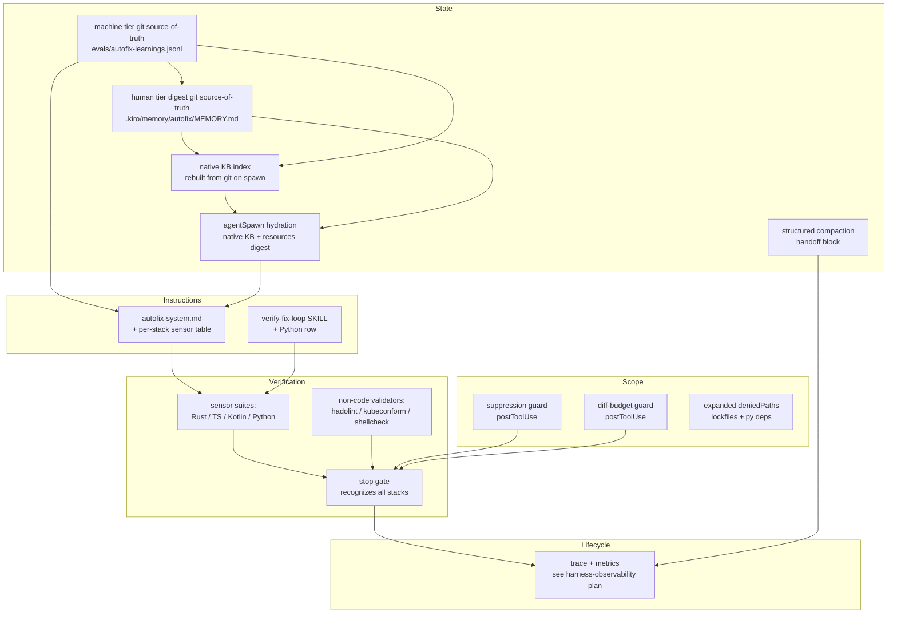
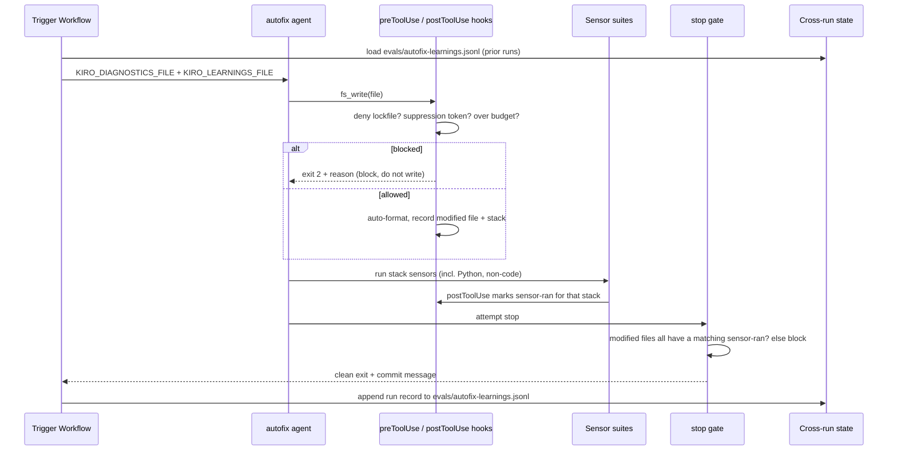

# Design Document: Autofix Harness Expansion

## Overview

The autofix harness (`.kiro/agents/autofix.json` + `.kiro/shared/autofix-system.md`) is a CI remediation agent that diagnoses build/deploy failures and applies minimal, verified fixes inside a verify-fix loop. It is the repo's most mature harness and the reference implementation for the harness-engineering skill. This design expands it by strengthening the two weakest of its five subsystems — **Verification** (a whole service has no sensors) and **State** (learnings are wiped every queue run) — and by promoting three "suggestions" in the system prompt into **mechanical Scope controls** the agent cannot bypass.

Every proposed feature traces to a concrete, observed gap in the current harness, follows the ratchet principle (add a control only where a real failure can land), and respects the project's CODEOWNERS, retry, and dependency steering rules. The observability/trace/eval expansion is already specified in `.kiro/plans/harness-observability.md`; this design references it as the Lifecycle track and does not duplicate it.

This document contains both a **High-Level Design** (subsystem architecture, data flow, component diagrams) and a **Low-Level Design** (exact `autofix.json` schema deltas, hook scripts, sensor commands, and state-file formats).

## Glossary

One term per concept, used consistently throughout.

| Term | Meaning |
|------|---------|
| Subsystem | One of the five harness subsystems: Instructions, State, Verification, Scope, Lifecycle. |
| Sensor | A deterministic verification command (fmt, clippy, test, lint) whose exit code is the only valid evidence of correctness. |
| Side-channel file | A state file under `$RUNNER_TEMP` written by hooks (e.g. `autofix-modified-files.txt`). |
| Queue run | One execution of the autofix queue in `kiro-autofix-trigger.yml`; may process many diagnostic artifacts and produce many commits. |
| Guard | A `preToolUse` or `postToolUse` hook that mechanically blocks or flags an agent action. |
| Stack | One language/service unit with its own sensor suite: Rust, TypeScript (baileys), Kotlin (android), Python (ocr-service). |

---

## Current State (Baseline)

The harness as implemented today, mapped to the five subsystems.

| Subsystem | Current mechanism | Strength |
|-----------|-------------------|----------|
| Instructions | `file://` system prompt with role + NOT-do list; resources load `AGENTS.md`, all steering globs, and the `verify-fix-loop` skill | Solid |
| State | Per-artifact `KIRO_LEARNINGS_FILE` accumulated within one queue run; `KIRO_GIT_HISTORY_FILE` of prior attempts | Partial — resets every queue run |
| Verification | `postToolUse` auto-format + sensor-ran tracking; `stop` three-layer termination gate (max 2 blocks) | Partial — no Python sensors |
| Scope | Minimal `tools` list (no wildcard); `write.deniedPaths` for workflows/actions/configs/infra/Cargo manifests; `preToolUse` git block | Partial — three rules are prompt-only |
| Lifecycle | `agentSpawn` clears stale state; structured commit-message output contract | Partial — no persisted trace (see existing plan) |

### Structural score (baseline)

Scored with the rubric in `measuring-harness-quality.md` (0 absent / 1 partial / 2 solid):

- Instructions 8/8, State 2/4, Verification 4/6, Scope 6/8, Lifecycle 2/4.
- Total **22/30 ≈ 73%** → Level 3 (scoped + verified), upper edge.

The expansion targets the four lost points (State, Verification, Lifecycle) and the two soft Scope points, aiming for ~90% (Level 4). The **State subsystem is the biggest mover**: F4 (cross-run learnings) plus F10 (git-backed persistent memory that survives ephemeral sessions, hydrated on spawn, with workflow-only write integrity) take State from partial (2/4) to solid (4/4), since continuity now spans both *within* a queue run and *across* CI invocations.

---

## Gap Analysis

Each gap is a place where a real failure can land today.

| ID | Subsystem | Gap | Evidence in repo | Failure it allows |
|----|-----------|-----|------------------|-------------------|
| GAP-1 | Verification | No sensors for `ocr-service/` (Python) | `ocr-service/` has `main.py`, `ocr_engine.py`, `test_main.py`, `test_classification_pbt.py`, `requirements.txt`; neither `autofix-system.md` nor `verify-fix-loop` SKILL mentions Python | Agent edits a `.py` file, runs no sensor, `stop` gate still passes because the sensor-ran matcher does not recognize `pytest`/`ruff` |
| GAP-2 | Verification | No sensors for Dockerfiles, K8s manifests, shell, YAML | `autofix-system.md` marks all non-code "clean, no sensors"; container/deploy diagnostics exist (`diag-container-*`, `diag-deploy-*`) | Agent "fixes" a Dockerfile or manifest with zero validation; escapes to a failing image build/deploy |
| GAP-3 | State | Learnings wiped every queue run | `kiro-autofix-trigger.yml`: `: > "$LEARNINGS_FILE"` at queue start | Queue run N+1 repeats an approach that already failed in run N (cross-run amnesia) |
| GAP-4 | Scope | "No suppressed warnings" is prompt-only | `autofix-system.md` forbids `#[allow]`, `@ts-ignore`, etc.; nothing enforces it | Agent silences a warning to make a sensor pass — defect escapes |
| GAP-5 | Scope | No diff-size budget | No control on number/spread of files written | Agent sprawls a "minimal" fix across many files; scope discipline relies on the prompt alone |
| GAP-6 | Scope | Lockfiles and Python deps not write-protected | `deniedPaths` covers Cargo manifests + `Cargo.lock` but not `package-lock.json`, `android` lockfiles, or `ocr-service/requirements.txt` | Agent silently bumps a dependency version, violating the dependencies steering rule |
| GAP-7 | Lifecycle | No persisted trace / metrics | Covered in detail by `.kiro/plans/harness-observability.md` (G1–G6) | Cannot compute VCR, verification_gap, escape rate |
| GAP-8 | State | Agent sessions are ephemeral; kiro-cli's native knowledge base is stored machine-locally and does not survive across CI invocations on a fresh runner | Each `kiro-cli chat --agent autofix` call in `kiro-autofix-trigger.yml` is a fresh, isolated process; the native KB lives in the runner's local data dir ([machine-local storage](https://kiro.dev/docs/cli/experimental/knowledge-management/)), which is empty each job, and `agentSpawn` currently only clears state | Agent re-derives the same root cause every run and re-attempts an approach that already failed for the same artifact/diagnostic — no durable, human-readable memory |

---

## Architecture

This section is the High-Level Design: subsystem topology, data flow, and design rationale.

### Subsystem map after expansion



### Data flow: one artifact through the expanded loop



### Design decisions and rationale

- **Mechanical over advisory.** GAP-4, GAP-5, GAP-6 are promoted from prompt text to hooks/`deniedPaths` because a control that depends on the agent choosing to comply is a suggestion, not a control (harness quality gate #2).
- **Per-stack sensor tracking, not a single boolean.** The current `stop` gate uses one `autofix-sensors-ran.txt` flag for all stacks. After adding Python and non-code validators, a single flag would let an agent satisfy the gate by running a Rust sensor after editing a Python file. The expansion tracks sensor-ran **per stack** so the gate verifies the right sensor ran for the files actually modified (closes GAP-1 properly).
- **State persistence rides the existing commit, not a new branch.** Cross-run learnings append to a git-tracked `evals/autofix-learnings.jsonl` committed alongside the fix — consistent with the harness-observability plan's Phase 5/7 decision to avoid a separate metrics branch where possible.
- **Reuse the existing observability plan for Lifecycle.** No new trace design here; this spec's Lifecycle work is "consume the learnings the observability pipeline persists," keeping the two efforts non-overlapping.

---

## Components and Interfaces

### Component 1: Per-stack Sensor Registry

**Purpose**: Single source of truth mapping a modified file path to its stack and sensor suite, used by both the `postToolUse` sensor-ran tracker and the `stop` gate.

**Interface** (conceptual — implemented as a shared bash function sourced by hooks):

```bash
classify_stack <file_path>   # echoes one of: rust | ts | kotlin | python | docker | k8s | shell | none
sensor_pattern <stack>       # echoes the regex of sensor commands that count for that stack
```

**Responsibilities**:
- Map each writable file type to exactly one stack.
- Provide the sensor-command regex the `stop` gate matches against.
- Return `none` for files that legitimately need no sensor (Markdown prose), so the gate does not block on them.

### Component 2: Scope Guards (preToolUse / postToolUse)

**Purpose**: Mechanically enforce the three currently-advisory scope rules.

**Responsibilities**:
- **Suppression guard**: reject any write whose new content introduces a suppression token (`#[allow(`, `@ts-ignore`, `@ts-nocheck`, `eslint-disable`, `@Suppress`, `# type: ignore`, `# noqa`).
- **Diff-budget guard**: track the cumulative count of distinct files modified in one agent invocation; warn at a soft threshold and block further writes past a hard threshold, telling the agent to narrow scope.
- **Lockfile/dep guard**: handled declaratively via `deniedPaths` (no hook needed).

### Component 3: Cross-run State Store

**Purpose**: Carry failed-approach learnings across queue runs so the agent does not repeat them.

**Interface**:

```bash
# read at queue start, before the per-artifact loop
load_prior_learnings <history_file>   # tail of evals/autofix-learnings.jsonl → KIRO_LEARNINGS_FILE seed
# append at queue end, in the existing commit step
record_run <run_id> <artifact> <verdict> <approach_summary>
```

**Responsibilities**:
- Seed `KIRO_LEARNINGS_FILE` with the last K records instead of an empty file.
- Append one JSONL record per processed artifact to the git-tracked store.
- Bound the file (keep last N records) so it does not grow unbounded.

### Component 4: Structured Compaction Handoff

**Purpose**: When a long agent session approaches its context limit, write a structured handoff block so the next turn/session can resume without re-diagnosing.

**Responsibilities**:
- Capture goal, constraints, progress (done/in-progress/blocked), key decisions, next steps, and cumulative modified files.
- This is a system-prompt instruction backed by the existing side-channel files (modified-files list already exists), not a new tool.

### Component 5: Persistent Memory Subsystem (F10)

**Purpose**: Give the ephemeral agent durable memory across CI invocations. Git-tracked files are the durable source of truth; kiro-cli's native knowledge base ([`/knowledge`](https://kiro.dev/docs/cli/experimental/knowledge-management/)) is a searchable index rebuilt from those files on every session init. The agent reads memory (native KB search + an always-in-context prose digest); only the workflow writes it. Full design in the Low-Level Design (F10).

**Interface**:

```bash
# read-on-spawn (native KB sync on session init + resources digest): index prior learnings, load digest
hydrate_memory                       # native KB re-indexes .kiro/memory/autofix on init; digest loaded via resources
# write-on-commit (workflow): append a keyed record, then rebuild the digest
record_run <artifact> <diag_sig> <result> <approach>   # appends to evals/autofix-learnings.jsonl
distill_digest                       # rebuild .kiro/memory/autofix/MEMORY.md, bounded + deduped
```

**Responsibilities**:
- Persist memory in two git-tracked tiers as the durable source of truth: machine (`evals/autofix-learnings.jsonl`, = F4) and human (`.kiro/memory/autofix/MEMORY.md`).
- Index the git-tracked memory into a native kiro-cli knowledge base that re-syncs on every session init, giving the agent lexical search over prior lessons without depending on cross-session persistence of the index itself.
- Hydrate the persisted memory into every fresh session via the native KB (re-indexed on spawn) plus the prose digest in `resources` (guaranteed-in-context fallback).
- Key each record by `(artifact, diag_sig)` so anti-repeat lookup is meaningful.
- Keep the agent out of the writer role (`.kiro/memory/**` in `deniedPaths`) so memory integrity holds; the native KB is read-only for the agent.
- Bound both tiers (record cap + entry cap) so memory — and the KB index rebuilt from it — does not grow unbounded or rot.

---

## Data Models

### Cross-run learnings record (`evals/autofix-learnings.jsonl`)

One JSON object per line.

```json
{
  "run_id": "1234567890",
  "ts": "2026-06-13T02:00:00Z",
  "branch": "main",
  "artifact": "diag-clippy-backend",
  "verdict": "CLEAN",
  "iterations": 2,
  "files": ["backend/src/handlers/payments.rs"],
  "approach": "Removed unused import flagged by clippy::unused_imports",
  "outcome": "fixed"
}
```

**Validation rules**:
- `verdict` ∈ {`CLEAN`, `PARTIAL`, `NO_FIX`, `SKIPPED`}.
- `outcome` ∈ {`fixed`, `no_change`, `skipped`, `held`, `escaped`} (`held`/`escaped` set later by the observability correlation step).
- `files` is a possibly-empty array of repo-relative paths.
- File is truncated to the most recent `KIRO_LEARNINGS_KEEP` records (default 200) on append.

### Per-stack sensor-ran state (`$RUNNER_TEMP/autofix-sensors-ran.d/`)

Replaces the single `autofix-sensors-ran.txt` flag. One empty marker file per stack whose sensor ran:

```
$RUNNER_TEMP/autofix-sensors-ran.d/rust
$RUNNER_TEMP/autofix-sensors-ran.d/python
$RUNNER_TEMP/autofix-sensors-ran.d/ts
```

### Modified-files state (`$RUNNER_TEMP/autofix-modified-files.txt`)

Unchanged in format (one path per line); now also consumed by the diff-budget guard and the stop gate's per-stack check.

---

## Proposed Features

Each feature names the subsystem it strengthens, the behavior it adds, and whether it is mechanical (enforced) or advisory (prompt).

| ID | Feature | Subsystem | Closes | Type |
|----|---------|-----------|--------|------|
| F1 | Python (ocr-service) sensor suite | Verification | GAP-1 | Mechanical + prompt |
| F2 | Non-code validators (Dockerfile, K8s, shell) | Verification | GAP-2 | Mechanical + prompt |
| F3 | Per-stack sensor-ran tracking in the stop gate | Verification | GAP-1, GAP-2 | Mechanical |
| F4 | Cross-run learnings store | State | GAP-3 | Mechanical + prompt |
| F5 | Structured compaction handoff | State / Lifecycle | GAP-3 | Advisory (prompt) |
| F6 | Suppression guard | Scope | GAP-4 | Mechanical |
| F7 | Diff-budget guard | Scope | GAP-5 | Mechanical |
| F8 | Expanded deniedPaths (lockfiles + Python deps) | Scope | GAP-6 | Mechanical |
| F9 | Trace + metrics integration | Lifecycle | GAP-7 | See existing plan |
| F10 | Persistent memory subsystem (git source-of-truth, two-tier, native KB re-indexed on spawn, read-on-spawn / write-on-commit) | State (+ Lifecycle) | GAP-8 | Mechanical + prompt |

---

## Low-Level Design

### F1 + F2 + F8: `autofix.json` schema deltas

The expanded `toolsSettings.write.deniedPaths` (F8). Additions are the last four entries; existing entries retained.

```json
{
  "toolsSettings": {
    "write": {
      "deniedPaths": [
        ".github/workflows/**",
        ".github/actions/**",
        ".kiro/agents/**",
        ".kiro/steering/**",
        ".kiro/skills/**",
        "infra/**",
        "Cargo.toml",
        "backend/Cargo.toml",
        "frontend/Cargo.toml",
        "Cargo.lock",
        "baileys-service/package-lock.json",
        "ocr-service/requirements.txt",
        "android/gradle/libs.versions.toml",
        "android/**/*.lockfile",
        ".kiro/memory/**"
      ]
    }
  }
}
```

Rationale: the dependencies steering rule requires research-and-pin before any version change. Dependency edits are out of scope for a surgical CI fix, so they are denied outright. If a fix genuinely requires a dependency change, the agent exits with `Status: PARTIAL` and reports it for human action (consistent with how it already handles unfixable secret/infra diagnostics in the trigger workflow). The final entry, `.kiro/memory/**` (F10), is denied so the agent can read but never author its own memory — see the F10 memory subsystem for the write-integrity rationale.

### F1: Python sensor suite (system prompt + verify-fix-loop SKILL row)

Add to the **Verify** section of `autofix-system.md` and the sensor-selection table of the `verify-fix-loop` SKILL:

```bash
# Python (ocr-service/**/*.py) — run from ocr-service/
cd ocr-service && ruff format --check .
cd ocr-service && ruff check .
cd ocr-service && python -m pytest -q
```

These match the existing repo tooling: `ruff` is already configured at `.trunk/configs/ruff.toml`, and `ocr-service/` already has `pytest` + `hypothesis` tests (`test_main.py`, `test_classification_pbt.py`, `conftest.py`). No new dependency is introduced.

Priority order within the Python stack follows Keep-Quality-Left: `ruff format --check` → `ruff check` → `pytest`.

### F2: Non-code validators

Add as a new sensor tier for file types the harness currently marks "clean, no sensors". Each tool is fetched in the runner image or via a retry-wrapped install (per the workflow-retries steering rule: tool installs → 10 min, 3 attempts, 10s):

```bash
# Dockerfile (**/Dockerfile, *.Dockerfile)
hadolint <path>

# Kubernetes manifests (infra/k8s/**/*.yml) — validation only; writes still denied by deniedPaths
kubeconform -strict -ignore-missing-schemas <path>

# Shell scripts (*.sh, hook command bodies)
shellcheck <path>
```

Note: `infra/**` is write-denied, so K8s/Dockerfile validators apply only when the agent inspects manifests referenced by `diag-container-*` / `diag-deploy-*` diagnostics to inform a code-side fix — they validate, they do not authorize writes. This keeps F2 consistent with the existing infra protection.

### F3: Per-stack sensor-ran tracking

Replaces the single-flag `postToolUse` sensor matcher and the `stop` gate. The shared classifier is defined once and referenced by both hooks.

**New `postToolUse` sensor tracker** (replaces the third existing `postToolUse` entry):

```bash
bash -c '
CMD=$(cat | jq -r .tool_input.command 2>/dev/null)
DIR="${RUNNER_TEMP:-/tmp}/autofix-sensors-ran.d"
mkdir -p "$DIR"
case "$CMD" in
  *"cargo clippy"*|*"cargo test"*|*"cargo fmt"*) touch "$DIR/rust" ;;
  *"npm run build"*|*"npm test"*|*"npx eslint"*)  touch "$DIR/ts" ;;
  *"gradlew build"*|*"gradlew test"*)             touch "$DIR/kotlin" ;;
  *"pytest"*|*"ruff check"*|*"ruff format"*)       touch "$DIR/python" ;;
  *hadolint*)    touch "$DIR/docker" ;;
  *kubeconform*) touch "$DIR/k8s" ;;
  *shellcheck*)  touch "$DIR/shell" ;;
esac'
```

**New `stop` gate** (replaces the existing stop hook). Blocks exit if any modified file belongs to a stack whose sensor did not run; preserves the max-2-block escape hatch.

```bash
bash -c '
TMP="${RUNNER_TEMP:-/tmp}"
MODIFIED="$TMP/autofix-modified-files.txt"
SENSOR_DIR="$TMP/autofix-sensors-ran.d"
BLOCKS="$TMP/autofix-stop-blocks.txt"
COUNT=$(cat "$BLOCKS" 2>/dev/null || echo 0)

cleanup() { rm -rf "$MODIFIED" "$SENSOR_DIR" "$BLOCKS" 2>/dev/null; }

# Escape hatch: never block more than twice.
if [ "$COUNT" -ge 2 ]; then cleanup; exit 0; fi
# Nothing modified → clean exit.
if [ ! -s "$MODIFIED" ]; then cleanup; exit 0; fi

classify() {
  case "$1" in
    *.rs) echo rust ;;
    */baileys-service/*.ts|*/baileys-service/*.tsx) echo ts ;;
    */android/*.kt|*/android/*.kts) echo kotlin ;;
    */ocr-service/*.py) echo python ;;
    *Dockerfile|*.Dockerfile) echo docker ;;
    */infra/k8s/*.yml|*/infra/k8s/*.yaml) echo k8s ;;
    *.sh) echo shell ;;
    *) echo none ;;
  esac
}

MISSING=""
while IFS= read -r f; do
  [ -z "$f" ] && continue
  stack=$(classify "$f")
  [ "$stack" = none ] && continue
  if [ ! -f "$SENSOR_DIR/$stack" ]; then
    case "$MISSING" in *"$stack"*) ;; *) MISSING="$MISSING $stack" ;; esac
  fi
done < "$MODIFIED"

if [ -n "$MISSING" ]; then
  echo $((COUNT + 1)) > "$BLOCKS"
  printf "{\"decision\": \"block\", \"reason\": \"You modified files in stack(s):%s but did not run their verification sensors. Run the sensors for each modified stack (Rust: cargo clippy/test; Python: ruff check + pytest; TS: npm run build + eslint; Kotlin: gradlew build) before stopping.\"}" "$MISSING"
else
  cleanup
fi'
```

**Extended `postToolUse` formatter** (adds Python formatting to the two existing write/str_replace formatters):

```bash
# appended case to the existing format switch
*/ocr-service/*.py) cd ocr-service && ruff format "$FILE" 2>/dev/null || true ;;
```

### F6: Suppression guard (`preToolUse`)

New `preToolUse` entries matching `fs_write` and `str_replace`. Reads the content being written; blocks if it introduces a suppression token.

```bash
bash -c '
INPUT=$(cat)
CONTENT=$(echo "$INPUT" | jq -r ".tool_input.text // .tool_input.newStr // empty" 2>/dev/null)
if echo "$CONTENT" | grep -qE "#\[allow\(|@ts-ignore|@ts-nocheck|eslint-disable|@Suppress|# type: ignore|# noqa"; then
  echo "BLOCKED: suppression directive detected. Fix the root cause instead of silencing the warning (see autofix-system.md: No suppressed warnings)." >&2
  exit 2
fi'
```

Edge case: a legitimate pre-existing suppression being moved verbatim would also trip this. Accepted tradeoff — the harness forbids suppressions outright, and a surgical fix should not be relocating them. The max-2-block stop escape does not apply to `preToolUse` (this is a hard deny), so the agent must choose a non-suppressing fix.

### F7: Diff-budget guard (`postToolUse`)

Tracks distinct modified files; soft-warns past `KIRO_DIFF_SOFT` (default 8), and emits a strong advisory past `KIRO_DIFF_HARD` (default 15). Because `postToolUse` cannot retroactively undo a write, the hard limit surfaces as a loud warning the agent sees on its next turn rather than a silent block; the stop gate remains the enforcement point.

```bash
bash -c '
TMP="${RUNNER_TEMP:-/tmp}"
MODIFIED="$TMP/autofix-modified-files.txt"
SOFT="${KIRO_DIFF_SOFT:-8}"; HARD="${KIRO_DIFF_HARD:-15}"
N=$(sort -u "$MODIFIED" 2>/dev/null | grep -c . || echo 0)
if [ "$N" -ge "$HARD" ]; then
  echo "::warning::Autofix has modified $N files (hard budget $HARD). A surgical CI fix should touch few files. Stop expanding scope; if the fix genuinely needs this many files, exit with Status: PARTIAL and explain." >&2
elif [ "$N" -ge "$SOFT" ]; then
  echo "::notice::Autofix has modified $N files (soft budget $SOFT). Confirm each change traces to the diagnosed failure." >&2
fi'
```

### F4: Cross-run learnings store (workflow-side)

In `kiro-autofix-trigger.yml`, replace the queue-start wipe with a seed-from-history, and add an append step in the existing commit path.

Before (current):

```bash
LEARNINGS_FILE="${RUNNER_TEMP}/autofix-learnings.txt"
: > "$LEARNINGS_FILE"
```

After (seed from the git-tracked store):

```bash
LEARNINGS_FILE="${RUNNER_TEMP}/autofix-learnings.txt"
: > "$LEARNINGS_FILE"
STORE="evals/autofix-learnings.jsonl"
if [ -s "$STORE" ]; then
  echo "=== PRIOR RUN LEARNINGS (last ${KIRO_LEARNINGS_SEED:-20}) ===" >> "$LEARNINGS_FILE"
  tail -n "${KIRO_LEARNINGS_SEED:-20}" "$STORE" \
    | jq -r "\"[\(.artifact)] \(.verdict): \(.approach)\"" >> "$LEARNINGS_FILE" 2>/dev/null || true
fi
```

Append one record per processed artifact (after the existing per-artifact commit), then commit `evals/autofix-learnings.jsonl` alongside the fix:

```bash
jq -c -n \
  --arg run_id "$CI_RUN_ID" --arg ts "$(date -u +%FT%TZ)" \
  --arg branch "$BRANCH" --arg artifact "$artifact" \
  --arg verdict "$VERDICT" --arg approach "$APPROACH_SUMMARY" \
  --argjson files "$(printf '%s' "$NEWLY_FIXED" | jq -R . | jq -s .)" \
  '{run_id:$run_id, ts:$ts, branch:$branch, artifact:$artifact,
    verdict:$verdict, files:$files, approach:$approach, outcome:"fixed"}' \
  >> evals/autofix-learnings.jsonl
# bound the file
tail -n "${KIRO_LEARNINGS_KEEP:-200}" evals/autofix-learnings.jsonl > evals/.tmp && mv evals/.tmp evals/autofix-learnings.jsonl
```

`VERDICT` and `APPROACH_SUMMARY` are parsed from the agent's commit message (`Status:` line and subject), data the harness already produces. `evals/autofix-learnings.jsonl` is **not** in `deniedPaths` (the agent does not write it — the workflow does), and it rides the existing commit/push, so no new push or branch is introduced.

### F5: Structured compaction handoff (system prompt)

Add to `autofix-system.md` a section instructing the agent, when its context approaches the limit mid-fix, to write a handoff block capturing the six structured-compaction fields before continuing:

```
## Handoff on Compaction

If your context fills before the fix is verified, write this block so the next
turn resumes without re-diagnosing:

  GOAL: <the failure being fixed, artifact name>
  CONSTRAINTS: <surgical, no suppressions, stack sensors required>
  PROGRESS: done=<...> in-progress=<...> blocked=<...>
  DECISIONS: <root cause identified, approach chosen and why>
  NEXT: <exact next sensor to run or file to edit>
  FILES: <cumulative modified files this session>
```

This is advisory (the model decides when), backed by the already-tracked modified-files side-channel for the FILES field.

In addition to the prose handoff block, F5 can tune kiro-cli's native compaction settings ([settings reference](https://kiro.dev/docs/cli/reference/settings/)) rather than relying on the handoff alone: `chat.disableAutoCompaction` controls whether auto-compaction runs at all, `compaction.excludeMessages` keeps specific messages out of the compacted summary, and `compaction.excludeContextWindowPercent` reserves a slice of the window. Setting these on the runner gives the handoff block a predictable place to land and avoids losing the in-progress diagnosis to an untimed auto-compaction.

### F10: Persistent memory subsystem

#### Problem and workaround

kiro-cli exposes a native, experimental knowledge base ([`/knowledge`](https://kiro.dev/docs/cli/experimental/knowledge-management/)) that is designed to persist "across chat sessions and CLI restarts." That is the intended persistence and hydration mechanism, and the autofix harness should use it. There is one decisive caveat: the native knowledge base is stored in the **machine-local** system data directory, not in the repository (Linux: `~/.local/share/kiro-cli/knowledge_bases/`, macOS: `~/Library/Application Support/kiro-cli/knowledge_bases/`, Windows: `%LOCALAPPDATA%\kiro-cli\knowledge_bases\`). The autofix harness runs each agent turn as a fresh `kiro-cli chat --agent autofix` process on an **ephemeral CI runner** in `kiro-autofix-trigger.yml`. On such a runner that local data directory is empty at the start of every job, so the native "persists across sessions" guarantee does not survive across CI invocations on its own — the index is rebuilt from nothing each run.

This is precisely why **git must remain the source of truth**. The architecture combines both layers:

- **Durability comes from git.** Memory lives in git-tracked files committed by the *workflow*. They are present in the checkout at the start of every run regardless of the runner's local state.
- **Ergonomic search comes from the native knowledge base.** On session init the native KB indexes those git-tracked files, giving the agent fast lexical lookup keyed on diagnostic signatures and lint codes. Because the index is rebuilt from the durable git files each run, its machine-local ephemerality no longer matters.

The native knowledge base's supported file types include `.md`, `.txt`, `.json`, `.yaml/.yml`, and code files, so both tiers of our store are natively indexable — though the agent searches the human-readable `.md` digest, since `.jsonl` is not in the documented supported-extensions list. This reuses three mechanics the harness already has — the `resources` list, the structured commit message, and (optionally) an agent-config knowledge-base resource — rather than introducing a new runtime, and it directly answers the original question: *sessions are temporal and in-session memory does not persist, so persist in git and re-index into the native KB on every spawn.*

Four principles:

1. **Persist outside the session, in git.** Memory lives in git-tracked files committed by the *workflow*, not written by the agent. Git is the durable source of truth; the native KB is a rebuildable index over it.
2. **Read-on-spawn via the native knowledge base + resources.** The native KB re-indexes the git-tracked memory on session init; the prose digest is also loaded via `resources` as a guaranteed-in-context fallback.
3. **Write-on-commit.** The workflow extracts the session's learnings from the structured commit message and appends a record to the store, committed alongside the fix.
4. **Bounded + garbage-collected.** Both tiers are capped so memory does not grow unbounded or rot. The native KB has **no automatic cleanup of old contexts** ([docs](https://kiro.dev/docs/cli/experimental/knowledge-management/)), which is an additional reason our git-side distillation/GC is required: re-indexing a bounded git directory keeps the rebuilt KB bounded too.

#### Two-tier model

| Tier | File | Format | Audience | Source |
|------|------|--------|----------|--------|
| Machine tier | `evals/autofix-learnings.jsonl` (this is the **F4** store) | JSONL, one record per artifact | Workflow: seeding, dedup, distillation | Appended by the workflow on commit |
| Human/agent tier | `.kiro/memory/autofix/MEMORY.md` | Bounded Markdown prose digest | The agent: searched via the native KB and loaded via `resources` every spawn | Distilled from the JSONL by a workflow step |

F4 is **not duplicated** by F10 — F4 *is* the machine tier of this subsystem. F10 adds the human-readable digest on top of it, the native-KB index over the git-tracked memory, and the read-on-spawn hydration. The digest is small enough to load into context on every spawn and to index quickly; the JSONL is the structured substrate it is distilled from. The native KB indexes the `.md` digest (a supported file type); `.jsonl` is not a documented supported extension, so the digest is the artifact the agent searches.

#### File layout

```
.kiro/memory/autofix/
  MEMORY.md                  # bounded prose digest, loaded via resources every spawn
evals/
  autofix-learnings.jsonl    # machine tier (F4): structured records, seed + dedup substrate
```

#### Memory record key (dedup / anti-repeat)

For lookup to be meaningful, each record is keyed so the agent can recognize a previously-failed approach for the *same problem*. The key is `artifact + diagnostic signature`:

- `artifact` — the diagnostics artifact name (e.g. `diag-clippy-backend`).
- `diag_sig` — a normalized signature of the diagnostic itself: the clippy lint name, Rust error code (`E0277`), failing test name, ruff rule code, hadolint rule, etc. Extracted from the diagnostics file by a fixed regex; falls back to a hash of the first error line when no code is present.

The F4 record (defined above) gains two fields to support this:

```json
{
  "run_id": "1234567890",
  "ts": "2026-06-13T02:00:00Z",
  "branch": "main",
  "artifact": "diag-clippy-backend",
  "diag_sig": "clippy::needless_return",
  "verdict": "CLEAN",
  "iterations": 2,
  "files": ["backend/src/handlers/payments.rs"],
  "approach": "Removed needless return flagged by clippy",
  "result": "worked",
  "outcome": "fixed"
}
```

- `diag_sig` is the memory key component alongside `artifact`.
- `result` ∈ {`worked`, `failed`} records whether the approach actually cleared the diagnostic, so the digest can carry both *fix-that-worked* and *fix-that-failed* lessons. (`outcome` keeps its existing F4 vocabulary for the observability correlation step.)

Before attempting a fix, the seeded memory lets the agent match the current `(artifact, diag_sig)` against prior records and avoid re-running a `result: failed` approach.

#### Digest schema (`.kiro/memory/autofix/MEMORY.md`)

Prose, one entry per distinct `(artifact, diag_sig)`, newest first, capped at `KIRO_MEMORY_ENTRIES` (default 40 entries) so the whole file stays small enough for `resources`:

```markdown
# Autofix Memory

Durable lessons distilled from prior runs. Read before attempting a fix.
Match the current artifact + diagnostic signature against the entries below.

## diag-clippy-backend · clippy::needless_return
- Failure: clippy denies `needless_return` in payment handlers.
- Root cause: trailing `return` added by an earlier mechanical edit.
- Fix that worked: drop the `return` keyword, leave the tail expression.
- Avoid: do NOT add `#[allow(clippy::needless_return)]` (blocked by suppression guard).

## diag-test-backend · contracts::overlap_rejected
- Failure: contract overlap test fails after date-range change.
- Root cause: inclusive vs exclusive end date off-by-one.
- Fix that failed: widening the range — broke an adjacent test.
- Fix that worked: use a half-open interval in the overlap check.
```

#### Native knowledge base wiring (read-on-spawn search)

The native knowledge base must be enabled and pointed at the git-tracked memory directory so it re-indexes on every session init. There are two ways to wire it; the harness should prefer the agent-config form and fall back to the CLI-command form.

**Option A — declare a knowledge base in the agent config (preferred).** Per the docs, "Knowledge base resources defined in an agent's configuration sync automatically on session init and agent swap, so agent-defined knowledge bases are indexed without manual intervention" ([knowledge management](https://kiro.dev/docs/cli/experimental/knowledge-management/)). This is the native read-on-spawn hydration mechanism: declare a knowledge base over `.kiro/memory/autofix/` in `autofix.json` and kiro-cli re-indexes it on every spawn, with no manual `/knowledge add` step.

> Schema note: the **exact JSON field** for an agent-config knowledge-base resource is not specified in the two referenced docs. Do not fabricate it. Verify the precise key against the custom-agents configuration reference before implementing Option A. If the field cannot be confirmed, ship Option B (below), which uses only documented CLI commands and settings, and promote to Option A once the schema is verified.

**Option B — workflow runs documented CLI commands (grounded fallback).** Before the agent turn in `kiro-autofix-trigger.yml`, enable the feature and add (or re-index) the memory directory using only commands the docs define:

```bash
kiro-cli settings chat.enableKnowledge true
kiro-cli settings knowledge.indexType Fast

# First run: register the memory dir; subsequent runs: re-index it.
if kiro-cli /knowledge show 2>/dev/null | grep -q 'autofix-memory'; then
  kiro-cli /knowledge update .kiro/memory/autofix
else
  kiro-cli /knowledge add --name autofix-memory --path .kiro/memory/autofix \
    --include '**/*.md' --index-type Fast
fi
```

**Index type — Fast (bm25), not Best.** The docs offer two index types: **Fast** (lexical bm25 — near-instant indexing, instant keyword search, low CPU/memory, "perfect for logs, configs, and large codebases") and **Best** (semantic `all-minilm-l6-v2` — natural-language meaning, but slower and more resource-hungry). Autofix memory lookup is keyed on diagnostic signatures and lint codes (`clippy::needless_return`, `E0277`, ruff rule codes) — exact-token matches — so **Fast (bm25) is the right default**. It also keeps per-run indexing cost negligible on the ephemeral runner.

#### Settings (runner image or workflow)

Set via `kiro-cli settings <key> <value>`; settings live in `~/.kiro/settings/cli.json` ([settings reference](https://kiro.dev/docs/cli/reference/settings/)). Keep the memory-dir index tiny.

| Setting | Value | Why |
|---------|-------|-----|
| `chat.enableKnowledge` | `true` | Knowledge is experimental and off by default; required to use `/knowledge`. |
| `knowledge.indexType` | `Fast` | bm25 lexical match on diagnostic signatures; fast, low-resource. |
| `knowledge.defaultIncludePatterns` | `["**/*.md"]` | Scope indexing to the prose digest (the supported, agent-searched tier). |
| `knowledge.maxFiles` | small (e.g. `16`) | The memory dir is tiny; cap defensively. |
| `knowledge.chunkSize` / `knowledge.chunkOverlap` | small defaults | Digest entries are short; no need for large chunks. |

Per-add `--include '**/*.md'` (Option B) achieves the same scoping as `knowledge.defaultIncludePatterns` for the single `autofix-memory` base.

#### Extended `agentSpawn` hook (read-on-spawn hydration)

The current `agentSpawn` hook only clears stale verification state. It is extended to also hydrate memory: announce the digest's presence and, as a fallback for environments where the workflow did not pre-seed (e.g. local runs), seed the JSONL tail into the session-visible learnings file. The native knowledge base (wired via Option A or B above) is the primary search path and re-indexes the digest on session init; the digest itself also reaches context through the `resources` entry below, not through copying. The `agentSpawn` seed is a belt-and-suspenders fallback for the case where knowledge is disabled or the index is still empty on the very first run.

```bash
bash -c '
T="${RUNNER_TEMP:-/tmp}"
# Existing cleanup (now reflects F3 per-stack state dir).
rm -f "$T/autofix-modified-files.txt" "$T/autofix-stop-blocks.txt" 2>/dev/null
rm -rf "$T/autofix-sensors-ran.d" 2>/dev/null

MEM=".kiro/memory/autofix/MEMORY.md"
STORE="evals/autofix-learnings.jsonl"
SEED="$T/autofix-learnings.txt"

if [ -s "$MEM" ]; then
  echo "Memory digest present ($(wc -l < "$MEM") lines) — loaded via resources."
else
  echo "No memory digest yet (first run or empty store)."
fi

# Fallback seed only if the workflow did not already populate the learnings file.
if [ ! -s "$SEED" ] && [ -s "$STORE" ]; then
  echo "=== PRIOR RUN LEARNINGS (last ${KIRO_LEARNINGS_SEED:-20}) ===" > "$SEED"
  tail -n "${KIRO_LEARNINGS_SEED:-20}" "$STORE" \
    | jq -r "\"[\(.artifact) \(.diag_sig)] \(.result // .verdict): \(.approach)\"" >> "$SEED" 2>/dev/null || true
fi

echo "Autofix session initialized — stale verification state cleared, memory hydrated."'
```

#### `resources` entry (always-in-context digest)

Add the digest to the agent's `resources` list so it loads on every spawn alongside the existing AGENTS.md, steering, and skill resources:

```json
{
  "resources": [
    "file://../../AGENTS.md",
    "file://../../.kiro/steering/**/*.md",
    "skill://../../.kiro/skills/verify-fix-loop/SKILL.md",
    "file://../../.kiro/memory/autofix/MEMORY.md"
  ]
}
```

A `file://` resource that does not yet exist is tolerated (empty on first run); the workflow creates it on the first distillation.

This is the second layer of a deliberate two-layer hydration: the native knowledge base provides ergonomic search over the memory, while the small prose digest in `resources` is **always in context** regardless of the KB. Both layers are kept because (a) the native knowledge feature is experimental, and (b) the KB index may be empty on the very first run before any `/knowledge add`/sync completes. If knowledge is disabled or the index is empty, the agent still sees the digest verbatim through `resources`.

#### `deniedPaths` entry (write integrity)

The agent must not be able to write, tamper with, or fabricate its own memory — otherwise memory is just the agent talking to itself and loses its value as an independent record. The memory directory is added to `write.deniedPaths` (extending the F8 list):

```json
".kiro/memory/**"
```

The agent reads memory (via the native KB search and the `resources` digest) but can never write it. The workflow is the sole writer — the same trust boundary already used for `evals/autofix-learnings.jsonl`, which is likewise absent from `deniedPaths` only because the agent never targets it and the workflow owns it. For the prose digest the protection is made explicit because the path is human-readable and an attractive target for an agent tempted to "remember" a convenient falsehood. The native knowledge base does **not** change this writer/integrity model: the KB is a read-only search index for the agent, the workflow writes the git files, and the KB is re-indexed *from* those git files on the next spawn. The agent cannot influence memory by writing to the KB; there is no agent-facing KB write path in this design.

#### Workflow steps (seed / append / distill)

These extend the F4 workflow edits in `kiro-autofix-trigger.yml`; F10 adds the `diag_sig`/`result` fields and the distillation step.

**Seed (queue start)** — unchanged from F4: tail of the JSONL store is loaded into `KIRO_LEARNINGS_FILE`. The digest reaches the agent through `resources`, so no extra seed step is needed for the human tier.

**Append (on commit)** — extends the F4 append to compute the diagnostic signature and the worked/failed result:

```bash
# DIAG_SIG: extract a stable signature from the diagnostics file.
DIAG_SIG=$(grep -oiE 'clippy::[a-z_]+|error\[E[0-9]+\]|[A-Z][0-9]{3,4}|test [^ ]+ \.\.\. FAILED' \
  "$EFFECTIVE_CTX" | head -1 | tr -d '[]' || true)
[ -z "$DIAG_SIG" ] && DIAG_SIG=$(head -1 "$EFFECTIVE_CTX" | sha1sum | cut -c1-12)

# RESULT: did the post-fix sensor re-run clear the diagnostic for this artifact?
RESULT="failed"; [ "$VERDICT" = "CLEAN" ] && RESULT="worked"

jq -c -n \
  --arg run_id "$CI_RUN_ID" --arg ts "$(date -u +%FT%TZ)" \
  --arg branch "$BRANCH" --arg artifact "$artifact" \
  --arg diag_sig "$DIAG_SIG" --arg verdict "$VERDICT" \
  --arg approach "$APPROACH_SUMMARY" --arg result "$RESULT" \
  --argjson files "$(printf '%s' "$NEWLY_FIXED" | jq -R . | jq -s .)" \
  '{run_id:$run_id, ts:$ts, branch:$branch, artifact:$artifact, diag_sig:$diag_sig,
    verdict:$verdict, files:$files, approach:$approach, result:$result, outcome:"fixed"}' \
  >> evals/autofix-learnings.jsonl
tail -n "${KIRO_LEARNINGS_KEEP:-200}" evals/autofix-learnings.jsonl > evals/.tmp \
  && mv evals/.tmp evals/autofix-learnings.jsonl
```

**Distill (end of queue, before the final push)** — rebuild the bounded prose digest from the JSONL, keeping the newest record per `(artifact, diag_sig)` and capping the entry count. Committed alongside the fix on the existing push (no new branch):

```bash
DIGEST=".kiro/memory/autofix/MEMORY.md"
mkdir -p "$(dirname "$DIGEST")"
{
  echo "# Autofix Memory"
  echo
  echo "Durable lessons distilled from prior runs. Read before attempting a fix."
  echo "Match the current artifact + diagnostic signature against the entries below."
  echo
  # newest record per (artifact, diag_sig), most recent first, capped.
  tac evals/autofix-learnings.jsonl \
    | jq -c -s 'unique_by(.artifact + "::" + .diag_sig)
                | sort_by(.ts) | reverse
                | .[0:('"${KIRO_MEMORY_ENTRIES:-40}"')] | .[]' \
    | jq -r '"## \(.artifact) · \(.diag_sig)\n- Fix that \(.result): \(.approach)\n- Files: \(.files | join(", "))\n"'
} > "$DIGEST"
git add "$DIGEST" evals/autofix-learnings.jsonl
```

Distillation runs once per queue (not per artifact) to keep the digest churn-free and the commit minimal. The agent's own root-cause prose can later enrich each entry; the workflow seeds the mechanical skeleton from data it already has. Because distillation rebuilds a *bounded* digest each queue, the native KB rebuilt from it on the next spawn is bounded too — which matters specifically because the native knowledge base performs **no automatic cleanup of old contexts** ([docs](https://kiro.dev/docs/cli/experimental/knowledge-management/)); our git-side GC is what keeps the indexed surface small.

This is advisory at the prompt layer too: `autofix-system.md` gains one line instructing the agent to read `.kiro/memory/autofix/MEMORY.md` (or search the `autofix-memory` knowledge base), match the current `(artifact, diagnostic)` against it, and not repeat any approach recorded as `failed`.

---

## Error Handling

| Scenario | Condition | Response | Recovery |
|----------|-----------|----------|----------|
| Sensor tool missing | `ruff`/`hadolint`/`kubeconform`/`shellcheck` not on PATH | Install step (retry-wrapped per steering) runs in the job before the agent; if still missing, the sensor command fails loudly and the stack is treated as un-verified → stop gate blocks | Add the tool to the runner image |
| Suppression false-positive | Legitimate content trips the regex | Agent receives the block reason and must choose a non-suppressing fix | Refine the regex if a real false-positive recurs (review-feedback promotion) |
| Learnings store corrupt | `evals/autofix-learnings.jsonl` has a malformed line | `jq` per-line parse with `|| true`; bad lines are skipped, not fatal | Truncation on append self-heals over time |
| Diff budget exceeded legitimately | A cross-cutting fix genuinely needs many files | Hard-limit warning instructs the agent to exit `Status: PARTIAL` and explain rather than silently sprawl | Human reviews the PARTIAL report |
| Per-stack gate deadlock | Modified stack has no installed sensor | Max-2-block escape hatch (preserved from current design) lets the agent exit after two blocks to avoid an infinite stop loop | Trace shows the un-verified stack for follow-up |
| Memory digest missing | `.kiro/memory/autofix/MEMORY.md` absent on first run | `resources` tolerates a missing `file://`; `agentSpawn` announces "no digest yet"; distillation creates it at end of the first queue | Self-heals after the first committed fix |
| Memory digest / JSONL corrupt | A malformed JSONL line or unparseable digest | Distillation uses per-record `jq` with `-c -s` over the array and `|| true` seeding; bad lines are skipped, the digest is rebuilt from scratch each queue (idempotent) | Truncation + full rebuild self-heals over time |
| Agent attempts to write memory | Agent issues `fs_write`/`str_replace` under `.kiro/memory/**` | Denied by `deniedPaths` (F10) before the write lands; agent receives the denial and must proceed without editing memory | None needed — write integrity preserved by design |
| Native KB empty on first run | No `/knowledge add`/sync has completed yet (fresh runner, first ever run) | The `resources` digest is always in context, so the agent still sees prior lessons even before the index exists | Self-heals once the first sync/`/knowledge add` completes |
| Knowledge feature disabled | `chat.enableKnowledge` is `false` or `/knowledge` unavailable | Falls back entirely to the `resources` digest (always in context) and the `agentSpawn` seeded learnings; no behavior depends on the KB being present | Enable `chat.enableKnowledge true` on the runner image to restore search |
| Native KB index stale vs git | Memory committed in a prior run, runner-local index rebuilt from current checkout | Index re-syncs on session init (Option A) or via `/knowledge update` (Option B) from the git files, which are the source of truth | Re-index from git on next spawn; git checkout is authoritative |
| Stale / wrong lesson in digest | A recorded approach no longer applies after code drift | Entry is keyed by `(artifact, diag_sig)` and overwritten by the newest record on each distillation; recency cap evicts old entries | Next successful fix for that key replaces the lesson |

---

## Testing Strategy

### Unit / hook tests

Each hook is a pure bash script taking JSON on stdin. Test by piping crafted tool-input JSON and asserting exit code + stderr:

```bash
# suppression guard blocks
echo '{"tool_input":{"text":"#[allow(dead_code)]\nfn x(){}"}}' | bash suppression-guard.sh; test $? -eq 2

# suppression guard allows clean content
echo '{"tool_input":{"text":"fn x(){}"}}' | bash suppression-guard.sh; test $? -eq 0

# stop gate blocks when a .py file modified but python sensor not run
printf 'ocr-service/main.py\n' > "$RUNNER_TEMP/autofix-modified-files.txt"
rm -rf "$RUNNER_TEMP/autofix-sensors-ran.d"
echo '{}' | bash stop-gate.sh | jq -e '.decision=="block"'
```

### Property-based testing approach

**Property test library**: `bats` is not property-based; for the classifier, use a table-driven generator in `pytest`/`hypothesis` (already present in `ocr-service`) or a shell loop over a fixed corpus. The key invariant to fuzz: *for any file path, `classify_stack` returns exactly one stack, and `none` only for paths with no sensor suite.*

### Integration test (behavioral, against the harness)

Per `measuring-harness-quality.md`, run the expanded harness against a set of N known CI failures (≥5) including at least one `ocr-service` Python failure and one suppression-temptation case:

| Step | Measure | Target |
|------|---------|--------|
| Run against N seeded failures | CLEAN rate | improves or holds vs baseline |
| Python failure in the set | sensors_ran[python] = true | always (was impossible before) |
| Suppression-temptation case | suppression token in diff | never (mechanically blocked) |
| Controlled exclusion | remove F3, re-run | verification_gap rises → confirms F3 moves the number |

### Ablation (does each control move the number?)

For F3, F6, F7: disable the hook, re-run the seeded set, measure the metric delta. A control with zero delta is removed (quality gate #1).

---

## Security Considerations

- **No weakening of existing protections.** All current `deniedPaths` and the git-block `preToolUse` are retained verbatim; the expansion only adds denials and guards.
- **Suppression guard is a security control, not just style.** Forbidding `# noqa`/`@ts-ignore`/`#[allow]` mechanically prevents the agent from silencing a security lint (Semgrep/clippy) to make CI green — directly supporting AGENTS.md rule 1 (never weaken protections to unblock progress).
- **Hook input is untrusted.** Hook scripts parse tool input with `jq -r ... // empty` and quote all expansions; no `eval` of agent-provided strings. Content is grepped, never executed.
- **No secret exposure.** The learnings store records artifact names, verdicts, and file paths — never diagnostic file contents, tokens, or environment values. The append `jq` filter has a fixed schema, so it cannot accidentally serialize secrets.
- **Workflow secrets unchanged.** F4 rides the existing commit/push with the already-scoped `KIRO_GITHUB_TOKEN`; no new permission or secret is required. `GH_TOKEN` is still not exported to the agent.
- **CODEOWNERS.** Changes to `.github/workflows/kiro-autofix-trigger.yml` (F4, F10) and `.kiro/agents/autofix.json` (F1, F3, F6, F7, F8, F10) are CODEOWNERS-protected and require human review — show diffs, do not self-merge.
- **Memory write integrity (F10).** `.kiro/memory/**` is in `deniedPaths`, so the agent can read but never write its own memory. This prevents an agent from fabricating a convenient "lesson" to justify a future action — memory stays an independent record authored only by the workflow from committed outcomes.
- **No secrets in memory (F10).** Both tiers record only artifact names, normalized diagnostic signatures, file paths, and short approach summaries — never diagnostic file contents, tokens, or environment values. The append `jq` filter has a fixed schema and the `diag_sig` extractor matches only lint/error codes or a hash, so neither tier can serialize a secret. The digest is git-tracked and human-reviewable, making any accidental leak visible in the diff.

---

## Dependencies

New CLI tools required by F1/F2 sensors. Per the dependencies steering rule, pin exact versions and add to the runner image rather than fetching ad hoc; research the current stable version at implementation time.

| Tool | Used by | Already present? | Action |
|------|---------|------------------|--------|
| `ruff` | F1 (Python lint/format) | Configured (`.trunk/configs/ruff.toml`) | Ensure on runner PATH; pin version |
| `pytest` + `hypothesis` | F1 (Python tests) | Present in `ocr-service` | Ensure installed in CI Python env |
| `hadolint` | F2 (Dockerfile) | `.trunk/configs/.hadolint.yaml` exists | Add to runner image; pin version |
| `kubeconform` | F2 (K8s validate) | No | Add to runner image; pin version (justify over `kubeval`, which is unmaintained) |
| `shellcheck` | F2 (shell) | `.trunk/configs/.shellcheckrc` exists | Add to runner image; pin version |

No new Rust crate, npm package, or Gradle dependency is introduced. All tools are validators, not runtime dependencies.

### F10 native knowledge base settings

F10 introduces no package dependency, only kiro-cli settings ([settings reference](https://kiro.dev/docs/cli/reference/settings/)), set on the runner image or in the workflow via `kiro-cli settings <key> <value>`:

| Setting | Value | Purpose |
|---------|-------|---------|
| `chat.enableKnowledge` | `true` | Enable the experimental native knowledge base (off by default). |
| `knowledge.indexType` | `Fast` | bm25 lexical index — exact-token match on diagnostic signatures, low resource. |
| `knowledge.defaultIncludePatterns` | `["**/*.md"]` | Scope the index to the prose digest tier. |
| `knowledge.maxFiles` | small (e.g. `16`) | Defensive cap; the memory dir is tiny. |

The native knowledge base is **experimental**; `/knowledge clear` is irreversible and there is no automatic cleanup of old contexts — both reasons the design keeps git as the source of truth and bounds the digest on the git side.

### References

- kiro-cli knowledge management (native `/knowledge`, index types, storage location, agent-config sync, limitations): <https://kiro.dev/docs/cli/experimental/knowledge-management/>
- kiro-cli settings reference (`chat.enableKnowledge`, `knowledge.*`, compaction settings): <https://kiro.dev/docs/cli/reference/settings/>

---

## Correctness Properties

Universal statements the implementation must satisfy; each maps to a feature and is checkable.

### Property 1: Sensor coverage completeness (F1, F2, F3)

For every file the agent can write where `classify_stack(f) ≠ none`, a sensor suite exists and the `stop` gate blocks exit unless that suite ran. Formally: for all modified file `f` with stack `s`, exit allowed implies `sensor-ran[s]` is set (or block count = 2).

### Property 2: No silent stack (F3)

The `stop` gate's per-stack check considers every modified file, not a single global flag. For all runs: a modified Python file with only a Rust sensor run implies the gate blocks.

### Property 3: Suppression impossibility (F6)

For all writes `w`: if `w` introduces a suppression token, then `w` is blocked with exit code 2.

### Property 4: Dependency immutability (F8)

For all writes `w` targeting a lockfile or pinned-dependency manifest: `w` is denied.

### Property 5: Cross-run memory (F4)

For all queue runs `n > 1` with a non-empty store: the agent's `KIRO_LEARNINGS_FILE` contains records from run `n−1`.

### Property 6: No regression of existing controls

Every current `deniedPaths` entry, the git-block guard, the auto-format behavior, and the max-2-block escape hatch are preserved unchanged.

### Property 7: Bounded state (F4)

For all appends: `evals/autofix-learnings.jsonl` line count is at most `KIRO_LEARNINGS_KEEP`.

### Property 8: Memory persistence across ephemeral sessions (F10)

For any two successive agent invocations `s` and `s+1`, where `s` produced a committed fix recorded with key `(artifact, diag_sig)`: when `s+1` spawns, that lesson is reachable in `s+1`'s context (the `resources` digest, the native KB re-indexed from git, and/or the seeded learnings).

This property holds **via the git source of truth plus re-indexing on spawn, not via the native knowledge base's own cross-session persistence.** On an ephemeral CI runner the native KB's machine-local store ([Linux `~/.local/share/kiro-cli/knowledge_bases/`, etc.](https://kiro.dev/docs/cli/experimental/knowledge-management/)) is empty at job start, so the native "persists across sessions" guarantee cannot be relied on here. Because the lesson is committed to git in `s` and re-loaded (digest in `resources`) and re-indexed (native KB) from that git checkout at the spawn of `s+1`, the property is true even when no in-process memory and no machine-local index survive between invocations. Formally: a fix recorded in session `s` implies its lesson is present at the spawn of session `s+1`, on a fresh runner with an empty local data directory.

### Property 9: Memory write integrity — agent cannot author its own memory (F10)

For all writes `w` issued by the agent targeting `.kiro/memory/**`: `w` is denied. The only writer of `.kiro/memory/autofix/MEMORY.md` and `evals/autofix-learnings.jsonl` is the workflow. The agent can read memory but can never create, edit, or delete it.

### Property 10: Bounded memory (F10)

For all distillations: `.kiro/memory/autofix/MEMORY.md` contains at most `KIRO_MEMORY_ENTRIES` entries, and holds at most one entry per distinct `(artifact, diag_sig)` (the most recent). The digest does not grow unbounded and does not accumulate duplicate keys.

### Property 11: Anti-repeat (F10)

For any `(artifact, diag_sig)` with a prior record whose `result = failed`: that approach is present in the seeded memory at spawn, so the agent can recognize and avoid re-attempting it.

---

## Relationship to the Existing Observability Plan

`.kiro/plans/harness-observability.md` (Phases 0–7) owns the Lifecycle/trace/metrics track (GAP-7). This spec is complementary and deliberately non-overlapping:

- This spec's **F4 learnings store** aligns with that plan's **Phase 7** (persist learnings across queue runs) — they describe the same artifact (`evals/autofix-learnings.jsonl`). Implement once; this design supplies the record schema and the seed/append mechanics, the observability plan supplies the trend/eval consumption.
- **F10 builds directly on F4, it does not duplicate it.** F4 is the *machine tier* of the F10 memory subsystem (structured JSONL for seeding and dedup); F10 adds the *human tier* (the distilled `.kiro/memory/autofix/MEMORY.md` digest) plus read-on-spawn hydration and the `deniedPaths` write-integrity boundary. There is exactly one JSONL store, written by exactly one writer (the workflow), consumed by three readers: the F4 queue seed, the F9/observability trend step, and the F10 distillation step.
- The **per-stack sensor-ran state (F3)** feeds the observability plan's `harness.sensors_ran` signal, making `verification_gap` accurate per stack.
- No trace-emission, OTLP, or Tempo work is specified here — that remains entirely in the observability plan.

## Implementation Sequencing (suggested)

Ratchet order, cheapest-and-highest-value first:

1. **F1 + F3** (Python sensors + per-stack gate) — closes the largest verification hole; one `autofix.json` edit + prompt/SKILL rows.
2. **F8** (deniedPaths) — one-line-per-entry config change, zero risk.
3. **F6** (suppression guard) — small `preToolUse` hook, high security value.
4. **F4** (cross-run learnings) — workflow edit (CODEOWNERS review). This lays the machine tier F10 builds on.
5. **F10** (persistent memory) — extends F4 with `diag_sig`/`result` fields, the `agentSpawn` hydration, the `resources` digest entry, the `.kiro/memory/**` deniedPath, and the distillation step. Sequence right after F4 since it reuses the same JSONL store.
6. **F2** (non-code validators) — needs runner-image tool installs.
7. **F7 + F5** (diff budget + handoff) — softest controls; add last, measure whether they move the number before keeping.
