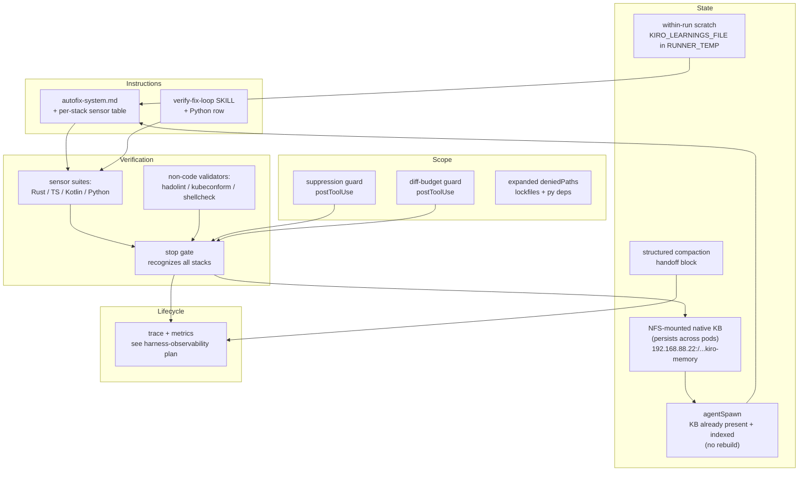
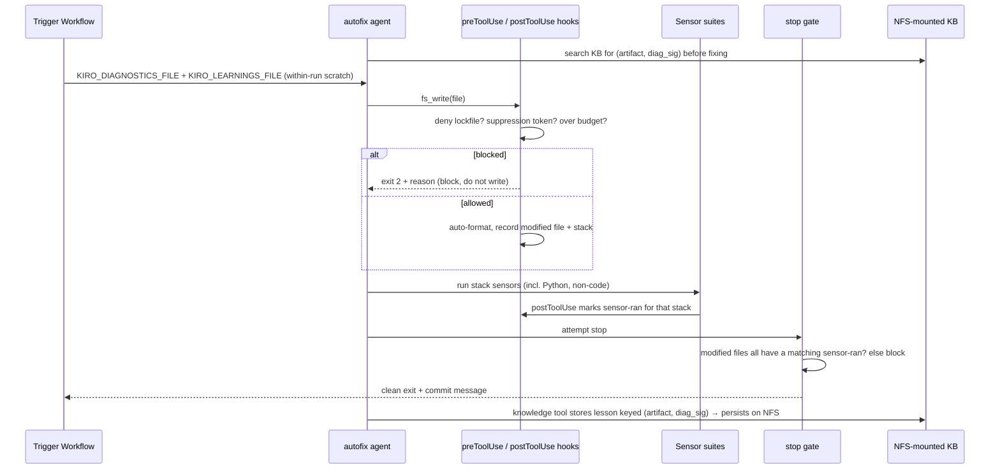

# Design Document: Autofix Harness Expansion

## Overview

The autofix harness (`.kiro/agents/autofix.json` + `.kiro/shared/autofix-system.md`) is a CI remediation agent that diagnoses build/deploy failures and applies minimal, verified fixes inside a verify-fix loop. It is the repo's most mature harness and the reference implementation for the harness-engineering skill. This design expands it by strengthening the two weakest of its five subsystems — **Verification** (a whole service has no sensors) and **State** (learnings are wiped every queue run) — and by promoting three "suggestions" in the system prompt into **mechanical Scope controls** the agent cannot bypass.

Every proposed feature traces to a concrete, observed gap in the current harness, follows the ratchet principle (add a control only where a real failure can land), and respects the project's CODEOWNERS, retry, and dependency steering rules. The observability/trace/eval expansion is already specified in `.kiro/plans/harness-observability.md`; this design references it as the Lifecycle track and does not duplicate it.

This document contains both a **High-Level Design** (subsystem architecture, data flow, component diagrams) and a **Low-Level Design** (exact `autofix.json` schema deltas, hook scripts, sensor commands, and state-file formats).

## Glossary

One term per concept, used consistently throughout.

| Term | Meaning |
|------|---------|
| Subsystem | One of the five harness subsystems: Instructions, State, Verification, Scope, Lifecycle. |
| Sensor | A deterministic verification command (fmt, clippy, test, lint) whose exit code is the only valid evidence of correctness. |
| Side-channel file | A state file under `$RUNNER_TEMP` written by hooks (e.g. `autofix-modified-files.txt`). |
| Queue run | One execution of the autofix queue in `kiro-autofix-trigger.yml`; may process many diagnostic artifacts and produce many commits. |
| Guard | A `preToolUse` or `postToolUse` hook that mechanically blocks or flags an agent action. |
| Stack | One language/service unit with its own sensor suite: Rust, TypeScript (baileys), Kotlin (android), Python (ocr-service). |

---

## Current State (Baseline)

The harness as implemented today, mapped to the five subsystems.

| Subsystem | Current mechanism | Strength |
|-----------|-------------------|----------|
| Instructions | `file://` system prompt with role + NOT-do list; resources load `AGENTS.md`, all steering globs, and the `verify-fix-loop` skill | Solid |
| State | Per-artifact `KIRO_LEARNINGS_FILE` accumulated within one queue run; `KIRO_GIT_HISTORY_FILE` of prior attempts | Partial — resets every queue run |
| Verification | `postToolUse` auto-format + sensor-ran tracking; `stop` three-layer termination gate (max 2 blocks) | Partial — no Python sensors |
| Scope | Minimal `tools` list (no wildcard); `write.deniedPaths` for workflows/actions/configs/infra/Cargo manifests; `preToolUse` git block | Partial — three rules are prompt-only |
| Lifecycle | `agentSpawn` clears stale state; structured commit-message output contract | Partial — no persisted trace (see existing plan) |

### Structural score (baseline)

Scored with the rubric in `measuring-harness-quality.md` (0 absent / 1 partial / 2 solid):

- Instructions 8/8, State 2/4, Verification 4/6, Scope 6/8, Lifecycle 2/4.
- Total **22/30 ≈ 73%** → Level 3 (scoped + verified), upper edge.

The expansion targets the four lost points (State, Verification, Lifecycle) and the two soft Scope points, aiming for ~90% (Level 4). The **State subsystem is the biggest mover**: F10 (a persistent native knowledge base stored on an NFS-mounted volume that survives ephemeral runner pods, present at session start with no rebuild) takes State from partial (2/4) to solid (4/4), since continuity now spans both *within* a queue run (F4's ephemeral learnings file) and *across* CI invocations (the NFS-persisted knowledge base). **Memory does not live in git** — see F10 for the storage architecture.

---

## Gap Analysis

Each gap is a place where a real failure can land today.

| ID | Subsystem | Gap | Evidence in repo | Failure it allows |
|----|-----------|-----|------------------|-------------------|
| GAP-1 | Verification | No sensors for `ocr-service/` (Python) | `ocr-service/` has `main.py`, `ocr_engine.py`, `test_main.py`, `test_classification_pbt.py`, `requirements.txt`; neither `autofix-system.md` nor `verify-fix-loop` SKILL mentions Python | Agent edits a `.py` file, runs no sensor, `stop` gate still passes because the sensor-ran matcher does not recognize `pytest`/`ruff` |
| GAP-2 | Verification | No sensors for Dockerfiles, K8s manifests, shell, YAML | `autofix-system.md` marks all non-code "clean, no sensors"; container/deploy diagnostics exist (`diag-container-*`, `diag-deploy-*`) | Agent "fixes" a Dockerfile or manifest with zero validation; escapes to a failing image build/deploy |
| GAP-3 | State | Learnings wiped every queue run | `kiro-autofix-trigger.yml`: `: > "$LEARNINGS_FILE"` at queue start | Queue run N+1 repeats an approach that already failed in run N (cross-run amnesia) |
| GAP-4 | Scope | "No suppressed warnings" is prompt-only | `autofix-system.md` forbids `#[allow]`, `@ts-ignore`, etc.; nothing enforces it | Agent silences a warning to make a sensor pass — defect escapes |
| GAP-5 | Scope | No diff-size budget | No control on number/spread of files written | Agent sprawls a "minimal" fix across many files; scope discipline relies on the prompt alone |
| GAP-6 | Scope | Lockfiles and Python deps not write-protected | `deniedPaths` covers Cargo manifests + `Cargo.lock` but not `package-lock.json`, `android` lockfiles, or `ocr-service/requirements.txt` | Agent silently bumps a dependency version, violating the dependencies steering rule |
| GAP-7 | Lifecycle | No persisted trace / metrics | Covered in detail by `.kiro/plans/harness-observability.md` (G1–G6) | Cannot compute VCR, verification_gap, escape rate |
| GAP-8 | State | Agent sessions are ephemeral; kiro-cli's native knowledge base is stored machine-locally and does not survive across CI invocations because each autofix job runs in a fresh, destroyed-after-use ARC runner pod | The autofix workflows invoke `kiro-cli chat --agent autofix --model claude-opus-4.6 --effort max --no-interactive --trust-all-tools "$PROMPT"` (`kiro-autofix-runtime.yml`) on `arc-runner-dind` pods (`runs-on: arc-runner-dind` in `kiro-autofix.yml`, `kiro-autofix-trigger.yml`, `kiro-autofix-runtime.yml`). The native KB is stored only on the local filesystem at `~/.local/share/kiro-cli/knowledge_bases/` ([machine-local storage, no remote backend](https://kiro.dev/docs/cli/experimental/knowledge-management/), [kiro#4823](https://github.com/kirodotdev/Kiro/issues/4823)); the pod template (`infra/k8s/arc-v2/runner-scale-set-values.yml`, `minRunners: 1`, `maxRunners: 10`) destroys that dir after each job, so it is empty on the next run unless backed by an external volume, and `agentSpawn` currently only clears state. Compounding this, the `knowledge` built-in tool is **not** in the autofix agent's `tools`/`allowedTools` (current list: `read, write, shell, code, grep, glob, introspect, thinking, @context7`), so even a persisted store is unreachable by the headless agent until the tool is granted ([built-in tools doc](https://kiro.dev/docs/cli/reference/built-in-tools/)). Enabling cross-run memory therefore requires BOTH `chat.enableKnowledge true` AND granting the `knowledge` tool in `autofix.json`. | Agent re-derives the same root cause every run and re-attempts an approach that already failed for the same artifact/diagnostic — no durable memory |

---

## Architecture

This section is the High-Level Design: subsystem topology, data flow, and design rationale.

### Subsystem map after expansion



### Data flow: one artifact through the expanded loop



### Design decisions and rationale

- **Mechanical over advisory.** GAP-4, GAP-5, GAP-6 are promoted from prompt text to hooks/`deniedPaths` because a control that depends on the agent choosing to comply is a suggestion, not a control (harness quality gate #2).
- **Per-stack sensor tracking, not a single boolean.** The current `stop` gate uses one `autofix-sensors-ran.txt` flag for all stacks. After adding Python and non-code validators, a single flag would let an agent satisfy the gate by running a Rust sensor after editing a Python file. The expansion tracks sensor-ran **per stack** so the gate verifies the right sensor ran for the files actually modified (closes GAP-1 properly).
- **Cross-run memory lives on an NFS-mounted volume, not in git.** The native KB directory is mounted from the existing NFS server (`192.168.88.22`) into the runner pod, exactly mirroring the `cargo-registry`/`sccache` cache pattern already in `infra/k8s/arc-v2/runner-scale-set-values.yml`. The memory *is* the native KB itself, living on the NAS; it survives ephemeral pods because the volume is external to the pod. Nothing memory-related is committed to the repository. Because the index persists on NFS, there is **no rebuild-from-source step on spawn** — the KB is already present and indexed when the agent starts.
- **Within-run scratch stays ephemeral.** The `KIRO_LEARNINGS_FILE` in `$RUNNER_TEMP` remains a within-run scratch pad for the current queue; cross-run continuity is now provided by the NFS-persisted KB, not by a git-tracked store.
- **Reuse the existing observability plan for Lifecycle.** No new trace design here; this spec's Lifecycle work is "consume the learnings the observability pipeline persists," keeping the two efforts non-overlapping.

---

## Components and Interfaces

### Component 1: Per-stack Sensor Registry

**Purpose**: Single source of truth mapping a modified file path to its stack and sensor suite, used by both the `postToolUse` sensor-ran tracker and the `stop` gate.

**Interface** (conceptual — implemented as a shared bash function sourced by hooks):

```bash
classify_stack <file_path>   # echoes one of: rust | ts | kotlin | python | docker | k8s | shell | none
sensor_pattern <stack>       # echoes the regex of sensor commands that count for that stack
```

**Responsibilities**:
- Map each writable file type to exactly one stack.
- Provide the sensor-command regex the `stop` gate matches against.
- Return `none` for files that legitimately need no sensor (Markdown prose), so the gate does not block on them.

### Component 2: Scope Guards (preToolUse / postToolUse)

**Purpose**: Mechanically enforce the three currently-advisory scope rules.

**Responsibilities**:
- **Suppression guard**: reject any write that *increases* the count of suppression tokens (`#[allow(`, `@ts-ignore`, `@ts-nocheck`, `eslint-disable`, `@Suppress`, `# type: ignore`, `# noqa`) for a file — i.e. block only a net-new suppression, never a pre-existing one that is left in place or relocated unchanged.
- **Diff-budget guard**: track the cumulative count of distinct files modified in one agent invocation; warn at a soft threshold and emit a stronger `::warning::` past a hard threshold, telling the agent to narrow scope. This guard is **advisory only** — it prints CI annotations the agent may act on; it does not block writes and nothing in the harness mechanically enforces the file-count budget.
- **Lockfile/dep guard**: handled declaratively via `deniedPaths` (no hook needed).

### Component 3: Within-run Scratch State

**Purpose**: Carry failed-approach notes *within a single queue run* so the agent does not repeat them while processing the artifacts of that one run. Cross-run continuity is now provided by the NFS-persisted native KB (Component 5), not by this scratch file.

**Interface**:

```bash
# reset at queue start (within-run only — NOT seeded from git)
init_scratch <learnings_file>        # truncate KIRO_LEARNINGS_FILE in $RUNNER_TEMP
# appended by the agent/workflow during the run
note_attempt <artifact> <approach>   # one line appended to the scratch file
```

**Responsibilities**:
- Provide an ephemeral, within-run notepad (`KIRO_LEARNINGS_FILE` in `$RUNNER_TEMP`) that lives and dies with the queue run.
- Hold no durable, cross-run state — that role moves entirely to the NFS-mounted KB (Component 5).
- Stay out of git: the scratch file is never committed.

### Component 4: Structured Compaction Handoff

**Purpose**: When a long agent session approaches its context limit, write a structured handoff block so the next turn/session can resume without re-diagnosing.

**Responsibilities**:
- Capture goal, constraints, progress (done/in-progress/blocked), key decisions, next steps, and cumulative modified files.
- This is a system-prompt instruction backed by the existing side-channel files (modified-files list already exists), not a new tool.

### Component 5: Persistent Memory Subsystem (F10)

**Purpose**: Give the ephemeral agent durable memory across CI invocations **without using git**. The memory is kiro-cli's own native knowledge base, reached by the headless agent through the built-in [`knowledge` tool](https://kiro.dev/docs/cli/reference/built-in-tools/) (the `/knowledge` REPL slash-command is the interactive surface for the same feature; the `--no-interactive` autofix agent uses the tool). Its store directory is mounted from an NFS-backed volume into the runner pod. Because the volume is external to the pod, the KB — and its index — survive the destruction of each ephemeral runner pod. No memory is committed to the repository. Full design in the Low-Level Design (F10).

**Interface** (the built-in `knowledge` tool — search / store; no custom store):

```text
# The headless autofix agent invokes the built-in `knowledge` tool, NOT the
# `/knowledge` REPL slash-command. `/knowledge` is the interactive surface for the
# SAME feature; the --no-interactive agent reaches the feature through the tool.
# The `knowledge` tool has no configuration options (per the built-in tools doc) —
# storage location is governed by settings + the filesystem (the NFS mount), not a tool flag.

knowledge: search "<artifact> <diag_sig>"   # read-on-spawn anti-repeat lookup before a fix
knowledge: store  "<lesson keyed (artifact, diag_sig)>"   # native-curation write after a verified outcome
```

**Responsibilities**:
- Persist memory as the native KB on an NFS-mounted volume at the kiro-cli data dir (`~/.local/share/kiro-cli`), so the `knowledge_bases/` subdir and its index persist across pods.
- Present the KB already-indexed at session start — **no read-on-spawn rebuild**, unlike a git-seeded approach.
- Key/tag each entry by `(artifact, diag_sig)` so anti-repeat lookup is meaningful (a naming/tagging convention, since the native KB has no schema).
- Bound growth via an out-of-band GC mechanism (the native KB has no auto-cleanup); see F10.
- Default to the **native-curation** write model (the agent maintains its own KB); offer a stronger read-only-mount variant if write integrity proves necessary (see F10).

---

## Data Models

### Persisted memory entry (native KB on NFS)

Memory is not a git file; it is the native KB persisted on the NFS-mounted volume, reached through the built-in `knowledge` tool. There is no enforced schema, so entries follow a **naming/tagging convention** keyed by `(artifact, diag_sig)` to make anti-repeat lookup meaningful. A typical curated entry (written by the agent via the `knowledge` tool's store operation) records, in prose:

```text
[artifact: diag-clippy-backend] [diag_sig: clippy::needless_return]
Failure: clippy denies needless_return in payment handlers.
Root cause: trailing `return` added by an earlier mechanical edit.
Fix that worked: drop the `return` keyword, keep the tail expression.
Avoid: do NOT add #[allow(clippy::needless_return)] (blocked by suppression guard).
Files: backend/src/handlers/payments.rs
```

**Convention rules**:
- The first line carries the `(artifact, diag_sig)` tag so a `knowledge` tool search for `"<artifact> <diag_sig>"` retrieves the right lesson.
- `diag_sig` is a normalized signature of the diagnostic: clippy lint name, Rust error code (`E0277`), failing test name, ruff rule code, hadolint rule, etc.
- Each entry records whether the approach *worked* or *failed*, so the agent can avoid re-attempting a failed approach.
- Growth is bounded out-of-band (GC CronJob / periodic removal via the `knowledge` tool), since the native KB has no auto-cleanup — see F10.

### Within-run scratch (`$RUNNER_TEMP/autofix-learnings.txt`)

A plain-text notepad, one line per attempt, that lives and dies with a single queue run. It is reset at queue start and is **never** committed to git. Cross-run continuity comes from the NFS KB above, not from this file.

### Per-stack sensor-ran state (`$RUNNER_TEMP/autofix-sensors-ran.d/`)

Replaces the single `autofix-sensors-ran.txt` flag. One empty marker file per stack whose sensor ran:

```
$RUNNER_TEMP/autofix-sensors-ran.d/rust
$RUNNER_TEMP/autofix-sensors-ran.d/python
$RUNNER_TEMP/autofix-sensors-ran.d/ts
```

### Modified-files state (`$RUNNER_TEMP/autofix-modified-files.txt`)

Unchanged in format (one path per line); now also consumed by the diff-budget guard and the stop gate's per-stack check.

---

## Proposed Features

Each feature names the subsystem it strengthens, the behavior it adds, and whether it is mechanical (enforced) or advisory (prompt).

| ID | Feature | Subsystem | Closes | Type |
|----|---------|-----------|--------|------|
| F1 | Python (ocr-service) sensor suite | Verification | GAP-1 | Mechanical + prompt |
| F2 | Non-code validators (Dockerfile, K8s, shell) | Verification | GAP-2 | Mechanical + prompt |
| F3 | Per-stack sensor-ran tracking in the stop gate | Verification | GAP-1, GAP-2 | Mechanical |
| F4 | Within-run scratch learnings (ephemeral; cross-run role folded into F10) | State | GAP-3 (within-run) | Ephemeral (within-run only) |
| F5 | Structured compaction handoff | State / Lifecycle | GAP-3 | Advisory (prompt) |
| F6 | Suppression guard | Scope | GAP-4 | Mechanical |
| F7 | Diff-budget guard | Scope | GAP-5 | Advisory (prompt/CI-annotation) |
| F8 | Expanded deniedPaths (lockfiles + Python deps) | Scope | GAP-6 | Mechanical |
| F9 | Trace + metrics integration | Lifecycle | GAP-7 | See existing plan |
| F10 | Persistent memory subsystem (native KB on an NFS-mounted volume, persists across ephemeral pods, present + indexed at session start with no rebuild; subsumes the cross-run role of F4) | State (+ Lifecycle) | GAP-3 (cross-run), GAP-8 | Mechanical (infra) + prompt |

---

## Low-Level Design

### F1 + F2 + F8: `autofix.json` schema deltas

The expanded `toolsSettings.write.deniedPaths` (F8). Additions are the last four entries; existing entries retained.

```json
{
  "toolsSettings": {
    "write": {
      "deniedPaths": [
        ".github/workflows/**",
        ".github/actions/**",
        ".kiro/agents/**",
        ".kiro/steering/**",
        ".kiro/skills/**",
        "infra/**",
        "Cargo.toml",
        "backend/Cargo.toml",
        "frontend/Cargo.toml",
        "Cargo.lock",
        "baileys-service/package-lock.json",
        "ocr-service/requirements.txt",
        "android/gradle/libs.versions.toml",
        "android/**/*.lockfile"
      ]
    }
  }
}
```

Rationale: the dependencies steering rule requires research-and-pin before any version change. Dependency edits are out of scope for a surgical CI fix, so they are denied outright. If a fix genuinely requires a dependency change, the agent exits with `Status: PARTIAL` and reports it for human action (consistent with how it already handles unfixable secret/infra diagnostics in the trigger workflow). No memory path appears in `deniedPaths`: memory is the NFS-mounted native KB, not a file in the repository (F10), so there is nothing repo-side to deny — see the F10 write-integrity discussion for how memory integrity is handled instead.

Note on `android/**/*.lockfile`: this pattern matches no file in the repo today because Gradle dependency-locking is not currently enabled. It is a harmless forward-looking guard — a pattern with no current target rather than an active rule — kept so that if dependency-locking is later turned on, the lockfiles it produces are denied from the start. The entry is intentionally retained.

### F1: Python sensor suite (system prompt + verify-fix-loop SKILL row)

Add to the **Verify** section of `autofix-system.md` and the sensor-selection table of the `verify-fix-loop` SKILL:

```bash
# Python (ocr-service/**/*.py) — run from ocr-service/
cd ocr-service && ruff format --check .
cd ocr-service && ruff check .
cd ocr-service && python -m pytest -q
```

These match the existing repo tooling: `ruff` is already configured at `.trunk/configs/ruff.toml`, and `ocr-service/` already has `pytest` + `hypothesis` tests (`test_main.py`, `test_classification_pbt.py`, `conftest.py`). No new dependency is introduced.

Priority order within the Python stack follows Keep-Quality-Left: `ruff format --check` → `ruff check` → `pytest`.

### F2: Non-code validators

Add as a new sensor tier for file types the harness currently marks "clean, no sensors". Each tool is fetched in the runner image or via a retry-wrapped install (per the workflow-retries steering rule: tool installs → 10 min, 3 attempts, 10s):

```bash
# Dockerfile (**/Dockerfile, *.Dockerfile)
hadolint <path>

# Kubernetes manifests (infra/k8s/**/*.yml) — validation only; writes still denied by deniedPaths
kubeconform -strict -ignore-missing-schemas <path>

# Shell scripts (*.sh, hook command bodies)
shellcheck <path>
```

Note: `infra/**` is write-denied, so K8s/Dockerfile validators apply only when the agent inspects manifests referenced by `diag-container-*` / `diag-deploy-*` diagnostics to inform a code-side fix — they validate, they do not authorize writes. This keeps F2 consistent with the existing infra protection.

### F3: Per-stack sensor-ran tracking

Replaces the single-flag `postToolUse` sensor matcher and the `stop` gate. The shared classifier is defined once and referenced by both hooks.

**New `postToolUse` sensor tracker** (replaces the third existing `postToolUse` entry):

```bash
bash -c '
CMD=$(cat | jq -r .tool_input.command 2>/dev/null)
DIR="${RUNNER_TEMP:-/tmp}/autofix-sensors-ran.d"
mkdir -p "$DIR"
case "$CMD" in
  *"cargo clippy"*|*"cargo test"*|*"cargo fmt"*) touch "$DIR/rust" ;;
  *"npm run build"*|*"npm test"*|*"npx eslint"*)  touch "$DIR/ts" ;;
  *"gradlew build"*|*"gradlew test"*)             touch "$DIR/kotlin" ;;
  *"pytest"*|*"ruff check"*|*"ruff format"*)       touch "$DIR/python" ;;
  *hadolint*)    touch "$DIR/docker" ;;
  *kubeconform*) touch "$DIR/k8s" ;;
  *shellcheck*)  touch "$DIR/shell" ;;
esac'
```

**New `stop` gate** (replaces the existing stop hook). Blocks exit if any modified file belongs to a stack whose sensor did not run; preserves the max-2-block escape hatch.

```bash
bash -c '
TMP="${RUNNER_TEMP:-/tmp}"
MODIFIED="$TMP/autofix-modified-files.txt"
SENSOR_DIR="$TMP/autofix-sensors-ran.d"
BLOCKS="$TMP/autofix-stop-blocks.txt"
COUNT=$(cat "$BLOCKS" 2>/dev/null || echo 0)

cleanup() { rm -rf "$MODIFIED" "$SENSOR_DIR" "$BLOCKS" 2>/dev/null; }

# Escape hatch: never block more than twice.
if [ "$COUNT" -ge 2 ]; then cleanup; exit 0; fi
# Nothing modified → clean exit.
if [ ! -s "$MODIFIED" ]; then cleanup; exit 0; fi

classify() {
  case "$1" in
    *.rs) echo rust ;;
    */baileys-service/*.ts|*/baileys-service/*.tsx) echo ts ;;
    */android/*.kt|*/android/*.kts) echo kotlin ;;
    */ocr-service/*.py) echo python ;;
    *Dockerfile|*.Dockerfile) echo docker ;;
    */infra/k8s/*.yml|*/infra/k8s/*.yaml) echo k8s ;;
    *.sh) echo shell ;;
    *) echo none ;;
  esac
}

MISSING=""
while IFS= read -r f; do
  [ -z "$f" ] && continue
  stack=$(classify "$f")
  [ "$stack" = none ] && continue
  if [ ! -f "$SENSOR_DIR/$stack" ]; then
    case "$MISSING" in *"$stack"*) ;; *) MISSING="$MISSING $stack" ;; esac
  fi
done < "$MODIFIED"

if [ -n "$MISSING" ]; then
  echo $((COUNT + 1)) > "$BLOCKS"
  printf "{\"decision\": \"block\", \"reason\": \"You modified files in stack(s):%s but did not run their verification sensors. Run the sensors for each modified stack (Rust: cargo clippy/test; Python: ruff check + pytest; TS: npm run build + eslint; Kotlin: gradlew build) before stopping.\"}" "$MISSING"
else
  cleanup
fi'
```

**Extended `postToolUse` formatter** (adds Python formatting to the two existing write/str_replace formatters):

```bash
# appended case to the existing format switch
*/ocr-service/*.py) cd ocr-service && ruff format "$FILE" 2>/dev/null || true ;;
```

Implementation note: the bash snippets above show the hook command bodies only. When wired into `autofix.json`, each hook MUST retain its `matcher` field or it will not bind to any tool — `execute_bash` for the sensor-ran tracker (it inspects `tool_input.command`), and `fs_write`/`str_replace` for the formatter (it acts on written files). The existing hooks in `autofix.json` already use exactly these matchers; mirror them when adding the per-stack versions.

### F6: Suppression guard (`preToolUse`)

New `preToolUse` entries matching `fs_write` and `str_replace`. The guard must block only a **net-new** suppression, never a suppression that already exists in the file. A naive presence-check is unshippable on this repo: `#[allow(...)]` is pervasive across the backend (`app.rs`, `auth.rs`, `documentos.rs`, `firmas.rs`, `config.rs`, `main.rs`, and dozens of services/models/tests). Because `fs_write` carries the *full* new file content, a presence-check would hard-deny any full-file write to a file that already contains a suppression — locking the agent out of large parts of the backend. The guard therefore compares suppression-token counts and blocks only when the write increases the count.

- **`str_replace`**: compare the suppression-token count in `tool_input.newStr` against `tool_input.oldStr`; block only if `count(newStr) > count(oldStr)`.
- **`fs_write`**: read the current on-disk file at `tool_input.path` and compare the suppression-token count in `tool_input.text` (new) against the current file (old; treat a non-existent file as count 0); block only if `new > old`.

**`str_replace` matcher:**

```bash
bash -c '
INPUT=$(cat)
RE="#\[allow\(|@ts-ignore|@ts-nocheck|eslint-disable|@Suppress|# type: ignore|# noqa"
NEW=$(echo "$INPUT" | jq -r ".tool_input.newStr // empty" 2>/dev/null)
OLD=$(echo "$INPUT" | jq -r ".tool_input.oldStr // empty" 2>/dev/null)
NEW_N=$(printf "%s" "$NEW" | grep -oE "$RE" | wc -l | tr -d " ")
OLD_N=$(printf "%s" "$OLD" | grep -oE "$RE" | wc -l | tr -d " ")
if [ "$NEW_N" -gt "$OLD_N" ]; then
  echo "BLOCKED: this edit adds a NET-NEW suppression directive ($OLD_N -> $NEW_N). Fix the root cause instead of silencing the warning (see autofix-system.md: No suppressed warnings)." >&2
  exit 2
fi'
```

**`fs_write` matcher:**

```bash
bash -c '
INPUT=$(cat)
RE="#\[allow\(|@ts-ignore|@ts-nocheck|eslint-disable|@Suppress|# type: ignore|# noqa"
PATH_=$(echo "$INPUT" | jq -r ".tool_input.path // empty" 2>/dev/null)
NEW=$(echo "$INPUT" | jq -r ".tool_input.text // empty" 2>/dev/null)
NEW_N=$(printf "%s" "$NEW" | grep -oE "$RE" | wc -l | tr -d " ")
if [ -f "$PATH_" ]; then
  OLD_N=$(grep -oE "$RE" "$PATH_" | wc -l | tr -d " ")
else
  OLD_N=0
fi
if [ "$NEW_N" -gt "$OLD_N" ]; then
  echo "BLOCKED: this write adds a NET-NEW suppression directive ($OLD_N -> $NEW_N) to $PATH_. Fix the root cause instead of silencing the warning (see autofix-system.md: No suppressed warnings)." >&2
  exit 2
fi'
```

Edge case: `#[allow(...)]` is **pervasive** in this repo, so a naive presence-check is unshippable — it would block routine edits to any file that already carries a suppression and effectively lock the agent out of the backend. The count-delta check above is required: it permits leaving or relocating an existing suppression while still blocking the introduction of a new one. Residual limitation: a single write that *removes* one suppression and *adds* a different one (equal count) slips through, since the total count is unchanged. That is an accepted tradeoff — the goal is preventing net-new suppressions, not perfectly tracking individual tokens. The max-2-block stop escape does not apply to `preToolUse` (this is a hard deny), so the agent must choose a fix that does not increase the suppression count.

### F7: Diff-budget guard (`postToolUse`)

Tracks distinct modified files; soft-warns past `KIRO_DIFF_SOFT` (default 8), and emits a strong advisory past `KIRO_DIFF_HARD` (default 15). **F7 is a purely advisory nudge — it enforces nothing.** Because `postToolUse` cannot retroactively undo a write, the hard limit only prints a `::warning::`/`::notice::` annotation the agent sees on its next turn. Nothing in the harness mechanically enforces the file-count budget: the F3 stop gate checks sensors-ran per stack only and has no file-count check, so no component blocks a fix for exceeding the budget. The budget influences behavior solely by surfacing a message the agent may act on.

If a hard, mechanical budget is ever wanted, it would require adding an explicit file-count check to the stop gate — count distinct entries in `autofix-modified-files.txt` and block exit past the cap — but that is not part of this design as written.

```bash
bash -c '
TMP="${RUNNER_TEMP:-/tmp}"
MODIFIED="$TMP/autofix-modified-files.txt"
SOFT="${KIRO_DIFF_SOFT:-8}"; HARD="${KIRO_DIFF_HARD:-15}"
N=$(sort -u "$MODIFIED" 2>/dev/null | grep -c . || echo 0)
if [ "$N" -ge "$HARD" ]; then
  echo "::warning::Autofix has modified $N files (hard budget $HARD). A surgical CI fix should touch few files. Stop expanding scope; if the fix genuinely needs this many files, exit with Status: PARTIAL and explain." >&2
elif [ "$N" -ge "$SOFT" ]; then
  echo "::notice::Autofix has modified $N files (soft budget $SOFT). Confirm each change traces to the diagnosed failure." >&2
fi'
```

### F4: Within-run scratch learnings (workflow-side)

F4 is now **within-run only**. The previous design wrote a git-tracked `evals/autofix-learnings.jsonl` and seeded the next run from it; that git store is **removed** (memory must not live in git) and its cross-run role is folded into F10's NFS-mounted native KB. What remains of F4 is the ephemeral scratch pad inside a single queue run.

In `kiro-autofix-trigger.yml`, the queue-start reset is kept as-is — the scratch file starts empty each run and is never committed:

```bash
LEARNINGS_FILE="${RUNNER_TEMP}/autofix-learnings.txt"
: > "$LEARNINGS_FILE"
```

There is **no seed-from-git** step and **no commit-of-memory** step. Within a queue run, the agent (and the workflow) may append short notes to `$LEARNINGS_FILE` so later artifacts in the *same* run benefit from earlier attempts; the file is discarded when the runner pod is destroyed.

Cross-run continuity — remembering a `(artifact, diag_sig)` lesson from a *previous* CI invocation — is provided entirely by the NFS-persisted native KB described in F10. The agent searches that KB at the start of a fix; it does not read any git-tracked learnings file.

### F5: Structured compaction handoff (system prompt)

Add to `autofix-system.md` a section instructing the agent, when its context approaches the limit mid-fix, to write a handoff block capturing the six structured-compaction fields before continuing:

```
## Handoff on Compaction

If your context fills before the fix is verified, write this block so the next
turn resumes without re-diagnosing:

  GOAL: <the failure being fixed, artifact name>
  CONSTRAINTS: <surgical, no suppressions, stack sensors required>
  PROGRESS: done=<...> in-progress=<...> blocked=<...>
  DECISIONS: <root cause identified, approach chosen and why>
  NEXT: <exact next sensor to run or file to edit>
  FILES: <cumulative modified files this session>
```

This is advisory (the model decides when), backed by the already-tracked modified-files side-channel for the FILES field.

In addition to the prose handoff block, F5 can tune kiro-cli's native compaction settings ([settings reference](https://kiro.dev/docs/cli/reference/settings/)) rather than relying on the handoff alone: `chat.disableAutoCompaction` controls whether auto-compaction runs at all, `compaction.excludeMessages` keeps specific messages out of the compacted summary, and `compaction.excludeContextWindowPercent` reserves a slice of the window. Setting these on the runner gives the handoff block a predictable place to land and avoids losing the in-progress diagnosis to an untimed auto-compaction.

### F10: Persistent memory subsystem

> **F10 is the highest-infra-cost, lowest-verification feature in this design.** Everything else (F1–F8) is editable config or hooks verified by the repo's own sensors. The official [built-in tools doc](https://kiro.dev/docs/cli/reference/built-in-tools/) now **retires the tool-existence risk**: `knowledge` is a real, grantable built-in tool (listed under experimental tools alongside `thinking` and `todo`), so the earlier worry that "there is no knowledge tool / it is only a slash-command" is settled. What remains are two smaller, still-unproven assumptions: (a) that the granted `knowledge` tool actually *functions* in headless `--no-interactive` mode, and (b) the real on-disk store path on the runner image. The spike below is a **hard gate** narrowed to those two: it must pass before any work touches `infra/` or helm.

#### Validation spike (prerequisite gate)

Before any infra/helm/NFS work, a spike MUST confirm the two remaining unproven assumptions below. The tool-existence question is already **RESOLVED** by the official [built-in tools doc](https://kiro.dev/docs/cli/reference/built-in-tools/): `knowledge` is a real built-in tool ("Store and retrieve information in a knowledge base across chat sessions. Provides semantic search capabilities for files, directories, and text content. This tool has no configuration options."), listed under the experimental tools, and the doc's `allowedTools` example explicitly includes `"knowledge"`. So the earlier worry — "there is no `knowledge` tool / it is only a REPL slash-command" — is settled, provided the tool is granted (see the tool-grant delta below). The spike no longer has to discover whether a knowledge mechanism exists; it only has to confirm the two narrower points.

**(a) Does the granted `knowledge` tool actually function headless?** The tool exists and is grantable, but its runtime behavior under `kiro-cli chat --agent autofix --no-interactive --trust-all-tools "$PROMPT"` is unverified. After adding `"knowledge"` to both `tools` and `allowedTools` in `autofix.json` (the tool-grant delta below), smoke-test that in non-interactive mode the agent can (1) run a knowledge **search** and get results back, and (2) **store** an entry that actually persists to the store directory. The tool being present and granted does not by itself prove the search/store round-trip works in headless mode — that is what this step verifies before any infra spend.

**(b) What is the real KB store path on the runner image?** The store path `~/.local/share/kiro-cli/knowledge_bases/` is an **external claim** (kiro.dev docs + [kiro#4823](https://github.com/kirodotdev/Kiro/issues/4823)). If the real path on the runner image differs, the NFS mount targets the wrong directory and the KB is always empty. Because the `knowledge` tool "has no configuration options" (built-in tools doc), there is **no per-tool path setting** to point it elsewhere — the store location is governed by the feature/settings and the filesystem, which is exactly why the NFS-mount-at-the-data-dir approach is the persistence mechanism. The spike must determine the actual path by running kiro-cli on the runner image `ghcr.io/perezjoseph/realestate-runner` and inspecting the filesystem — do not trust the documented path blindly.

**Gate decision.** If the spike shows the granted `knowledge` tool **does not function** headless (search returns nothing usable, or stores do not persist), F10 must be **redesigned** (e.g. a different memory mechanism the headless agent can actually drive) or **dropped**. Do not proceed to the NFS mount, the `runner-scale-set-values.yml` delta, or any helm change until both (a) and (b) are confirmed. This makes the "external claims — re-verify at implementation time" callout (see Dependencies) concrete and blocking for F10.

#### Problem and decision

kiro-cli exposes a native, experimental knowledge base — reached by the headless agent through the built-in [`knowledge` tool](https://kiro.dev/docs/cli/reference/built-in-tools/) (the [`/knowledge`](https://kiro.dev/docs/cli/experimental/knowledge-management/) slash-command is the interactive surface for the same feature) — designed to persist "across chat sessions and CLI restarts." Critically, **kiro-cli has no remote or cloud memory backend**: the knowledge base is stored *only* on the local filesystem at `~/.local/share/kiro-cli/knowledge_bases/` ([knowledge management docs](https://kiro.dev/docs/cli/experimental/knowledge-management/), [kiro#4823](https://github.com/kirodotdev/Kiro/issues/4823)), and the `knowledge` tool itself "has no configuration options" ([built-in tools doc](https://kiro.dev/docs/cli/reference/built-in-tools/)) — so there is no setting on the tool to point it at S3, a database, or any external service. So the **only** way to persist it is to make that local directory itself durable.

The autofix workflows run on self-hosted Actions Runner Controller (ARC) runners (`runs-on: arc-runner-dind` in `kiro-autofix.yml`, `kiro-autofix-trigger.yml`, `kiro-autofix-runtime.yml`), invoking `kiro-cli chat --agent autofix --model claude-opus-4.6 --effort max --no-interactive --trust-all-tools "$PROMPT"` (`kiro-autofix-runtime.yml`). Each job runs in a fresh `arc-runner-dind` pod that is destroyed afterward, so the local data dir is empty on the next run.

**Core decision: persist kiro-cli's native knowledge base directory on an NFS-backed volume mounted into the ARC runner pod at the kiro-cli data dir**, mirroring the existing cargo-cache NFS pattern in `infra/k8s/arc-v2/runner-scale-set-values.yml`. The memory *is* the native KB itself, living on the NAS — it survives ephemeral runner pods because the volume is external to the pod. It is durable, **not in git**, and **not in the container image**.

A key simplification versus a git-seeded approach: because the index itself persists on NFS, there is **no rebuild-from-source step on spawn** — the KB is already present and indexed when the agent starts.

Four principles (adapted to NFS storage):

1. **Persist outside the session, on NFS — never in git.** Memory is the native KB on a volume external to the pod. Nothing memory-related is committed to the repository, baked into the image, or distilled to a tracked file.
2. **Read-on-spawn with no rebuild.** The KB is already mounted, present, and indexed at session start; the agent searches it immediately. There is no seed step and no re-index-from-git step.
3. **Bounded + garbage-collected out-of-band.** The native KB has **no automatic cleanup of old contexts** ([docs](https://kiro.dev/docs/cli/experimental/knowledge-management/)) and NFS persists indefinitely, so a separate GC mechanism trims the store (see below).
4. **Degrade gracefully.** If the NFS server is unavailable, the agent runs with no memory rather than failing hard.

#### Tool-grant delta to `autofix.json` (prerequisite for the headless agent)

Per the [built-in tools doc](https://kiro.dev/docs/cli/reference/built-in-tools/), "if a tool is not in the `allowedTools` list, the user will be prompted for permission when the tool is used." In headless `--no-interactive` mode **there is no user to prompt**, so an ungranted tool effectively cannot be used. The autofix agent's current `tools`/`allowedTools` are `read, write, shell, code, grep, glob, introspect, thinking, @context7` — `knowledge` is **absent from both**. F10 therefore requires adding `"knowledge"` to BOTH arrays. This mirrors the pattern the same doc states for `subagent`: a custom agent must explicitly add the tool to its `tools` array (or pull it in via `@builtin`).

```json
{
  "tools": [
    "read", "write", "shell", "code", "grep", "glob",
    "introspect", "thinking", "knowledge", "@context7"
  ],
  "allowedTools": [
    "read", "write", "shell", "code", "grep", "glob",
    "introspect", "thinking", "knowledge", "@context7"
  ]
}
```

`--trust-all-tools` (already passed on the runtime invocation) may in practice cover an ungranted tool, but relying on it is non-deterministic — explicitly listing `knowledge` in both `tools` and `allowedTools` is the correct, deterministic grant and the approach this design adopts. The `knowledge` tool "has no configuration options," so there is nothing further to configure on the tool itself; storage location is handled by the NFS mount, not a tool flag.

This is a `.kiro/agents/autofix.json` change. Per the Security section's two-mechanism distinction, that file is protected **only** by the agent's own `write.deniedPaths` (`.kiro/agents/**`, which stops the agent self-editing it) — it is **not** in `.github/CODEOWNERS`, so a human PR editing it triggers no required-review gate. Apply this grant as part of the same human-applied change set as the F10 infra delta.

#### Proposed infra delta to `runner-scale-set-values.yml`

> **This is a PROPOSED, human-applied change.** `infra/**` is in the agent's `write.deniedPaths` and is CODEOWNERS-protected; the autofix agent cannot apply it. A human applies these YAML additions and re-runs `helm upgrade`.

Add a new `kiro-memory` NFS volume, mount it in the `runner` container at the kiro-cli data dir, and extend the `init-nfs-permissions` initContainer to `chmod 777` the new mount — consistent with the file's existing style.

**1. New volume (add under `volumes:`):**

```yaml
      - name: kiro-memory
        nfs:
          server: 192.168.88.22
          path: /volume1/docker/k3s-cache/kiro-memory
```

**2. Mount in the `runner` container (add under that container's `volumeMounts:`):**

```yaml
          - name: kiro-memory
            mountPath: /home/runner/.local/share/kiro-cli
```

The native KB lives in the `knowledge_bases/` subdir of that path; mounting the parent kiro-cli data dir persists the KB and its index together.

**3. Extend the `init-nfs-permissions` initContainer.** Add the new mount and include `/mnt/kiro-memory` in the existing `chmod` loop:

```yaml
      - name: init-nfs-permissions
        image: ghcr.io/perezjoseph/realestate-runner:latest
        imagePullPolicy: Always
        command:
          [
            "sh",
            "-c",
            'for d in /mnt/registry /mnt/git /mnt/sccache /mnt/target /mnt/kiro-memory; do chmod 777 "$d" 2>/dev/null || true; done',
          ]
        securityContext:
          runAsUser: 0
        volumeMounts:
          - name: cargo-registry
            mountPath: /mnt/registry
          - name: cargo-git
            mountPath: /mnt/git
          - name: sccache
            mountPath: /mnt/sccache
          - name: cargo-target
            mountPath: /mnt/target
          - name: kiro-memory
            mountPath: /mnt/kiro-memory
```

This reuses the exact NFS server (`192.168.88.22`) and path convention (`/volume1/docker/k3s-cache/...`) already established for the cargo caches.


#### Anti-repeat keying convention

The native KB has no enforced schema, so entries follow a tagging convention keyed by `(artifact, diag_sig)` so the agent can recognize a previously-seen problem:

- `artifact` — the diagnostics artifact name (e.g. `diag-clippy-backend`).
- `diag_sig` — a normalized signature of the diagnostic itself: the clippy lint name, Rust error code (`E0277`), failing test name, ruff rule code, hadolint rule, etc. Falls back to a hash of the first error line when no code is present.

Before attempting a fix, the agent invokes the `knowledge` tool to search for `"<artifact> <diag_sig>"` against the persisted KB, reads any matching lesson, and avoids re-attempting an approach recorded as failed. Each curated entry records whether the approach worked or failed (see the entry convention in Data Models). This `(artifact, diag_sig)` keying is the read-on-spawn / anti-repeat mechanism; because the KB is already on the mounted volume, the lookup needs no rebuild.

#### Concurrency: reuse the existing per-branch group, partition the KB per branch

`maxRunners: 10` means up to ten runner pods could mount the **same** NFS KB at once. The instinct to add a `concurrency: group: autofix-memory` block is **wrong** here, for two concrete reasons:

1. **A GitHub workflow can declare only one `concurrency:` block, and `kiro-autofix-trigger.yml` already has one** (marked mandatory by its own comment):

   ```yaml
   # IMPORTANT: cancel-in-progress MUST be false ...
   concurrency:
     group: kiro-autofix-${{ github.event.workflow_run.head_branch }}
     cancel-in-progress: false
   ```

2. **Replacing the per-branch group with a global `autofix-memory` group would serialize all branches** and destroy the per-branch queue semantics the file comment says are mandatory (the queue processes one artifact at a time *per branch*). A global group is therefore not an option, and a second block cannot be added.

**Resolution: do not add any concurrency group. Reuse the existing per-branch group as-is and partition the KB per branch.** Each branch writes its own KB subdirectory under the NFS mount:

```text
/home/runner/.local/share/kiro-cli/knowledge_bases/<branch>/
```

The per-branch path is derived from the branch name that already drives the existing concurrency group — `github.event.workflow_run.head_branch` — sanitized for filesystem safety (replace `/` and any non-`[A-Za-z0-9._-]` character with `_`), e.g. `feature/x` → `feature_x`. The workflow exports it (for example `KIRO_KB_BRANCH`) and the agent/settings point the KB at the corresponding subdir.

This fits the existing concurrency model perfectly: the `kiro-autofix-${{ head_branch }}` group already guarantees **at most one autofix job per branch runs at a time**, so within a branch there is a single writer to that branch's subdir, and different branches write different subdirs — no cross-branch contention and no new group needed.

Tradeoff: per-branch partitioning means a lesson learned on branch A is **not** visible on branch B. This is acceptable — `main` is the dominant autofix target, so the bulk of accumulated memory lives and is reused under the `main` subdir.

Residual risk: even with a single writer per branch, NFS file-locking on a bm25 index can still be flaky across pod churn (a pod dying mid-write, or NFS lock state lingering after a pod is destroyed). Graceful degradation (the `agentSpawn` missing-KB check) softens this but does **not** fully eliminate the chance of a corrupted index; the GC/rebuild path (below) is the recovery for a corrupted base.


#### Write integrity: who curates the memory

With `--trust-all-tools`, the `knowledge` tool granted, and a writable NFS mount, the agent **can** invoke the `knowledge` tool's store operation and curate its own memory. Be honest about the consequence: there is **no hard mechanical barrier** here like the old git `deniedPaths` entry gave — the previous design could deny `.kiro/memory/**` because memory was a repo path, but the NFS-mounted KB is not a repo path and the agent owns the `knowledge` tool. Two options:

**(a) Native-curation model — DEFAULT, recommended for the first iteration.** The agent maintains its own KB: after a verified outcome it records a lesson via the `knowledge` tool's store operation, keyed `(artifact, diag_sig)`. This matches how kiro-cli's knowledge feature is intended to work and is the simplest. Integrity relies on the bounded, reviewable nature of the store and on the fact that lessons derive from *verified* sensor outcomes (a lesson is written only after the stop gate confirms the result). **Residual risk:** because the agent is the writer, it could in principle record a self-serving or inaccurate lesson; nothing mechanically prevents it. The GC policy and the small bounded size keep the store auditable.

**(b) Stronger-integrity variant — adopt only if write-integrity proves necessary.** Mount the NFS KB **read-only** into the runner during the agent turn, and have a separate writer — a small post-job step or a k8s `Job` using `kubectl`, or the workflow itself — write curated entries out-of-band so the agent cannot author its own memory. This is more complex and may fight kiro-cli's native KB, which expects to write its own store (a read-only store dir can break the `knowledge` tool's store operation and index updates). Treat it as a hardening step, not the starting point.

**Recommendation:** ship (a) first; move to (b) only if observed behavior shows the agent recording untrustworthy lessons.


#### Knowledge base enablement and index type

Enabling cross-run memory has **two** prerequisites that must both hold: (1) the `knowledge` built-in tool is granted in `autofix.json` (the tool-grant delta above), and (2) the experimental knowledge feature is turned on via settings. Missing either one leaves the headless agent unable to use memory.

The native knowledge base must be enabled (it is experimental and off by default) and configured to use the Fast index. Both settings live in `~/.kiro/settings/cli.json` and are set with `kiro-cli settings <key> <value>` ([settings reference](https://kiro.dev/docs/cli/reference/settings/)):

```bash
kiro-cli settings chat.enableKnowledge true
kiro-cli settings knowledge.indexType Fast
```

Because the KB store persists on the NFS mount, there is no per-run re-add of the memory dir — the base is already present and indexed at session start. The agent simply invokes the `knowledge` tool to search it for `"<artifact> <diag_sig>"` and, under the native-curation model, stores lessons after verified fixes.

> Schema note: if a future kiro-cli release lets an agent config declare a knowledge-base resource that "syncs automatically on session init," that could replace the manual settings step. The **exact JSON field** for an agent-config knowledge-base resource is not specified in the referenced docs. Do not fabricate it — verify the precise key against the custom-agents configuration reference before relying on it.

**Index type — Fast (bm25), not Best.** The docs offer two index types: **Fast** (lexical bm25 — near-instant indexing, instant keyword search, low CPU/memory, "perfect for logs, configs, and large codebases") and **Best** (semantic `all-minilm-l6-v2` — natural-language meaning, but slower and more resource-hungry). Autofix memory lookup is keyed on diagnostic signatures and lint codes (`clippy::needless_return`, `E0277`, ruff rule codes) — exact-token matches — so **Fast (bm25) is the right default**. It also keeps per-run indexing cost negligible on the ephemeral runner.

#### Settings persistence on ephemeral pods

`chat.enableKnowledge true` and `knowledge.indexType Fast` live in `~/.kiro/settings/cli.json`, which resets on each ephemeral pod unless persisted. Three options, in order of preference:

1. **Bake the settings into the runner image** (`ghcr.io/perezjoseph/realestate-runner`) so every pod starts with knowledge enabled — simplest and most reliable.
2. **Run `kiro-cli settings ...` idempotently at job start** in the workflow before the agent turn (the two commands above) — no image change, but adds a step to each run.
3. **Persist `~/.kiro` on NFS** as a second mounted volume — heavier, and overlaps with the KB-data mount; only worthwhile if many other settings must also persist.

Option 1 is recommended; option 2 is the zero-infra-change fallback.


#### `agentSpawn` hook (no rebuild, degrade gracefully)

The KB is already present on the NFS mount, so `agentSpawn` does **not** seed or rebuild memory. It keeps its existing job — clearing stale verification state (now the F3 per-stack dir) — and adds a graceful-degradation check: if the NFS-mounted KB dir is missing (server down or volume unmounted), it announces that the agent will run without memory rather than failing.

```bash
bash -c '
T="${RUNNER_TEMP:-/tmp}"
# Existing cleanup (now reflects F3 per-stack state dir).
rm -f "$T/autofix-modified-files.txt" "$T/autofix-stop-blocks.txt" 2>/dev/null
rm -rf "$T/autofix-sensors-ran.d" 2>/dev/null

# Within-run scratch starts empty (F4); cross-run memory is the NFS-mounted KB.
: > "$T/autofix-learnings.txt"

KB="${HOME}/.local/share/kiro-cli/knowledge_bases"
if [ -d "$KB" ]; then
  echo "Persistent KB present on NFS mount — memory available, already indexed."
else
  echo "WARNING: KB dir absent (NFS unavailable?) — proceeding WITHOUT memory."
fi

echo "Autofix session initialized — stale verification state cleared."'
```

There is no `resources` digest entry and no `.kiro/memory/**` path: memory does not live in the repository, so nothing memory-related is loaded through `resources` or denied through `deniedPaths`. The agent reaches memory only through the `knowledge` tool's search operation against the mounted KB.

#### Garbage collection (bounded growth)

The native KB has **no automatic cleanup of old contexts** ([docs](https://kiro.dev/docs/cli/experimental/knowledge-management/)) and NFS persists indefinitely, so without GC the memory grows forever. Add a bounded-retention GC, for example a small k8s `CronJob` that mounts the same `kiro-memory` NFS path and trims the store on a fixed policy:

- **Age cap:** remove entries (or context files) older than `N` days (e.g. 90).
- **Size cap:** if the store exceeds a byte/entry ceiling, evict oldest-first until under the cap.
- Implement either by pruning files under the mounted `knowledge_bases/` path directly, or by periodic removal of stale contexts via the `knowledge` tool.

The CronJob reuses the NFS volume definition from the runner pod (same server `192.168.88.22`, same `kiro-memory` path). This is the GC arm of the harness "bounded" principle, now enforced out-of-band instead of by a git distillation step.

#### Backup and single-point-of-failure

The NFS server `192.168.88.22` is a single point of failure: if it is down, memory is unavailable. The design **degrades gracefully** — the `agentSpawn` check above lets the agent run with no memory (a soft, not hard, failure), so a NAS outage slows learning but does not break autofix. Snapshot/back up the `kiro-memory` path alongside the other `k3s-cache` volumes so a NAS loss does not permanently erase accumulated lessons.

#### Prompt advisory

`autofix-system.md` gains one line instructing the agent to use the `knowledge` tool to search the persisted knowledge base for the current `(artifact, diagnostic signature)` *before* attempting a fix, and to not repeat any approach the KB records as `failed`. Under the native-curation model it also stores a short lesson (via the `knowledge` tool), keyed `(artifact, diag_sig)`, after the stop gate confirms a verified outcome.

---

## Error Handling

| Scenario | Condition | Response | Recovery |
|----------|-----------|----------|----------|
| Sensor tool missing | `ruff`/`hadolint`/`kubeconform`/`shellcheck` not on PATH | Install step (retry-wrapped per steering) runs in the job before the agent; if still missing, the sensor command fails loudly and the stack is treated as un-verified → stop gate blocks | Add the tool to the runner image |
| Suppression false-positive | Legitimate content trips the regex | Agent receives the block reason and must choose a non-suppressing fix | Refine the regex if a real false-positive recurs (review-feedback promotion) |
| Within-run scratch corrupt | `$RUNNER_TEMP/autofix-learnings.txt` has a malformed line | Plain-text notepad; bad lines are harmless and discarded with the pod | Ephemeral — gone after the run, no recovery needed |
| Diff budget exceeded legitimately | A cross-cutting fix genuinely needs many files | Hard-limit warning instructs the agent to exit `Status: PARTIAL` and explain rather than silently sprawl | Human reviews the PARTIAL report |
| Per-stack gate deadlock | Modified stack has no installed sensor | Max-2-block escape hatch (preserved from current design) lets the agent exit after two blocks to avoid an infinite stop loop | Trace shows the un-verified stack for follow-up |
| NFS unavailable | `kiro-memory` volume not mounted (server `192.168.88.22` down) | `agentSpawn` detects the missing KB dir and announces "proceeding WITHOUT memory"; the agent runs normally minus the anti-repeat lookup — a soft, not hard, failure | Restore NFS; memory resumes on the next run from the persisted store |
| Concurrent-write corruption | Multiple runner pods (`maxRunners: 10`) could mount the same NFS KB at once | Prevented by the **existing per-branch** `concurrency: group: kiro-autofix-${{ head_branch }}` (one autofix job per branch at a time) combined with **per-branch KB partitioning** (`knowledge_bases/<branch>/`), so each branch's subdir has a single writer. No new concurrency group is added. | If an index still corrupts (NFS lock flakiness across pod churn), GC/rebuild the affected branch subdir |
| Settings not persisted | `chat.enableKnowledge`/`indexType` reset on a fresh pod | Settings baked into the runner image (preferred) or set idempotently at job start, so knowledge is always enabled before the agent turn | Bake into image, or add the `kiro-cli settings` step to the workflow |
| KB grows unbounded | Native KB has no auto-cleanup; NFS persists indefinitely | GC CronJob trims by age/size cap (or periodic removal via the `knowledge` tool), keeping the store bounded and auditable | Tune the GC policy; run an out-of-band prune |
| Self-serving lesson (native-curation) | Agent records an inaccurate/self-serving lesson via the `knowledge` tool | Lessons are written only after a verified sensor outcome; store is small and auditable; residual risk accepted for iteration 1 | Adopt the read-only-mount + out-of-band writer variant (option b) if it recurs |
| Stale / wrong lesson | A recorded approach no longer applies after code drift | Newest entry per `(artifact, diag_sig)` supersedes older ones; GC age cap evicts stale entries | Next verified fix for that key replaces the lesson |

---

## Testing Strategy

### Unit / hook tests

Each hook is a pure bash script taking JSON on stdin. Test by piping crafted tool-input JSON and asserting exit code + stderr:

```bash
# suppression guard blocks
echo '{"tool_input":{"text":"#[allow(dead_code)]\nfn x(){}"}}' | bash suppression-guard.sh; test $? -eq 2

# suppression guard allows clean content
echo '{"tool_input":{"text":"fn x(){}"}}' | bash suppression-guard.sh; test $? -eq 0

# stop gate blocks when a .py file modified but python sensor not run
printf 'ocr-service/main.py\n' > "$RUNNER_TEMP/autofix-modified-files.txt"
rm -rf "$RUNNER_TEMP/autofix-sensors-ran.d"
echo '{}' | bash stop-gate.sh | jq -e '.decision=="block"'
```

### Property-based testing approach

**Property test library**: `bats` is not property-based; for the classifier, use a table-driven generator in `pytest`/`hypothesis` (already present in `ocr-service`) or a shell loop over a fixed corpus. The key invariant to fuzz: *for any file path, `classify_stack` returns exactly one stack, and `none` only for paths with no sensor suite.*

### Integration test (behavioral, against the harness)

Per `measuring-harness-quality.md`, run the expanded harness against a set of N known CI failures (≥5) including at least one `ocr-service` Python failure and one suppression-temptation case:

| Step | Measure | Target |
|------|---------|--------|
| Run against N seeded failures | CLEAN rate | improves or holds vs baseline |
| Python failure in the set | sensors_ran[python] = true | always (was impossible before) |
| Suppression-temptation case | suppression token in diff | never (mechanically blocked) |
| Controlled exclusion | remove F3, re-run | verification_gap rises → confirms F3 moves the number |

### Ablation (does each control move the number?)

For F3, F6, F7: disable the hook, re-run the seeded set, measure the metric delta. A control with zero delta is removed (quality gate #1).

---

## Security Considerations

- **No weakening of existing protections.** All current `deniedPaths` and the git-block `preToolUse` are retained verbatim; the expansion only adds denials and guards.
- **Suppression guard is a security control, not just style.** Forbidding `# noqa`/`@ts-ignore`/`#[allow]` mechanically prevents the agent from silencing a security lint (Semgrep/clippy) to make CI green — directly supporting AGENTS.md rule 1 (never weaken protections to unblock progress).
- **Hook input is untrusted.** Hook scripts parse tool input with `jq -r ... // empty` and quote all expansions; no `eval` of agent-provided strings. Content is grepped, never executed.
- **No secret exposure.** The within-run scratch and curated KB entries record artifact names, verdicts, and file paths — never diagnostic file contents, tokens, or environment values. Curated entries follow a fixed `(artifact, diag_sig)` convention, so they cannot accidentally serialize secrets.
- **Workflow secrets unchanged.** No memory is committed or pushed, so the autofix commit/push is unchanged and uses the already-scoped `KIRO_GITHUB_TOKEN`; no new permission or secret is required. `GH_TOKEN` is still not exported to the agent. The NFS mount carries no credentials.
- **Two distinct protection mechanisms — do not conflate them.** (a) `deniedPaths` blocks the *agent* from self-editing `.kiro/**` config: `.kiro/agents/**` is in the agent's own `write.deniedPaths`, so the autofix agent cannot modify `.kiro/agents/autofix.json` (the file that defines F1, F3, F6, F7, F8, F10). This is an agent self-edit barrier, *not* a review gate — `.kiro/` is **not** listed in `.github/CODEOWNERS`, so a human PR that edits `.kiro/agents/autofix.json` triggers no required-review gate. (b) CODEOWNERS requires human review only for the three paths it actually lists (`.github/workflows/`, `.github/actions/`, `infra/`, all owned by `@perezjoseph`). The F10 infra delta to `infra/k8s/arc-v2/runner-scale-set-values.yml` (covered by `infra/`) and the small per-branch-KB workflow step added to the autofix workflows under `.github/workflows/` (which exports the sanitized branch name — no new `concurrency:` block, since the existing per-branch group is reused) therefore **are** CODEOWNERS-protected and human-applied; the agent's `deniedPaths` also block `infra/**` and `.github/workflows/**`, so the agent cannot apply either change itself. In all cases: show diffs, do not self-merge.
- **Memory write integrity (F10).** Memory is the native KB on an NFS-mounted volume, not a repo path, so there is no `deniedPaths` barrier. The default native-curation model lets the agent write lessons only after a verified sensor outcome; the store is bounded and auditable. The honest residual risk — an agent recording a self-serving lesson — is accepted for the first iteration; the stronger read-only-mount + out-of-band-writer variant (F10 option b) is available if it proves necessary.
- **No secrets in memory (F10).** Curated entries record only artifact names, normalized diagnostic signatures, file paths, and short approach summaries — never diagnostic file contents, tokens, or environment values. The `(artifact, diag_sig)` keying matches only lint/error codes or a hash, so an entry cannot serialize a secret. The KB lives on the NAS (not in git and not in the image), and the GC policy keeps it small and reviewable.

---

## Dependencies

New CLI tools required by F1/F2 sensors. Per the dependencies steering rule, pin exact versions and add to the runner image rather than fetching ad hoc; research the current stable version at implementation time.

| Tool | Used by | Already present? | Action |
|------|---------|------------------|--------|
| `ruff` | F1 (Python lint/format) | Configured (`.trunk/configs/ruff.toml`) | Ensure on runner PATH; pin version |
| `pytest` + `hypothesis` | F1 (Python tests) | Present in `ocr-service` | Ensure installed in CI Python env |
| `hadolint` | F2 (Dockerfile) | `.trunk/configs/.hadolint.yaml` exists | Add to runner image; pin version |
| `kubeconform` | F2 (K8s validate) | No | Add to runner image; pin version (justify over `kubeval`, which is unmaintained) |
| `shellcheck` | F2 (shell) | `.trunk/configs/.shellcheckrc` exists | Add to runner image; pin version |

No new Rust crate, npm package, or Gradle dependency is introduced. All tools are validators, not runtime dependencies.

### F10 native knowledge base — infra and settings

F10 introduces no package dependency. It requires (1) the NFS-volume infra delta to `infra/k8s/arc-v2/runner-scale-set-values.yml` (proposed above, human-applied), (2) **no new concurrency group** — write safety comes from the existing per-branch `concurrency: group: kiro-autofix-${{ head_branch }}` plus per-branch KB partitioning; the only workflow change is a small step that exports the sanitized branch name so the KB points at `knowledge_bases/<branch>/`, (3) a GC CronJob, (4) the **tool-grant delta** adding `"knowledge"` to both `tools` and `allowedTools` in `autofix.json` (see the tool-grant subsection above; without it the headless agent cannot use the tool), and (5) two kiro-cli settings ([settings reference](https://kiro.dev/docs/cli/reference/settings/)), baked into the runner image or set idempotently at job start via `kiro-cli settings <key> <value>`. Enabling memory therefore has **two** independent prerequisites — granting the `knowledge` tool AND `chat.enableKnowledge true` — and both must hold:

| Prerequisite | Value / location | Purpose |
|--------------|------------------|---------|
| `knowledge` tool grant | `tools` + `allowedTools` in `.kiro/agents/autofix.json` | Make the built-in `knowledge` tool usable by the headless `--no-interactive` agent (ungranted tools cannot be used with no user to prompt). |
| `chat.enableKnowledge` | `true` (`~/.kiro/settings/cli.json`) | Enable the experimental native knowledge base (off by default; required for the knowledge feature). |
| `knowledge.indexType` | `Fast` (`~/.kiro/settings/cli.json`) | bm25 lexical index — exact-token match on diagnostic signatures, low resource. |

The native knowledge base is **experimental**, is stored only on the local filesystem (no remote backend), `/knowledge clear` is irreversible, and there is **no automatic cleanup of old contexts** — which is why the design (a) persists the store on a durable NFS volume rather than relying on the local pod disk, and (b) bounds growth with an out-of-band GC CronJob. Nothing about memory is stored in git.

> **External claims — re-verify at implementation time.** The kiro-cli native-KB properties this design relies on (local-only storage with no remote backend, no automatic cleanup of old contexts, and experimental/off-by-default status) are **external claims** sourced from the kiro.dev docs and kiro issue #4823 (see References). Per the dependencies steering rule, they must be re-verified against the live kiro-cli docs at implementation time and not treated as repo-verified facts — the experimental feature's behavior, settings keys, and storage location may change between now and implementation.

### References

- kiro-cli knowledge management (native `/knowledge`, index types, local-only storage location, limitations): <https://kiro.dev/docs/cli/experimental/knowledge-management/>
- kiro-cli built-in tools (the `knowledge` tool — "Store and retrieve information in a knowledge base across chat sessions"; experimental tools; `allowedTools` grant requirement and headless-permission behavior): <https://kiro.dev/docs/cli/reference/built-in-tools/>
- kiro-cli settings reference (`chat.enableKnowledge`, `knowledge.*`, compaction settings): <https://kiro.dev/docs/cli/reference/settings/>
- Kiro issue confirming no remote/cloud knowledge-base backend (local filesystem only): <https://github.com/kirodotdev/Kiro/issues/4823>
- ARC runner pod template (NFS volume pattern, `init-nfs-permissions`, `minRunners`/`maxRunners`): `infra/k8s/arc-v2/runner-scale-set-values.yml`
- Autofix workflows (`runs-on: arc-runner-dind`, `kiro-cli chat --agent autofix ...` invocation): `.github/workflows/kiro-autofix.yml`, `.github/workflows/kiro-autofix-trigger.yml`, `.github/workflows/kiro-autofix-runtime.yml`

---

## Correctness Properties

Universal statements the implementation must satisfy; each maps to a feature and is checkable.

### Property 1: Sensor coverage completeness (F1, F2, F3)

For every file the agent can write where `classify_stack(f) ≠ none`, a sensor suite exists and the `stop` gate blocks exit unless that suite ran. Formally: for all modified file `f` with stack `s`, exit allowed implies `sensor-ran[s]` is set (or block count = 2).

### Property 2: No silent stack (F3)

The `stop` gate's per-stack check considers every modified file, not a single global flag. For all runs: a modified Python file with only a Rust sensor run implies the gate blocks.

### Property 3: Suppression impossibility (F6)

For all writes `w`: if `w` increases the suppression-token count for the target file (`count(new) > count(old)`), then `w` is blocked with exit code 2. A write that leaves the count unchanged — including one that relocates a pre-existing suppression — is allowed.

### Property 4: Dependency immutability (F8)

For all writes `w` targeting a lockfile or pinned-dependency manifest: `w` is denied.

### Property 5: Within-run memory (F4)

For all queue runs and all artifacts `a_i` (`i > 1`) processed in one run: notes appended to `KIRO_LEARNINGS_FILE` while processing `a_1..a_{i-1}` are visible when the agent processes `a_i`. This scratch is ephemeral and is not expected to survive the run; cross-run continuity is Property 8.

### Property 6: No regression of existing controls

Every current `deniedPaths` entry, the git-block guard, the auto-format behavior, and the max-2-block escape hatch are preserved unchanged.

### Property 7: Bounded memory store (F10)

For all GC runs: the persisted KB on NFS is trimmed to the configured age and/or size cap, so the store does not grow without bound despite the native KB having no auto-cleanup.

### Property 8: Memory persistence across ephemeral pods (F10)

For any two successive agent invocations `s` and `s+1`, where `s` recorded a verified lesson keyed `(artifact, diag_sig)` into the KB: when `s+1` spawns on a fresh runner pod, that lesson is reachable via the `knowledge` tool's search operation.

This property holds **via the NFS-mounted data directory surviving pod churn — NOT via git, and NOT via kiro-cli's local-disk cross-session guarantee.** On an ephemeral runner the native KB's local store ([`~/.local/share/kiro-cli/knowledge_bases/`](https://kiro.dev/docs/cli/experimental/knowledge-management/), [kiro#4823](https://github.com/kirodotdev/Kiro/issues/4823)) would be empty at job start on a fresh pod, so the native "persists across sessions" guarantee cannot be relied on here. The design makes that local directory durable by mounting it from an external NFS volume; because the volume is external to the pod, the store and its index persist when the pod is destroyed. Formally: a lesson recorded in pod `s` is present, already indexed, at the spawn of pod `s+1`, even though `s+1` runs in a brand-new pod with no inherited local disk. (Subject to Property 12: the NFS volume is mounted; if it is not, the agent degrades to no memory.)

### Property 9: Memory write model (F10)

Under the default native-curation model there is **no mechanical guarantee** that the agent cannot write memory — with `--trust-all-tools`, the `knowledge` tool granted, and a writable NFS mount, the agent owns the `knowledge` tool. The honest invariant is narrower: a lesson is recorded only after the stop gate confirms a verified outcome, and the store is bounded and auditable. The stronger invariant "only a non-agent writer authors memory" holds **only** if the read-only-mount + out-of-band-writer variant (option b) is adopted.

### Property 10: Single-writer-per-branch (F10)

For all autofix runs: the **existing** per-branch `concurrency: group: kiro-autofix-${{ head_branch }}` group guarantees at most one autofix job runs per branch at a time, and the KB is **partitioned per branch** (`knowledge_bases/<branch>/`). Therefore each branch's KB subdir has a single writer at any moment — no new concurrency group is introduced, and writes from up to `maxRunners` pods on *different* branches target *different* subdirs. (Residual: NFS lock flakiness across pod churn can still corrupt a branch index; recovery is GC/rebuild of that subdir — see Error Handling.)

### Property 11: Anti-repeat (F10)

For any `(artifact, diag_sig)` with a prior KB entry recorded as `failed`: that entry is retrievable by the `knowledge` tool's search operation at spawn (the KB is already mounted and indexed), so the agent can recognize and avoid re-attempting it.

### Property 12: Graceful degradation (F10)

For all runs where the NFS volume is unavailable: `agentSpawn` detects the missing KB directory and the agent proceeds without memory rather than failing the job. Absence of memory is a soft degradation, never a hard error.

---

## Relationship to the Existing Observability Plan

`.kiro/plans/harness-observability.md` (Phases 0–7) owns the Lifecycle/trace/metrics track (GAP-7). This spec is complementary, but one prior assumption now **conflicts** and must be reconciled:

- **CONFLICT — observability Phase 7 assumed a git-tracked JSONL.** That plan's Phase 7 persisted cross-run learnings to a git-tracked `evals/autofix-learnings.jsonl`. Under this revision **memory must not live in git**, so that git JSONL is removed and cross-run memory is the NFS-persisted native KB (F10). This must be reconciled, not silently duplicated: either (a) the observability metrics step reads from the NFS-mounted KB, or (b) observability keeps its own *separate, non-memory* metrics artifact (trend data, VCR, escape rate) that is explicitly not the agent's memory. Do not recreate a committed learnings JSONL to satisfy the old Phase 7.
- **F10 subsumes the cross-run role of F4.** F4 is now within-run scratch only (`$RUNNER_TEMP`, never committed); the durable cross-run store is the NFS-mounted KB. There is no git memory file for either subsystem to read.
- The **per-stack sensor-ran state (F3)** feeds the observability plan's `harness.sensors_ran` signal, making `verification_gap` accurate per stack.
- No trace-emission, OTLP, or Tempo work is specified here — that remains entirely in the observability plan.

## Implementation Sequencing (suggested)

Ratchet order, cheapest-and-highest-value first:

0. **F10 validation spike (HARD GATE — must pass before any `infra/` or helm work).** The built-in tools doc already settles that `knowledge` is a real, grantable tool, so the spike is now narrowed: before mounting NFS or editing `runner-scale-set-values.yml`, run the spike described in F10's "Validation spike (prerequisite gate)": after adding `"knowledge"` to `tools`/`allowedTools` in `autofix.json`, confirm (1) the granted `knowledge` tool actually functions in a headless `kiro-cli chat --agent autofix --no-interactive --trust-all-tools` invocation (search returns results, store persists), and (2) the real KB store path on the runner image `ghcr.io/perezjoseph/realestate-runner`. If the spike fails, F10 is redesigned or dropped — do **not** proceed to the infra steps below.
1. **F1 + F3** (Python sensors + per-stack gate) — closes the largest verification hole; one `autofix.json` edit + prompt/SKILL rows.
2. **F8** (deniedPaths) — one-line-per-entry config change, zero risk.
3. **F6** (suppression guard) — small `preToolUse` hooks (count-delta, net-new only), high security value.
4. **F4** (within-run scratch) — keep the queue-start reset; no git store, no commit step. Trivial.
5. **F10** (persistent memory on NFS) — **gated on step 0 passing.** Then: grants the `knowledge` tool by adding `"knowledge"` to both `tools` and `allowedTools` in `autofix.json` (the tool-grant delta); human-applies the infra delta to `runner-scale-set-values.yml` (CODEOWNERS); adds **no new concurrency group** (reuses the existing per-branch group) plus per-branch KB partitioning and the small workflow step that exports the sanitized branch name; adds the GC CronJob; bakes `chat.enableKnowledge`/`indexType` into the runner image; and adds the prompt advisory + `agentSpawn` degrade check. Ship the native-curation write model first; move to the read-only-mount variant only if write integrity proves necessary.
6. **F2** (non-code validators) — needs runner-image tool installs.
7. **F7 + F5** (diff budget + handoff) — softest controls; add last, measure whether they move the number before keeping.
