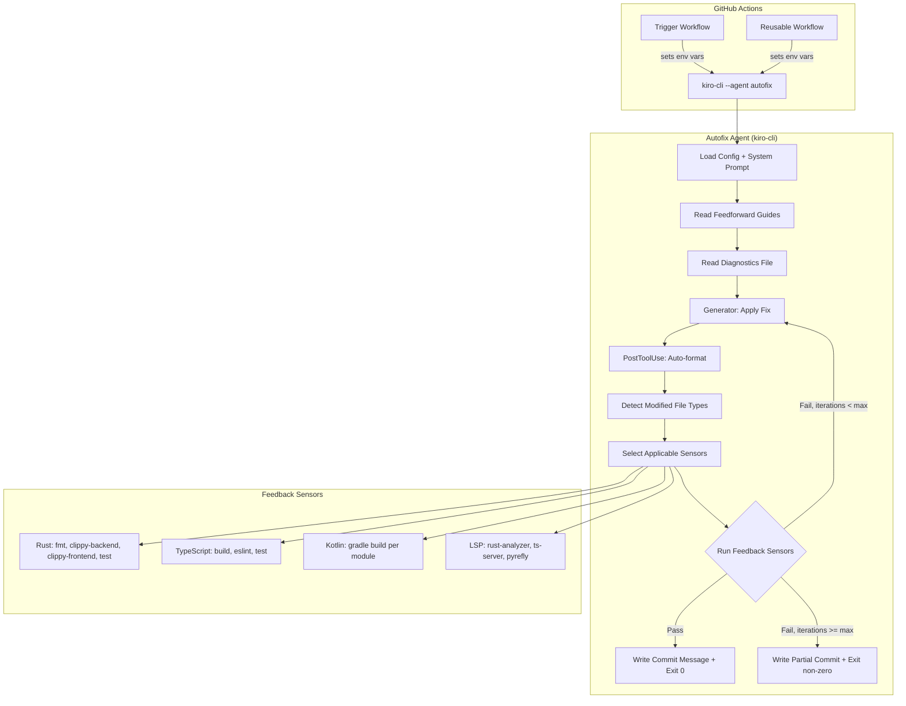
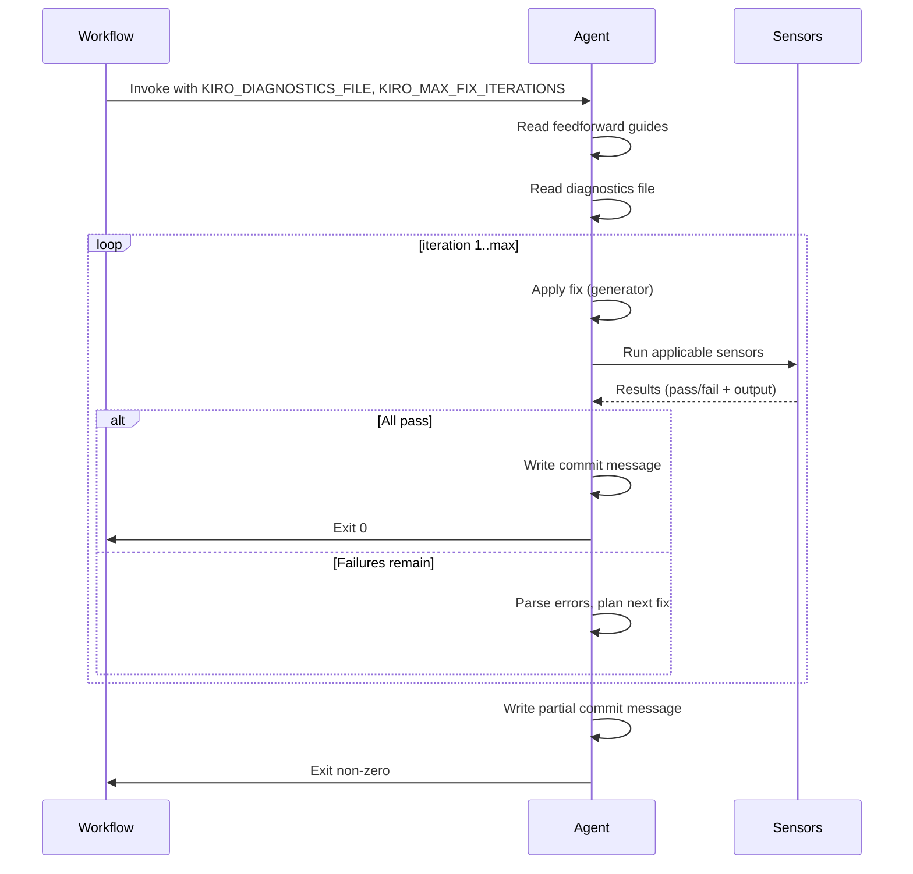

# Design Document: Autofix Harness Polish

## Overview

This design transforms the existing CI autofix harness from an inline-prompt, Rust-only verify loop into a structured, multi-language agent harness built on the generator/evaluator pattern. The key architectural shift: the agent itself owns the verify-fix loop internally (rather than the workflow re-invoking it), and feedback sensors are selected dynamically based on which files were modified.

The deliverables form a complete package:
1. **Agent config** (`.kiro/agents/autofix.json`) — declarative definition of tools, resources, hooks, and model
2. **System prompt** (`.kiro/prompts/autofix-system.md`) — behavioral instructions, constraints, and workflow
3. **Skills** — on-demand knowledge for TypeScript fixes and the verify-fix loop pattern
4. **Workflow updates** — trigger and reusable workflows simplified to invoke the agent
5. **Runner image updates** — LSP tooling (rust-analyzer, typescript-language-server, pyrefly) pre-installed

### Design Rationale

The current implementation embeds the prompt in shell string interpolation, runs a single verify pass (rustfmt + clippy) outside the agent, and has no TypeScript or Kotlin sensor coverage. This creates several problems:
- Prompt changes require editing shell scripts with careful quoting
- The agent cannot iterate on its own failures (the workflow must re-invoke)
- TypeScript/Kotlin failures require manual intervention
- No LSP-powered diagnostics (richer than CLI output alone)

The new design applies Ashby's Law: the harness must have at least as much variety as the failure modes it handles. Multi-language sensors, selective activation, and iteration control provide that variety.

## Architecture



### Generator/Evaluator Separation

| Role | Component | Responsibility |
|------|-----------|----------------|
| Generator | Autofix Agent (LLM) | Read diagnostics, apply code fixes |
| Evaluator | Feedback Sensors (deterministic) | Verify correctness via fmt/lint/compile/test |
| Feedforward | Steering files, AGENTS.md, skills | Reduce inferential load before generation |
| Feedback | Sensor output parsed back to agent | Guide next iteration |

The agent never self-evaluates. Every fix attempt is validated by external, deterministic tools.

### Iteration Flow



## Components and Interfaces

### 1. Agent Configuration (`.kiro/agents/autofix.json`)

```json
{
  "name": "autofix",
  "description": "CI autofix agent: diagnoses build/deploy failures and applies minimal, verified fixes.",
  "prompt": "file://../prompts/autofix-system.md",
  "model": "claude-sonnet-4",
  "tools": ["*"],
  "allowedTools": ["read", "write", "shell", "@builtin"],
  "resources": [
    "file://../../AGENTS.md",
    "file://../../.kiro/steering/**/*.md",
    "file://../../.kiro/settings/lsp.json",
    "skill://../../.kiro/skills/ci-fix-typescript/SKILL.md",
    "skill://../../.kiro/skills/verify-fix-loop/SKILL.md"
  ],
  "hooks": {
    "postToolUse": [
      {
        "matcher": "fs_write",
        "command": "bash -c 'FILE=\"$KIRO_TOOL_ARG_PATH\"; case \"$FILE\" in *.rs) cargo fmt -- \"$FILE\" 2>/dev/null || true ;; */baileys-service/*.ts|*/baileys-service/*.tsx) npx eslint --fix \"$FILE\" 2>/dev/null || true ;; */android/*.kt) cd android && ./gradlew spotlessApply 2>/dev/null || true ;; esac'"
      }
    ]
  }
}
```

**Path resolution notes:**
- Config lives at `.kiro/agents/autofix.json`
- `file://../prompts/autofix-system.md` resolves to `.kiro/prompts/autofix-system.md`
- `file://../../AGENTS.md` resolves to workspace root `AGENTS.md`
- `file://../../.kiro/steering/**/*.md` resolves to all steering files

**Design decisions:**
- `tools: ["*"]` — agent needs shell access for running sensors, file read/write for fixes
- `allowedTools` lists specific categories (not `"*"`) per schema constraints
- `matcher: "fs_write"` uses the internal tool name (not `"write"`)
- PostToolUse hook uses a single bash dispatch to handle all file types in one hook entry
- Hook failures are swallowed (`|| true`) to avoid blocking fix attempts (Req 3.5)

### 2. System Prompt (`.kiro/prompts/autofix-system.md`)

The system prompt defines:
- **Role**: Automated CI remediation agent making surgical, minimal fixes
- **Constraints**: No new features, match existing style, no suppressed warnings
- **Environment variables**: `KIRO_DIAGNOSTICS_FILE`, `KIRO_COMMIT_MSG_FILE`, `KIRO_MAX_FIX_ITERATIONS`
- **Workflow**: Read guides → Read diagnostics → Fix → Verify → Iterate or commit
- **Sensor commands**: Per-language verification commands
- **Commit format**: Structured message with scope, root cause, changes, verification status
- **Escalation**: Stop after max iterations, write partial commit, exit non-zero
- **LSP preference**: Use LSP code actions over manual edits when available
- **Lessons learned**: Consult `lessons-learned.md` before attempting fixes

### 3. Skills

#### TypeScript CI Fix Skill (`.kiro/skills/ci-fix-typescript/SKILL.md`)

```yaml
---
name: ci-fix-typescript
description: >
  Activate when fixing TypeScript compilation errors, ESLint violations, or test
  failures in baileys-service/. Provides verification commands, fix strategies,
  and dependency-order resolution for TS compiler errors.
---
```

Body includes: verification commands, auto-fix strategy (eslint --fix first), error parsing by file:line:column, dependency-order resolution, prohibition on @ts-ignore.

#### Verify-Fix Loop Skill (`.kiro/skills/verify-fix-loop/SKILL.md`)

```yaml
---
name: verify-fix-loop
description: >
  Activate after applying any code fix, when running verification sensors, or
  when iterating on failed checks. Encodes the diagnose → fix → verify → repeat
  workflow with priority ordering and exit conditions.
---
```

Body includes: sensor selection by file type, priority ordering (compile > lint > test), iteration strategy (different approach after 2 same-error iterations), exit codes (0=clean, 1=partial, 2=no progress).

### 4. Workflow Interface

The trigger workflow passes context to the agent via environment variables:

| Variable | Purpose | Set by |
|----------|---------|--------|
| `KIRO_DIAGNOSTICS_FILE` | Path to the effective diagnostics context file | Workflow |
| `KIRO_COMMIT_MSG_FILE` | Path where agent writes its commit message | Workflow |
| `KIRO_MAX_FIX_ITERATIONS` | Max verify-fix iterations (default: 3) | Workflow (env) |
| `KIRO_API_KEY` | Authentication for kiro-cli | Secret |

**Invocation command:**
```bash
kiro-cli --agent autofix chat --no-interactive --trust-all-tools \
  "Fix artifact: ${ARTIFACT_NAME} (queue position ${POS}/${TOTAL}). Diagnostics at KIRO_DIAGNOSTICS_FILE."
```

The positional prompt is minimal — all behavioral instructions live in the system prompt file.

### 5. Selective Sensor Activation

The agent determines which sensors to run based on `git diff --name-only` against the pre-fix state:

| Modified files | Sensors activated |
|----------------|-------------------|
| `*.rs` | Rust: fmt, clippy-backend, clippy-frontend, cargo test |
| `baileys-service/**/*.{ts,tsx,json}` | TypeScript: npm build, eslint, npm test |
| `android/**/*.{kt,kts}` | Kotlin: gradle build (affected module) |
| Mixed | All applicable stacks |
| Non-code only (YAML, MD, Dockerfile, K8s manifests) | None — mark clean |

### 6. PostToolUse Hook Dispatch

The hook fires after every `fs_write` call. It dispatches based on the written file's path and extension:

```
*.rs           → cargo fmt -- {file}
baileys-service/*.ts|*.tsx → npx eslint --fix {file}
android/*.kt   → ./gradlew spotlessApply (scoped to module)
other          → no-op
```

Failures are logged but do not block the agent (exit code swallowed).

### 7. Community Skills Integration

| Skill | Source | Purpose |
|-------|--------|---------|
| `warpdotdev/common-skills@diagnose-ci-failures` | Warp (25k★) | Read CI logs, identify root causes |
| `warpdotdev/common-skills@fix-errors` | Warp (25k★) | Fix compilation/lint/test errors |
| `warpdotdev/oz-skills@ci-fix` | Warp skills (788★) | End-to-end CI fix workflow |

Installed globally in CI via `npx skills add ... -g -y` in the workflow setup step. Referenced in the agent config via `skill://` URIs if local copies are maintained, or loaded from global install path.

### 8. Runner Image Additions

New tools to install in `infra/docker/Dockerfile.runner`:

| Tool | Purpose | Install method |
|------|---------|----------------|
| `rust-analyzer` | Rust LSP diagnostics | Download pre-built binary from GitHub releases |
| `typescript-language-server` | TS/JS LSP diagnostics | `npm install -g typescript-language-server typescript` |
| `pyrefly` | Python type-checking | `pip install pyrefly` or `uv pip install pyrefly` |
| Node.js 20 LTS | Required for TS tools | apt or nvm |

### 9. Pure Logic Functions (Testable Units)

The following functions encapsulate the deterministic logic that can be tested independently of the LLM agent:

| Function | Input | Output |
|----------|-------|--------|
| `dispatch_formatter(file_path)` | File path string | Formatter command string or None |
| `select_sensors(modified_files)` | Set of file paths | Set of sensor suites to activate |
| `parse_max_iterations(env_value)` | Optional string | Integer (default 3) |
| `should_continue_loop(iteration, max, sensor_results)` | Iteration count, max, results | Continue/Stop + exit code |
| `determine_exit_code(all_pass, max_reached, progress_made)` | Three booleans | Exit code (0, 1, 2) |
| `format_commit_message(scope, subject, root_cause, changes, sensors, status)` | Structured data | Formatted commit string |
| `prioritize_failures(failures)` | List of (type, message) | Sorted list by priority |

## Data Models

### Agent Configuration Schema

The agent config follows the kiro-cli custom agent JSON schema. Key fields:

```typescript
interface AutofixAgentConfig {
  name: "autofix";
  description: string;
  prompt: string;           // file:// URI to system prompt
  model: string;            // e.g. "claude-sonnet-4"
  tools: string[];          // ["*"] for full access
  allowedTools: string[];   // ["read", "write", "shell", "@builtin"]
  resources: string[];      // file:// and skill:// URIs
  hooks: {
    postToolUse: Array<{
      matcher: string;      // "fs_write" (internal tool name)
      command: string;      // shell command to execute
    }>;
  };
}
```

### Commit Message Structure

```
fix(<scope>): <subject under 70 chars>

Root cause:
- <error identifiers: clippy lint IDs, test names, file:line, TS error codes>

Changes:
- <bullet per file or logical change>

Verification:
- <sensor name>: PASS|FAIL
- <sensor name>: PASS|FAIL

Status: CLEAN|PARTIAL
Iteration: <n>/<max>
Workflow run: <url>
```

### Environment Variable Contract

| Variable | Type | Default | Description |
|----------|------|---------|-------------|
| `KIRO_DIAGNOSTICS_FILE` | path | (required) | Absolute path to diagnostics context file |
| `KIRO_COMMIT_MSG_FILE` | path | (required) | Absolute path where agent writes commit message |
| `KIRO_MAX_FIX_ITERATIONS` | integer | 3 | Maximum verify-fix loop iterations |
| `KIRO_API_KEY` | string | (required) | kiro-cli authentication key |

### Sensor Exit Code Semantics

| Agent exit code | Meaning | Workflow action |
|-----------------|---------|-----------------|
| 0 | All sensors pass, clean fix | Commit and continue queue |
| 1 | Max iterations reached, partial progress | Attempt commit if changes exist, then stop queue |
| 2 | No progress (same errors persist) | Stop queue, no commit |


## Correctness Properties

*A property is a characteristic or behavior that should hold true across all valid executions of a system — essentially, a formal statement about what the system should do. Properties serve as the bridge between human-readable specifications and machine-verifiable correctness guarantees.*

### Property 1: Hook dispatch produces correct formatter command

*For any* file path, the `dispatch_formatter` function SHALL return:
- `cargo fmt -- {file}` when the path ends in `.rs`
- `npx eslint --fix {file}` when the path ends in `.ts` or `.tsx` and is under `baileys-service/`
- `./gradlew spotlessApply` (scoped to module) when the path ends in `.kt` and is under `android/`
- `None` for all other paths

**Validates: Requirements 3.2, 3.3, 3.4**

### Property 2: Selective sensor activation by modified file set

*For any* set of modified file paths, the `select_sensors` function SHALL return exactly the sensor suites corresponding to the stacks represented in the file set:
- Only Rust sensors when all files are `.rs`
- Only TypeScript sensors when all files are in `baileys-service/` with extensions `.ts`, `.tsx`, or `.json`
- Only Kotlin sensors when all files are `.kt` or `.kts` under `android/`
- Multiple sensor suites when files span stacks
- Empty set (mark clean) when all files are non-code (YAML, Markdown, Dockerfile, K8s manifests)

**Validates: Requirements 5.1, 5.2, 5.3, 9.1, 9.2, 9.3, 9.4, 9.5**

### Property 3: Iteration configuration parsing

*For any* string value of `KIRO_MAX_FIX_ITERATIONS`, the `parse_max_iterations` function SHALL return the integer value if the string represents a positive integer, and 3 (the default) if the string is missing, empty, non-numeric, zero, or negative.

**Validates: Requirements 6.1**

### Property 4: Loop termination correctness

*For any* maximum iteration count `max` and sequence of sensor results per iteration, the verify-fix loop SHALL:
- Continue iterating when the current iteration is below `max` and at least one sensor fails
- Terminate with exit code 0 when all sensors pass at any iteration ≤ `max`
- Terminate with exit code 1 when iteration reaches `max` with at least one sensor still failing but progress was made
- Terminate with exit code 2 when iteration reaches `max` with no progress (same errors persist)

**Validates: Requirements 4.6, 6.2, 6.3, 6.4**

### Property 5: Exit code determination

*For any* combination of `(all_pass: bool, max_reached: bool, progress_made: bool)`, the `determine_exit_code` function SHALL return:
- 0 when `all_pass` is true (regardless of other flags)
- 1 when `all_pass` is false, `max_reached` is true, and `progress_made` is true
- 2 when `all_pass` is false, `max_reached` is true, and `progress_made` is false

And the workflow SHALL interpret these exit codes as:
- 0 → commit and continue queue
- non-zero → attempt commit if changes exist, then stop queue

**Validates: Requirements 7.5, 13.5**

### Property 6: Commit message format validity

*For any* scope string (non-empty, no whitespace) and subject string (non-empty, ≤70 chars), the `format_commit_message` function SHALL produce output matching the pattern `fix(<scope>): <subject>` on the first line, with the first line not exceeding 70 characters total.

**Validates: Requirements 10.1**

### Property 7: Commit message completeness

*For any* set of modified file paths and any set of sensor results (name + pass/fail status), the formatted commit message SHALL:
- Contain a bullet for each modified file in the Changes section
- Contain each sensor name with its PASS or FAIL status in the Verification section
- When status is PARTIAL: include "Status: PARTIAL" and list all failing sensor names
- Include the iteration count

**Validates: Requirements 6.5, 10.3, 10.4, 10.5**

### Property 8: Failure priority ordering

*For any* list of failures with types `{compilation, lint, test}`, the `prioritize_failures` function SHALL return them ordered such that all compilation errors precede all lint warnings, and all lint warnings precede all test failures. Within the same type, original order is preserved (stable sort).

**Validates: Requirements 13.3**

## Error Handling

### Hook Failures (PostToolUse)

- **Behavior**: Hook command failures are swallowed (`|| true` / exit code ignored)
- **Rationale**: A formatting failure should not block the fix attempt. The verify loop will catch formatting issues on the next sensor pass.
- **Logging**: The hook logs stderr output for debugging but does not surface it to the agent as an error.

### Sensor Failures (Verify Loop)

- **Behavior**: Sensor failures are captured as structured output (stdout + stderr + exit code) and fed back to the agent for the next iteration.
- **Timeout**: Each sensor has a 5-minute timeout. If exceeded, the sensor is marked as failed with a timeout message.
- **Crash**: If a sensor binary is missing or crashes (signal), the loop marks it as a hard failure and includes the error in the feedback.

### Agent Invocation Failures

- **Missing KIRO_API_KEY**: kiro-cli exits immediately with auth error. Workflow catches this in the existing secret validation step.
- **Missing diagnostics file**: Agent reads `KIRO_DIAGNOSTICS_FILE` — if empty or missing, the system prompt instructs the agent to exit with a clear error message rather than guessing.
- **Context window overflow**: Diagnostics are pre-truncated to `MAX_CONTEXT_BYTES` (60KB) by the workflow before passing to the agent.

### Iteration Exhaustion

- **Max iterations reached with progress**: Exit 1, write partial commit describing what was fixed and what remains.
- **Max iterations reached without progress**: Exit 2, no commit (same errors mean the approach is fundamentally wrong).
- **Workflow response**: On non-zero exit, the workflow attempts to commit any changes that exist (partial fix is better than no fix), then stops the queue and lets the next CI run re-evaluate.

### Concurrent Push Conflicts

- **Behavior**: The existing `nick-fields/retry` with rebase handles concurrent pushes (human pushed while autofix was running).
- **Rebase failure**: If rebase fails (conflicting changes), the workflow aborts the push and notifies on the PR.

## Testing Strategy

### Unit Tests (Example-Based)

Unit tests verify specific configurations and static content:

| Test | What it verifies |
|------|------------------|
| Agent config schema | `autofix.json` has all required fields, correct types |
| Prompt field resolution | `file://../prompts/autofix-system.md` resolves correctly |
| Resource paths exist | All `file://` and `skill://` URIs resolve to existing files |
| System prompt sections | Contains role, constraints, env var docs, loop instructions |
| Skill frontmatter | Both skills have correct `name` and `description` fields |
| Sensor ordering | Rust sensors execute in order: fmt → clippy-backend → clippy-frontend → test |
| Hook matcher | Uses `"fs_write"` (internal name), not `"write"` (category name) |

### Property-Based Tests

Property-based tests verify the pure logic functions using `proptest` (Rust) for the core harness logic. Each test runs a minimum of 100 iterations.

| Property | Function Under Test | Generator Strategy |
|----------|--------------------|--------------------|
| Property 1: Hook dispatch | `dispatch_formatter` | Random file paths with various extensions and directory prefixes |
| Property 2: Sensor activation | `select_sensors` | Random sets of 1-20 file paths from all stacks + non-code |
| Property 3: Iteration config | `parse_max_iterations` | Random strings: valid integers, empty, non-numeric, negative, zero |
| Property 4: Loop termination | `should_continue_loop` | Random (iteration, max, Vec<SensorResult>) tuples |
| Property 5: Exit code | `determine_exit_code` | All 8 combinations of 3 booleans (exhaustive) |
| Property 6: Commit format | `format_commit_message` | Random scope (alphanumeric 1-20 chars) + subject (1-70 chars) |
| Property 7: Commit completeness | `format_commit_message` | Random file sets (1-30 paths) + sensor result sets (1-10 sensors) |
| Property 8: Priority ordering | `prioritize_failures` | Random lists of 1-50 failures with random types |

**PBT Library**: `proptest` (Rust crate) — already used in the project for other property tests.

**Tag format**: Each test is annotated with:
```rust
// Feature: autofix-harness-polish, Property {N}: {title}
```

### Integration Tests

Integration tests verify end-to-end behavior that cannot be property-tested:

| Test | What it verifies |
|------|------------------|
| Hook fires on fs_write | PostToolUse hook executes after file write in kiro-cli |
| Hook failure non-blocking | Agent continues when hook command returns non-zero |
| Sensor output parsing | Agent correctly interprets clippy/eslint/gradle output |
| LSP diagnostic consumption | Agent uses rust-analyzer code actions when available |
| Workflow exit code handling | Workflow commits on exit 0, stops queue on non-zero |
| Skill progressive loading | Skills load on demand when relevant context detected |

### Smoke Tests

Smoke tests verify one-time setup and configuration:

| Test | What it verifies |
|------|------------------|
| Agent config valid JSON | `autofix.json` parses without error |
| System prompt file exists | `.kiro/prompts/autofix-system.md` is present and non-empty |
| Skills exist | Both skill files exist with valid YAML frontmatter |
| Runner image tools | rust-analyzer, typescript-language-server, pyrefly in PATH |
| Community skills installed | `npx skills add` commands succeed in CI environment |
| Workflow invocation pattern | `kiro-cli --agent autofix` command is correctly formed |
