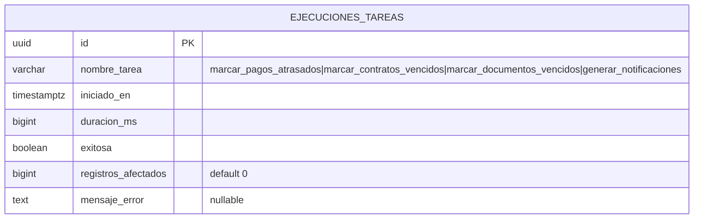

# Diseño — Tareas de Fondo Programadas

## Overview

Este módulo introduce un scheduler ligero de tareas de fondo que se ejecuta dentro del proceso Actix-web existente. Usa `tokio::spawn` con `tokio::time::interval` para ejecutar periódicamente cuatro tareas de negocio: marcar pagos atrasados, marcar contratos vencidos, marcar documentos vencidos, y generar notificaciones. Cada ejecución se registra en una nueva tabla `ejecuciones_tareas` para auditoría y diagnóstico.

El diseño introduce:
- Una tabla `ejecuciones_tareas` para registrar el historial de ejecuciones de cada tarea.
- Un módulo `services/background_jobs.rs` con la lógica del scheduler y las funciones de cada tarea.
- Un módulo `handlers/background_jobs.rs` con endpoints de administración para disparar tareas manualmente y consultar el historial.
- Una nueva función `contratos::marcar_vencidos` para actualizar contratos expirados (las demás tareas reutilizan funciones existentes).
- Integración en `main.rs` para iniciar el scheduler al arrancar la aplicación.

## Architecture

```mermaid
graph TD
    subgraph Startup [main.rs]
        INIT[App Init] --> SPAWN[tokio::spawn scheduler]
    end

    subgraph Scheduler [Background Scheduler]
        SPAWN --> LOOP[tokio::time::interval loop]
        LOOP --> T1[marcar_pagos_atrasados]
        LOOP --> T2[marcar_contratos_vencidos]
        LOOP --> T3[marcar_documentos_vencidos]
        LOOP --> T4[generar_notificaciones]
    end

    subgraph Services [Existing Services]
        T1 --> SP[pagos::mark_overdue]
        T2 --> SC[contratos::marcar_vencidos - nueva]
        T3 --> SD[documentos::marcar_vencidos]
        T4 --> SN[notificaciones::generar_notificaciones]
    end

    subgraph Admin [Admin Endpoints]
        EP1[POST /tareas/{nombre}/ejecutar] --> SBJ[services/background_jobs.rs]
        EP2[GET /tareas/historial] --> SBJ
        SBJ --> DB[(ejecuciones_tareas)]
    end

    T1 --> DB
    T2 --> DB
    T3 --> DB
    T4 --> DB
```

El flujo sigue el patrón existente handlers → services → entities:

1. **`entities/ejecucion_tarea.rs`** — Nueva entidad SeaORM mapeando la tabla `ejecuciones_tareas`.
2. **`services/background_jobs.rs`** — Contiene el scheduler, el registro de tareas, las funciones wrapper de cada tarea, y las funciones de consulta del historial.
3. **`handlers/background_jobs.rs`** — Handlers para disparar tareas manualmente y consultar historial.
4. **`services/contratos.rs`** — Se agrega la función pública `marcar_vencidos` (nueva).
5. **`main.rs`** — Se agrega el `tokio::spawn` del scheduler después de ejecutar migraciones.

### Decisiones de diseño

- **Sin crate externo de scheduling**: Se usa `tokio::time::interval` directamente. Es suficiente para intervalos fijos y evita dependencias adicionales. El patrón ya existe en `main.rs` para `PreviewStore::cleanup_expired`.
- **Una tarea tokio por job**: Cada tarea se ejecuta en su propio `tokio::spawn` con su propio intervalo, de modo que el fallo de una no bloquea las demás.
- **Registro de ejecución dentro del wrapper**: Cada wrapper mide el tiempo, ejecuta la función de negocio, y registra el resultado en `ejecuciones_tareas`. Esto centraliza la lógica de registro.
- **AdminOnly para endpoints**: Solo administradores pueden disparar tareas manualmente o ver el historial, ya que estas operaciones afectan datos globales del sistema.
- **Idempotencia inherente**: Todas las tareas usan `update_many` con filtros que excluyen registros ya procesados, por lo que ejecutarlas múltiples veces es seguro.
- **Notificaciones por organización**: La tarea de generar notificaciones itera sobre todas las organizaciones activas, invocando `generar_notificaciones` para cada una.

## Components and Interfaces

### Database Migration

**Migration: `m20250601_000001_create_ejecuciones_tareas`**

Crea la tabla `ejecuciones_tareas` con:

| Columna | Tipo | Restricciones |
|---------|------|---------------|
| id | UUID | PK, DEFAULT gen_random_uuid() |
| nombre_tarea | VARCHAR(100) | NOT NULL |
| iniciado_en | TIMESTAMP WITH TIME ZONE | NOT NULL, DEFAULT now() |
| duracion_ms | BIGINT | NOT NULL |
| exitosa | BOOLEAN | NOT NULL |
| registros_afectados | BIGINT | NOT NULL, DEFAULT 0 |
| mensaje_error | TEXT | NULLABLE |

Índices:
- `idx_ejecuciones_tareas_nombre` en `nombre_tarea`
- `idx_ejecuciones_tareas_iniciado_en` en `iniciado_en`
- `idx_ejecuciones_tareas_nombre_iniciado` en `(nombre_tarea, iniciado_en)` — para consultas filtradas por tarea ordenadas por fecha

### SeaORM Entity

**`entities/ejecucion_tarea.rs`**

```rust
#[sea_orm(table_name = "ejecuciones_tareas")]
pub struct Model {
    #[sea_orm(primary_key, auto_increment = false)]
    pub id: Uuid,
    pub nombre_tarea: String,
    pub iniciado_en: DateTimeWithTimeZone,
    pub duracion_ms: i64,
    pub exitosa: bool,
    pub registros_afectados: i64,
    pub mensaje_error: Option<String>,
}
```

Sin relaciones.

### API Endpoints

Todos bajo `/api/v1/tareas`:

| Método | Ruta | Auth | Handler | Descripción |
|--------|------|------|---------|-------------|
| POST | `/{nombre}/ejecutar` | AdminOnly | `ejecutar_tarea` | Disparar una tarea manualmente |
| GET | `/historial` | AdminOnly | `historial` | Listar historial de ejecuciones |

### Request/Response Models

**Nuevos modelos en `models/background_jobs.rs`**:

```rust
#[derive(Debug, Serialize)]
#[serde(rename_all = "camelCase")]
pub struct EjecucionTareaResponse {
    pub id: Uuid,
    pub nombre_tarea: String,
    pub iniciado_en: DateTime<Utc>,
    pub duracion_ms: i64,
    pub exitosa: bool,
    pub registros_afectados: i64,
    pub mensaje_error: Option<String>,
}

#[derive(Debug, Deserialize)]
#[serde(rename_all = "camelCase")]
pub struct HistorialQuery {
    pub nombre_tarea: Option<String>,
    pub exitosa: Option<bool>,
    pub page: Option<u64>,
    pub per_page: Option<u64>,
}

#[derive(Debug, Serialize)]
#[serde(rename_all = "camelCase")]
pub struct EjecutarTareaResponse {
    pub ejecucion: EjecucionTareaResponse,
}
```

### Service Layer

**`services/background_jobs.rs`**:

Constantes:

```rust
pub const TAREAS_VALIDAS: &[&str] = &[
    "marcar_pagos_atrasados",
    "marcar_contratos_vencidos",
    "marcar_documentos_vencidos",
    "generar_notificaciones",
];

const INTERVALO_POR_DEFECTO_SECS: u64 = 86_400; // 24 horas
```

Funciones públicas:

- `iniciar_scheduler(db: DatabaseConnection)` — Lanza un `tokio::spawn` por cada tarea con su propio `tokio::time::interval`. Cada spawn ejecuta un loop infinito que:
  1. Espera el tick del intervalo.
  2. Llama a `ejecutar_tarea_con_registro` dentro de un `catch_unwind` (vía `AssertUnwindSafe`).
  3. Si hay panic, registra el error con `tracing::error!`.

- `ejecutar_tarea_por_nombre(db: &DatabaseConnection, nombre: &str) -> Result<EjecucionTareaResponse, AppError>` — Valida que el nombre esté en `TAREAS_VALIDAS`. Ejecuta la tarea correspondiente y retorna el registro de ejecución. Usada por el handler de ejecución manual.

- `historial(db: &DatabaseConnection, query: HistorialQuery) -> Result<PaginatedResponse<EjecucionTareaResponse>, AppError>` — Lista paginada de ejecuciones con filtros opcionales por `nombre_tarea` y `exitosa`, ordenada por `iniciado_en` DESC.

Funciones internas:

- `ejecutar_tarea_con_registro(db: &DatabaseConnection, nombre: &str) -> Result<EjecucionTareaResponse, AppError>` — Mide el tiempo con `std::time::Instant`, ejecuta la función de negocio correspondiente, registra el resultado en `ejecuciones_tareas`, y retorna el registro.

- `ejecutar_marcar_pagos_atrasados(db: &DatabaseConnection) -> Result<i64, AppError>` — Llama a `pagos::mark_overdue(db)` y retorna `rows_affected` como `i64`.

- `ejecutar_marcar_contratos_vencidos(db: &DatabaseConnection) -> Result<i64, AppError>` — Llama a `contratos::marcar_vencidos(db)` y retorna `rows_affected` como `i64`.

- `ejecutar_marcar_documentos_vencidos(db: &DatabaseConnection) -> Result<i64, AppError>` — Llama a `documentos::marcar_vencidos(db)` y retorna `rows_affected` como `i64`.

- `ejecutar_generar_notificaciones(db: &DatabaseConnection) -> Result<i64, AppError>` — Consulta todas las organizaciones activas. Para cada una, llama a `notificaciones::generar_notificaciones(db, organizacion_id)`. Suma los totales y retorna el total general como `i64`.

- `registrar_ejecucion(db: &DatabaseConnection, nombre: &str, duracion_ms: i64, exitosa: bool, registros_afectados: i64, mensaje_error: Option<String>) -> Result<EjecucionTareaResponse, AppError>` — Inserta un registro en `ejecuciones_tareas` y retorna el response.

### Modificaciones a servicios existentes

**`services/contratos.rs` — nueva función `marcar_vencidos`**:

```rust
pub async fn marcar_vencidos(db: &DatabaseConnection) -> Result<u64, AppError> {
    let today = Utc::now().date_naive();

    let result = contrato::Entity::update_many()
        .col_expr(
            contrato::Column::Estado,
            sea_orm::sea_query::Expr::value("vencido"),
        )
        .col_expr(
            contrato::Column::UpdatedAt,
            sea_orm::sea_query::Expr::value(Utc::now().fixed_offset()),
        )
        .filter(contrato::Column::FechaFin.lt(today))
        .filter(contrato::Column::Estado.eq("activo"))
        .exec(db)
        .await?;

    Ok(result.rows_affected)
}
```

Sigue el mismo patrón que `pagos::mark_overdue`.

**`services/pagos.rs`** — Se remueve el `#[allow(dead_code)]` de `mark_overdue` ya que ahora se usa desde el scheduler.

### Handlers

**`handlers/background_jobs.rs`**:

```rust
pub async fn ejecutar_tarea(
    db: web::Data<DatabaseConnection>,
    _admin: AdminOnly,
    path: web::Path<String>,
) -> Result<HttpResponse, AppError>

pub async fn historial(
    db: web::Data<DatabaseConnection>,
    _admin: AdminOnly,
    query: web::Query<HistorialQuery>,
) -> Result<HttpResponse, AppError>
```

### Rutas

En `routes.rs`, se agrega un nuevo scope:

```rust
.service(
    web::scope("/tareas")
        .route("/historial", web::get().to(handlers::background_jobs::historial))
        .route("/{nombre}/ejecutar", web::post().to(handlers::background_jobs::ejecutar_tarea))
)
```

Nota: La ruta estática `/historial` se registra antes de la dinámica `/{nombre}/ejecutar` para evitar conflictos de matching.

### Integración en main.rs

Después de ejecutar migraciones y antes de iniciar el `HttpServer`, se agrega:

```rust
// Iniciar scheduler de tareas de fondo
let scheduler_db = db.clone();
realestate_backend::services::background_jobs::iniciar_scheduler(scheduler_db);
```

Esto sigue el patrón existente del `tokio::spawn` para `PreviewStore::cleanup_expired`.

## Data Models

### Entity Relationship Diagram



### Constantes de dominio

- **Nombres de tareas válidos**: `marcar_pagos_atrasados`, `marcar_contratos_vencidos`, `marcar_documentos_vencidos`, `generar_notificaciones`
- **Intervalo por defecto**: 86400 segundos (24 horas)
- **Estado inicial de exitosa**: depende del resultado de la ejecución

## Correctness Properties

### Property 1: Idempotencia de marcar pagos atrasados

*Para cualquier* conjunto de pagos en la base de datos, ejecutar `marcar_pagos_atrasados` dos veces consecutivas sin cambios intermedios en los datos debe producir cero actualizaciones en la segunda ejecución. La primera ejecución puede actualizar N ≥ 0 registros; la segunda debe actualizar exactamente 0.

**Valida: Requisitos 1.1, 1.4**

### Property 2: Idempotencia de marcar contratos vencidos

*Para cualquier* conjunto de contratos en la base de datos, ejecutar `marcar_contratos_vencidos` dos veces consecutivas sin cambios intermedios debe producir cero actualizaciones en la segunda ejecución.

**Valida: Requisitos 2.1, 2.4**

### Property 3: Idempotencia de marcar documentos vencidos

*Para cualquier* conjunto de documentos en la base de datos, ejecutar `marcar_documentos_vencidos` dos veces consecutivas sin cambios intermedios debe producir cero actualizaciones en la segunda ejecución.

**Valida: Requisitos 3.1, 3.4**

### Property 4: Registro de ejecución completo

*Para cualquier* nombre de tarea válido, ejecutar la tarea (manual o automáticamente) debe producir exactamente un registro en `ejecuciones_tareas` con: `nombre_tarea` igual al nombre proporcionado, `iniciado_en` no nulo, `duracion_ms >= 0`, `exitosa` como booleano, y `registros_afectados >= 0`.

**Valida: Requisitos 5.1**

### Property 5: Nombre de tarea inválido retorna 404

*Para cualquier* cadena de texto que no esté en el conjunto `TAREAS_VALIDAS`, intentar ejecutar la tarea manualmente debe retornar un error NotFound (HTTP 404).

**Valida: Requisitos 7.2**

### Property 6: Historial ordenado por fecha descendente

*Para cualquier* conjunto de ejecuciones en la base de datos, listar el historial sin filtros debe retornar registros ordenados por `iniciado_en` descendente — para cada par consecutivo `(items[i], items[i+1])`, `items[i].iniciado_en >= items[i+1].iniciado_en`.

**Valida: Requisitos 8.1**

### Property 7: Filtrado del historial retorna solo registros coincidentes

*Para cualquier* filtro de `nombre_tarea` o `exitosa` aplicado a la consulta del historial, todos los registros retornados deben coincidir con el valor del filtro. Si se filtra por `nombre_tarea = T`, todos los registros tienen `nombre_tarea == T`. Si se filtra por `exitosa = E`, todos los registros tienen `exitosa == E`.

**Valida: Requisitos 8.2, 8.3**

### Property 8: Post-condición de marcar pagos atrasados

*Para cualquier* estado de la base de datos, después de ejecutar `marcar_pagos_atrasados`, no debe existir ningún pago con `estado = "pendiente"` y `fecha_vencimiento < hoy`. Todos esos pagos deben tener `estado = "atrasado"`.

**Valida: Requisitos 1.1**

### Property 9: Post-condición de marcar contratos vencidos

*Para cualquier* estado de la base de datos, después de ejecutar `marcar_contratos_vencidos`, no debe existir ningún contrato con `estado = "activo"` y `fecha_fin < hoy`. Todos esos contratos deben tener `estado = "vencido"`.

**Valida: Requisitos 2.1**

### Property 10: Post-condición de marcar documentos vencidos

*Para cualquier* estado de la base de datos, después de ejecutar `marcar_documentos_vencidos`, no debe existir ningún documento con `estado_verificacion = "verificado"` y `fecha_vencimiento < hoy`. Todos esos documentos deben tener `estado_verificacion = "vencido"`.

**Valida: Requisitos 3.1**

## Error Handling

Todos los errores siguen el patrón existente de `AppError` en `backend/src/errors.rs`:

| Escenario | Error | HTTP Status |
|-----------|-------|-------------|
| Nombre de tarea no encontrado | `AppError::NotFound("Tarea no encontrada: {nombre}")` | 404 |
| Gerente intenta ejecutar tarea | `AppError::Forbidden` via `AdminOnly` extractor | 403 |
| Visualizador intenta ejecutar tarea | `AppError::Forbidden` via `AdminOnly` extractor | 403 |
| Gerente intenta ver historial | `AppError::Forbidden` via `AdminOnly` extractor | 403 |
| Error de base de datos | `AppError::Internal` via `From<DbErr>` | 500 |
| Tarea falla durante ejecución (scheduler) | Se registra con `tracing::error!` y en `ejecuciones_tareas` con `exitosa = false` | N/A (no HTTP) |
| Tarea produce panic (scheduler) | Se captura con `catch_unwind`, se registra con `tracing::error!` | N/A (no HTTP) |

## Testing Strategy

### Unit Tests

Tests en `backend/src/services/background_jobs.rs` bajo `#[cfg(test)]`:

- Validación de nombres de tarea: `TAREAS_VALIDAS` contiene los 4 nombres esperados
- Conversión `From<Model>` para `EjecucionTareaResponse`

Tests en `backend/src/models/background_jobs.rs` bajo `#[cfg(test)]`:
- Serialización de `EjecucionTareaResponse` produce camelCase
- Serialización de `EjecutarTareaResponse`
- Deserialización de `HistorialQuery` con campos opcionales

Tests en `backend/src/services/contratos.rs` bajo `#[cfg(test)]`:
- La función `marcar_vencidos` existe y compila (la lógica se prueba en integración)

### Property-Based Tests

Librería: `proptest` (ya disponible en dev-dependencies).

Cada test ejecuta mínimo 100 iteraciones.

| Property | Test | Descripción |
|----------|------|-------------|
| P1 | `test_idempotencia_marcar_pagos` | Ejecuta mark_overdue dos veces, verifica segunda retorna 0 |
| P2 | `test_idempotencia_marcar_contratos` | Ejecuta marcar_vencidos dos veces, verifica segunda retorna 0 |
| P3 | `test_idempotencia_marcar_documentos` | Ejecuta marcar_vencidos dos veces, verifica segunda retorna 0 |
| P4 | `test_registro_ejecucion_completo` | Ejecuta cualquier tarea válida, verifica campos del registro |
| P5 | `test_nombre_tarea_invalido_404` | Genera strings aleatorios no en TAREAS_VALIDAS, verifica 404 |
| P6 | `test_historial_ordenado` | Genera múltiples ejecuciones, lista, verifica orden descendente |
| P7 | `test_filtrado_historial` | Genera ejecuciones variadas, filtra, verifica coincidencia |
| P8 | `test_postcondicion_pagos_atrasados` | Genera pagos con fechas variadas, ejecuta tarea, verifica no quedan pendientes vencidos |
| P9 | `test_postcondicion_contratos_vencidos` | Genera contratos con fechas variadas, ejecuta tarea, verifica no quedan activos vencidos |
| P10 | `test_postcondicion_documentos_vencidos` | Genera documentos con fechas variadas, ejecuta tarea, verifica no quedan verificados vencidos |

### Integration Tests

Archivo: `backend/tests/background_jobs_tests.rs`

Tests de ciclo completo request/response contra la API:
- Ejecutar tarea manualmente → verificar respuesta 200 con registro de ejecución
- Ejecutar tarea con nombre inválido → 404
- Ejecutar tarea como gerente → 403
- Ejecutar tarea como visualizador → 403
- Consultar historial → respuesta paginada con ejecuciones
- Filtrar historial por nombre_tarea → solo ejecuciones de esa tarea
- Filtrar historial por exitosa → solo ejecuciones con ese resultado
- Consultar historial como gerente → 403
- Verificar que marcar_pagos_atrasados actualiza pagos pendientes vencidos
- Verificar que marcar_contratos_vencidos actualiza contratos activos expirados
- Verificar que marcar_documentos_vencidos actualiza documentos verificados expirados
- Verificar idempotencia: segunda ejecución retorna 0 registros afectados
