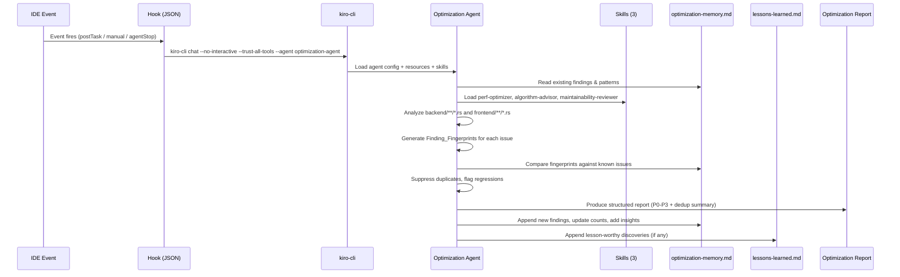

# Design: CLI Optimization Agent

## Overview

This feature creates a non-interactive optimization agent that runs via `kiro-cli` to perform automated Rust code analysis. The system consists of:

- A custom agent JSON configuration at `.kiro/agents/optimization-agent.json`
- Three specialized skills (perf-optimizer, algorithm-advisor, maintainability-reviewer) each with domain-specific reference guides
- Three IDE hooks (post-task, manual trigger, agent-stop) that invoke the agent non-interactively
- A persistent memory file at `.kiro/optimization-memory.md` for cross-run knowledge accumulation
- Integration with the project's `lessons-learned.md` for sharing significant discoveries
- Finding deduplication via fingerprinting to keep reports noise-free

The agent operates in read-only mode against the codebase, producing structured optimization reports with severity-ranked findings. It runs unattended via `kiro-cli chat --no-interactive --trust-all-tools --agent optimization-agent`.

## Architecture

### File Structure

```
.kiro/
├── agents/
│   ├── default.json                          (existing)
│   └── optimization-agent.json               (NEW — agent configuration)
├── hooks/
│   ├── code-review-post-task.kiro.hook       (existing)
│   ├── optimization-agent-post-task.kiro.hook (NEW — postTaskExecution trigger)
│   ├── optimization-agent-manual.kiro.hook    (NEW — userTriggered trigger)
│   └── optimization-agent-on-stop.kiro.hook   (NEW — agentStop trigger)
├── skills/
│   ├── perf-optimizer/
│   │   ├── SKILL.md                           (NEW — performance skill)
│   │   └── references/
│   │       ├── rust-performance.md            (NEW)
│   │       ├── memory-optimization.md         (NEW)
│   │       ├── concurrency-patterns.md        (NEW)
│   │       └── build-config.md               (NEW)
│   ├── algorithm-advisor/
│   │   ├── SKILL.md                           (NEW — algorithm skill)
│   │   └── references/
│   │       ├── data-structures.md             (NEW)
│   │       └── complexity-analysis.md         (NEW)
│   └── maintainability-reviewer/
│       ├── SKILL.md                           (NEW — maintainability skill)
│       └── references/
│           ├── solid-principles.md            (NEW)
│           ├── error-handling.md              (NEW)
│           └── code-organization.md           (NEW)
├── optimization-memory.md                     (NEW — persistent memory)
└── steering/                                  (existing, referenced by agent)
```

### Non-Interactive Execution Flow



### Design Decisions

1. **Read-only agent**: All three skills restrict tools to `Read, Grep, Glob` — the agent never modifies source code, only reports findings. This is safe for unattended execution with `--trust-all-tools`.

2. **Prompt-driven deduplication**: Fingerprinting and deduplication logic lives in the agent's system prompt rather than in code. The agent is instructed to compute fingerprints as `{file_path}::{category}::{normalized_description}` and compare against the memory file. This avoids needing custom tooling while leveraging the LLM's ability to do fuzzy string matching for description similarity.

3. **Memory file as markdown**: Using a structured markdown file (not JSON) for the memory file keeps it human-readable, git-diffable, and editable by developers. The agent parses sections by heading.

4. **Separate hooks per trigger**: Three separate hook files rather than one multi-trigger hook, because the kiro hook schema supports one `when.type` per file. Each hook invokes the same CLI command with the same prompt.

5. **Lessons-learned integration via prompt**: The agent's prompt instructs it to check `lessons-learned.md` for existing entries before appending, and to only append findings meeting the lesson-worthy criteria. This uses the agent's reading tools rather than custom dedup code.

## Components and Interfaces

### 1. Agent Configuration (`optimization-agent.json`)

```json
{
  "name": "optimization-agent",
  "resources": [
    "file://.kiro/steering/**/*.md",
    "file://.kiro/optimization-memory.md",
    "file://lessons-learned.md"
  ],
  "skills": [
    "perf-optimizer",
    "algorithm-advisor",
    "maintainability-reviewer"
  ],
  "mcpServers": {}
}
```

The agent's system prompt is delivered via the hook's `prompt` field. The `resources` array ensures steering files, the memory file, and lessons-learned are loaded into context on every run. No MCP servers are needed — the agent uses built-in file reading tools.

### 2. Hook Configurations

All three hooks execute the same command with the same analysis prompt. They differ only in trigger type and name.

#### Post-Task Hook (`optimization-agent-post-task.kiro.hook`)

```json
{
  "enabled": true,
  "name": "Optimization Agent — Post Task",
  "description": "Runs the optimization agent after each completed spec task to analyze recently changed Rust files",
  "version": "1",
  "when": {
    "type": "postTaskExecution"
  },
  "then": {
    "type": "runCommand",
    "command": "kiro-cli chat --no-interactive --trust-all-tools --agent optimization-agent --prompt \"<ANALYSIS_PROMPT>\"",
    "timeout": 300
  }
}
```

#### Manual Trigger Hook (`optimization-agent-manual.kiro.hook`)

```json
{
  "enabled": true,
  "name": "Optimization Agent — On Demand",
  "description": "Manually trigger the optimization agent for on-demand code analysis",
  "version": "1",
  "when": {
    "type": "userTriggered"
  },
  "then": {
    "type": "runCommand",
    "command": "kiro-cli chat --no-interactive --trust-all-tools --agent optimization-agent --prompt \"<ANALYSIS_PROMPT>\"",
    "timeout": 300
  }
}
```

#### Agent Stop Hook (`optimization-agent-on-stop.kiro.hook`)

```json
{
  "enabled": true,
  "name": "Optimization Agent — On Agent Stop",
  "description": "Runs a final optimization pass when the main agent stops",
  "version": "1",
  "when": {
    "type": "agentStop"
  },
  "then": {
    "type": "runCommand",
    "command": "kiro-cli chat --no-interactive --trust-all-tools --agent optimization-agent --prompt \"<ANALYSIS_PROMPT>\"",
    "timeout": 300
  }
}
```

#### Shared Analysis Prompt (`<ANALYSIS_PROMPT>`)

The `<ANALYSIS_PROMPT>` placeholder in all three hooks is replaced with the following prompt (escaped for JSON string embedding):

```
You are the optimization agent. Follow these steps exactly:

1. READ .kiro/optimization-memory.md to load previously identified issues and project-specific insights.

2. ANALYZE all Rust files in backend/**/*.rs and frontend/**/*.rs. For each file, activate the perf-optimizer, algorithm-advisor, and maintainability-reviewer skills and apply their detection rules.

3. For each finding, generate a Finding_Fingerprint using the format: {file_path}::{category}::{normalized_description} where normalized_description is the description lowercased with whitespace collapsed.

4. DEDUPLICATE: Compare each fingerprint against the Previously Identified Issues in optimization-memory.md.
   - If the fingerprint matches an UNRESOLVED issue: suppress it from the report, increment its occurrence count in the memory file.
   - If the fingerprint matches a RESOLVED issue: include it in the report as a REGRESSION with reference to the previous resolution date.
   - If no match: include it as a new finding.

5. PRODUCE the Optimization Report with these sections:
   ## Summary
   Brief overview of files analyzed and findings count.
   ## Critical Issues (P0)
   Correctness-affecting performance bugs.
   ## Major Issues (P1)
   Significant optimization opportunities.
   ## Minor Issues (P2)
   Minor improvements.
   ## Informational (P3)
   Best-practice suggestions.
   ## Positive Patterns Found
   Good patterns worth preserving.
   ## Deduplicated Summary
   Count of suppressed duplicate findings by category.

   Each finding must include: file path, line range, severity (P0-P3), category (performance | algorithm | maintainability), description, and suggested fix with code example.
   Limit to top 20 findings sorted by severity.

6. UPDATE .kiro/optimization-memory.md:
   - Add new findings to Previously Identified Issues with today's date.
   - Update occurrence counts for suppressed duplicates.
   - Add any newly discovered project-specific patterns to Project-Specific Insights.

7. LESSONS LEARNED: If any finding meets lesson-worthy criteria (non-obvious solution, unexpected dependency behavior, architectural performance insight, or significant debugging effort), then:
   - Read lessons-learned.md and verify the topic is not already documented.
   - If new, append an entry using format: ### YYYY-MM-DD — <Topic Title> followed by a brief description.
   - Include relevant crate/tool version numbers when applicable.
   - Limit to one topic per entry, keep concise and actionable.
```

### 3. Skill Definitions

#### perf-optimizer (`SKILL.md`)

```yaml
---
name: perf-optimizer
description: >
  Detects Rust performance anti-patterns including unnecessary clones, redundant
  allocations, inefficient string operations, blocking calls in async contexts,
  and suboptimal iterator usage. Provides fix suggestions with code examples
  tailored to Actix-web + SeaORM + tokio stacks.
license: MIT
allowed-tools: Read, Grep, Glob
metadata:
  author: project
  version: "1.0.0"
  domain: performance
  triggers: performance, optimization, clone, allocation, async, iterator, memory
  role: specialist
  scope: analysis
  output-format: report
  related-skills: algorithm-advisor, maintainability-reviewer
---
```

Core workflow:
1. Scan for unnecessary `.clone()` calls where borrowing suffices
2. Detect redundant heap allocations (`String` where `&str` works, `Vec` where slice works)
3. Find inefficient string concatenation (repeated `format!` or `+` in loops)
4. Identify blocking operations in async contexts (std::fs, std::thread::sleep)
5. Check iterator patterns (collect-then-iterate, unnecessary intermediate collections)
6. Evaluate `Cow<T>` opportunities for conditional ownership

Reference guide table:
| Topic | Reference | Load When |
|-------|-----------|-----------|
| Rust Performance | `references/rust-performance.md` | Iterator patterns, zero-copy, Cow |
| Memory Optimization | `references/memory-optimization.md` | Allocations, Box/Rc/Arc, clone detection |
| Concurrency Patterns | `references/concurrency-patterns.md` | tokio, Send/Sync, locks, channels |
| Build Configuration | `references/build-config.md` | Cargo profiles, LTO, codegen-units |

#### algorithm-advisor (`SKILL.md`)

```yaml
---
name: algorithm-advisor
description: >
  Evaluates algorithm efficiency and data structure selection in Rust code.
  Identifies O(n²) patterns, suboptimal collection choices, and iterator chain
  inefficiencies. Provides alternatives with complexity analysis relevant to
  property management domain operations.
license: MIT
allowed-tools: Read, Grep, Glob
metadata:
  author: project
  version: "1.0.0"
  domain: algorithms
  triggers: algorithm, data structure, complexity, HashMap, BTreeMap, Vec, O(n)
  role: specialist
  scope: analysis
  output-format: report
  related-skills: perf-optimizer, maintainability-reviewer
---
```

Core workflow:
1. Identify nested loops over collections that could use hash-based lookups
2. Evaluate collection type choices (HashMap vs BTreeMap, Vec vs VecDeque)
3. Check for O(n²) patterns in contract overlap detection, payment aggregation, tenant search
4. Analyze iterator chain efficiency vs manual loop implementations
5. Flag unnecessary sorting or repeated linear searches

Reference guide table:
| Topic | Reference | Load When |
|-------|-----------|-----------|
| Data Structures | `references/data-structures.md` | Collection selection, HashMap vs BTreeMap |
| Complexity Analysis | `references/complexity-analysis.md` | Big-O evaluation, amortized analysis |

#### maintainability-reviewer (`SKILL.md`)

```yaml
---
name: maintainability-reviewer
description: >
  Reviews Rust code for maintainability issues including SOLID principle
  violations, error handling anti-patterns, excessive function length, deep
  nesting, and module organization problems. References the project's layered
  architecture (handlers → services → entities) and error patterns in errors.rs.
license: MIT
allowed-tools: Read, Grep, Glob
metadata:
  author: project
  version: "1.0.0"
  domain: maintainability
  triggers: maintainability, SOLID, error handling, code organization, refactor
  role: specialist
  scope: analysis
  output-format: report
  related-skills: perf-optimizer, algorithm-advisor, code-reviewer
---
```

Core workflow:
1. Check function length (flag functions exceeding 50 lines)
2. Check module public API surface (flag modules with more than 10 public items)
3. Detect deeply nested control flow (more than 3 levels)
4. Verify error handling follows `AppError` patterns from `backend/src/errors.rs`
5. Check `thiserror` vs `anyhow` usage consistency
6. Evaluate trait design and module boundary clarity

Reference guide table:
| Topic | Reference | Load When |
|-------|-----------|-----------|
| SOLID Principles | `references/solid-principles.md` | Trait design, module boundaries, SRP |
| Error Handling | `references/error-handling.md` | thiserror, anyhow, AppError patterns |
| Code Organization | `references/code-organization.md` | Module structure, visibility, API surface |

### 4. Reference Guide Content Scope

Each reference guide is a markdown file providing detailed domain knowledge. They follow the pattern established by `rust-engineer/references/` and `code-reviewer/references/`.

#### perf-optimizer references

- **rust-performance.md**: Iterator adapter patterns (`.map().filter().collect()` vs manual loops), zero-copy techniques with `&str`/`&[u8]`, `Cow<T>` for conditional ownership, `into_iter()` vs `iter()` selection. Examples use Actix-web handler patterns and SeaORM query results.
- **memory-optimization.md**: Stack vs heap allocation guidance, `Box<T>` for large types, `Rc<T>`/`Arc<T>` for shared ownership, clone detection heuristics (clone of `String`, `Vec`, `HashMap` where a reference would work), `String::with_capacity` pre-allocation.
- **concurrency-patterns.md**: `tokio::spawn` vs `spawn_blocking`, `tokio::sync::Mutex` vs `std::sync::Mutex` in async contexts, `mpsc`/`broadcast`/`watch` channel selection, `Send`/`Sync` bound troubleshooting, connection pool sizing for SeaORM.
- **build-config.md**: Cargo profile `[profile.release]` settings, LTO (`lto = true` vs `"thin"`), `codegen-units = 1` for maximum optimization, `opt-level` selection, `strip = true` for binary size.

#### algorithm-advisor references

- **data-structures.md**: `HashMap` vs `BTreeMap` (hash vs ordered iteration), `Vec` vs `VecDeque` (front insertion), `HashSet` vs `BTreeSet`, `SmallVec` for small collections. Domain examples: contract date range storage, payment lookup by contrato_id, tenant search by cedula.
- **complexity-analysis.md**: Big-O notation reference, amortized analysis for `Vec::push`, common anti-patterns (nested `.contains()` loops, repeated `.find()` on unsorted data), algorithmic alternatives for contract overlap detection (interval tree vs sorted scan).

#### maintainability-reviewer references

- **solid-principles.md**: SRP applied to Rust modules (handlers do HTTP, services do logic), OCP via trait objects and generics, LSP in trait hierarchies, ISP with fine-grained traits, DIP with trait-based dependency injection. Examples reference the project's handler → service → entity layering.
- **error-handling.md**: `thiserror` for library error types (like `AppError`), `anyhow` for application-level propagation, `.context()` for adding error context, mapping `sea_orm::DbErr` to `AppError`, error response format `{ "error": "...", "message": "..." }`.
- **code-organization.md**: Module structure conventions (file-based modules, `mod.rs` usage), `pub` vs `pub(crate)` visibility, re-exports via `prelude.rs`, documentation standards, API surface minimization.

## Data Models

### Optimization Memory File Format (`.kiro/optimization-memory.md`)

```markdown
# Optimization Memory

> Auto-maintained by the optimization agent. Last updated: YYYY-MM-DD

## Previously Identified Issues

| File | Category | Description | Fingerprint | First Seen | Occurrences | Status |
|------|----------|-------------|-------------|------------|-------------|--------|
| backend/src/services/pagos.rs | performance | Unnecessary clone of Vec<Pago> in list_pagos | backend/src/services/pagos.rs::performance::unnecessary clone of vec<pago> in list_pagos | 2025-01-15 | 3 | unresolved |
| backend/src/handlers/contratos.rs | maintainability | Function create_contrato exceeds 50 lines | backend/src/handlers/contratos.rs::maintainability::function create_contrato exceeds 50 lines | 2025-01-15 | 1 | resolved:2025-01-20 |

## Recurring Patterns

| Pattern | Category | Occurrences | Files Affected |
|---------|----------|-------------|----------------|
| Unnecessary String clone in handler responses | performance | 5 | handlers/propiedades.rs, handlers/inquilinos.rs |

## Project-Specific Insights

- SeaORM `find_with_related()` returns owned entities; prefer `.into_model()` over cloning when only specific fields are needed.
- The `AppError::from(DbErr)` conversion in `errors.rs` wraps all DB errors as Internal — consider adding specific variants for constraint violations.
```

### Finding Fingerprint Schema

A fingerprint is a string computed as:

```
{file_path}::{category}::{normalized_description}
```

Where:
- `file_path`: Relative path from project root (e.g., `backend/src/services/pagos.rs`)
- `category`: One of `performance`, `algorithm`, `maintainability`
- `normalized_description`: Description lowercased, whitespace collapsed to single spaces, trimmed

Matching rules:
- Exact match on `file_path` and `category`
- Description similarity: the agent treats findings as matching when the normalized descriptions are substantially similar, allowing for minor wording variations due to code changes. The agent uses its judgment for fuzzy matching since this runs in an LLM context.

### Optimization Report Format

```markdown
## Summary
Analyzed X files. Found Y new issues (Z suppressed as duplicates).

## Critical Issues (P0)
### 1. [file_path:L{start}-L{end}] [category] Title
**Severity:** P0
**Description:** ...
**Suggested Fix:**
\`\`\`rust
// before
...
// after
...
\`\`\`

## Major Issues (P1)
...

## Minor Issues (P2)
...

## Informational (P3)
...

## Positive Patterns Found
- [file_path] Good use of iterator chains for payment aggregation
- ...

## Deduplicated Summary
Suppressed N duplicate findings: X performance, Y algorithm, Z maintainability.
```

### Hook Schema Summary

| Field | Type | Description |
|-------|------|-------------|
| `enabled` | boolean | Whether the hook is active |
| `name` | string | Human-readable hook name |
| `description` | string | What the hook does |
| `version` | string | Schema version (`"1"`) |
| `when.type` | string | Trigger event: `postTaskExecution`, `userTriggered`, or `agentStop` |
| `then.type` | string | Action type: `runCommand` |
| `then.command` | string | CLI command to execute |
| `then.timeout` | number | Timeout in seconds (300) |

### Agent Configuration Schema

| Field | Type | Description |
|-------|------|-------------|
| `name` | string | Agent identifier for `--agent` flag |
| `resources` | string[] | Glob patterns for files loaded into context |
| `skills` | string[] | Skill directory names to activate |
| `mcpServers` | object | MCP server configurations (empty for this agent) |


## Error Handling

This feature consists entirely of static configuration files (JSON, Markdown) and prompt engineering. Errors fall into two categories: authoring errors caught during review, and runtime errors handled by kiro-cli.

### Authoring Errors

| Scenario | Detection | Mitigation |
|----------|-----------|------------|
| Invalid JSON in agent config or hooks | kiro-cli fails to parse on invocation | Validate JSON syntax before committing. Use consistent structure matching `default.json` and existing hooks. |
| Missing skill directory or SKILL.md | kiro-cli fails to load skill on agent start | Verify all three skill directories exist with SKILL.md files before first run. |
| Missing reference file in skill | Skill loads but agent lacks domain knowledge | Verify all reference files listed in SKILL.md tables exist. |
| Invalid frontmatter in SKILL.md | Skill may not load or may load without metadata | Follow exact frontmatter format from existing skills (rust-engineer, code-reviewer). |
| Memory file missing on first run | Agent cannot read previous findings | The agent prompt instructs creation of the memory file with empty sections if it doesn't exist. |
| Malformed memory file | Agent may misparse previous findings | The memory file uses simple markdown table format. The agent prompt instructs the agent to preserve the table structure when updating. |

### Runtime Errors

| Scenario | Detection | Mitigation |
|----------|-----------|------------|
| Agent exceeds 300s timeout | Hook timeout kills the process | The 300s timeout is set in each hook. If analysis consistently times out, reduce the file scope in the prompt or increase the timeout. |
| kiro-cli not available on PATH | Hook command fails with "command not found" | Prerequisite: kiro-cli must be installed and on PATH. Document in project README. |
| Agent fails to write memory file | Findings from current run are lost | The agent uses built-in file write tools. If write fails, the agent's output still contains the report — findings are visible but not persisted. |
| Agent writes duplicate lessons-learned entry | Redundant entry in lessons-learned.md | The prompt instructs the agent to search existing entries before appending. As a fallback, developers can manually deduplicate during review. |
| Agent produces malformed report | Report is hard to read or missing sections | The prompt specifies exact section structure. If the agent deviates, the prompt can be refined. |

### Graceful Degradation

The optimization agent is a **non-critical background process**. If it fails for any reason:
- The developer's primary workflow is unaffected (hooks run asynchronously)
- No source code is modified (read-only agent)
- The worst case is a missing or incomplete optimization report
- The memory file may not be updated, but the next successful run will re-discover findings

## Testing Strategy

### Why Property-Based Testing Does Not Apply

This feature creates static configuration files (JSON, Markdown) and prompt text. There are no pure functions, parsers, serializers, or algorithms implemented as executable code. All runtime logic (fingerprinting, deduplication, report generation) is encoded as natural language instructions in the agent's prompt and executed by the LLM at runtime. Therefore:

- There are no functions with input/output behavior to test with generated inputs
- There are no universal properties that hold across a wide input space
- The "code" being produced is declarative configuration, not executable logic

Property-based testing is not appropriate. The testing strategy uses smoke tests and example-based verification instead.

### Smoke Tests (File Existence and Schema Validation)

Verify all artifacts exist and conform to their schemas:

| Test | What It Verifies | Requirements |
|------|-----------------|--------------|
| Agent JSON exists and parses | `.kiro/agents/optimization-agent.json` is valid JSON with `name`, `resources`, `skills` fields | 1.1, 1.2, 1.3, 1.4 |
| Agent references all three skills | `skills` array contains `perf-optimizer`, `algorithm-advisor`, `maintainability-reviewer` | 1.2 |
| Agent includes steering resources | `resources` contains `file://.kiro/steering/**/*.md` | 1.3 |
| Agent includes memory file resource | `resources` contains `file://.kiro/optimization-memory.md` | 10.4 |
| Post-task hook exists and parses | `.kiro/hooks/optimization-agent-post-task.kiro.hook` is valid JSON | 5.1 |
| Post-task hook trigger type | `when.type` equals `postTaskExecution` | 5.2 |
| Post-task hook timeout | `then.timeout` equals 300 | 5.5 |
| Manual hook exists with correct trigger | `when.type` equals `userTriggered` | 6.1 |
| Agent-stop hook exists with correct trigger | `when.type` equals `agentStop` | 7.1 |
| Agent-stop hook timeout | `then.timeout` equals 300 | 7.3 |
| perf-optimizer SKILL.md exists with frontmatter | Valid frontmatter with `name`, `description`, `allowed-tools` | 2.1, 9.4 |
| algorithm-advisor SKILL.md exists with frontmatter | Valid frontmatter with `name`, `description`, `allowed-tools` | 3.1, 9.4 |
| maintainability-reviewer SKILL.md exists with frontmatter | Valid frontmatter with `name`, `description`, `allowed-tools` | 4.1, 9.4 |
| All perf-optimizer references exist | 4 files in `references/` | 2.2, 2.3, 2.4, 2.5 |
| All algorithm-advisor references exist | 2 files in `references/` | 3.2, 3.3 |
| All maintainability-reviewer references exist | 3 files in `references/` | 4.2, 4.3, 4.4 |
| Memory file template has required sections | Contains `Previously Identified Issues`, `Recurring Patterns`, `Project-Specific Insights` headings | 10.3 |
| All skills restrict to read-only tools | Each SKILL.md frontmatter has `allowed-tools: Read, Grep, Glob` | 9.4 |

### Example-Based Tests (Content Verification)

Verify specific content requirements in configuration and prompt text:

| Test | What It Verifies | Requirements |
|------|-----------------|--------------|
| Hook command contains correct CLI invocation | `then.command` includes `kiro-cli chat --no-interactive --trust-all-tools --agent optimization-agent` | 5.3, 6.2, 7.2 |
| Hook prompt references Rust file globs | Prompt contains `backend/**/*.rs` and `frontend/**/*.rs` | 5.4 |
| All three hooks use identical command | Post-task, manual, and agent-stop hooks have the same `then.command` | 6.2, 7.2 |
| Prompt specifies report sections | Prompt contains Summary, Critical Issues (P0), Major Issues (P1), Minor Issues (P2), Informational (P3), Positive Patterns Found, Deduplicated Summary | 8.1, 12.5 |
| Prompt specifies finding fields | Prompt mentions file path, line range, severity, category, description, suggested fix | 8.2 |
| Prompt defines P0-P3 severity levels | Prompt contains definitions for each severity level | 8.3 |
| Prompt limits to top 20 findings | Prompt contains "top 20" and "sorted by severity" | 8.4 |
| Prompt instructs fingerprint generation | Prompt specifies `{file_path}::{category}::{normalized_description}` format | 12.1 |
| Prompt instructs dedup comparison | Prompt instructs comparing fingerprints against memory file | 12.2 |
| Prompt specifies suppression for unresolved matches | Prompt instructs suppressing duplicates and incrementing count | 12.3 |
| Prompt specifies regression for resolved matches | Prompt instructs reporting regressions with resolution date reference | 12.4 |
| Prompt specifies fuzzy description matching | Prompt allows for minor wording variations in matching | 12.6 |
| Prompt instructs memory file read-before-write | Prompt says to read memory file first, update after analysis | 10.1, 10.2, 10.5 |
| Prompt instructs memory file creation if missing | Prompt handles the case where memory file doesn't exist | 10.6 |
| Prompt instructs lessons-learned integration | Prompt specifies appending to lessons-learned.md with correct format | 11.1, 11.2 |
| Prompt specifies lesson-worthy criteria | Prompt contains all four criteria (non-obvious, dependency gotcha, architectural insight, significant debugging) | 11.6 |
| Prompt instructs lessons-learned dedup check | Prompt says to search existing entries before appending | 11.4 |
| Prompt instructs including version numbers | Prompt mentions including crate/tool versions | 11.5 |
| Prompt limits to one topic per lesson entry | Prompt specifies single-topic, concise entries | 11.3 |
| perf-optimizer SKILL.md contains detection rules | SKILL.md mentions clone detection, allocation, string concat, blocking in async | 2.6 |
| algorithm-advisor SKILL.md contains O(n²) guidance | SKILL.md mentions identifying quadratic patterns | 3.4 |
| algorithm-advisor SKILL.md contains iterator guidance | SKILL.md mentions iterator chain vs manual loop evaluation | 3.5 |
| maintainability-reviewer SKILL.md contains threshold rules | SKILL.md mentions 50-line functions, 10 public items, 3-level nesting | 4.5 |
| perf-optimizer references use project stack examples | References mention actix-web, SeaORM, tokio patterns | 9.1 |
| algorithm-advisor references use domain examples | References mention contract overlap, payment aggregation, tenant search | 9.2 |
| maintainability-reviewer references mention project architecture | References mention handlers → services → entities and errors.rs | 9.3 |

### Integration Test (Manual)

One manual integration test to verify end-to-end execution:

1. Run `kiro-cli chat --no-interactive --trust-all-tools --agent optimization-agent --prompt "<analysis prompt>"` from the project root
2. Verify the agent completes within 300 seconds without prompting for input (Req 1.5)
3. Verify the output contains the expected report sections
4. Verify `.kiro/optimization-memory.md` is created or updated

This test requires kiro-cli installed and cannot be automated in CI without the tool available.
