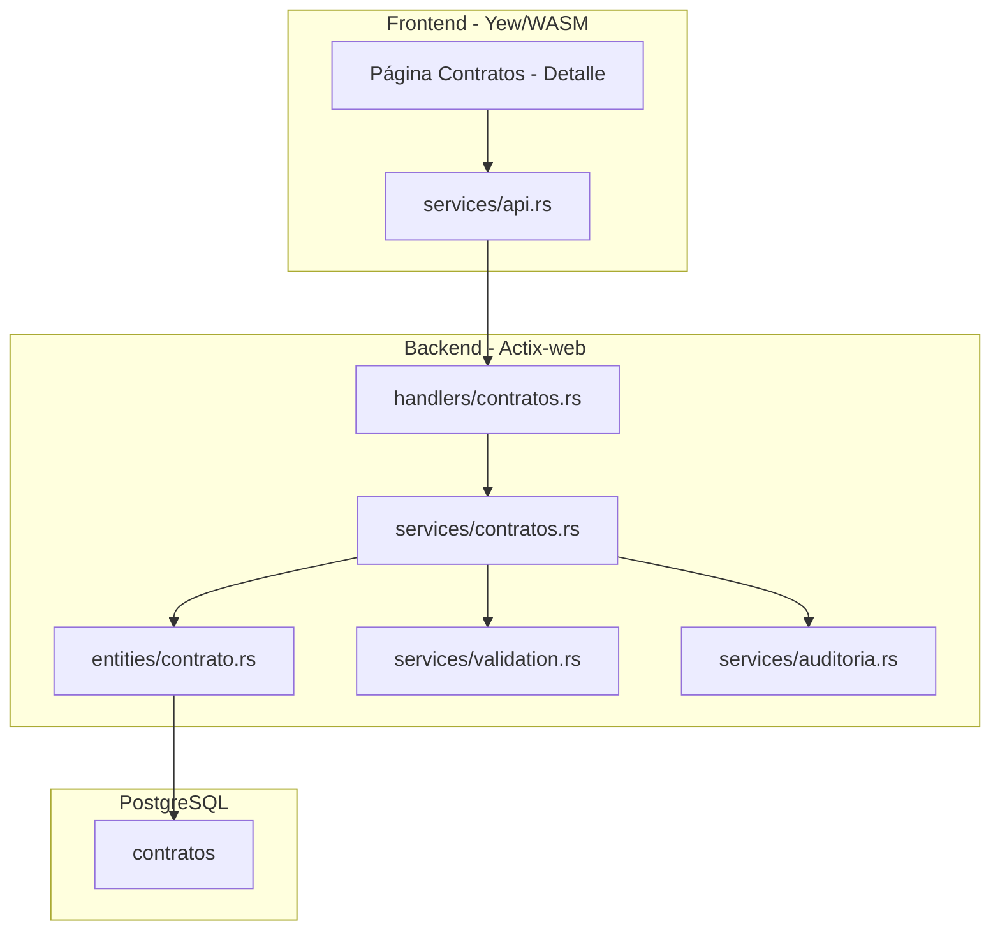
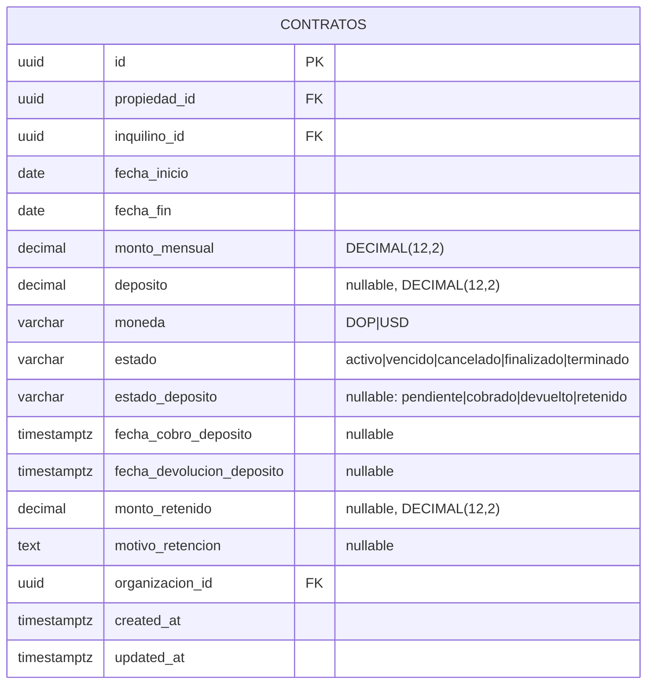
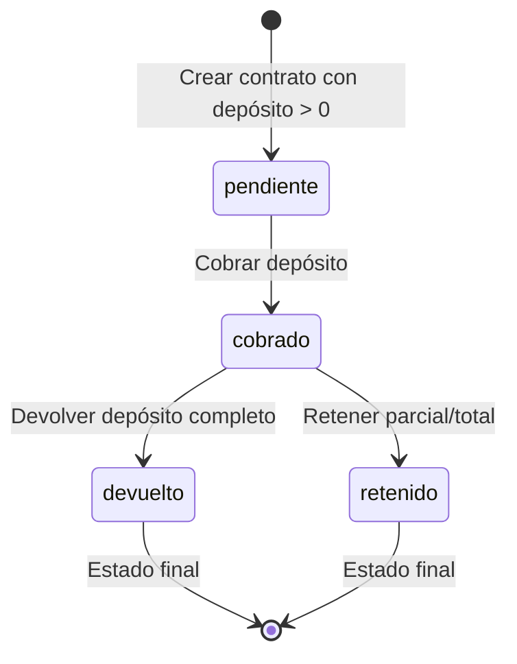

# Diseño — Seguimiento de Depósitos de Garantía

## Overview

Este módulo agrega seguimiento del ciclo de vida de depósitos de garantía a los contratos existentes. Es una extensión ligera: se agregan cinco columnas a la tabla `contratos`, se actualiza la entidad SeaORM, se agrega un endpoint dedicado `PUT /contratos/{id}/deposito` para gestionar transiciones de estado, y se modifica la UI del detalle del contrato para mostrar una sección de depósito.

No se crean tablas nuevas. La lógica de negocio principal es una máquina de estados para el depósito (pendiente → cobrado → devuelto|retenido) con validaciones de retención parcial.

## Architecture



El flujo sigue el patrón existente handlers → services → entities:

1. El handler `cambiar_estado_deposito` recibe la request HTTP con `WriteAccess`, extrae el ID del contrato y el body, y delega al servicio.
2. El servicio `cambiar_estado_deposito` valida la transición de estado, aplica las reglas de negocio (timestamps, retención), actualiza el contrato, y registra auditoría.
3. La entidad contrato existente se extiende con los cinco campos nuevos.

### Decisiones de diseño

- **Sin tabla nueva**: Los campos de depósito se agregan directamente a `contratos` porque hay una relación 1:1 estricta (un contrato tiene exactamente un depósito o ninguno). Una tabla separada agregaría complejidad innecesaria con JOINs.
- **Endpoint dedicado**: Se usa `PUT /contratos/{id}/deposito` en lugar de extender el `PUT /contratos/{id}` existente para separar la lógica de estado del depósito de la actualización general del contrato, evitando conflictos y simplificando validaciones.
- **Función pura para validación de transiciones**: `validar_transicion_deposito` es una función pura sin I/O que facilita testing con property-based tests.
- **Estado nulo cuando no hay depósito**: Si `deposito` es NULL o cero, `estado_deposito` permanece NULL. Esto evita estados inconsistentes.

## Components and Interfaces

### Database Migration

**Migration: `m20250615_000001_add_deposit_tracking_to_contratos`**

Agrega cinco columnas a la tabla `contratos`:

| Columna | Tipo | Restricciones |
|---------|------|---------------|
| estado_deposito | VARCHAR(20) | NULLABLE |
| fecha_cobro_deposito | TIMESTAMP WITH TIME ZONE | NULLABLE |
| fecha_devolucion_deposito | TIMESTAMP WITH TIME ZONE | NULLABLE |
| monto_retenido | DECIMAL(12,2) | NULLABLE |
| motivo_retencion | TEXT | NULLABLE |

Adicionalmente, la migración ejecuta un UPDATE para establecer `estado_deposito = 'pendiente'` en todos los contratos existentes que tienen `deposito IS NOT NULL AND deposito > 0`, para mantener consistencia con los datos existentes.

No se requieren índices adicionales — estos campos se consultan solo al obtener un contrato individual, no se filtran en listados.

### SeaORM Entity Changes

**`entities/contrato.rs`** — Se agregan cinco campos al `Model`:

```rust
pub estado_deposito: Option<String>,
pub fecha_cobro_deposito: Option<DateTimeWithTimeZone>,
pub fecha_devolucion_deposito: Option<DateTimeWithTimeZone>,
#[sea_orm(column_type = "Decimal(Some((12, 2)))", nullable)]
pub monto_retenido: Option<Decimal>,
pub motivo_retencion: Option<String>,
```

### API Endpoint

| Método | Ruta | Auth | Handler | Descripción |
|--------|------|------|---------|-------------|
| PUT | `/api/v1/contratos/{id}/deposito` | WriteAccess | `cambiar_estado_deposito` | Cambiar estado del depósito |

### Request/Response Models

**Nuevo en `models/contrato.rs`**:

```rust
#[derive(Debug, Deserialize)]
#[serde(rename_all = "camelCase")]
pub struct CambiarEstadoDepositoRequest {
    pub estado: String,
    pub monto_retenido: Option<Decimal>,
    pub motivo_retencion: Option<String>,
}
```

**Modificación a `ContratoResponse`** — Se agregan cinco campos:

```rust
pub struct ContratoResponse {
    // ... campos existentes ...
    pub estado_deposito: Option<String>,
    pub fecha_cobro_deposito: Option<DateTime<Utc>>,
    pub fecha_devolucion_deposito: Option<DateTime<Utc>>,
    pub monto_retenido: Option<Decimal>,
    pub motivo_retencion: Option<String>,
}
```

### Service Layer

**Nuevas funciones en `services/contratos.rs`**:

Constante:
```rust
const ESTADOS_DEPOSITO: &[&str] = &["pendiente", "cobrado", "devuelto", "retenido"];
```

Función pura de validación de transiciones:
```rust
pub fn validar_transicion_deposito(
    estado_actual: &str,
    nuevo_estado: &str,
) -> Result<(), AppError>
```

Transiciones válidas:
- `pendiente` → `cobrado`
- `cobrado` → `devuelto`
- `cobrado` → `retenido`

Todas las demás combinaciones son rechazadas con mensajes específicos en español.

Función de cambio de estado:
```rust
pub async fn cambiar_estado_deposito(
    db: &DatabaseConnection,
    contrato_id: Uuid,
    input: CambiarEstadoDepositoRequest,
    usuario_id: Uuid,
) -> Result<ContratoResponse, AppError>
```

Lógica:
1. Busca el contrato por ID (404 si no existe).
2. Valida que el contrato tiene depósito (`deposito IS NOT NULL AND deposito > 0`), rechaza con 422 si no.
3. Valida que `estado_deposito` actual no es NULL (consistencia).
4. Valida el enum `estado` con `validate_enum`.
5. Llama a `validar_transicion_deposito(estado_actual, nuevo_estado)`.
6. Si el nuevo estado es `retenido`:
   - Valida que `monto_retenido` está presente y > 0.
   - Valida que `monto_retenido` <= `deposito`.
   - Valida que `motivo_retencion` está presente y no es vacío/whitespace.
7. Abre transacción.
8. Actualiza campos según el nuevo estado:
   - `cobrado`: establece `fecha_cobro_deposito = now()`.
   - `devuelto`: establece `fecha_devolucion_deposito = now()`.
   - `retenido`: establece `fecha_devolucion_deposito = now()`, `monto_retenido`, `motivo_retencion`.
9. Registra auditoría con acción "cambiar_estado_deposito".
10. Commit y retorna `ContratoResponse`.

### Modificaciones a funciones existentes

**`contratos::create`** — Después de crear el contrato:
- Si `deposito` es `Some(d)` donde `d > 0`, establece `estado_deposito = "pendiente"`.
- Si `deposito` es `None` o `Some(0)`, deja `estado_deposito = None`.

**`ContratoResponse::from`** — Se agregan los cinco campos nuevos al mapeo.

### Handler

**Nuevo en `handlers/contratos.rs`**:

```rust
pub async fn cambiar_estado_deposito(
    db: web::Data<DatabaseConnection>,
    access: WriteAccess,
    path: web::Path<Uuid>,
    body: web::Json<CambiarEstadoDepositoRequest>,
) -> Result<HttpResponse, AppError>
```

### Ruta nueva

En `routes.rs`, dentro del scope `/contratos`:

```rust
.route("/{id}/deposito", web::put().to(handlers::contratos::cambiar_estado_deposito))
```

### Frontend

**Modificaciones a `frontend/src/types/contrato.rs`**:

Se agregan campos al struct `Contrato`:
```rust
pub estado_deposito: Option<String>,
pub fecha_cobro_deposito: Option<String>,
pub fecha_devolucion_deposito: Option<String>,
pub monto_retenido: Option<f64>,
pub motivo_retencion: Option<String>,
```

Se crea un nuevo struct para el request:
```rust
pub struct CambiarEstadoDeposito {
    pub estado: String,
    pub monto_retenido: Option<f64>,
    pub motivo_retencion: Option<String>,
}
```

**Modificaciones a `frontend/src/pages/contratos.rs`**:

Se agrega un componente `DepositoSection` que se renderiza en la vista de detalle del contrato (dentro del formulario de edición o como sección separada cuando se visualiza un contrato):

1. **Sección "Depósito de Garantía"**: Visible solo cuando el contrato tiene `deposito > 0`.
2. **Información mostrada**: Monto del depósito con moneda, badge de estado (pendiente=amarillo, cobrado=azul, devuelto=verde, retenido=rojo), fecha de cobro, fecha de devolución.
3. **Datos de retención**: Cuando `estado_deposito == "retenido"`, muestra monto retenido, monto devuelto (depósito - monto_retenido), y motivo de retención.
4. **Botones de acción**: Según el estado actual, muestra botones para las transiciones válidas:
   - `pendiente` → botón "Marcar como Cobrado"
   - `cobrado` → botones "Devolver Depósito" y "Retener Depósito"
   - `devuelto` / `retenido` → sin botones (estado final)
5. **Modal de retención**: Al hacer clic en "Retener Depósito", muestra un modal con campos para `monto_retenido` y `motivo_retencion`.
6. **Control de acceso**: Botones ocultos para rol `visualizador`.
7. **Textos en español**.

## Data Models

### Entidad modificada



### State Machine del Depósito



### Constantes de dominio

- **Estados válidos de depósito:** `pendiente`, `cobrado`, `devuelto`, `retenido`
- **Estado inicial:** `pendiente` (solo cuando deposito > 0)
- **Estados finales:** `devuelto`, `retenido`

## Correctness Properties

*A property is a characteristic or behavior that should hold true across all valid executions of a system — essentially, a formal statement about what the system should do.*

### Property 1: Deposit status defaults correctly on creation

*For any* valid `CreateContratoRequest` with `deposito = Some(d)` where `d > 0`, creating the contrato and retrieving it should return `estado_deposito == "pendiente"`. *For any* valid `CreateContratoRequest` with `deposito = None` or `deposito = Some(0)`, the response should have `estado_deposito == None`.

**Validates: Requirements 1.6, 1.7**

### Property 2: Valid deposit state transitions set correct timestamps

*For any* contrato with `estado_deposito == "pendiente"`, transitioning to `"cobrado"` should result in `fecha_cobro_deposito` being set to a non-null value. *For any* contrato with `estado_deposito == "cobrado"`, transitioning to `"devuelto"` should result in `fecha_devolucion_deposito` being set to a non-null value. *For any* contrato with `estado_deposito == "cobrado"`, transitioning to `"retenido"` should result in `fecha_devolucion_deposito` being set to a non-null value.

**Validates: Requirements 2.1, 2.2, 2.3**

### Property 3: Invalid deposit state transitions are rejected

*For any* contrato with `estado_deposito == "pendiente"` and *for any* target estado in `{"devuelto", "retenido"}`, attempting to transition should return a validation error. *For any* contrato with `estado_deposito` in `{"devuelto", "retenido"}` and *for any* target estado, attempting to transition should return a validation error. *For any* contrato with `estado_deposito == "cobrado"` and target `"pendiente"`, attempting to transition should return a validation error.

**Validates: Requirements 2.4, 2.5**

### Property 4: Retention requires valid monto and motivo

*For any* contrato with `estado_deposito == "cobrado"` and `deposito = d`, transitioning to `"retenido"` with `monto_retenido = m` where `0 < m <= d` and non-empty `motivo_retencion` should succeed. Transitioning to `"retenido"` without `monto_retenido`, with `monto_retenido <= 0`, with `monto_retenido > d`, or with empty/missing `motivo_retencion` should return a validation error.

**Validates: Requirements 3.1, 3.2, 3.3, 3.4**

### Property 5: Deposit status change round-trip preserves data

*For any* valid deposit state transition applied to a contrato, retrieving the contrato by ID should return the updated `estado_deposito`, the correct timestamps, and (for retention) the correct `monto_retenido` and `motivo_retencion`.

**Validates: Requirements 4.1, 4.4**

### Property 6: Invalid deposit estado enum values are rejected

*For any* string value not in the set `{"pendiente", "cobrado", "devuelto", "retenido"}`, attempting to use it as `estado` in `CambiarEstadoDepositoRequest` should return a validation error.

**Validates: Requirements 4.3**

### Property 7: Deposit operations on contracts without deposit are rejected

*For any* contrato where `deposito` is NULL or zero, attempting to change the deposit status should return a validation error.

**Validates: Requirements 2.6**

## Error Handling

Todos los errores siguen el patrón existente de `AppError` en `backend/src/errors.rs`:

| Escenario | Error | HTTP Status |
|-----------|-------|-------------|
| Contrato no encontrado | `AppError::NotFound("Contrato no encontrado")` | 404 |
| Contrato sin depósito | `AppError::Validation("El contrato no tiene depósito de garantía")` | 422 |
| Estado de depósito inválido | `AppError::Validation("Valor inválido para estado de depósito...")` via `validate_enum` | 422 |
| Transición inválida pendiente→devuelto/retenido | `AppError::Validation("El depósito debe ser cobrado antes de ser devuelto o retenido")` | 422 |
| Transición desde estado final | `AppError::Validation("Los depósitos devueltos o retenidos no pueden cambiar de estado")` | 422 |
| Transición cobrado→pendiente | `AppError::Validation("No se puede revertir un depósito cobrado a pendiente")` | 422 |
| Monto retenido faltante | `AppError::Validation("El monto retenido es requerido para retención")` | 422 |
| Monto retenido <= 0 | `AppError::Validation("El monto retenido debe ser mayor a cero")` | 422 |
| Monto retenido > depósito | `AppError::Validation("El monto retenido no puede exceder el depósito")` | 422 |
| Motivo retención vacío | `AppError::Validation("El motivo de retención es requerido")` | 422 |
| Visualizador intenta cambiar | `AppError::Forbidden` via `WriteAccess` extractor | 403 |
| Error de base de datos | `AppError::Internal` via `From<DbErr>` | 500 |

## Testing Strategy

### Unit Tests

Tests en `backend/src/services/contratos.rs` bajo `#[cfg(test)]`:

- `validar_transicion_deposito`: todas las combinaciones de estado actual → nuevo estado (9 combinaciones: 3 válidas, 6 inválidas)
- Validación de `monto_retenido` negativo, cero, y mayor que depósito
- Validación de `motivo_retencion` vacío y whitespace-only

Tests en `backend/src/models/contrato.rs` bajo `#[cfg(test)]`:
- Serialización/deserialización de `CambiarEstadoDepositoRequest` con camelCase
- `ContratoResponse` serializa los campos nuevos correctamente

### Property-Based Tests

Librería: `proptest` (ya disponible en dev-dependencies).

Cada test ejecuta mínimo 100 iteraciones.

| Property | Test | Descripción |
|----------|------|-------------|
| P1 | `test_deposit_status_defaults_on_creation` | Genera montos de depósito aleatorios (Some(>0), Some(0), None), verifica estado_deposito correcto |
| P2 | `test_valid_transitions_set_timestamps` | Ejecuta transiciones válidas, verifica timestamps no nulos |
| P3 | `test_invalid_transitions_rejected` | Genera todas las combinaciones inválidas de (estado_actual, nuevo_estado), verifica rechazo |
| P4 | `test_retention_validation` | Genera montos de retención aleatorios vs depósito, verifica validación correcta |
| P5 | `test_deposit_round_trip` | Aplica transiciones válidas, recupera contrato, verifica campos preservados |
| P6 | `test_invalid_estado_enum_rejected` | Genera strings aleatorios fuera del conjunto válido, verifica rechazo |
| P7 | `test_no_deposit_operations_rejected` | Genera contratos sin depósito, intenta cambiar estado, verifica rechazo |

Tag format: `// Feature: deposit-tracking, Property {N}: {title}`

Configuración: `proptest::test_runner::Config { cases: 100, .. }`

### Integration Tests

Archivo: `backend/tests/deposit_tracking_tests.rs`

Tests de ciclo completo request/response contra la API:
- Crear contrato con depósito → verificar estado_deposito = "pendiente"
- Crear contrato sin depósito → verificar estado_deposito = null
- Flujo completo: pendiente → cobrado → devuelto, verificar timestamps
- Flujo completo: pendiente → cobrado → retenido con monto y motivo
- Transiciones inválidas retornan 422
- Retención sin monto/motivo retorna 422
- Retención con monto > depósito retorna 422
- Cambio de estado en contrato sin depósito retorna 422
- Visualizador intenta cambiar estado → 403
- Contrato inexistente → 404
- Verificar campos de depósito en respuesta de GET /contratos/{id}
- Verificar entradas de auditoría para cada cambio de estado
