# Design Document: DR Landlord Compliance

## Overview

This feature extends the existing property management platform with Dominican Republic fiscal compliance capabilities. It introduces a **tipo_fiscal** classification on the Organizacion entity that gates access to tax-related features, then layers on condominium fee management, informal receipt tracking, multi-property analytics, lease indexation (IPC + Ley 85-25 cap), ITBIS (18% VAT) handling, NCF/e-CF sequential invoice numbering, DGII 606/607 report generation, and IPI property tax tracking.

The design leverages existing infrastructure:
- **Organizacion entity** already has `rnc`, `cedula`, `razon_social` fields
- **IPC service** already fetches from Banco Central and has `calcular_monto_maximo`
- **DGII service** already does RNC/cédula lookups with caching
- **Validación fiscal** already validates RNC (DGII algorithm) and cédula (Luhn)
- **Pago entity** already tracks payments per contrato with metodo_pago

The new system adds 6 new database entities, extends 3 existing entities, introduces 5 new service modules, and adds corresponding API endpoints and frontend pages.

## Architecture

```mermaid
graph TB
    subgraph Frontend ["Frontend (Leptos)"]
        FiscalConfig[Configuración Fiscal Page]
        CondominioMgmt[Cuotas Condominio Component]
        RecibosInformal[Recibos Informales Page]
        DashComp[Dashboard Comparativo Page]
        IndexacionPanel[Panel Indexación]
        NCFAdmin[Administración NCF Page]
        ReporteDGII[Reportes 606/607 Page]
        IPIPanel[Panel IPI]
    end

    subgraph API ["API Layer (Actix-web)"]
        HandlerFiscal[handlers/fiscal.rs]
        HandlerCondominio[handlers/condominios.rs]
        HandlerNCF[handlers/ncf.rs]
        HandlerReportes606[handlers/reportes_dgii.rs]
        HandlerIPI[handlers/ipi.rs]
        HandlerIndexacion[handlers/indexacion.rs]
    end

    subgraph Services ["Service Layer"]
        SvcFiscal[services/fiscal.rs]
        SvcCondominio[services/condominios.rs]
        SvcITBIS[services/itbis.rs]
        SvcNCF[services/ncf.rs]
        SvcReportes606[services/reportes_dgii.rs]
        SvcIPI[services/ipi.rs]
        SvcIndexacion[services/indexacion.rs]
        SvcExisting[Existing: ipc.rs, validacion_fiscal.rs, dgii.rs]
    end

    subgraph Entities ["Database Entities (SeaORM)"]
        EntOrg[organizacion ← extended]
        EntPago[pago ← extended]
        EntPropiedad[propiedad ← extended]
        EntCuota[cuota_condominio NEW]
        EntNCFSeq[secuencia_ncf NEW]
        EntReporte[reporte_dgii NEW]
        EntIPI[configuracion_ipi NEW]
        EntRecibo[recibo_informal NEW]
        EntCopropietario[copropietario NEW]
    end

    FiscalConfig --> HandlerFiscal
    CondominioMgmt --> HandlerCondominio
    NCFAdmin --> HandlerNCF
    ReporteDGII --> HandlerReportes606
    IPIPanel --> HandlerIPI
    IndexacionPanel --> HandlerIndexacion

    HandlerFiscal --> SvcFiscal
    HandlerCondominio --> SvcCondominio
    HandlerNCF --> SvcNCF
    HandlerReportes606 --> SvcReportes606
    HandlerIPI --> SvcIPI
    HandlerIndexacion --> SvcIndexacion

    SvcFiscal --> EntOrg
    SvcCondominio --> EntCuota
    SvcITBIS --> EntPago
    SvcNCF --> EntNCFSeq
    SvcReportes606 --> EntReporte
    SvcIPI --> EntIPI
    SvcIPI --> EntCopropietario
    SvcIndexacion --> SvcExisting
```



### Key Design Decisions

1. **tipo_fiscal on Organizacion**: Reuse the existing `tipo` field semantics but add a dedicated `tipo_fiscal` column. The existing `tipo` field is a free-form string used for organizational categorization, while `tipo_fiscal` is a strict enum controlling compliance feature gates.

2. **NCF Sequencing with Row-Level Locking**: NCF numbers must be gapless and sequential. We use `SELECT ... FOR UPDATE` on the `secuencia_ncf` row within a transaction to prevent concurrent allocation conflicts.

3. **ITBIS as Separate Service**: Rather than embedding ITBIS logic in the payment service, a dedicated `itbis.rs` service computes tax amounts. The payment service calls it during payment creation.

4. **606/607 as Pipe-Delimited TXT**: DGII requires a specific pipe-delimited format per Norma 07-2018. We generate this in-memory and return as downloadable file, with a preview endpoint that returns structured JSON.

5. **IPI Calculated On-Demand**: IPI is computed from current property values and the configured threshold rather than stored as a static value, since property values and thresholds change.

6. **Extend Existing Entities via Migrations**: Add columns to `organizaciones`, `pagos`, and `propiedades` tables rather than creating junction tables, keeping queries simple.

## Components and Interfaces

### New Service Modules

#### `services/fiscal.rs`
Manages tipo_fiscal transitions and gates fiscal feature access.

```rust
pub fn verificar_acceso_fiscal(org: &organizacion::Model) -> Result<(), AppError>;
pub async fn actualizar_tipo_fiscal(
    db: &DatabaseConnection,
    org_id: Uuid,
    nuevo_tipo: TipoFiscal,
    identificador: Option<&str>,
) -> Result<organizacion::Model, AppError>;
```

#### `services/condominios.rs`
CRUD for cuota_condominio records and billing integration.

```rust
pub async fn crear_cuota(db: &DatabaseConnection, input: CrearCuotaRequest) -> Result<CuotaResponse, AppError>;
pub async fn actualizar_cuota(db: &DatabaseConnection, id: Uuid, input: UpdateCuotaRequest) -> Result<CuotaResponse, AppError>;
pub async fn listar_cuotas(db: &DatabaseConnection, propiedad_id: Uuid) -> Result<Vec<CuotaResponse>, AppError>;
pub fn calcular_billing_con_cuota(monto_base: Decimal, cuota: Option<&CuotaCondominio>, tipo_propiedad: &str, is_registered: bool) -> BillingDesglose;
```

#### `services/itbis.rs`
Pure ITBIS calculation logic.

```rust
pub fn calcular_itbis(monto_base: Decimal, tipo_propiedad: &str, tipo_fiscal: &TipoFiscal, tasa: Option<Decimal>) -> ItbisResult;
pub fn calcular_retencion(monto_itbis: Decimal, tenant_tipo_fiscal: &TipoFiscal) -> RetencionResult;
```

#### `services/ncf.rs`
NCF/e-CF sequence management with concurrency control.

```rust
pub async fn asignar_ncf(db: &DatabaseConnection, org_id: Uuid, tipo_ncf: TipoNCF, fecha_comprobante: NaiveDate) -> Result<String, AppError>;
pub async fn configurar_rango(db: &DatabaseConnection, org_id: Uuid, input: ConfigurarRangoRequest) -> Result<SecuenciaNcfResponse, AppError>;
pub fn validar_formato_ncf(ncf: &str) -> Result<(), AppError>;
pub async fn verificar_consumo_rango(db: &DatabaseConnection, org_id: Uuid) -> Result<Vec<AlertaRango>, AppError>;
```

#### `services/reportes_dgii.rs`
606/607 report generation per Norma General 07-2018.

```rust
pub async fn generar_607(db: &DatabaseConnection, org_id: Uuid, periodo: YearMonth) -> Result<ReporteGenerado, AppError>;
pub async fn generar_606(db: &DatabaseConnection, org_id: Uuid, periodo: YearMonth) -> Result<ReporteGenerado, AppError>;
pub fn formatear_linea_607(record: &Registro607) -> String;
pub fn formatear_linea_606(record: &Registro606) -> String;
pub fn generar_header(rnc: &str, periodo: YearMonth, cantidad: u32, total: Decimal) -> String;
pub async fn calcular_itbis_neto(db: &DatabaseConnection, org_id: Uuid, periodo: YearMonth) -> Result<ItbisNetoResult, AppError>;
```

#### `services/ipi.rs`
IPI calculation and tracking.

```rust
pub async fn calcular_ipi(db: &DatabaseConnection, org_id: Uuid) -> Result<IpiLiabilityResponse, AppError>;
pub fn calcular_ipi_monto(valor_total: Decimal, umbral: Decimal) -> Decimal;
pub async fn obtener_copropietarios(db: &DatabaseConnection, propiedad_id: Uuid) -> Result<Vec<CopropietarioResponse>, AppError>;
pub fn calcular_ipi_proporcional(ipi_total: Decimal, porcentaje_propiedad: Decimal) -> Decimal;
```

### Extended Existing Service: `services/indexacion.rs`
Builds on existing `services/ipc.rs` for lease renewal workflow.

```rust
pub async fn calcular_propuesta_renovacion(db: &DatabaseConnection, contrato_id: Uuid) -> Result<PropuestaRenovacion, AppError>;
pub async fn aprobar_renovacion(db: &DatabaseConnection, contrato_id: Uuid, monto_aprobado: Decimal, admin_id: Uuid) -> Result<contrato::Model, AppError>;
pub async fn contratos_proximos_vencer(db: &DatabaseConnection, org_id: Uuid, dias: i32) -> Result<Vec<ContratoProximoVencer>, AppError>;
```

### New Handler Modules

All endpoints under `/api/v1/` prefix, requiring `WriteAccess` or `AdminOnly` extractors as appropriate.

| Handler | Route Base | Key Endpoints |
|---------|-----------|---------------|
| `fiscal.rs` | `/organizacion/fiscal` | `PUT /tipo-fiscal`, `GET /estado` |
| `condominios.rs` | `/propiedades/{id}/condominios` | `POST /`, `PUT /{cuota_id}`, `GET /`, `DELETE /{cuota_id}` |
| `ncf.rs` | `/ncf` | `GET /secuencias`, `POST /configurar-rango`, `GET /alertas` |
| `reportes_dgii.rs` | `/reportes-dgii` | `POST /607`, `POST /606`, `GET /preview/{tipo}/{periodo}`, `PUT /{id}/estado` |
| `ipi.rs` | `/ipi` | `GET /calculo`, `PUT /umbral`, `GET /copropietarios/{propiedad_id}`, `POST /copropietarios` |
| `indexacion.rs` | `/indexacion` | `GET /propuesta/{contrato_id}`, `POST /aprobar/{contrato_id}`, `GET /proximos-vencer` |

### Frontend Pages

| Page | Route | Description |
|------|-------|-------------|
| Configuración Fiscal | `/configuracion/fiscal` | Set tipo_fiscal, RNC/cédula, NCF ranges |
| Cuotas Condominio | `/propiedades/{id}/condominios` | Manage condominium fees per property |
| Recibos Informales | `/recibos-informales` | View/create informal receipts |
| Dashboard Comparativo | `/dashboard/comparativo` | Multi-property comparison table |
| Indexación | `/indexacion` | Upcoming renewals, IPC proposals |
| Reportes DGII | `/reportes-dgii` | Generate/preview/submit 606/607 |
| IPI | `/ipi` | View IPI liability, manage copropietarios |

## Data Models

### New Entities

#### `cuota_condominio` (table: `cuotas_condominio`)

| Column | Type | Description |
|--------|------|-------------|
| id | UUID PK | |
| propiedad_id | UUID FK → propiedades | |
| monto | DECIMAL(12,2) | Fee amount |
| moneda | VARCHAR | DOP or USD |
| frecuencia | VARCHAR | mensual, trimestral, anual |
| fecha_inicio | DATE | When fee starts |
| fecha_fin | DATE NULL | When fee ends (NULL = ongoing) |
| es_passthrough | BOOLEAN | Whether passed to tenant |
| contrato_id | UUID FK → contratos NULL | Which contract bears cost (if passthrough) |
| organizacion_id | UUID FK → organizaciones | |
| created_at | TIMESTAMPTZ | |
| updated_at | TIMESTAMPTZ | |

#### `secuencia_ncf` (table: `secuencias_ncf`)

| Column | Type | Description |
|--------|------|-------------|
| id | UUID PK | |
| organizacion_id | UUID FK → organizaciones | |
| tipo_ncf | VARCHAR | B01, B02, B14, B15 |
| prefijo | CHAR(1) | B or E (physical vs e-CF) |
| siguiente_numero | INTEGER | Next number to assign |
| rango_desde | INTEGER | DGII-authorized start |
| rango_hasta | INTEGER | DGII-authorized end |
| is_active | BOOLEAN | |
| is_ecf | BOOLEAN | Whether org is e-CF certified |
| created_at | TIMESTAMPTZ | |
| updated_at | TIMESTAMPTZ | |

**Unique constraint**: `(organizacion_id, tipo_ncf, prefijo)`

#### `reporte_dgii` (table: `reportes_dgii`)

| Column | Type | Description |
|--------|------|-------------|
| id | UUID PK | |
| organizacion_id | UUID FK → organizaciones | |
| tipo_reporte | VARCHAR | "606" or "607" |
| periodo | VARCHAR(6) | YYYYMM |
| estado | VARCHAR | borrador, enviado |
| cantidad_registros | INTEGER | |
| monto_total | DECIMAL(14,2) | |
| itbis_total | DECIMAL(14,2) | |
| contenido | TEXT | Pipe-delimited TXT content |
| registros_excluidos | JSONB NULL | Records excluded with reasons |
| generated_by | UUID FK → usuarios | |
| generated_at | TIMESTAMPTZ | |
| submitted_at | TIMESTAMPTZ NULL | |
| created_at | TIMESTAMPTZ | |
| updated_at | TIMESTAMPTZ | |

**Unique constraint**: `(organizacion_id, tipo_reporte, periodo, estado)` — allows one borrador and one enviado per period.

#### `configuracion_ipi` (table: `configuraciones_ipi`)

| Column | Type | Description |
|--------|------|-------------|
| id | UUID PK | |
| organizacion_id | UUID FK → organizaciones | |
| umbral_ipi | DECIMAL(14,2) | Current threshold (RD$10,695,494 for 2026) |
| anio | INTEGER | Fiscal year |
| fecha_pago_1 | DATE | First semi-annual deadline (March 11) |
| fecha_pago_2 | DATE | Second semi-annual deadline (September 11) |
| created_at | TIMESTAMPTZ | |
| updated_at | TIMESTAMPTZ | |

#### `recibo_informal` (table: `recibos_informales`)

| Column | Type | Description |
|--------|------|-------------|
| id | UUID PK | |
| pago_id | UUID FK → pagos | |
| referencia_interna | VARCHAR UNIQUE | System-generated reference (e.g., RI-000001) |
| organizacion_id | UUID FK → organizaciones | |
| created_at | TIMESTAMPTZ | |

#### `copropietario` (table: `copropietarios`)

| Column | Type | Description |
|--------|------|-------------|
| id | UUID PK | |
| propiedad_id | UUID FK → propiedades | |
| nombre | VARCHAR | Owner name |
| cedula_rnc | VARCHAR | Owner's cédula or RNC |
| porcentaje_propiedad | DECIMAL(5,2) | Ownership % (must sum to 100 per property) |
| organizacion_id | UUID FK → organizaciones | |
| created_at | TIMESTAMPTZ | |
| updated_at | TIMESTAMPTZ | |

### Extended Existing Entities

#### `organizaciones` — new columns

| Column | Type | Description |
|--------|------|-------------|
| tipo_fiscal | VARCHAR NOT NULL DEFAULT 'informal' | persona_juridica, persona_fisica, informal |
| regimen_pagos | VARCHAR NULL | mensual, trimestral |
| fecha_inicio_operaciones | DATE NULL | |
| is_ecf_certificado | BOOLEAN DEFAULT false | e-CF certification status |

#### `pagos` — new columns

| Column | Type | Description |
|--------|------|-------------|
| monto_base | DECIMAL(12,2) NULL | Base amount before ITBIS |
| monto_itbis | DECIMAL(12,2) NULL | ITBIS amount (18% of base for commercial) |
| monto_itbis_retenido | DECIMAL(12,2) NULL | 30% retention by corporate tenant |
| ncf | VARCHAR(11) NULL | Assigned NCF/e-CF number |
| fecha_comprobante | DATE NULL | NCF issue date |
| tipo_ncf | VARCHAR NULL | B01, B02, B14, B15 |
| es_parcial | BOOLEAN DEFAULT false | Whether this is a partial payment |
| saldo_pendiente | DECIMAL(12,2) NULL | Remaining balance after this payment |
| tipo_linea | VARCHAR DEFAULT 'renta' | renta, cuota_condominio, recargo |

#### `propiedades` — new columns

| Column | Type | Description |
|--------|------|-------------|
| valor_catastral | DECIMAL(14,2) NULL | DGII assessed value for IPI |
| exento_ipi | BOOLEAN DEFAULT false | CONFOTUR or other exemption |
| motivo_exencion | VARCHAR NULL | e.g., "CONFOTUR 15 años" |

### Key DTOs (models/)

```rust
// models/fiscal.rs
pub enum TipoFiscal { PersonaJuridica, PersonaFisica, Informal }
pub struct ActualizarTipoFiscalRequest { pub tipo_fiscal: TipoFiscal, pub identificador: Option<String> }
pub struct EstadoFiscalResponse { pub tipo_fiscal: TipoFiscal, pub rnc: Option<String>, pub is_ecf: bool, ... }

// models/itbis.rs
pub struct ItbisResult { pub monto_base: Decimal, pub monto_itbis: Decimal, pub monto_total: Decimal, pub tasa: Decimal }
pub struct RetencionResult { pub monto_retenido: Decimal, pub monto_neto: Decimal }

// models/ncf.rs
pub enum TipoNCF { B01, B02, B14, B15 }
pub struct ConfigurarRangoRequest { pub tipo_ncf: TipoNCF, pub rango_desde: i32, pub rango_hasta: i32 }
pub struct AlertaRango { pub tipo_ncf: TipoNCF, pub consumo_porcentaje: f64, pub restantes: i32 }

// models/reportes_dgii.rs
pub struct Registro607 { pub rnc_cliente: String, pub tipo_ncf: String, pub ncf: String, ... }
pub struct Registro606 { pub rnc_proveedor: String, pub tipo_ncf: String, pub ncf_proveedor: String, ... }
pub struct ReporteGenerado { pub contenido: String, pub preview: Vec<RegistroPreview>, pub excluidos: Vec<RegistroExcluido> }

// models/ipi.rs
pub struct IpiLiabilityResponse { pub valor_total: Decimal, pub umbral: Decimal, pub exceso: Decimal, pub ipi_anual: Decimal, pub pago_semestral: Decimal, pub proxima_fecha: NaiveDate }

// models/indexacion.rs
pub struct PropuestaRenovacion { pub contrato_id: Uuid, pub monto_actual: Decimal, pub monto_maximo: Decimal, pub ipc_porcentaje: Decimal, pub tope_aplicado: bool, pub datos_stale: bool }
```

## Correctness Properties

*A property is a characteristic or behavior that should hold true across all valid executions of a system — essentially, a formal statement about what the system should do. Properties serve as the bridge between human-readable specifications and machine-verifiable correctness guarantees.*

### Property 1: RNC Check-Digit Validation Round Trip

*For any* 8-digit prefix, computing the DGII check digit and appending it produces a 9-digit string that passes `validar_rnc`, and changing any single digit in a valid RNC produces a string that fails validation.

**Validates: Requirements 1.2**

### Property 2: Cédula Luhn Validation Round Trip

*For any* 10-digit prefix, computing the Luhn check digit and appending it produces an 11-digit string that passes `validar_cedula`, and changing any single digit in a valid cédula produces a string that fails validation.

**Validates: Requirements 1.3**

### Property 3: Fiscal Feature Access Gate

*For any* `(tipo_fiscal, fiscal_feature)` pair, access to fiscal-only features (ITBIS, NCF, 606/607) is granted if and only if `tipo_fiscal` is `persona_juridica` or `persona_fisica`. All requests with `tipo_fiscal = informal` are rejected with an error.

**Validates: Requirements 1.5, 1.6**

### Property 4: Tipo Fiscal Transition Requires Valid Identifier

*For any* transition from `informal` to a registered `tipo_fiscal`, the transition succeeds only when the corresponding identifier (9-digit RNC for persona_juridica, 11-digit cédula for persona_fisica) passes its validation algorithm. Missing or invalid identifiers result in rejection.

**Validates: Requirements 1.7**

### Property 5: Billing Desglose with Condominium Fee

*For any* `(monto_base, cuota_condominio)` where both are positive and the cuota is configured as passthrough, the billing total equals `monto_base + cuota_condominio` (plus ITBIS on both if applicable), with each component appearing as a separate line item.

**Validates: Requirements 2.3, 2.4**

### Property 6: Condominium Fee Change Temporal Boundary

*For any* cuota change with an effective date, billing periods starting before the change date use the old amount, and periods starting on or after the change date use the new amount.

**Validates: Requirements 2.5**

### Property 7: Condominium Fee Increase Uncapped

*For any* cuota_condominio increase (including increases exceeding 10%), the system accepts the new amount without applying the Ley 85-25 rent cap. Only base rent increases are capped.

**Validates: Requirements 2.7**

### Property 8: ITBIS Applicability

*For any* `(tipo_fiscal, tipo_propiedad, monto_base)`, ITBIS equals `monto_base * 0.18` if and only if `tipo_fiscal` is `persona_juridica` or `persona_fisica` AND `tipo_propiedad` is `comercial` or `industrial`. In all other cases (residential property or informal organization), ITBIS equals zero.

**Validates: Requirements 6.1, 6.2, 6.3, 6.8, 2.8**

### Property 9: Payment Amount Invariant

*For any* payment record with ITBIS applied, `monto_total == monto_base + monto_itbis` holds exactly. No rounding discrepancy is allowed since both are stored as DECIMAL(12,2).

**Validates: Requirements 6.4**

### Property 10: ITBIS Retention Split

*For any* ITBIS amount where the tenant has `tipo_fiscal = persona_juridica`, `monto_itbis_retenido = monto_itbis * 0.30` and the landlord net ITBIS received equals `monto_itbis * 0.70`.

**Validates: Requirements 6.7**

### Property 11: Partial Payment Balance Tracking

*For any* sequence of partial payments against a billing period with `amount_due`, the `saldo_pendiente` after each payment equals `amount_due - sum(all_payments_so_far)`, and the period is marked `pagado` if and only if `sum(all_payments) >= amount_due`.

**Validates: Requirements 3.1, 3.2, 3.3**

### Property 12: FIFO Payment Allocation

*For any* payment without explicit `fecha_vencimiento` reference and a set of unpaid periods, the payment is allocated to the period with the earliest `fecha_vencimiento`. If the payment exceeds that period's balance, the surplus cascades to the next oldest unpaid period.

**Validates: Requirements 3.4, 3.8**

### Property 13: Informal Receipt Uniqueness

*For any* sequence of cash payments recorded for an informal organization, each generated `referencia_interna` is unique across all recibos_informales for that organization.

**Validates: Requirements 3.5**

### Property 14: Rent Indexation Formula with Legal Cap

*For any* `(monto_actual, ipc_porcentaje)` where both are positive, `calcular_monto_maximo` returns `monto_actual * (1 + min(ipc_porcentaje, 10) / 100)`. The result never exceeds `monto_actual * 1.10` regardless of IPC value.

**Validates: Requirements 5.2, 5.9**

### Property 15: Indexation 60-Day Trigger

*For any* active contrato with `fecha_fin`, the system triggers a renewal proposal if and only if `fecha_fin - today <= 60 days` and `fecha_fin - today > 0`.

**Validates: Requirements 5.1, 5.7**

### Property 16: Indexation Anniversary Alignment

*For any* contrato with `fecha_inicio`, rent indexation applies on the anniversary of `fecha_inicio` (fecha_inicio + N years), not on January 1 of each calendar year.

**Validates: Requirements 5.10**

### Property 17: NCF Sequential Gapless Generation

*For any* organization and NCF type, if NCFs n₁, n₂, ..., nₖ are generated in order, then nᵢ₊₁ = nᵢ + 1 for all i. No gaps in the sequence.

**Validates: Requirements 7.1, 7.4, 7.5**

### Property 18: NCF Format Compliance

*For any* generated NCF string, it matches the pattern `^[A-Z]\d{10}$` — exactly one uppercase letter followed by exactly 10 digits. The letter is 'E' for e-CF organizations and 'B' for physical NCF.

**Validates: Requirements 7.3**

### Property 19: NCF Range Boundary Enforcement

*For any* NCF sequence position and authorized range `[rango_desde, rango_hasta]`, the system rejects NCF generation if `siguiente_numero > rango_hasta`, and generates an alert when `siguiente_numero > rango_desde + 0.8 * (rango_hasta - rango_desde)`.

**Validates: Requirements 7.9**

### Property 20: Report 607 Monthly Filtering

*For any* set of payment records and target month (YYYYMM), the generated 607 report includes only payments whose `fecha_pago` falls within that month. Payments with `fecha_pago` in other months are excluded regardless of when the payment record was created.

**Validates: Requirements 8.1**

### Property 21: Report 607 Field Completeness

*For any* valid payment record with complete fiscal data (RNC, fecha_comprobante), the generated 607 line contains all Norma 07-2018 required fields: RNC/cédula del cliente, tipo NCF, NCF, fecha comprobante, fecha pago, monto servicios, monto bienes, ITBIS facturado, ITBIS retenido, and forma de pago.

**Validates: Requirements 8.2**

### Property 22: Report 606 Field Completeness

*For any* valid expense record with complete fiscal data (RNC proveedor, NCF proveedor, fecha_comprobante), the generated 606 line contains all Norma 07-2018 required fields: RNC proveedor, tipo NCF, NCF, fecha comprobante, fecha pago, monto servicios, monto bienes, ITBIS facturado, ITBIS retenido, ITBIS al costo, and forma de pago.

**Validates: Requirements 8.3**

### Property 23: Report Format and Header Integrity

*For any* generated 606 or 607 report, the output is pipe-delimited (`|` separator) with a header record containing: reporting entity RNC, period as YYYYMM, record count matching the number of body lines, and total amount equaling the sum of individual record amounts.

**Validates: Requirements 8.4, 8.5**

### Property 24: Incomplete Record Exclusion

*For any* set of payment/expense records, those missing RNC or fecha_comprobante are excluded from the generated report body and appear in the `registros_excluidos` list. Records with complete fiscal data but missing NCF are included with blank NCF field.

**Validates: Requirements 8.6**

### Property 25: ITBIS Neto Calculation

*For any* month, ITBIS neto equals the sum of ITBIS facturado from 607 records minus the sum of ITBIS facturado from 606 records for the same period.

**Validates: Requirements 8.8**

### Property 26: Residential Income in 607 Has Zero ITBIS

*For any* residential rental payment appearing in a 607 report, the ITBIS facturado field equals zero.

**Validates: Requirements 8.9**

### Property 27: IPI Calculation

*For any* set of properties within an organization (excluding those with `exento_ipi = true`), IPI = `max(0, sum(valor_catastral) - umbral_ipi) * 0.01`. IPI applies regardless of `tipo_fiscal`.

**Validates: Requirements 9.1, 9.2, 9.7, 9.8**

### Property 28: IPI Co-Owner Proportional Split

*For any* property with co-owners where `sum(porcentaje_propiedad) = 100%`, each co-owner's IPI contribution equals `property_valor_catastral * porcentaje_propiedad / 100`, and the sum of all co-owner contributions equals the property's total IPI contribution.

**Validates: Requirements 9.10**

### Property 29: Dashboard Date Range Filtering

*For any* set of financial records (pagos, gastos) and a date range filter, computed metrics (ingresos, gastos, rentabilidad) include only records with dates within the specified range. When no date range is specified, no computed metrics are returned.

**Validates: Requirements 4.5**

### Property 30: Rentabilidad Neta Formula

*For any* `(ingresos, gastos, cuotas_condominio, valor_catastral)` where `valor_catastral > 0`, rentabilidad_neta = `(ingresos - gastos - cuotas) / valor_catastral * 100`, capped at 200%. Properties with `valor_catastral < 100,000` are flagged as unreliable.

**Validates: Requirements 4.6**

### Property 31: Currency Normalization

*For any* monetary amount with known currency (DOP or USD) and exchange rate, the normalized value in the target currency equals `amount * rate` (DOP→USD) or `amount / rate` (USD→DOP), with the rate sourced from Banco Central published data.

**Validates: Requirements 4.3**

## Error Handling

| Scenario | Error Type | HTTP Status | User Message |
|----------|-----------|-------------|--------------|
| Informal user accesses fiscal features | `AppError::Forbidden` | 403 | "Funciones fiscales requieren registro en DGII" |
| Invalid RNC check digit | `AppError::Validation` | 422 | "RNC inválido: formato o dígito verificador incorrecto" |
| Invalid cédula Luhn | `AppError::Validation` | 422 | "Cédula inválida: formato o dígito verificador incorrecto" |
| NCF range exhausted | `AppError::Validation` | 422 | "Rango de NCF agotado. Solicite nueva autorización a DGII" |
| NCF concurrency conflict (after retries) | `AppError::Conflict` | 409 | "Error de concurrencia al asignar NCF. Reintente" |
| IPC data stale (>90 days) | Soft warning | 200 | Calculation proceeds with stale flag + warning in response |
| IPC unavailable + no cache | `AppError::ServiceUnavailable` | 503 | "Datos de IPC no disponibles. Actualice manualmente" |
| Partial payment exceeds total across all periods | `AppError::Validation` | 422 | "Monto excede el total adeudado" |
| Report missing fiscal data | Soft exclusion | 200 | Records excluded with reasons in `registros_excluidos` |
| Co-owner percentages don't sum to 100 | `AppError::Validation` | 422 | "Porcentajes de copropietarios deben sumar 100%" |
| DGII report already submitted | `AppError::Conflict` | 409 | "Reporte ya fue enviado a DGII para este período" |

### Graceful Degradation

- **Banco Central API down**: Use cached IPC, flag as stale
- **DGII API down**: Use cached RNC data, flag as cached
- **NCF assignment fails**: Payment remains `pagado` without NCF; flagged for manual resolution

## Testing Strategy

### Property-Based Tests (PBT)

**Library**: `proptest` (Rust's standard PBT framework)
**Configuration**: Minimum 100 iterations per property test (`proptest::test_runner::Config { cases: 100, .. }`)

Each correctness property maps to a dedicated PBT test file:
- `backend/src/services/fiscal_pbt.rs` — Properties 1-4
- `backend/src/services/itbis_pbt.rs` — Properties 8-10
- `backend/src/services/pagos_parciales_pbt.rs` — Properties 11-13
- `backend/src/services/indexacion_pbt.rs` — Properties 14-16
- `backend/src/services/ncf_pbt.rs` — Properties 17-19
- `backend/src/services/reportes_dgii_pbt.rs` — Properties 20-26
- `backend/src/services/ipi_pbt.rs` — Properties 27-28
- `backend/src/services/dashboard_comparativo_pbt.rs` — Properties 29-31
- `backend/src/services/condominios_pbt.rs` — Properties 5-7

Tag format: `// Feature: dr-landlord-compliance, Property {N}: {title}`

### Unit Tests (Example-Based)

- Specific DGII NCF format examples (B0100000001, E3100000001)
- Edge cases: empty cuota list, zero monto, boundary dates
- Tipo fiscal transition scenarios
- Report generation with mixed residential/commercial data
- IPI threshold exactly at boundary

### Integration Tests

- Full payment flow: create pago → ITBIS calculation → NCF assignment → 607 inclusion
- Concurrent NCF generation (verify row-level locking)
- Lease renewal workflow end-to-end
- 606/607 pipe-delimited output parseable by DGII validator

### Migrations

New migrations required:
1. `m20260601_000001_add_tipo_fiscal_to_organizaciones.rs`
2. `m20260601_000002_add_fiscal_columns_to_pagos.rs`
3. `m20260601_000003_add_catastral_to_propiedades.rs`
4. `m20260601_000004_create_cuotas_condominio.rs`
5. `m20260601_000005_create_secuencias_ncf.rs`
6. `m20260601_000006_create_reportes_dgii.rs`
7. `m20260601_000007_create_configuraciones_ipi.rs`
8. `m20260601_000008_create_recibos_informales.rs`
9. `m20260601_000009_create_copropietarios.rs`
