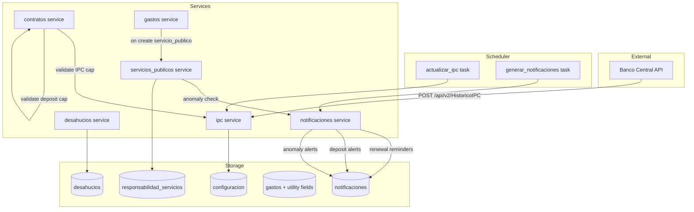
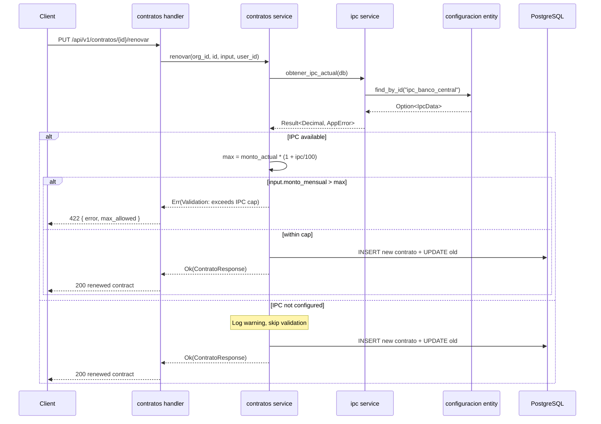
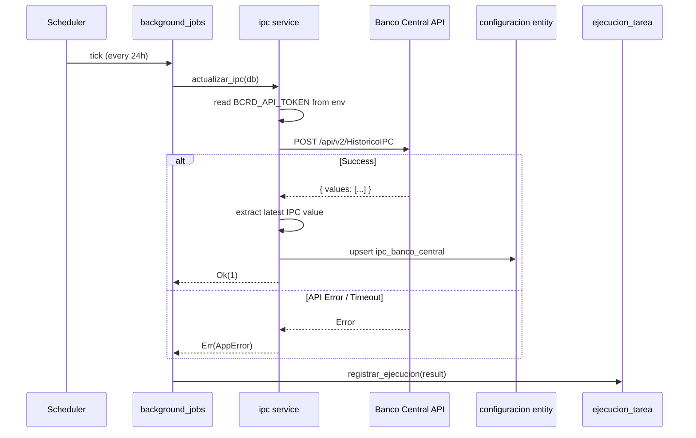
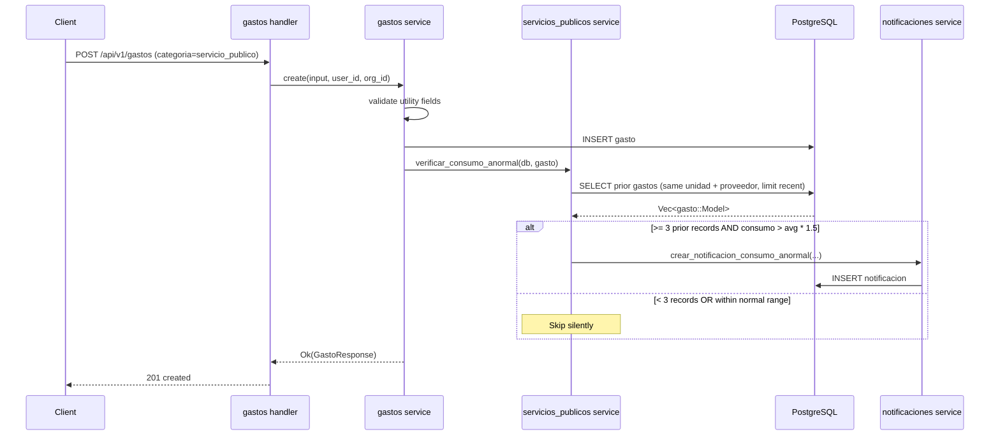
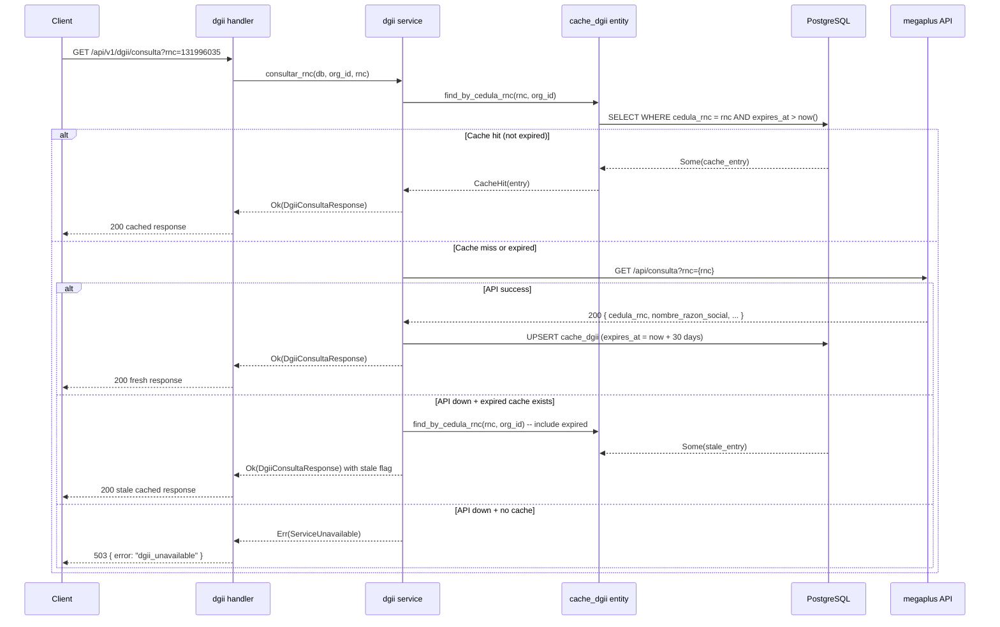

# Design Document: DR Legal Compliance and Utilities

## Overview

This feature implements Dominican Republic rental law compliance (Ley 4314) and utility management for the property management platform. It adds IPC-based rent increase caps enforced during contract renewals, automatic IPC fetching from Banco Central, lease renewal reminders at legally required notice periods (90/60/30 days), deposit return enforcement within the 15-day legal window, eviction process tracking, utility bill tracking with supplier-specific metadata for DR electricity distributors (EDENORTE/EDESUR/EDEESTE) and water (CAASD), configurable payment responsibility per unit/contract, and abnormal consumption detection.

The design integrates with existing systems: the `configuracion` key-value store for IPC data, the scheduler (`background_jobs`) for daily IPC fetching and notification generation, the `notificaciones` service for alerts, and the `gastos` entity for utility bill tracking via new optional columns.

## Architecture



## Sequence Diagrams

### Contract Renewal with IPC Validation



### Daily IPC Fetch



### Abnormal Consumption Detection



## Components and Interfaces

### Component 1: IPC Service (`services/ipc.rs`)

**Purpose**: Fetches, stores, and provides the IPC inflation index value used for rent cap calculations.

**Interface**:

```rust
/// Fetch current IPC from configuracion store
pub async fn obtener_ipc_actual(db: &DatabaseConnection) -> Result<Option<IpcData>, AppError>;

/// Manually override IPC value (admin only)
pub async fn actualizar_ipc_manual(
    db: &DatabaseConnection,
    input: UpdateIpcRequest,
    updated_by: Uuid,
) -> Result<IpcData, AppError>;

/// Fetch IPC from Banco Central API and persist to configuracion
pub async fn fetch_ipc_from_bcrd(db: &DatabaseConnection) -> Result<i64, AppError>;

/// Calculate maximum allowed rent for a renewal
pub fn calcular_monto_maximo(monto_actual: Decimal, ipc_porcentaje: Decimal) -> Decimal;
```

**Responsibilities**:

- HTTP client calls to Banco Central API via `reqwest`
- Serialize/deserialize IPC JSON in configuracion
- Graceful degradation when API is unreachable (use cached value)
- Pure calculation of max rent amount

### Component 2: Desahucios Service (`services/desahucios.rs`)

**Purpose**: CRUD for eviction process tracking with audit logging and state machine validation.

**Interface**:

```rust
pub async fn create(
    db: &DatabaseConnection,
    input: CreateDesahucioRequest,
    usuario_id: Uuid,
    organizacion_id: Uuid,
) -> Result<DesahucioResponse, AppError>;

pub async fn update(
    db: &DatabaseConnection,
    org_id: Uuid,
    id: Uuid,
    input: UpdateDesahucioRequest,
    usuario_id: Uuid,
) -> Result<DesahucioResponse, AppError>;

pub async fn list(
    db: &DatabaseConnection,
    org_id: Uuid,
    query: DesahucioListQuery,
) -> Result<PaginatedResponse<DesahucioResponse>, AppError>;
```

**Responsibilities**:

- Validate contract is `activo` before creating eviction
- Enforce `fecha_resolucion` required when transitioning to `completado`
- Register audit entries on create/update
- Organization-scoped queries with pagination

### Component 3: Servicios Públicos Service (`services/servicios_publicos.rs`)

**Purpose**: Utility payment responsibility management and abnormal consumption detection.

**Interface**:

```rust
/// Get effective responsibility for all providers on a unit
pub async fn obtener_responsabilidades(
    db: &DatabaseConnection,
    org_id: Uuid,
    unidad_id: Uuid,
) -> Result<Vec<ResponsabilidadEfectivaResponse>, AppError>;

/// Update unit-level default responsibilities
pub async fn actualizar_responsabilidad_unidad(
    db: &DatabaseConnection,
    org_id: Uuid,
    unidad_id: Uuid,
    input: UpdateResponsabilidadRequest,
    usuario_id: Uuid,
) -> Result<Vec<ResponsabilidadEfectivaResponse>, AppError>;

/// Update contract-level override responsibilities
pub async fn actualizar_responsabilidad_contrato(
    db: &DatabaseConnection,
    org_id: Uuid,
    contrato_id: Uuid,
    input: UpdateResponsabilidadRequest,
    usuario_id: Uuid,
) -> Result<Vec<ResponsabilidadEfectivaResponse>, AppError>;

/// Check for abnormal consumption after gasto creation (best-effort, non-blocking)
pub async fn verificar_consumo_anormal(
    db: &DatabaseConnection,
    gasto: &gasto::Model,
    organizacion_id: Uuid,
) -> Result<(), AppError>;
```

**Responsibilities**:

- Resolve effective responsibility: contract override > unit default
- Validate proveedor_servicio enum values
- Calculate historical average consumption (last N records, same unit + provider)
- Generate `consumo_anormal` notification when threshold exceeded (>50% above average)
- Require minimum 3 historical records before anomaly detection activates

## Data Models

### IPC Configuración Value Schema

```rust
#[derive(Debug, Serialize, Deserialize)]
pub struct IpcData {
    pub valor_ipc: Decimal,
    pub fecha_efectiva: NaiveDate,
    pub ultimo_fetch_exitoso: DateTime<Utc>,
}
```

Stored in `configuracion` table with `clave = "ipc_banco_central"`, `valor` as JSON.

### Entity: `desahucios`

```rust
#[derive(Clone, Debug, PartialEq, DeriveEntityModel, Serialize, Deserialize)]
#[sea_orm(table_name = "desahucios")]
pub struct Model {
    #[sea_orm(primary_key, auto_increment = false)]
    pub id: Uuid,
    pub contrato_id: Uuid,
    pub estado: String,           // iniciado | en_progreso | completado
    pub fecha_inicio: Date,
    pub fecha_resolucion: Option<Date>,
    #[sea_orm(column_type = "Text")]
    pub motivo: String,
    pub organizacion_id: Uuid,
    pub created_at: DateTimeWithTimeZone,
    pub updated_at: DateTimeWithTimeZone,
}
```

**Validation Rules**:

- `estado` must be one of: `iniciado`, `en_progreso`, `completado`
- `fecha_resolucion` required when `estado = "completado"`
- `contrato_id` must reference an active contract on creation

### Entity: `responsabilidad_servicios`

```rust
#[derive(Clone, Debug, PartialEq, DeriveEntityModel, Serialize, Deserialize)]
#[sea_orm(table_name = "responsabilidad_servicios")]
pub struct Model {
    #[sea_orm(primary_key, auto_increment = false)]
    pub id: Uuid,
    pub unidad_id: Uuid,
    pub proveedor_servicio: String,  // EDENORTE | EDESUR | EDEESTE | CAASD
    pub responsable: String,          // propietario | inquilino
    pub contrato_id: Option<Uuid>,    // None = unit default, Some = contract override
    pub organizacion_id: Uuid,
    pub created_at: DateTimeWithTimeZone,
    pub updated_at: DateTimeWithTimeZone,
}
```

**Validation Rules**:

- `proveedor_servicio` must be one of: `EDENORTE`, `EDESUR`, `EDEESTE`, `CAASD`
- `responsable` must be one of: `propietario`, `inquilino`
- Unique constraint on `(unidad_id, proveedor_servicio, COALESCE(contrato_id, UUID_NIL))`

### Extended Gasto Entity Fields

```rust
// Added to existing gasto::Model
pub nic_contrato: Option<String>,
pub proveedor_servicio: Option<String>,
#[sea_orm(column_type = "Decimal(Some((12, 4)))", nullable)]
pub consumo: Option<Decimal>,
pub unidad_consumo: Option<String>,    // kWh | m3
pub periodo_desde: Option<Date>,
pub periodo_hasta: Option<Date>,
```

**Validation Rules**:

- When `categoria = "servicio_publico"`: `proveedor_servicio` is required
- `consumo` must be > 0 when provided
- `periodo_desde < periodo_hasta` when both provided
- `proveedor_servicio` must be one of: `EDENORTE`, `EDESUR`, `EDEESTE`, `CAASD`
- `unidad_consumo` must be one of: `kWh`, `m3`

## DTOs

### IPC Models (`models/ipc.rs`)

```rust
#[derive(Debug, Serialize)]
#[serde(rename_all = "camelCase")]
pub struct IpcResponse {
    pub valor_ipc: Decimal,
    pub fecha_efectiva: NaiveDate,
    pub ultimo_fetch_exitoso: DateTime<Utc>,
}

#[derive(Debug, Deserialize)]
#[serde(rename_all = "camelCase")]
pub struct UpdateIpcRequest {
    pub valor_ipc: Decimal,
    pub fecha_efectiva: NaiveDate,
}
```

### Desahucio Models (`models/desahucio.rs`)

```rust
#[derive(Debug, Deserialize)]
#[serde(rename_all = "camelCase")]
pub struct CreateDesahucioRequest {
    pub contrato_id: Uuid,
    pub motivo: String,
}

#[derive(Debug, Deserialize)]
#[serde(rename_all = "camelCase")]
pub struct UpdateDesahucioRequest {
    pub estado: Option<String>,
    pub fecha_resolucion: Option<NaiveDate>,
    pub motivo: Option<String>,
}

#[derive(Debug, Serialize)]
#[serde(rename_all = "camelCase")]
pub struct DesahucioResponse {
    pub id: Uuid,
    pub contrato_id: Uuid,
    pub estado: String,
    pub fecha_inicio: NaiveDate,
    pub fecha_resolucion: Option<NaiveDate>,
    pub motivo: String,
    pub created_at: DateTime<Utc>,
    pub updated_at: DateTime<Utc>,
}

#[derive(Debug, Deserialize)]
#[serde(rename_all = "camelCase")]
pub struct DesahucioListQuery {
    pub contrato_id: Option<Uuid>,
    pub estado: Option<String>,
    pub page: Option<u64>,
    pub per_page: Option<u64>,
}
```

### Responsabilidad Servicio Models (`models/responsabilidad_servicio.rs`)

```rust
#[derive(Debug, Serialize)]
#[serde(rename_all = "camelCase")]
pub struct ResponsabilidadEfectivaResponse {
    pub proveedor_servicio: String,
    pub responsable: String,
    pub es_override_contrato: bool,
}

#[derive(Debug, Deserialize)]
#[serde(rename_all = "camelCase")]
pub struct UpdateResponsabilidadRequest {
    pub responsabilidades: Vec<ResponsabilidadItem>,
}

#[derive(Debug, Deserialize)]
#[serde(rename_all = "camelCase")]
pub struct ResponsabilidadItem {
    pub proveedor_servicio: String,
    pub responsable: String,
}
```

### Extended Gasto DTOs

```rust
// Added to CreateGastoRequest / UpdateGastoRequest
pub nic_contrato: Option<String>,
pub proveedor_servicio: Option<String>,
pub consumo: Option<Decimal>,
pub unidad_consumo: Option<String>,
pub periodo_desde: Option<NaiveDate>,
pub periodo_hasta: Option<NaiveDate>,

// Added to GastoListQuery
pub proveedor_servicio: Option<String>,
pub periodo_desde: Option<NaiveDate>,
pub periodo_hasta: Option<NaiveDate>,
```

## API Endpoints

### IPC / Configuración

| Method | Path | Auth | Description |
| ------ | ---- | ---- | ----------- |
| GET | `/api/v1/configuracion/ipc` | WriteAccess | Get current IPC value, effective date, last fetch timestamp |
| PUT | `/api/v1/configuracion/ipc` | AdminOnly | Manually override IPC value |

### Desahucios (Evictions)

| Method | Path | Auth | Description |
| ------ | ---- | ---- | ----------- |
| GET | `/api/v1/desahucios` | WriteAccess | List evictions (paginated, org-scoped) |
| POST | `/api/v1/desahucios` | WriteAccess | Create eviction record |
| PUT | `/api/v1/desahucios/{id}` | WriteAccess | Update eviction (estado, fecha_resolucion) |

### Utility Payment Responsibility

| Method | Path | Auth | Description |
| ------ | ---- | ---- | ----------- |
| GET | `/api/v1/propiedades/{propiedad_id}/unidades/{id}/servicios` | WriteAccess | Get effective responsibility per provider |
| PUT | `/api/v1/propiedades/{propiedad_id}/unidades/{id}/servicios` | WriteAccess | Update unit default responsibility |
| PUT | `/api/v1/contratos/{id}/servicios` | WriteAccess | Update contract-level override |

### Extended Gastos Filtering

Existing `GET /api/v1/gastos` gains new optional query params: `proveedor_servicio`, `periodo_desde`, `periodo_hasta`.

## Key Functions with Formal Specifications

### Function: `renovar()` — IPC Cap Validation

```rust
pub async fn renovar(
    db: &DatabaseConnection,
    org_id: Uuid,
    contrato_id: Uuid,
    input: RenovarContratoRequest,
    usuario_id: Uuid,
) -> Result<ContratoResponse, AppError>
```

**Preconditions:**

- `contrato_id` references an existing contract with `estado = "activo"` in the given org
- `input.monto_mensual > 0`
- `input.fecha_fin > original.fecha_fin`

**Postconditions:**

- If IPC is configured AND `input.monto_mensual > original.monto_mensual * (1 + ipc/100)`: returns `Err(AppError::Validation)` with the maximum allowed amount
- If IPC is not configured: renewal proceeds without cap validation (log warning)
- On success: original contract set to `finalizado`, new contract created with `estado = "activo"`

**Integration Point:** Insert IPC validation BEFORE the existing overlap check and contract creation logic in the current `renovar()` function.

### Function: `fetch_ipc_from_bcrd()`

```rust
pub async fn fetch_ipc_from_bcrd(db: &DatabaseConnection) -> Result<i64, AppError>
```

**Preconditions:**

- `BCRD_API_TOKEN` environment variable is set
- Network access to `api.bancentral.gov.do` is available

**Postconditions:**

- On success: `configuracion` row with `clave = "ipc_banco_central"` is upserted with fresh IPC data; returns `Ok(1)`
- On failure: returns `Err(AppError)` with descriptive message (logged by scheduler)

**API Details (from [BCRD Swagger spec](https://api.bancentral.gov.do/swagger/index.html)):**

Two relevant endpoints are available:

1. **Primary — Historical IPC Index**
   - Endpoint: `POST https://api.bancentral.gov.do/api/v2/HistoricoIPC`
   - Request body (`HistoricIpcIndexInputDto`):

     ```json
     {
       "monthFrom": 5,
       "yearFrom": 2026,
       "monthTo": 5,
       "yearTo": 2026,
       "token": "<BCRD_API_TOKEN>",
       "skipCount": 0,
       "maxResultCount": 1
     }
     ```

   - All numeric fields are `int32`. `token` is `string`.

2. **Alternative — Current Inflation Variables**
   - Endpoint: `POST https://api.bancentral.gov.do/api/services/app/MacroVariables/Inflacion`
   - Request body (`MacroInputDto`):

     ```json
     { "token": "<BCRD_API_TOKEN>" }
     ```

   - Returns current inflation variables including IPC in a single call.

**Response schema** (both endpoints return `Var`):

```json
{
  "name": "string",
  "values": [{ /* dynamic object fields */ }]
}
```

**Implementation choice:** Use `/api/v2/HistoricoIPC` as the primary source since it allows querying specific month/year ranges for precise IPC values. Fall back to `/Inflacion` only if historical data is unavailable.

**Rate limit:** 500 daily connections (scheduler runs once/day, well within limits).

### Function: `verificar_consumo_anormal()`

```rust
pub async fn verificar_consumo_anormal(
    db: &DatabaseConnection,
    gasto: &gasto::Model,
    organizacion_id: Uuid,
) -> Result<(), AppError>
```

**Preconditions:**

- `gasto.categoria == "servicio_publico"`
- `gasto.consumo.is_some()` and `gasto.proveedor_servicio.is_some()`
- `gasto.unidad_id.is_some()`

**Postconditions:**

- If unit has < 3 prior gastos with same `proveedor_servicio`: no-op, returns `Ok(())`
- If unit has >= 3 prior records AND `consumo > avg * 1.5`: generates `consumo_anormal` notification
- If unit has >= 3 prior records AND `consumo <= avg * 1.5`: no-op, returns `Ok(())`
- Never fails the parent gasto creation (errors are logged, not propagated)

**Algorithm:**

```rust
let historico = gasto::Entity::find()
    .filter(gasto::Column::UnidadId.eq(unidad_id))
    .filter(gasto::Column::ProveedorServicio.eq(proveedor))
    .filter(gasto::Column::Consumo.is_not_null())
    .filter(gasto::Column::Id.ne(gasto.id))
    .order_by_desc(gasto::Column::FechaGasto)
    .limit(10)
    .all(db)
    .await?;

if historico.len() < 3 {
    return Ok(());
}

let sum: Decimal = historico.iter()
    .filter_map(|g| g.consumo)
    .sum();
let count = Decimal::from(historico.len());
let promedio = sum / count;
let umbral = promedio * Decimal::from_str("1.5").unwrap();

if gasto.consumo.unwrap() > umbral {
    // Generate consumo_anormal notification
}
```

### Function: Deposit Cap Validation

Integrated into existing `contratos::create()` and `contratos::update()`:

```rust
// Inside create/update, after basic validation:
if let Some(deposito) = input.deposito {
    if deposito > input.monto_mensual {
        return Err(AppError::Validation(
            "El depósito no puede exceder un mes de renta (Ley 4314)".to_string(),
        ));
    }
}
```

**Preconditions:**

- `input.deposito` and `input.monto_mensual` are both positive decimals

**Postconditions:**

- If `deposito > monto_mensual`: returns validation error
- Otherwise: proceeds normally

## Notification Generation

### New Notification Types

| Tipo | Entity Type | Trigger | Dedup Strategy |
| ---- | ----------- | ------- | -------------- |
| `contrato_renovacion` | contrato | Scheduler (daily) | tipo + entity_id + usuario_id + threshold marker in mensaje |
| `deposito_devolucion_pendiente` | contrato | Scheduler (daily) | tipo + entity_id + usuario_id |
| `deposito_devolucion_vencida` | contrato | Scheduler (daily) | tipo + entity_id + usuario_id |
| `consumo_anormal` | gasto | On gasto creation | tipo + entity_id + usuario_id |

### Renewal Reminders (`generar_renovacion_reminders`)

Added to `generar_notificaciones()` pipeline. Runs per-organization.

```rust
pub(crate) async fn generar_renovacion_reminders(
    db: &DatabaseConnection,
    organizacion_id: Uuid,
) -> Result<u64, AppError>
```

**Logic:**

1. Find active contracts where `fecha_fin` is within 90 days of today
2. For each contract, determine which thresholds apply (90, 60, 30 days)
3. Dedup: check existing notifications with `tipo = "contrato_renovacion"` for same entity_id + usuario_id where `mensaje` contains the threshold marker (e.g., "[90d]", "[60d]", "[30d]")
4. Notification mensaje includes: property name, tenant name, expiration date, max rent increase (from IPC)

### Deposit Return Enforcement (`generar_deposito_devolucion`)

Added to `generar_notificaciones()` pipeline. Runs per-organization.

```rust
pub(crate) async fn generar_deposito_devolucion(
    db: &DatabaseConnection,
    organizacion_id: Uuid,
) -> Result<u64, AppError>
```

**Logic:**

1. Find contracts with `estado IN ('terminado', 'finalizado')` AND `estado_deposito = 'cobrado'`
2. Calculate days since termination (`updated_at` when estado changed, or use a termination date field)
3. If 10-14 days elapsed: generate `deposito_devolucion_pendiente` (remaining days in mensaje)
4. If > 15 days elapsed: generate `deposito_devolucion_vencida`
5. Dedup: one notification per tipo per entity_id per usuario_id

## Database Migrations

### Migration 1: `m20260512_000001_add_utility_fields_to_gastos.rs`

Extends `gastos` table:

| Column | Type | Nullable | Notes |
| ------ | ---- | -------- | ----- |
| `nic_contrato` | VARCHAR(50) | YES | Utility account number (NIC) |
| `proveedor_servicio` | VARCHAR(20) | YES | EDENORTE, EDESUR, EDEESTE, CAASD |
| `consumo` | DECIMAL(12,4) | YES | Consumption amount |
| `unidad_consumo` | VARCHAR(5) | YES | kWh or m3 |
| `periodo_desde` | DATE | YES | Billing period start |
| `periodo_hasta` | DATE | YES | Billing period end |

**Indexes:**

- `idx_gastos_proveedor_servicio` on `(proveedor_servicio)` — filtered queries by provider
- `idx_gastos_unidad_proveedor` on `(unidad_id, proveedor_servicio)` — anomaly detection lookups

### Migration 2: `m20260512_000002_create_desahucios.rs`

New table `desahucios`:

| Column | Type | Nullable | Notes |
| ------ | ---- | -------- | ----- |
| `id` | UUID PK | NO | gen_random_uuid() |
| `contrato_id` | UUID FK → contratos | NO | |
| `estado` | VARCHAR(20) | NO | iniciado, en_progreso, completado |
| `fecha_inicio` | DATE | NO | Defaults to current date |
| `fecha_resolucion` | DATE | YES | Required when estado = completado |
| `motivo` | TEXT | NO | |
| `organizacion_id` | UUID FK → organizaciones | NO | |
| `created_at` | TIMESTAMPTZ | NO | |
| `updated_at` | TIMESTAMPTZ | NO | |

**Indexes:**

- `idx_desahucios_contrato_id` on `(contrato_id)`
- `idx_desahucios_organizacion_id` on `(organizacion_id)`

### Migration 3: `m20260512_000003_create_responsabilidad_servicios.rs`

New table `responsabilidad_servicios`:

| Column | Type | Nullable | Notes |
| ------ | ---- | -------- | ----- |
| `id` | UUID PK | NO | gen_random_uuid() |
| `unidad_id` | UUID FK → unidades | NO | |
| `proveedor_servicio` | VARCHAR(20) | NO | EDENORTE, EDESUR, EDEESTE, CAASD |
| `responsable` | VARCHAR(20) | NO | propietario or inquilino |
| `contrato_id` | UUID FK → contratos | YES | NULL = unit default, Some = contract override |
| `organizacion_id` | UUID FK → organizaciones | NO | |
| `created_at` | TIMESTAMPTZ | NO | |
| `updated_at` | TIMESTAMPTZ | NO | |

**Constraints:**

- Unique: `uq_responsabilidad_unidad_proveedor_contrato` on `(unidad_id, proveedor_servicio, COALESCE(contrato_id, '00000000-0000-0000-0000-000000000000'))`

**Indexes:**

- `idx_responsabilidad_unidad_id` on `(unidad_id)`
- `idx_responsabilidad_contrato_id` on `(contrato_id)` WHERE `contrato_id IS NOT NULL`

## Service Logic Changes to Existing Code

### `services/contratos.rs`

1. **`renovar()`** — Add IPC cap validation before overlap check:
   - Call `ipc::obtener_ipc_actual(db)`
   - If `Some(ipc_data)`: calculate max, reject if exceeded
   - If `None`: log warning via `tracing::warn!`, proceed without cap

2. **`create()` and `update()`** — Add deposit cap validation:
   - If `deposito > monto_mensual`: return `AppError::Validation`

### `services/gastos.rs`

1. **`create()`** — Add utility field validation when `categoria == "servicio_publico"`:
   - Require `proveedor_servicio`
   - Validate `consumo > 0` if provided
   - Validate `periodo_desde < periodo_hasta` if both provided
   - After successful insert: call `servicios_publicos::verificar_consumo_anormal()` (best-effort, log errors)

2. **`list()`** — Add filtering by `proveedor_servicio`, `periodo_desde`, `periodo_hasta`

### `services/notificaciones.rs`

1. **`generar_notificaciones()`** — Add calls to:
   - `generar_renovacion_reminders(db, organizacion_id)`
   - `generar_deposito_devolucion(db, organizacion_id)`

2. **`GenerarNotificacionesResponse`** — Add fields:
   - `contrato_renovacion: u64`
   - `deposito_devolucion: u64`

### `services/background_jobs.rs`

1. **`TAREAS_VALIDAS`** — Add `"actualizar_ipc"`
2. **`ejecutar_tarea_con_registro()`** — Add match arm for `"actualizar_ipc"` calling `ipc::fetch_ipc_from_bcrd(db)`

## Error Handling

| Scenario | Behavior | Severity |
| -------- | -------- | -------- |
| BCRD API unreachable during scheduled fetch | Log error, record failure in `ejecuciones_tareas` | Warning |
| BCRD API unreachable during renewal | Use cached IPC from configuracion | Warning |
| IPC not configured at all | Skip rent cap validation, allow any amount | Info (log) |
| Anomaly check fails | Log error, do not fail gasto creation | Warning |
| Invalid proveedor_servicio value | Return 422 validation error | User error |
| Deposit exceeds one month rent | Return 422 validation error | User error |
| Eviction on non-active contract | Return 422 validation error | User error |
| Completado without fecha_resolucion | Return 422 validation error | User error |

## Testing Strategy

### Unit Tests

- `ipc::calcular_monto_maximo` — pure function, test with various IPC percentages
- Deposit cap validation — boundary cases (equal, exceeds by 0.01)
- Desahucio state machine — valid/invalid transitions
- Utility field validation — required fields, enum values, period ordering
- Anomaly threshold calculation — exact boundary at 50%

### Integration Tests

- `contratos_tests.rs` — renewal with IPC cap (accepted/rejected), renewal without IPC configured
- `desahucios_tests.rs` — full CRUD lifecycle, audit trail verification
- `gastos_tests.rs` — utility gasto creation with anomaly detection trigger
- `servicios_publicos_tests.rs` — responsibility resolution (unit default vs contract override)
- `background_jobs_tests.rs` — `actualizar_ipc` task registration and execution

### Property-Based Tests

See the dedicated [Property-Based Testing](#property-based-testing) section below for comprehensive PBT coverage.

## Property-Based Testing

**Test File:** `backend/tests/dr_legal_compliance_pbt.rs`

**Conventions:**

- Uses `TestRunner::new(ProptestConfig { cases: crate::pbt_cases(), ..Default::default() })`
- Custom strategies defined at top of file
- Each test annotated: `// Feature: dr-legal-compliance-and-utilities, Property N: description`
- Never hardcodes case counts — uses `crate::pbt_cases()` (reads `PROPTEST_CASES` env var, default 100, CI uses 20)
- Reference style: `backend/tests/gastos_pbt.rs`

### Custom Strategies

```rust
#![allow(clippy::needless_return)]
use proptest::prelude::*;
use proptest::test_runner::{Config as ProptestConfig, TestRunner};
use rust_decimal::Decimal;
use chrono::NaiveDate;

use realestate_backend::services::ipc::calcular_monto_maximo;
use realestate_backend::services::validation::validate_enum;

// --- Shared strategies ---

fn positive_decimal() -> impl Strategy<Value = Decimal> {
    (1i64..10_000_000i64).prop_map(|v| Decimal::new(v, 2))
}

fn ipc_percentage() -> impl Strategy<Value = Decimal> {
    (1i64..5000i64).prop_map(|v| Decimal::new(v, 2)) // 0.01% to 50.00%
}

fn money_amount() -> impl Strategy<Value = Decimal> {
    (1i64..10_000_000i64).prop_map(|v| Decimal::new(v, 2))
}

fn positive_consumo() -> impl Strategy<Value = Decimal> {
    (1i64..1_000_000i64).prop_map(|v| Decimal::new(v, 4))
}

fn consumption_history() -> impl Strategy<Value = Vec<Decimal>> {
    proptest::collection::vec(
        (1i64..1_000_000i64).prop_map(|v| Decimal::new(v, 4)),
        3..15
    )
}

fn small_history() -> impl Strategy<Value = Vec<Decimal>> {
    proptest::collection::vec(
        (1i64..1_000_000i64).prop_map(|v| Decimal::new(v, 4)),
        0..3
    )
}

fn arbitrary_date() -> impl Strategy<Value = NaiveDate> {
    (2020i32..2030i32, 1u32..12u32, 1u32..28u32)
        .prop_map(|(y, m, d)| NaiveDate::from_ymd_opt(y, m, d).unwrap())
}

fn days_remaining() -> impl Strategy<Value = i64> {
    0i64..120i64
}

fn desahucio_estado() -> impl Strategy<Value = &'static str> {
    proptest::sample::select(vec!["iniciado", "en_progreso", "completado"])
}

fn proveedor_servicio() -> impl Strategy<Value = &'static str> {
    proptest::sample::select(vec!["EDENORTE", "EDESUR", "EDEESTE", "CAASD"])
}

fn responsable() -> impl Strategy<Value = &'static str> {
    proptest::sample::select(vec!["propietario", "inquilino"])
}

fn arbitrary_string() -> impl Strategy<Value = String> {
    "[a-zA-Z0-9_]{1,30}"
}
```

---

### Property 1: IPC Rent Cap Enforcement

**Validates:** Requirement 1 (AC 1.2)

**Formal Property:**

`∀ monto_actual > 0, ipc > 0, monto_nuevo`: if `monto_nuevo > monto_actual * (1 + ipc/100)` then renewal MUST be rejected; if `monto_nuevo <= monto_actual * (1 + ipc/100)` then IPC validation MUST pass

```rust
// Feature: dr-legal-compliance-and-utilities, Property 1: IPC rent cap enforcement
#[test]
fn test_ipc_rent_cap_enforcement() {
    let mut runner = TestRunner::new(ProptestConfig {
        cases: crate::pbt_cases(),
        ..Default::default()
    });

    // Sub-property A: amounts within cap always pass
    runner
        .run(&(positive_decimal(), ipc_percentage()), |(monto_actual, ipc)| {
            let max = calcular_monto_maximo(monto_actual, ipc);
            // Any monto_nuevo in [0, max] should pass validation
            // Use monto_actual itself (always <= max since ipc > 0)
            assert!(monto_actual <= max);
            // Use max exactly (boundary — should pass)
            assert!(max <= max);
            Ok(())
        })
        .unwrap();

    // Sub-property B: amounts exceeding cap always rejected
    runner
        .run(
            &(positive_decimal(), ipc_percentage(), 1i64..1_000_000i64),
            |(monto_actual, ipc, excess_raw)| {
                let max = calcular_monto_maximo(monto_actual, ipc);
                let excess = Decimal::new(excess_raw, 2);
                let monto_nuevo = max + excess;
                assert!(monto_nuevo > max);
                // validate_ipc_cap(monto_actual, monto_nuevo, ipc) must return Err
                Ok(())
            },
        )
        .unwrap();
}
```

---

### Property 2: Deposit Cap Invariant (Ley 4314)

**Validates:** Requirement 4 (AC 4.4)

**Formal Property:**

`∀ deposito, monto_mensual > 0`: `deposito <= monto_mensual` ⟹ validation passes; `deposito > monto_mensual` ⟹ validation fails

```rust
// Feature: dr-legal-compliance-and-utilities, Property 2: Deposit cap invariant (Ley 4314)
#[test]
fn test_deposit_cap_invariant() {
    let mut runner = TestRunner::new(ProptestConfig {
        cases: crate::pbt_cases(),
        ..Default::default()
    });

    // Sub-property A: deposit at or below monto_mensual always passes
    runner
        .run(&(money_amount(), 0i64..=100i64), |(monto_mensual, pct)| {
            // Generate deposito as a percentage [0%, 100%] of monto_mensual
            let factor = Decimal::new(pct, 2); // 0.00 to 1.00
            let deposito = monto_mensual * factor;
            assert!(deposito <= monto_mensual);
            // validate_deposit(deposito, monto_mensual) must return Ok
            Ok(())
        })
        .unwrap();

    // Sub-property B: deposit exceeding monto_mensual always fails
    runner
        .run(
            &(money_amount(), 1i64..1_000_000i64),
            |(monto_mensual, excess_raw)| {
                let excess = Decimal::new(excess_raw, 2);
                let deposito = monto_mensual + excess;
                assert!(deposito > monto_mensual);
                // validate_deposit(deposito, monto_mensual) must return Err
                Ok(())
            },
        )
        .unwrap();
}
```

---

### Property 3: Anomaly Detection Threshold

**Validates:** Requirement 8 (AC 8.1, 8.2, 8.4)

**Formal Property:**

`∀ consumo_nuevo, historical_values (len >= 3)`: if `consumo_nuevo > avg(historical) * 1.5` then notification MUST be generated; otherwise no notification

```rust
// Feature: dr-legal-compliance-and-utilities, Property 3: Anomaly detection threshold
#[test]
fn test_anomaly_detection_threshold() {
    let mut runner = TestRunner::new(ProptestConfig {
        cases: crate::pbt_cases(),
        ..Default::default()
    });

    // Sub-property A: consumption above 150% of average always triggers alert
    runner
        .run(
            &(consumption_history(), 1i64..1_000_000i64),
            |(history, excess_raw)| {
                let sum: Decimal = history.iter().copied().sum();
                let count = Decimal::from(history.len() as u64);
                let avg = sum / count;
                let umbral = avg * Decimal::new(15, 1); // avg * 1.5
                let excess = Decimal::new(excess_raw, 4);
                let consumo_nuevo = umbral + excess; // guaranteed > threshold

                assert!(consumo_nuevo > umbral);
                // verificar_consumo_anormal must generate consumo_anormal notification
                Ok(())
            },
        )
        .unwrap();

    // Sub-property B: consumption at or below 150% of average never triggers alert
    runner
        .run(&consumption_history(), |history| {
            let sum: Decimal = history.iter().copied().sum();
            let count = Decimal::from(history.len() as u64);
            let avg = sum / count;
            let umbral = avg * Decimal::new(15, 1); // avg * 1.5
            // consumo_nuevo exactly at threshold = no alert (not strictly greater)
            let consumo_nuevo = umbral;

            assert!(consumo_nuevo <= umbral);
            // verificar_consumo_anormal must NOT generate notification
            Ok(())
        })
        .unwrap();

    // Sub-property C: fewer than 3 records always skips check
    runner
        .run(
            &(small_history(), positive_consumo()),
            |(history, consumo_nuevo)| {
                assert!(history.len() < 3);
                // verificar_consumo_anormal returns Ok(()) without notification
                // regardless of how high consumo_nuevo is
                let _ = consumo_nuevo;
                Ok(())
            },
        )
        .unwrap();
}
```

---

### Property 4: Renewal Reminder Threshold Correctness

**Validates:** Requirement 3 (AC 3.1, 3.2, 3.3)

**Formal Property:**

`∀ fecha_fin, today`: exactly the correct set of thresholds (90, 60, 30) should fire based on days remaining

```rust
// Feature: dr-legal-compliance-and-utilities, Property 4: Renewal reminder threshold correctness
#[test]
fn test_renewal_reminder_threshold_correctness() {
    let mut runner = TestRunner::new(ProptestConfig {
        cases: crate::pbt_cases(),
        ..Default::default()
    });

    runner
        .run(&days_remaining(), |days| {
            let expected_thresholds: Vec<i64> = [90i64, 60, 30]
                .iter()
                .filter(|&&t| days <= t)
                .copied()
                .collect();

            // Verify: if days <= 30, all three thresholds fire
            if days <= 30 {
                assert_eq!(expected_thresholds.len(), 3);
                assert!(expected_thresholds.contains(&90));
                assert!(expected_thresholds.contains(&60));
                assert!(expected_thresholds.contains(&30));
            }
            // If 30 < days <= 60, only 90 and 60 fire
            else if days <= 60 {
                assert_eq!(expected_thresholds.len(), 2);
                assert!(expected_thresholds.contains(&90));
                assert!(expected_thresholds.contains(&60));
                assert!(!expected_thresholds.contains(&30));
            }
            // If 60 < days <= 90, only 90 fires
            else if days <= 90 {
                assert_eq!(expected_thresholds.len(), 1);
                assert!(expected_thresholds.contains(&90));
            }
            // If days > 90, no thresholds fire
            else {
                assert!(expected_thresholds.is_empty());
            }

            Ok(())
        })
        .unwrap();
}
```

---

### Property 5: Desahucio State Machine

**Validates:** Requirement 5 (AC 5.1, 5.3)

**Formal Property:**

`∀ estado transitions`: only valid transitions are allowed (iniciado → en_progreso → completado), completado requires fecha_resolucion

```rust
// Feature: dr-legal-compliance-and-utilities, Property 5: Desahucio state machine
#[test]
fn test_desahucio_state_machine() {
    let mut runner = TestRunner::new(ProptestConfig {
        cases: crate::pbt_cases(),
        ..Default::default()
    });

    // Sub-property A: completado without fecha_resolucion is always invalid
    runner
        .run(&arbitrary_date(), |_fecha| {
            let estado = "completado";
            let fecha_resolucion: Option<NaiveDate> = None;
            // validate_desahucio_transition must reject
            assert!(
                validate_desahucio_transition(estado, &fecha_resolucion).is_err()
            );
            Ok(())
        })
        .unwrap();

    // Sub-property B: completado with fecha_resolucion is always valid
    runner
        .run(&arbitrary_date(), |fecha| {
            let estado = "completado";
            let fecha_resolucion = Some(fecha);
            assert!(
                validate_desahucio_transition(estado, &fecha_resolucion).is_ok()
            );
            Ok(())
        })
        .unwrap();

    // Sub-property C: only valid transitions allowed
    // Valid: iniciado → en_progreso, en_progreso → completado, iniciado → completado
    let valid_transitions = vec![
        ("iniciado", "en_progreso"),
        ("en_progreso", "completado"),
        ("iniciado", "completado"),
    ];

    runner
        .run(
            &(desahucio_estado(), desahucio_estado()),
            |(from, to)| {
                let is_valid = valid_transitions.contains(&(from, to));
                let result = validate_estado_transition(from, to);
                if is_valid {
                    assert!(result.is_ok(), "Transition {from} → {to} should be valid");
                } else if from != to {
                    // Same state is a no-op (not a transition)
                    assert!(result.is_err(), "Transition {from} → {to} should be invalid");
                }
                Ok(())
            },
        )
        .unwrap();

    // Sub-property D: invalid estado values always rejected
    runner
        .run(&arbitrary_string(), |estado| {
            let valid = ["iniciado", "en_progreso", "completado"];
            if !valid.contains(&estado.as_str()) {
                assert!(validate_enum("estado", &estado, &valid).is_err());
            }
            Ok(())
        })
        .unwrap();
}
```

---

### Property 6: Utility Field Validation

**Validates:** Requirement 6 (AC 6.2, 6.3, 6.4)

**Formal Property:**

`∀ proveedor_servicio string`: must be one of EDENORTE/EDESUR/EDEESTE/CAASD or rejected; consumo must be > 0; periodo_desde < periodo_hasta

```rust
// Feature: dr-legal-compliance-and-utilities, Property 6: Utility field validation
#[test]
fn test_utility_field_validation() {
    let mut runner = TestRunner::new(ProptestConfig {
        cases: crate::pbt_cases(),
        ..Default::default()
    });

    // Sub-property A: valid proveedor_servicio values always accepted
    runner
        .run(&proveedor_servicio(), |proveedor| {
            let valid = ["EDENORTE", "EDESUR", "EDEESTE", "CAASD"];
            assert!(valid.contains(&proveedor));
            assert!(validate_enum("proveedor_servicio", proveedor, &valid).is_ok());
            Ok(())
        })
        .unwrap();

    // Sub-property B: invalid proveedor_servicio values always rejected
    runner
        .run(&arbitrary_string(), |value| {
            let valid = ["EDENORTE", "EDESUR", "EDEESTE", "CAASD"];
            if !valid.contains(&value.as_str()) {
                assert!(validate_enum("proveedor_servicio", &value, &valid).is_err());
            }
            Ok(())
        })
        .unwrap();

    // Sub-property C: consumo must be > 0
    runner
        .run(&positive_consumo(), |consumo| {
            assert!(consumo > Decimal::ZERO);
            // validate_consumo(consumo) must return Ok
            Ok(())
        })
        .unwrap();

    // Sub-property D: zero or negative consumo always rejected
    runner
        .run(&(0i64..=0i64,), |(zero_raw,)| {
            let consumo = Decimal::new(zero_raw, 4);
            assert!(consumo <= Decimal::ZERO);
            // validate_consumo(consumo) must return Err
            Ok(())
        })
        .unwrap();

    // Sub-property E: periodo_desde < periodo_hasta always valid
    runner
        .run(
            &(arbitrary_date(), 1u32..365u32),
            |(desde, days_offset)| {
                let hasta = desde + chrono::Duration::days(days_offset as i64);
                assert!(desde < hasta);
                // validate_periodo(desde, hasta) must return Ok
                Ok(())
            },
        )
        .unwrap();

    // Sub-property F: periodo_desde >= periodo_hasta always invalid
    runner
        .run(&arbitrary_date(), |date| {
            let desde = date;
            let hasta = date; // same date = invalid
            assert!(desde >= hasta);
            // validate_periodo(desde, hasta) must return Err
            Ok(())
        })
        .unwrap();
}
```

---

### Property 7: Responsibility Resolution Precedence

**Validates:** Requirement 7 (AC 7.3)

**Formal Property:**

`∀ unit_default, contract_override`: contract override always takes precedence over unit default when present

```rust
// Feature: dr-legal-compliance-and-utilities, Property 7: Responsibility resolution precedence
#[test]
fn test_responsibility_resolution_precedence() {
    let mut runner = TestRunner::new(ProptestConfig {
        cases: crate::pbt_cases(),
        ..Default::default()
    });

    // Sub-property A: contract override always takes precedence when present
    runner
        .run(
            &(proveedor_servicio(), responsable(), responsable()),
            |(proveedor, unit_default, contract_override)| {
                let override_entry = Some(contract_override);
                let effective = resolve_responsabilidad(unit_default, &override_entry);
                assert_eq!(effective, contract_override);
                // Regardless of unit_default value, override wins
                let _ = proveedor;
                Ok(())
            },
        )
        .unwrap();

    // Sub-property B: unit default used when no contract override exists
    runner
        .run(
            &(proveedor_servicio(), responsable()),
            |(proveedor, unit_default)| {
                let override_entry: Option<&str> = None;
                let effective = resolve_responsabilidad(unit_default, &override_entry);
                assert_eq!(effective, unit_default);
                let _ = proveedor;
                Ok(())
            },
        )
        .unwrap();

    // Sub-property C: override and default can differ — override still wins
    runner
        .run(&proveedor_servicio(), |proveedor| {
            // Explicitly test the case where they differ
            let unit_default = "propietario";
            let contract_override = Some("inquilino");
            let effective = resolve_responsabilidad(unit_default, &contract_override);
            assert_eq!(effective, "inquilino");

            let unit_default = "inquilino";
            let contract_override = Some("propietario");
            let effective = resolve_responsabilidad(unit_default, &contract_override);
            assert_eq!(effective, "propietario");
            let _ = proveedor;
            Ok(())
        })
        .unwrap();
}
```

---

### PBT Summary Table

| Property | Requirement | Formal Statement | Test Function |
| -------- | ----------- | ---------------- | ------------- |
| 1 | Req 1 (IPC rent cap) | `monto_nuevo > monto_actual * (1 + ipc/100) ⟹ reject` | `test_ipc_rent_cap_enforcement` |
| 2 | Req 4 (Deposit cap) | `deposito > monto_mensual ⟹ reject` | `test_deposit_cap_invariant` |
| 3 | Req 8 (Anomaly detection) | `consumo > avg * 1.5 ∧ len >= 3 ⟹ alert` | `test_anomaly_detection_threshold` |
| 4 | Req 3 (Renewal reminders) | `days <= threshold ⟹ threshold fires` | `test_renewal_reminder_threshold_correctness` |
| 5 | Req 5 (Desahucio) | `completado ⟹ fecha_resolucion required` | `test_desahucio_state_machine` |
| 6 | Req 6 (Utility fields) | `proveedor ∈ {EDENORTE,EDESUR,EDEESTE,CAASD} ∧ consumo > 0` | `test_utility_field_validation` |
| 7 | Req 7 (Responsibility) | `override.is_some() ⟹ effective == override` | `test_responsibility_resolution_precedence` |

All tests in: `backend/tests/dr_legal_compliance_pbt.rs`

## RNC/Cédula Lookup Service (DGII) with Cache

### Overview

Integrates with the free DGII RNC/Cédula validation API at `https://rnc.megaplus.com.do/` to validate taxpayer information for tenants and landlords. Implements a 30-day cache to minimize external API calls and provide resilience when the API is unavailable.

### Architecture



### External API Details

**Base URL:** `https://rnc.megaplus.com.do/`

**Endpoint 1 — Lookup by RNC/Cédula:**

- `GET https://rnc.megaplus.com.do/api/consulta?rnc={rnc_or_cedula}`
- Success response (200):

```json
{
  "error": false,
  "codigo_http": 200,
  "mensaje": "Consulta Exitosa",
  "cedula_rnc": "131-99603-5",
  "nombre_razon_social": "AGROPECUARIA DELIA & MILO AGRODEMI SRL",
  "nombre_comercial": "AGROPECUARIA DELIA & MILO AGRODEMI",
  "categoria": "",
  "regimen_de_pagos": "NORMAL",
  "estado": "ACTIVO",
  "actividad_economica": "...",
  "administracion_local": "ADM LOCAL LA VEGA",
  "facturador_electronico": "SI",
  "licencias_de_comercializacion_de_vhm": "N/A",
  "rnc_consultado": "131996035"
}
```

- Error 404: `{ "error": true, "codigo_http": 404, "mensaje": "el rnc/cedula consultado no se encuentra inscrito como contribuyente." }`
- Error 400: invalid format

**Endpoint 2 — Lookup by Name (paginated):**

- `GET https://rnc.megaplus.com.do/api/consulta/nombres?buscar={name}`
- Returns paginated results (multiple matches)

### Component: DGII Service (`services/dgii.rs`)

**Purpose**: Handles RNC/cédula lookups against the megaplus API with a 30-day cache layer.

**Interface:**

```rust
/// Lookup RNC/cédula with cache-first strategy (30-day TTL)
pub async fn consultar_rnc(
    db: &DatabaseConnection,
    organizacion_id: Uuid,
    rnc: &str,
) -> Result<DgiiConsultaResponse, AppError>;

/// Lookup by name (NOT cached — returns paginated results from API)
pub async fn consultar_nombre(
    buscar: &str,
) -> Result<DgiiNombreResponse, AppError>;

/// Invalidate a specific cache entry (admin only)
pub async fn invalidar_cache(
    db: &DatabaseConnection,
    organizacion_id: Uuid,
    rnc: &str,
) -> Result<(), AppError>;

/// Best-effort validation of inquilino cédula against DGII
/// Returns Ok(Some(info)) if found, Ok(None) if not found or API down
/// Never returns Err — failures are logged and swallowed
pub async fn validar_cedula_inquilino(
    db: &DatabaseConnection,
    organizacion_id: Uuid,
    cedula: &str,
) -> Option<DgiiConsultaResponse>;
```

**Responsibilities:**

- Normalize RNC/cédula input (strip dashes, validate format)
- Cache-first lookup with 30-day TTL
- Graceful degradation: return stale cache if API is down
- Never block tenant creation — `validar_cedula_inquilino` is best-effort
- Organization-scoped cache entries
- HTTP client calls via `reqwest` with timeout (10s)

### Cache Strategy

1. **On lookup request**: Check `cache_dgii` for non-expired entry matching `cedula_rnc` + `organizacion_id`
2. **Cache hit (not expired)**: Return cached data immediately
3. **Cache miss or expired**: Call megaplus API
   - **API success**: Upsert cache entry with `expires_at = now() + 30 days`, return fresh data
   - **API failure + stale cache exists**: Return stale cached data with a warning header
   - **API failure + no cache**: Return 503 error
4. **Cache invalidation**: Admin can force-delete a cache entry via `DELETE /api/v1/dgii/cache/{rnc}`

### Data Model: `cache_dgii`

```rust
#[derive(Clone, Debug, PartialEq, DeriveEntityModel, Serialize, Deserialize)]
#[sea_orm(table_name = "cache_dgii")]
pub struct Model {
    #[sea_orm(primary_key, auto_increment = false)]
    pub id: Uuid,
    #[sea_orm(unique)]
    pub cedula_rnc: String,
    pub nombre_razon_social: String,
    pub nombre_comercial: Option<String>,
    pub estado: String,
    pub regimen_de_pagos: Option<String>,
    pub actividad_economica: Option<String>,
    #[sea_orm(column_type = "JsonBinary")]
    pub raw_response: serde_json::Value,
    pub organizacion_id: Uuid,
    pub cached_at: DateTimeWithTimeZone,
    pub expires_at: DateTimeWithTimeZone,
    pub created_at: DateTimeWithTimeZone,
    pub updated_at: DateTimeWithTimeZone,
}
```

**Validation Rules:**

- `cedula_rnc` is unique per organization (composite unique on `cedula_rnc` + `organizacion_id`)
- `expires_at` = `cached_at` + 30 days
- `raw_response` stores the complete API JSON for future field extraction

### Migration: `m20260512_000004_create_cache_dgii.rs`

| Column | Type | Nullable | Notes |
| ------ | ---- | -------- | ----- |
| `id` | UUID PK | NO | gen_random_uuid() |
| `cedula_rnc` | VARCHAR(20) | NO | Normalized (no dashes) |
| `nombre_razon_social` | VARCHAR(255) | NO | |
| `nombre_comercial` | VARCHAR(255) | YES | |
| `estado` | VARCHAR(20) | NO | ACTIVO, INACTIVO, etc. |
| `regimen_de_pagos` | VARCHAR(50) | YES | NORMAL, SIMPLIFICADO, etc. |
| `actividad_economica` | TEXT | YES | |
| `raw_response` | JSONB | NO | Full API response |
| `organizacion_id` | UUID FK → organizaciones | NO | |
| `cached_at` | TIMESTAMPTZ | NO | When the data was fetched |
| `expires_at` | TIMESTAMPTZ | NO | cached_at + 30 days |
| `created_at` | TIMESTAMPTZ | NO | |
| `updated_at` | TIMESTAMPTZ | NO | |

**Constraints:**

- Unique: `uq_cache_dgii_rnc_org` on `(cedula_rnc, organizacion_id)`

**Indexes:**

- `idx_cache_dgii_cedula_rnc` on `(cedula_rnc)`
- `idx_cache_dgii_organizacion_id` on `(organizacion_id)`
- `idx_cache_dgii_expires_at` on `(expires_at)` — for cleanup queries

### DTOs (`models/dgii.rs`)

```rust
#[derive(Debug, Serialize, Deserialize)]
#[serde(rename_all = "camelCase")]
pub struct DgiiConsultaResponse {
    pub cedula_rnc: String,
    pub nombre_razon_social: String,
    pub nombre_comercial: Option<String>,
    pub estado: String,
    pub regimen_de_pagos: Option<String>,
    pub actividad_economica: Option<String>,
    pub administracion_local: Option<String>,
    pub facturador_electronico: Option<String>,
    pub from_cache: bool,
    pub cached_at: Option<DateTime<Utc>>,
}

#[derive(Debug, Serialize, Deserialize)]
#[serde(rename_all = "camelCase")]
pub struct DgiiNombreResponse {
    pub resultados: Vec<DgiiNombreItem>,
    pub total: u64,
}

#[derive(Debug, Serialize, Deserialize)]
#[serde(rename_all = "camelCase")]
pub struct DgiiNombreItem {
    pub cedula_rnc: String,
    pub nombre_razon_social: String,
    pub nombre_comercial: Option<String>,
    pub estado: String,
}

#[derive(Debug, Serialize, Deserialize)]
#[serde(rename_all = "camelCase")]
pub struct DgiiCacheEntry {
    pub id: Uuid,
    pub cedula_rnc: String,
    pub nombre_razon_social: String,
    pub estado: String,
    pub cached_at: DateTime<Utc>,
    pub expires_at: DateTime<Utc>,
}

/// Raw API response deserialization (internal use)
#[derive(Debug, Deserialize)]
pub(crate) struct MegaplusApiResponse {
    pub error: bool,
    pub codigo_http: u16,
    pub mensaje: String,
    pub cedula_rnc: Option<String>,
    pub nombre_razon_social: Option<String>,
    pub nombre_comercial: Option<String>,
    pub categoria: Option<String>,
    pub regimen_de_pagos: Option<String>,
    pub estado: Option<String>,
    pub actividad_economica: Option<String>,
    pub administracion_local: Option<String>,
    pub facturador_electronico: Option<String>,
    pub licencias_de_comercializacion_de_vhm: Option<String>,
    pub rnc_consultado: Option<String>,
}
```

### API Endpoints

| Method | Path | Auth | Description |
| ------ | ---- | ---- | ----------- |
| GET | `/api/v1/dgii/consulta?rnc={rnc}` | WriteAccess | Lookup by RNC/cédula (cached, 30-day TTL) |
| GET | `/api/v1/dgii/consulta/nombre?buscar={name}` | WriteAccess | Lookup by name (NOT cached, proxied to API) |
| DELETE | `/api/v1/dgii/cache/{rnc}` | AdminOnly | Invalidate a specific cache entry |

### Handler (`handlers/dgii.rs`)

```rust
/// GET /api/v1/dgii/consulta?rnc={rnc}
pub async fn consultar_rnc(
    db: web::Data<DatabaseConnection>,
    user: WriteAccess,
    query: web::Query<ConsultaRncQuery>,
) -> Result<HttpResponse, AppError>;

/// GET /api/v1/dgii/consulta/nombre?buscar={name}
pub async fn consultar_nombre(
    _user: WriteAccess,
    query: web::Query<ConsultaNombreQuery>,
) -> Result<HttpResponse, AppError>;

/// DELETE /api/v1/dgii/cache/{rnc}
pub async fn invalidar_cache(
    db: web::Data<DatabaseConnection>,
    user: AdminOnly,
    path: web::Path<String>,
) -> Result<HttpResponse, AppError>;
```

### Integration with Inquilinos

When creating or updating an inquilino with a cédula:

```rust
// In services/inquilinos.rs — create() and update()
// After successful insert/update, best-effort DGII validation:
if let Some(cedula) = &input.cedula {
    // Fire-and-forget: don't block creation
    let dgii_info = dgii::validar_cedula_inquilino(db, organizacion_id, cedula).await;
    if let Some(info) = dgii_info {
        tracing::info!(
            cedula = %cedula,
            nombre_dgii = %info.nombre_razon_social,
            estado_dgii = %info.estado,
            "DGII validation successful for inquilino"
        );
    }
    // If None: API down or not found — log and continue, never block
}
```

### Error Handling

| Scenario | Behavior | HTTP Status |
| -------- | -------- | ----------- |
| megaplus API returns 200 | Cache and return data | 200 |
| megaplus API returns 404 | Return not-found message (do NOT cache 404s) | 404 |
| megaplus API returns 400 | Return validation error (bad RNC format) | 400 |
| megaplus API timeout/5xx + fresh cache | Return cached data with `from_cache: true` | 200 |
| megaplus API timeout/5xx + stale cache | Return stale data with `from_cache: true` | 200 |
| megaplus API timeout/5xx + no cache | Return service unavailable | 503 |
| Invalid RNC format (pre-validation) | Return validation error before calling API | 422 |
| Inquilino creation with bad cédula | Log warning, proceed with creation | N/A (best-effort) |

### Environment Variables

| Variable | Description | Required |
| -------- | ----------- | -------- |
| `DGII_CACHE_TTL_DAYS` | Cache TTL in days (default: 30) | No |
| `DGII_API_TIMEOUT_SECS` | HTTP timeout for megaplus API (default: 10) | No |

## Configuration

### Environment Variables

| Variable | Description | Required |
| -------- | ----------- | -------- |
| `BCRD_API_TOKEN` | Banco Central API authentication token | Yes (for IPC fetch) |

### Configuración Keys

| Clave | Value Schema | Description |
| ----- | ------------ | ----------- |
| `ipc_banco_central` | `{ "valor_ipc": Decimal, "fecha_efectiva": "YYYY-MM-DD", "ultimo_fetch_exitoso": "ISO8601" }` | Latest IPC value from BCRD |

## File Inventory

### New Files

- `backend/migrations/m20260512_000001_add_utility_fields_to_gastos.rs`
- `backend/migrations/m20260512_000002_create_desahucios.rs`
- `backend/migrations/m20260512_000003_create_responsabilidad_servicios.rs`
- `backend/migrations/m20260512_000004_create_cache_dgii.rs`
- `backend/src/entities/desahucio.rs`
- `backend/src/entities/responsabilidad_servicio.rs`
- `backend/src/entities/cache_dgii.rs`
- `backend/src/models/desahucio.rs`
- `backend/src/models/ipc.rs`
- `backend/src/models/responsabilidad_servicio.rs`
- `backend/src/models/dgii.rs`
- `backend/src/services/ipc.rs`
- `backend/src/services/desahucios.rs`
- `backend/src/services/servicios_publicos.rs`
- `backend/src/services/dgii.rs`
- `backend/src/handlers/desahucios.rs`
- `backend/src/handlers/ipc.rs`
- `backend/src/handlers/servicios_publicos.rs`
- `backend/src/handlers/dgii.rs`
- `backend/tests/dr_legal_compliance_pbt.rs`

### Modified Files

- `backend/migrations/mod.rs` — register new migrations
- `backend/src/entities/mod.rs` — re-export new entities
- `backend/src/entities/gasto.rs` — add utility fields
- `backend/src/models/mod.rs` — re-export new models
- `backend/src/models/gasto.rs` — extend DTOs with utility fields
- `backend/src/services/mod.rs` — re-export new services
- `backend/src/services/contratos.rs` — IPC validation in `renovar()`, deposit cap in `create()`/`update()`
- `backend/src/services/gastos.rs` — utility validation, anomaly trigger
- `backend/src/services/inquilinos.rs` — best-effort DGII cédula validation on create/update
- `backend/src/services/notificaciones.rs` — new notification generators
- `backend/src/services/background_jobs.rs` — add `actualizar_ipc` task
- `backend/src/handlers/mod.rs` — re-export new handlers
- `backend/src/routes.rs` — register new endpoints (desahucios, ipc, servicios_publicos, dgii)
- `backend/tests/main.rs` — register `dr_legal_compliance_pbt` module
