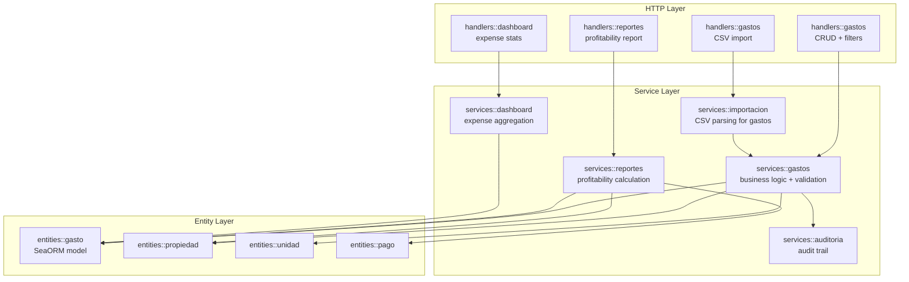

# Design Document: Gastos (Expenses Tracking)

## Overview

This feature adds expense (gasto) tracking to the property management system. Currently the system tracks income via `pagos` (rent payments tied to contracts) but has no way to record property-related costs. Gastos will be tied to a `propiedad` and optionally to a specific `unidad`, categorized by type (`mantenimiento`, `impuestos`, `seguros`, etc.), and integrated into profitability reports showing net income per property.

The design follows the existing layered architecture (handlers → services → entities) and mirrors the patterns established by the `pagos` module: SeaORM entity, CRUD service with audit trail, paginated list with filters, CSV import via the existing `importacion` pattern, and PDF/XLSX export via `genpdf`/`rust_xlsxwriter`.

## Architecture



### Key Design Decisions

1. **Gastos are tied to `propiedad`, not `contrato`**: Expenses like property taxes, insurance, and maintenance exist independently of any lease contract. The optional `unidad_id` allows unit-level cost tracking for multi-unit properties.

2. **Reuse existing import infrastructure**: The CSV import for gastos follows the same `parse_csv_rows` / column-index pattern from `services::importacion`, extended with gasto-specific columns and validation.

3. **Profitability report extends existing reportes module**: Rather than creating a separate reporting service, the profitability calculation is added to `services::reportes` alongside the existing `generar_reporte_ingresos`. This keeps all financial reporting in one place.

4. **Dashboard integration via existing `DashboardStats`**: The `total_gastos_mes` field is added to the existing `DashboardStats` struct, and a new `gastos_comparacion` endpoint mirrors the existing `ingresos_comparacion` pattern.

## Components and Interfaces

### New Files

| Layer | File | Purpose |
|-------|------|---------|
| Entity | `backend/src/entities/gasto.rs` | SeaORM entity for `gastos` table |
| Service | `backend/src/services/gastos.rs` | CRUD + validation + category summary |
| Handler | `backend/src/handlers/gastos.rs` | HTTP endpoints for gastos |
| DTO | `backend/src/models/gasto.rs` | Request/response types |
| Migration | `backend/migrations/m20250412_000001_create_gastos.rs` | Database schema |

### Modified Files

| File | Change |
|------|--------|
| `backend/src/entities/mod.rs` | Add `pub mod gasto;` |
| `backend/src/services/mod.rs` | Add `pub mod gastos;` |
| `backend/src/handlers/mod.rs` | Add `pub mod gastos;` |
| `backend/src/models/mod.rs` | Add `pub mod gasto;` |
| `backend/src/routes.rs` | Add `/gastos` scope, profitability routes, dashboard expense routes, import route |
| `backend/src/services/dashboard.rs` | Add `total_gastos_mes` to `DashboardStats`, add `gastos_comparacion` function |
| `backend/src/models/dashboard.rs` | Add `GastosComparacion` DTO |
| `backend/src/services/reportes.rs` | Add `generar_reporte_rentabilidad`, `exportar_rentabilidad_pdf`, `exportar_rentabilidad_xlsx` |
| `backend/src/models/reporte.rs` | Add `RentabilidadReportQuery`, `RentabilidadReportRow`, `RentabilidadReportSummary` |
| `backend/src/services/importacion.rs` | Add `importar_gastos` function |
| `backend/src/handlers/importacion.rs` | Add `importar_gastos` handler |
| `backend/migrations/mod.rs` | Register new migration |

### API Endpoints

```
# CRUD
POST   /api/gastos                          → create (WriteAccess)
GET    /api/gastos                          → list (Claims - any authenticated)
GET    /api/gastos/{id}                     → get_by_id (Claims)
PUT    /api/gastos/{id}                     → update (WriteAccess)
DELETE /api/gastos/{id}                     → delete (WriteAccess)

# Category summary
GET    /api/gastos/resumen-categorias       → category summary (Claims)

# Profitability report
GET    /api/reportes/rentabilidad           → profitability JSON (Claims)
GET    /api/reportes/rentabilidad/pdf       → profitability PDF (Claims)
GET    /api/reportes/rentabilidad/xlsx      → profitability XLSX (Claims)

# Dashboard
GET    /api/dashboard/gastos-comparacion    → monthly expense comparison (Claims)

# Import
POST   /api/importar/gastos                → CSV import (WriteAccess)
```

### Service Interfaces

```rust
// services::gastos
pub async fn create<C: ConnectionTrait>(db: &C, input: CreateGastoRequest, usuario_id: Uuid) -> Result<GastoResponse, AppError>;
pub async fn get_by_id(db: &DatabaseConnection, id: Uuid) -> Result<GastoResponse, AppError>;
pub async fn list(db: &DatabaseConnection, query: GastoListQuery) -> Result<PaginatedResponse<GastoResponse>, AppError>;
pub async fn update<C: ConnectionTrait>(db: &C, id: Uuid, input: UpdateGastoRequest, usuario_id: Uuid) -> Result<GastoResponse, AppError>;
pub async fn delete<C: ConnectionTrait>(db: &C, id: Uuid, usuario_id: Uuid) -> Result<(), AppError>;
pub async fn resumen_categorias(db: &DatabaseConnection, query: ResumenCategoriasQuery) -> Result<Vec<ResumenCategoriaRow>, AppError>;

// services::reportes (additions)
pub async fn generar_reporte_rentabilidad(db: &DatabaseConnection, query: RentabilidadReportQuery, generated_by: String) -> Result<RentabilidadReportSummary, AppError>;
pub fn exportar_rentabilidad_pdf(summary: &RentabilidadReportSummary) -> Result<Vec<u8>, AppError>;
pub fn exportar_rentabilidad_xlsx(summary: &RentabilidadReportSummary) -> Result<Vec<u8>, AppError>;

// services::dashboard (additions)
pub async fn gastos_comparacion(db: &DatabaseConnection) -> Result<GastosComparacion, AppError>;

// services::importacion (addition)
pub async fn importar_gastos(db: &DatabaseConnection, data: &[u8], formato: ImportFormat, usuario_id: Uuid) -> Result<ImportResult, AppError>;
```


## Data Models

### Database Schema: `gastos` Table

```sql
CREATE TABLE gastos (
    id                UUID PRIMARY KEY DEFAULT gen_random_uuid(),
    propiedad_id      UUID NOT NULL REFERENCES propiedades(id) ON DELETE RESTRICT ON UPDATE CASCADE,
    unidad_id         UUID REFERENCES unidades(id) ON DELETE SET NULL ON UPDATE CASCADE,
    categoria         VARCHAR(30) NOT NULL,
    descripcion       VARCHAR(500) NOT NULL,
    monto             DECIMAL(12,2) NOT NULL,
    moneda            VARCHAR(3) NOT NULL DEFAULT 'DOP',
    fecha_gasto       DATE NOT NULL,
    estado            VARCHAR(20) NOT NULL DEFAULT 'pendiente',
    proveedor         VARCHAR(200),
    numero_factura    VARCHAR(100),
    notas             TEXT,
    created_at        TIMESTAMP WITH TIME ZONE NOT NULL DEFAULT now(),
    updated_at        TIMESTAMP WITH TIME ZONE NOT NULL DEFAULT now()
);

-- Indexes
CREATE INDEX idx_gastos_propiedad_id ON gastos(propiedad_id);
CREATE INDEX idx_gastos_unidad_id ON gastos(unidad_id);
CREATE INDEX idx_gastos_categoria ON gastos(categoria);
CREATE INDEX idx_gastos_estado ON gastos(estado);
CREATE INDEX idx_gastos_fecha_gasto ON gastos(fecha_gasto);
```

### SeaORM Entity: `gasto.rs`

```rust
#[derive(Clone, Debug, PartialEq, DeriveEntityModel, Serialize, Deserialize)]
#[sea_orm(table_name = "gastos")]
#[serde(rename_all = "camelCase")]
pub struct Model {
    #[sea_orm(primary_key, auto_increment = false)]
    pub id: Uuid,
    pub propiedad_id: Uuid,
    pub unidad_id: Option<Uuid>,
    pub categoria: String,
    pub descripcion: String,
    #[sea_orm(column_type = "Decimal(Some((12, 2)))")]
    pub monto: Decimal,
    pub moneda: String,
    pub fecha_gasto: Date,
    pub estado: String,
    pub proveedor: Option<String>,
    pub numero_factura: Option<String>,
    #[sea_orm(column_type = "Text", nullable)]
    pub notas: Option<String>,
    pub created_at: DateTimeWithTimeZone,
    pub updated_at: DateTimeWithTimeZone,
}
```

Relations: `belongs_to` Propiedad (via `propiedad_id`), `belongs_to` Unidad (via `unidad_id`, nullable).

### DTOs: `models/gasto.rs`

```rust
// Request
pub struct CreateGastoRequest {
    pub propiedad_id: Uuid,
    pub unidad_id: Option<Uuid>,
    pub categoria: String,
    pub descripcion: String,
    pub monto: Decimal,
    pub moneda: String,
    pub fecha_gasto: NaiveDate,
    pub proveedor: Option<String>,
    pub numero_factura: Option<String>,
    pub notas: Option<String>,
}

pub struct UpdateGastoRequest {
    pub categoria: Option<String>,
    pub descripcion: Option<String>,
    pub monto: Option<Decimal>,
    pub moneda: Option<String>,
    pub fecha_gasto: Option<NaiveDate>,
    pub unidad_id: Option<Uuid>,
    pub proveedor: Option<String>,
    pub numero_factura: Option<String>,
    pub estado: Option<String>,
    pub notas: Option<String>,
}

pub struct GastoListQuery {
    pub propiedad_id: Option<Uuid>,
    pub unidad_id: Option<Uuid>,
    pub categoria: Option<String>,
    pub estado: Option<String>,
    pub fecha_desde: Option<NaiveDate>,
    pub fecha_hasta: Option<NaiveDate>,
    pub page: Option<u64>,
    pub per_page: Option<u64>,
}

pub struct ResumenCategoriasQuery {
    pub propiedad_id: Uuid,
    pub fecha_desde: Option<NaiveDate>,
    pub fecha_hasta: Option<NaiveDate>,
}

// Response
pub struct GastoResponse {
    pub id: Uuid,
    pub propiedad_id: Uuid,
    pub unidad_id: Option<Uuid>,
    pub categoria: String,
    pub descripcion: String,
    pub monto: Decimal,
    pub moneda: String,
    pub fecha_gasto: NaiveDate,
    pub estado: String,
    pub proveedor: Option<String>,
    pub numero_factura: Option<String>,
    pub notas: Option<String>,
    pub created_at: DateTime<Utc>,
    pub updated_at: DateTime<Utc>,
}

pub struct ResumenCategoriaRow {
    pub categoria: String,
    pub total: Decimal,
    pub cantidad: u64,
}
```

### Profitability Report DTOs: `models/reporte.rs` (additions)

```rust
pub struct RentabilidadReportQuery {
    pub mes: u32,
    pub anio: i32,
    pub propiedad_id: Option<Uuid>,
}

pub struct RentabilidadReportRow {
    pub propiedad_id: Uuid,
    pub propiedad_titulo: String,
    pub total_ingresos: Decimal,
    pub total_gastos: Decimal,
    pub ingreso_neto: Decimal,
    pub moneda: String,
}

pub struct RentabilidadReportSummary {
    pub rows: Vec<RentabilidadReportRow>,
    pub total_ingresos: Decimal,
    pub total_gastos: Decimal,
    pub total_neto: Decimal,
    pub mes: u32,
    pub anio: i32,
    pub generated_at: DateTime<Utc>,
    pub generated_by: String,
}
```

### Dashboard DTOs: `models/dashboard.rs` (additions)

```rust
pub struct GastosComparacion {
    pub mes_actual: Decimal,
    pub mes_anterior: Decimal,
    pub porcentaje_cambio: f64,
}
```

### Validation Constants

```rust
const CATEGORIAS_GASTO: &[&str] = &[
    "mantenimiento", "impuestos", "seguros", "servicios_publicos",
    "administracion", "legal", "mejoras", "otro",
];
const ESTADOS_GASTO: &[&str] = &["pendiente", "pagado", "cancelado"];
const MONEDAS: &[&str] = &["DOP", "USD"];
```


## Correctness Properties

*A property is a characteristic or behavior that should hold true across all valid executions of a system — essentially, a formal statement about what the system should do. Properties serve as the bridge between human-readable specifications and machine-verifiable correctness guarantees.*

### Property 1: Create-then-read round trip

*For any* valid `CreateGastoRequest` with an existing `propiedad_id`, valid `categoria`, valid `moneda`, and positive `monto`, creating the gasto and then retrieving it by ID should return a `GastoResponse` where all input fields match, `estado` equals `"pendiente"`, and `id` is a valid non-nil UUID.

**Validates: Requirements 1.1, 1.9, 2.5**

### Property 2: Required field validation rejects incomplete payloads

*For any* `CreateGastoRequest` where one or more of the required fields (`propiedad_id`, `categoria`, `descripcion`, `monto`, `moneda`, `fecha_gasto`) is missing, the system should return a validation error (HTTP 422) and no gasto record should be created.

**Validates: Requirements 1.2, 1.11**

### Property 3: Optional fields accepted in any combination

*For any* valid required fields and any combination of optional fields (`unidad_id`, `proveedor`, `numero_factura`, `notas`) being present or absent, creation should succeed and the returned `GastoResponse` should reflect the provided optional values (or null when absent).

**Validates: Requirements 1.3**

### Property 4: Non-existent ID returns not-found

*For any* random UUID that does not correspond to an existing record, calling get-by-id, update, or delete on that UUID should return a not-found error. Additionally, creating a gasto with a `propiedad_id` that does not exist should return a not-found error.

**Validates: Requirements 1.4, 2.6, 3.6, 4.3**

### Property 5: Unidad must belong to propiedad

*For any* gasto create or update operation that specifies a `unidad_id`, if that unidad does not belong to the gasto's `propiedad_id`, the system should return a validation error and the operation should not succeed.

**Validates: Requirements 1.5, 3.3**

### Property 6: Enum validation rejects invalid values

*For any* string value not in the allowed set for `categoria` (valid: `mantenimiento`, `impuestos`, `seguros`, `servicios_publicos`, `administracion`, `legal`, `mejoras`, `otro`), `moneda` (valid: `DOP`, `USD`), `estado` (valid: `pendiente`, `pagado`, `cancelado`), or any `monto` value ≤ 0, the create or update operation should return a validation error.

**Validates: Requirements 1.6, 1.7, 1.8, 3.4**

### Property 7: List filters return only matching records

*For any* filter applied to the gasto list endpoint (`propiedad_id`, `unidad_id`, `categoria`, `estado`, `fecha_desde`, `fecha_hasta`), every record in the response should satisfy the filter condition. Specifically, for date range filters, every returned gasto's `fecha_gasto` should be ≥ `fecha_desde` and ≤ `fecha_hasta` (inclusive).

**Validates: Requirements 2.2, 2.3, 2.4**

### Property 8: Partial update preserves unchanged fields

*For any* existing gasto and any `UpdateGastoRequest` containing a subset of updatable fields, after the update, the fields included in the request should reflect the new values, and all fields not included in the request should remain unchanged from their pre-update values.

**Validates: Requirements 3.1, 3.2**

### Property 9: Delete removes record

*For any* existing gasto, deleting it should succeed (HTTP 204), and a subsequent get-by-id for that gasto should return not-found (HTTP 404).

**Validates: Requirements 4.1**

### Property 10: Category summary only includes paid expenses

*For any* set of gastos associated with a propiedad where some have `estado = "pagado"` and others have `estado = "pendiente"` or `"cancelado"`, the category summary totals should only include amounts from gastos where `estado = "pagado"`. The sum of all category row totals should equal the sum of individual `monto` values of paid gastos.

**Validates: Requirements 5.1, 5.3**

### Property 11: Category summary sorted by total descending

*For any* category summary result with multiple categories, each row's `total` should be greater than or equal to the next row's `total`.

**Validates: Requirements 5.4**

### Property 12: Profitability net income invariant

*For any* property in the profitability report, `ingreso_neto` should equal `total_ingresos - total_gastos`. The report-level `total_neto` should equal `total_ingresos - total_gastos` summed across all rows.

**Validates: Requirements 6.1**

### Property 13: Profitability propiedad_id filter

*For any* profitability report requested with a `propiedad_id` filter, all rows in the result should have that `propiedad_id`.

**Validates: Requirements 6.3**

### Property 14: CSV import valid/invalid row accounting

*For any* CSV file with a mix of valid and invalid rows, `exitosos + len(fallidos)` should equal `total_filas`, each error in `fallidos` should reference a valid row number, and the number of gasto records created should equal `exitosos`.

**Validates: Requirements 8.4, 8.5**

### Property 15: Percentage change calculation

*For any* two non-negative expense totals (current month, previous month), the `porcentaje_cambio` should equal `((mes_actual - mes_anterior) / mes_anterior) * 100` when `mes_anterior > 0`, and should be `0.0` when `mes_anterior == 0` and `mes_actual == 0`, or `100.0` when `mes_anterior == 0` and `mes_actual > 0`.

**Validates: Requirements 9.2**

## Error Handling

All errors follow the existing `AppError` pattern in `backend/src/errors.rs`:

| Scenario | Error Variant | HTTP Status | Example Message |
|----------|--------------|-------------|-----------------|
| Missing/invalid required field | `AppError::Validation` | 422 | `"El campo 'descripcion' es requerido"` |
| Invalid enum value | `AppError::Validation` | 422 | `"Valor inválido para categoria: 'xyz'. Valores permitidos: mantenimiento, impuestos, ..."` |
| Monto ≤ 0 | `AppError::Validation` | 422 | `"El monto debe ser mayor que cero"` |
| Unidad doesn't belong to propiedad | `AppError::Validation` | 422 | `"La unidad no pertenece a la propiedad especificada"` |
| Propiedad not found | `AppError::NotFound` | 404 | `"Propiedad no encontrada"` |
| Gasto not found | `AppError::NotFound` | 404 | `"Gasto no encontrado"` |
| Visualizador attempts write | `AppError::Forbidden` | 403 | `"Acceso denegado"` |
| Empty CSV / no valid rows | `AppError::Validation` | 422 | `"El archivo CSV está vacío o no contiene filas válidas"` |
| Invalid CSV format | `AppError::Validation` | 422 | `"Formato de archivo inválido"` |
| Database error | `AppError::Internal` | 500 | `"Error interno del servidor"` |

All error messages are in Spanish, consistent with the existing codebase convention.

## Testing Strategy

### Property-Based Tests

Property-based tests use the `proptest` crate (already in `dev-dependencies`). Each test runs a minimum of 100 iterations.

Tests will be placed in `backend/tests/gastos_pbt.rs` and focus on the service layer (pure business logic), using mock database state where needed.

Key property tests to implement:
- **Property 1**: Create-then-read round trip via service layer
- **Property 6**: Enum validation rejects arbitrary strings not in allowed sets
- **Property 8**: Partial update preserves unchanged fields
- **Property 10**: Category summary only includes paid expenses
- **Property 11**: Category summary sorted descending
- **Property 12**: Profitability net income invariant (`ingreso_neto == total_ingresos - total_gastos`)
- **Property 14**: CSV import row accounting (`exitosos + fallidos == total_filas`)
- **Property 15**: Percentage change calculation correctness

Tag format: `// Feature: gastos-expenses-tracking, Property {N}: {title}`

### Unit Tests

Placed in `#[cfg(test)]` modules within each source file:

- `services/gastos.rs`: Validation logic (enum checks, monto > 0, Model → Response conversion)
- `services/reportes.rs`: PDF/XLSX export produces valid bytes, empty report handling
- `services/dashboard.rs`: Percentage change edge cases (zero previous month)
- `models/gasto.rs`: Serde deserialization of camelCase request bodies, serialization of responses

### Integration Tests

Placed in `backend/tests/gastos_tests.rs`:

- Full CRUD cycle: create → get → update → delete with HTTP status verification
- RBAC: visualizador can read (200) but cannot create/update/delete (403)
- Pagination: verify `total`, `page`, `perPage` fields
- Filters: propiedad_id, categoria, date range
- CSV import: valid file, mixed valid/invalid rows, empty file
- Audit trail: verify entries created for each CUD operation
- Dashboard stats: `total_gastos_mes` present in response
- Profitability report: JSON, PDF, XLSX endpoints return correct status codes
