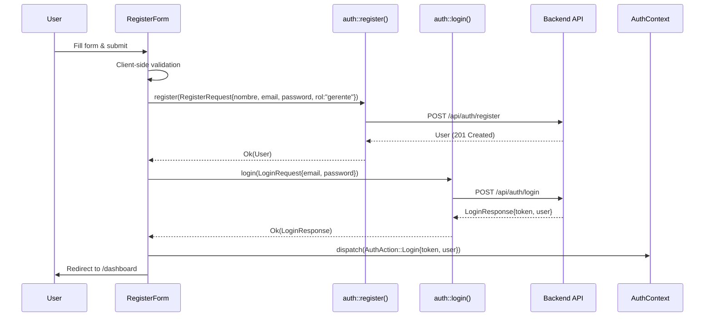

# Design: Landlord Registration

## Overview

This feature adds a self-registration page to the Yew frontend, allowing landlords to create accounts with the `gerente` role. The backend `POST /api/auth/register` endpoint and the frontend `register()` service function already exist — this feature is purely a frontend addition: a new route (`/registro`), a registration page, and a registration form component.

After successful registration, the system automatically logs the user in and redirects to the dashboard, providing a seamless onboarding experience.

## Architecture

No backend changes are required. The feature adds three frontend artifacts that integrate with existing infrastructure:

```
Frontend Changes
├── Route: /registro → RegistroPage (public, no auth required)
├── Page: frontend/src/pages/registro.rs
│   └── Renders RegisterForm, redirects if already authenticated
├── Component: frontend/src/components/auth/register_form.rs
│   └── Form with client-side validation, calls register() then login()
└── Modified Files
    ├── frontend/src/app.rs — Add Route::Registro variant + switch arm
    ├── frontend/src/pages/mod.rs — Add pub mod registro
    ├── frontend/src/components/auth/mod.rs — Add pub mod register_form
    └── frontend/src/pages/login.rs — Add registration link
```

### Request Flow



## Components and Interfaces

### Route Addition

Add a `Registro` variant to the existing `Route` enum in `app.rs`:

```rust
#[derive(Clone, Routable, PartialEq)]
pub enum Route {
    #[at("/")]
    Login,
    #[at("/registro")]
    Registro,
    // ... existing routes
}
```

The `switch` function maps `Route::Registro` to `<Registro />` without `ProtectedRoute` wrapping (public access).

### RegistroPage (`frontend/src/pages/registro.rs`)

A page component that:
- Checks `is_authenticated()` on mount and redirects to `/dashboard` if true
- Renders the `RegisterForm` component inside a centered card layout matching the login page style
- Receives `on_success: Callback<LoginResponse>` result from the form and dispatches `AuthAction::Login` to the `AuthContext`

### RegisterForm (`frontend/src/components/auth/register_form.rs`)

Props:
```rust
#[derive(Properties, PartialEq)]
pub struct RegisterFormProps {
    pub on_success: Callback<LoginResponse>,
}
```

State hooks:
- `nombre: UseStateHandle<String>`
- `email: UseStateHandle<String>`
- `password: UseStateHandle<String>`
- `confirm_password: UseStateHandle<String>`
- `nombre_error: UseStateHandle<Option<String>>`
- `email_error: UseStateHandle<Option<String>>`
- `password_error: UseStateHandle<Option<String>>`
- `confirm_error: UseStateHandle<Option<String>>`
- `server_error: UseStateHandle<Option<String>>`
- `loading: UseStateHandle<bool>`

Validation rules (executed on submit, before API call):
| Field | Rule | Error message |
|-------|------|---------------|
| nombre | `trim().is_empty()` | "El nombre es obligatorio" |
| email | `trim().is_empty() \|\| !contains('@')` | "Correo electrónico inválido" |
| password | `len() < 8` | "La contraseña debe tener al menos 8 caracteres" |
| confirm_password | `!= password` | "Las contraseñas no coinciden" |

Submission flow:
1. Run validation; abort if any errors
2. Set `loading = true`, button text → "Registrando..."
3. Call `auth::register(RegisterRequest { nombre, email, password, rol: "gerente".into() })`
4. On success: call `auth::login(LoginRequest { email, password })`
5. On login success: emit `on_success` callback with `LoginResponse`
6. On any error: set `server_error` with appropriate message, set `loading = false`

Error mapping:
- Response containing "ya está registrado" or 409 → "Este correo electrónico ya está registrado"
- Network error (gloo-net error) → "Error de conexión. Intente nuevamente."
- Other server errors → display the error string from the API

### Login Page Modification

Add a `<Link<Route>>` to `Route::Registro` below the `LoginForm` in `login.rs` with text "¿No tienes cuenta? Regístrate".

### Existing Types Used (no changes needed)

- `RegisterRequest` — `{ nombre, email, password, rol }` (already in `frontend/src/types/usuario.rs`)
- `LoginRequest` — `{ email, password }` (already in `frontend/src/types/usuario.rs`)
- `LoginResponse` — `{ token, user }` (already in `frontend/src/types/usuario.rs`)
- `User` — `{ id, nombre, email, rol, activo, created_at }` (already in `frontend/src/types/usuario.rs`)
- `auth::register()` — already in `frontend/src/services/auth.rs`
- `auth::login()` — already in `frontend/src/services/auth.rs`
- `ErrorBanner` — already in `frontend/src/components/common/error_banner.rs`

## Data Models

No new data models are required. The feature uses existing types exclusively:

- `RegisterRequest` (frontend) → serialized as JSON `{ nombre, email, password, rol }` with `camelCase` field names
- Backend `RegisterRequest` (backend) → deserialized with `camelCase` via `#[serde(rename_all = "camelCase")]`
- The `rol` field is hardcoded to `"gerente"` in the frontend form — never exposed to the user

The backend `register` service already handles:
- Email uniqueness check (returns 409 Conflict if duplicate)
- Argon2 password hashing
- UUID generation for user ID
- Timestamp generation for `created_at` / `updated_at`


## Correctness Properties

*A property is a characteristic or behavior that should hold true across all valid executions of a system — essentially, a formal statement about what the system should do. Properties serve as the bridge between human-readable specifications and machine-verifiable correctness guarantees.*

### Property 1: Nombre validation rejects empty input

*For any* string, if the trimmed string is empty then the nombre validation function SHALL return the error "El nombre es obligatorio", and if the trimmed string is non-empty then it SHALL return no error.

**Validates: Requirements 3.1**

### Property 2: Email validation rejects missing "@"

*For any* string, if the trimmed string is empty or does not contain the "@" character then the email validation function SHALL return the error "Correo electrónico inválido", and if the trimmed string is non-empty and contains "@" then it SHALL return no error.

**Validates: Requirements 3.2**

### Property 3: Password validation enforces minimum length

*For any* string, if its length is less than 8 then the password validation function SHALL return the error "La contraseña debe tener al menos 8 caracteres", and if its length is 8 or greater then it SHALL return no error.

**Validates: Requirements 3.3**

### Property 4: Confirm password validation rejects mismatches

*For any* two strings `password` and `confirm`, if they are not equal then the confirm-password validation function SHALL return the error "Las contraseñas no coinciden", and if they are equal then it SHALL return no error.

**Validates: Requirements 3.4**

### Property 5: Valid inputs produce correct request; invalid inputs block submission

*For any* combination of nombre, email, password, and confirm_password values: if all four fields pass their respective validation rules then the form SHALL produce a `RegisterRequest` with `rol` set to `"gerente"`, `nombre` matching the input nombre, `email` matching the input email, and `password` matching the input password. If any field fails validation then the form SHALL not produce a request.

**Validates: Requirements 3.5, 4.1, 7.1**

### Property 6: Auto-login uses submitted credentials

*For any* valid registration that succeeds, the subsequent login call SHALL use the same email and password that were submitted in the registration form.

**Validates: Requirements 4.3**

### Property 7: Server error messages are displayed verbatim

*For any* non-empty error string returned by the registration API (excluding 409 conflicts and network errors), the error banner SHALL display that exact string to the user.

**Validates: Requirements 5.2**

## Error Handling

| Scenario | Detection | User-Facing Message | Recovery |
|----------|-----------|-------------------|----------|
| Empty nombre | Client-side validation on submit | "El nombre es obligatorio" | Inline error below field; user corrects and resubmits |
| Invalid email | Client-side validation on submit | "Correo electrónico inválido" | Inline error below field |
| Password too short | Client-side validation on submit | "La contraseña debe tener al menos 8 caracteres" | Inline error below field |
| Passwords don't match | Client-side validation on submit | "Las contraseñas no coinciden" | Inline error below field |
| Duplicate email (409) | API response status/body contains conflict indicator | "Este correo electrónico ya está registrado" | Error banner with close button; user changes email |
| Other server error | API returns non-2xx response | Server error message displayed verbatim | Error banner with close button |
| Network failure | `gloo-net` request fails to send | "Error de conexión. Intente nuevamente." | Error banner with close button; user retries |
| Auto-login fails after registration | Login API call fails | Server error message displayed | Error banner; user can navigate to login page manually |

All error banners use the existing `ErrorBanner` component which includes a close button (`×`) with `aria-label="Cerrar"`.

The submit button is re-enabled and text reverts to "Registrarse" after any error, allowing the user to retry.

## Testing Strategy

### Unit Tests (Example-Based)

Unit tests cover specific scenarios, UI rendering, and integration points:

- Route `/registro` renders the registration page
- Registration page redirects authenticated users to dashboard
- Form renders all four input fields with Spanish labels
- Form renders "Registrarse" submit button
- Form renders link to login page with correct text
- No role selection field is rendered
- Loading state disables button and shows "Registrando..."
- 409 error displays "Este correo electrónico ya está registrado"
- Network error displays "Error de conexión. Intente nuevamente."
- Error banner close button dismisses the error
- Successful registration + login stores token and redirects to dashboard
- Login page displays "¿No tienes cuenta? Regístrate" link

### Property-Based Tests

Property-based tests verify universal validation and submission properties using the `proptest` crate. Each test runs a minimum of 100 iterations.

The validation logic should be extracted into pure functions (e.g., `validate_nombre`, `validate_email`, `validate_password`, `validate_confirm_password`, `validate_form`) to enable direct property-based testing without UI rendering overhead.

| Property | Test Description | Tag |
|----------|-----------------|-----|
| Property 1 | Generate random strings; verify nombre validation returns error iff trimmed input is empty | Feature: landlord-registration, Property 1: Nombre validation rejects empty input |
| Property 2 | Generate random strings; verify email validation returns error iff trimmed input is empty or missing "@" | Feature: landlord-registration, Property 2: Email validation rejects missing "@" |
| Property 3 | Generate random strings; verify password validation returns error iff length < 8 | Feature: landlord-registration, Property 3: Password validation enforces minimum length |
| Property 4 | Generate random string pairs; verify confirm validation returns error iff strings differ | Feature: landlord-registration, Property 4: Confirm password validation rejects mismatches |
| Property 5 | Generate random form inputs; verify valid inputs produce RegisterRequest with rol="gerente" and correct fields, invalid inputs produce None | Feature: landlord-registration, Property 5: Valid inputs produce correct request; invalid inputs block submission |
| Property 6 | Generate random valid credentials; mock register success; verify login called with same email and password | Feature: landlord-registration, Property 6: Auto-login uses submitted credentials |
| Property 7 | Generate random non-empty error strings; mock register failure; verify error banner displays the exact string | Feature: landlord-registration, Property 7: Server error messages are displayed verbatim |

### Testing Library

- `proptest` — property-based testing framework for Rust, already well-suited for the Yew/WASM ecosystem
- Each property test configured with `proptest! { #![proptest_config(ProptestConfig::with_cases(100))] ... }`
- Tests placed in `frontend/tests/` following the project convention
