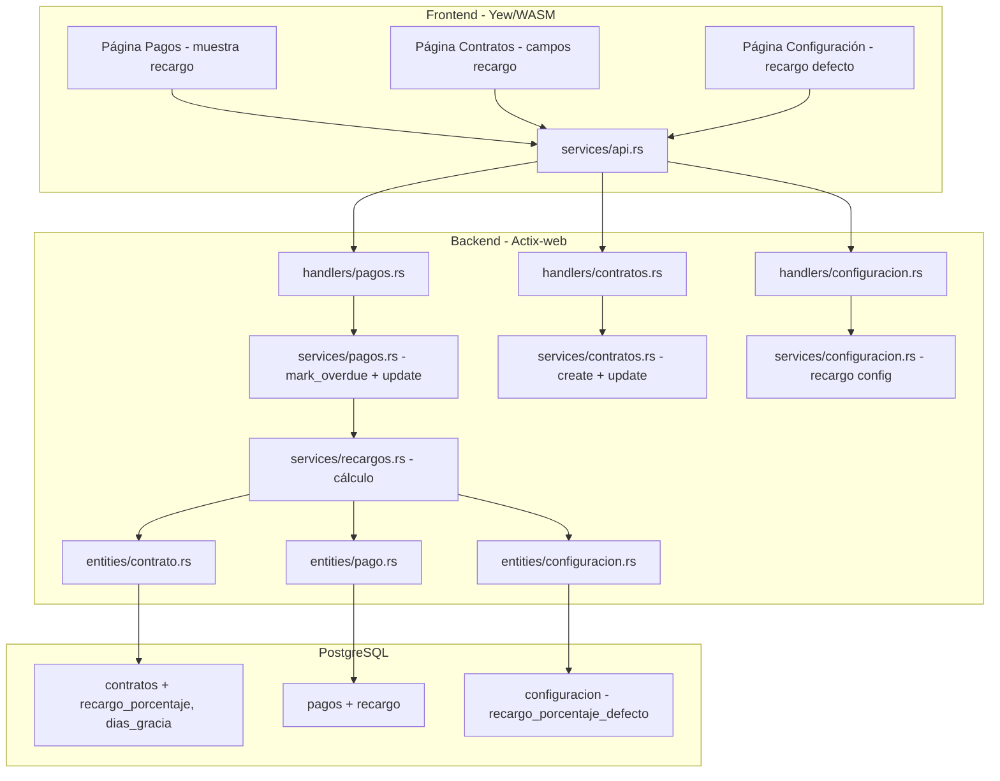
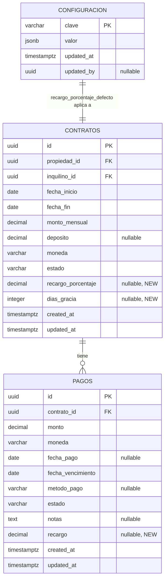

# Diseño — Recargos por Mora (Late Fees)

## Overview

Este módulo agrega recargos por mora al sistema de gestión inmobiliaria. Permite configurar un porcentaje de recargo a nivel de organización (por defecto) y a nivel de contrato (override), definir un período de gracia por contrato, calcular automáticamente el recargo cuando un pago se marca como atrasado, y mostrar el recargo en la interfaz.

Los cambios son quirúrgicos: se agregan dos columnas a `contratos`, una columna a `pagos`, un nuevo registro en `configuracion`, y se modifica la lógica existente de `mark_overdue` y `update` en el servicio de pagos. No se crean nuevas tablas ni nuevos endpoints REST (excepto dos endpoints de configuración de recargo).

## Architecture



El flujo de cálculo de recargo:
1. `mark_overdue` o `update` (estado → atrasado) detecta que un pago debe marcarse como atrasado.
2. Llama a `recargos::calcular_recargo(db, pago)` que resuelve el porcentaje efectivo (contrato → org → NULL).
3. Si hay porcentaje, calcula `monto * (porcentaje / 100)` y lo almacena en `pago.recargo`.

## Components and Interfaces

### Database Migrations

**Migration: `m20250615_000001_add_recargo_fields`**

Agrega columnas a tablas existentes:

```sql
-- Tabla contratos: campos de configuración de recargo
ALTER TABLE contratos ADD COLUMN recargo_porcentaje DECIMAL(5,2) NULL;
ALTER TABLE contratos ADD COLUMN dias_gracia INTEGER NULL;

-- Tabla pagos: campo de recargo calculado
ALTER TABLE pagos ADD COLUMN recargo DECIMAL(12,2) NULL;
```

No se necesitan índices adicionales — estos campos no se usan en filtros ni JOINs.

### Entity Changes

**`entities/contrato.rs`** — Agregar dos campos al Model:

```rust
#[sea_orm(column_type = "Decimal(Some((5, 2)))", nullable)]
pub recargo_porcentaje: Option<Decimal>,
pub dias_gracia: Option<i32>,
```

**`entities/pago.rs`** — Agregar un campo al Model:

```rust
#[sea_orm(column_type = "Decimal(Some((12, 2)))", nullable)]
pub recargo: Option<Decimal>,
```

### Service: `services/recargos.rs` (nuevo)

Módulo dedicado al cálculo de recargos. Funciones puras donde sea posible.

```rust
/// Resuelve el porcentaje de recargo efectivo: contrato > org > None
pub async fn resolver_porcentaje_recargo(
    db: &impl ConnectionTrait,
    contrato: &contrato::Model,
) -> Result<Option<Decimal>, AppError>

/// Calcula el recargo: monto * (porcentaje / 100), redondeado a 2 decimales.
/// Función pura, sin I/O.
pub fn calcular_recargo(monto: Decimal, porcentaje: Decimal) -> Decimal

/// Calcula y almacena el recargo en un pago atrasado.
/// Resuelve el porcentaje, calcula, y actualiza el pago.
pub async fn aplicar_recargo<C: ConnectionTrait>(
    db: &C,
    pago_id: Uuid,
    contrato: &contrato::Model,
) -> Result<Option<Decimal>, AppError>
```

La función `calcular_recargo` es pura y testeable con property-based tests.

`resolver_porcentaje_recargo` busca:
1. `contrato.recargo_porcentaje` — si es `Some`, lo retorna.
2. Si es `None`, busca `configuracion` con clave `recargo_porcentaje_defecto` y extrae el valor.
3. Si tampoco existe, retorna `None`.

### Service Changes: `services/pagos.rs`

**`mark_overdue`** — Modificar para:
1. Considerar `dias_gracia`: JOIN con `contratos` para obtener `dias_gracia`. Un pago se marca como atrasado solo si `today > fecha_vencimiento + dias_gracia` (o `today > fecha_vencimiento` si `dias_gracia` es NULL).
2. Después de marcar pagos como atrasados, para cada pago afectado, llamar a `recargos::aplicar_recargo` para calcular y almacenar el recargo.

La implementación cambia de un `update_many` masivo a un enfoque que:
1. Selecciona los pagos pendientes vencidos (considerando gracia) con JOIN a contratos.
2. Para cada pago, actualiza estado a "atrasado" y calcula el recargo.
3. Usa batch processing para eficiencia.

**`update`** — Modificar para:
1. Cuando `input.estado == Some("atrasado")` y el estado anterior no era "atrasado", calcular y almacenar el recargo.
2. Cuando el estado cambia de "atrasado" a otro estado, limpiar el recargo (set NULL).

### Service Changes: `services/configuracion.rs`

Agregar funciones para gestionar el recargo por defecto:

```rust
pub async fn obtener_recargo_defecto(db: &DatabaseConnection) -> Result<Option<Decimal>, AppError>
pub async fn actualizar_recargo_defecto(db: &DatabaseConnection, porcentaje: Decimal, updated_by: Uuid) -> Result<Decimal, AppError>
```

Sigue el mismo patrón de `obtener_moneda`/`actualizar_moneda` usando la tabla `configuracion` con clave `recargo_porcentaje_defecto`.

### Service Changes: `services/contratos.rs`

**`create`** — Agregar validación y almacenamiento de `recargo_porcentaje` y `dias_gracia`.
**`update`** — Agregar validación y actualización de `recargo_porcentaje` y `dias_gracia`.

Validaciones:
- `recargo_porcentaje`: si se proporciona, debe estar entre 0.00 y 100.00.
- `dias_gracia`: si se proporciona, debe ser >= 0.

### Model Changes

**`models/contrato.rs`**:
- `CreateContratoRequest`: agregar `recargo_porcentaje: Option<Decimal>`, `dias_gracia: Option<i32>`.
- `UpdateContratoRequest`: agregar `recargo_porcentaje: Option<Decimal>`, `dias_gracia: Option<i32>`.
- `ContratoResponse`: agregar `recargo_porcentaje: Option<Decimal>`, `dias_gracia: Option<i32>`.

**`models/pago.rs`**:
- `PagoResponse`: agregar `recargo: Option<Decimal>`.

**`models/configuracion.rs`** (nuevo o en `configuracion.rs` existente):
- `RecargoDefectoConfig`: struct con `porcentaje: Option<Decimal>`.
- `UpdateRecargoDefectoRequest`: struct con `porcentaje: Decimal`.

### Handler Changes

**`handlers/configuracion.rs`** — Agregar:
- `obtener_recargo_defecto(db, _claims)` → GET `/api/v1/configuracion/recargo`
- `actualizar_recargo_defecto(db, admin, body)` → PUT `/api/v1/configuracion/recargo`

### Route Changes

**`routes.rs`** — Agregar al scope `/configuracion`:
```rust
.route("/recargo", web::get().to(handlers::configuracion::obtener_recargo_defecto))
.route("/recargo", web::put().to(handlers::configuracion::actualizar_recargo_defecto))
```

### API Endpoints (nuevos)

| Método | Ruta | Auth | Descripción |
|--------|------|------|-------------|
| GET | `/api/v1/configuracion/recargo` | Claims | Obtener porcentaje de recargo por defecto |
| PUT | `/api/v1/configuracion/recargo` | AdminOnly | Actualizar porcentaje de recargo por defecto |

Los endpoints existentes de contratos y pagos se modifican para incluir los nuevos campos en request/response, sin cambiar las rutas.

### Frontend Changes

**`frontend/src/types/pago.rs`** — Agregar a `Pago`:
```rust
#[serde(default, deserialize_with = "deserialize_option_f64_from_any")]
pub recargo: Option<f64>,
```

**`frontend/src/types/contrato.rs`** — Agregar a `Contrato`, `CreateContrato`, `UpdateContrato`:
```rust
#[serde(default, deserialize_with = "deserialize_option_f64_from_any")]
pub recargo_porcentaje: Option<f64>,
pub dias_gracia: Option<i32>,
```

**`frontend/src/pages/pagos.rs`** — Modificar:
- En la tabla de listado, mostrar columna "Recargo" cuando el pago tiene recargo.
- En la vista de detalle, mostrar "Recargo" y "Monto Total" (monto + recargo).
- Formato de moneda con dos decimales.

**`frontend/src/pages/contratos.rs`** — Modificar:
- En el formulario de creación/edición, agregar campos "Porcentaje de Recargo (%)" y "Días de Gracia".
- En la vista de detalle, mostrar estos campos.
- Cuando `recargo_porcentaje` es NULL, mostrar "(usa valor por defecto de la organización)".

**`frontend/src/pages/configuracion.rs`** (o componente existente) — Modificar:
- Agregar sección "Recargo por Mora" con campo para el porcentaje por defecto.
- Solo editable por admin.

## Data Models

### Entity Changes Diagram



### Constantes de dominio

- **Clave configuración recargo**: `recargo_porcentaje_defecto`
- **Rango recargo_porcentaje**: 0.00 a 100.00 (DECIMAL(5,2))
- **Rango dias_gracia**: >= 0 (INTEGER)
- **Precisión recargo calculado**: DECIMAL(12,2)
- **Fórmula**: `recargo = monto * (recargo_porcentaje / 100)`

## Correctness Properties

### Property 1: Cálculo de recargo es correcto

*Para cualquier* monto `M` (DECIMAL(12,2), M > 0) y *para cualquier* porcentaje `P` (DECIMAL(5,2), 0 <= P <= 100), el recargo calculado debe ser igual a `M * P / 100` redondeado a 2 decimales. Esta es una función pura sin dependencias externas.

**Validates: Requirements 5.1, 5.3**

### Property 2: Round-trip de campos de contrato

*Para cualquier* contrato creado con `recargo_porcentaje` y `dias_gracia` válidos, al consultar el contrato por ID, los valores de `recargo_porcentaje` y `dias_gracia` en la respuesta deben coincidir con los valores enviados en la creación.

**Validates: Requirements 1.1, 1.2, 1.7**

### Property 3: Resolución de porcentaje — contrato tiene prioridad

*Para cualquier* contrato con `recargo_porcentaje` definido (no NULL) y *para cualquier* valor de `recargo_porcentaje_defecto` en la configuración de la organización, el porcentaje efectivo resuelto debe ser igual al `recargo_porcentaje` del contrato.

**Validates: Requirements 4.1**

### Property 4: Resolución de porcentaje — fallback a organización

*Para cualquier* contrato con `recargo_porcentaje` NULL y *para cualquier* valor de `recargo_porcentaje_defecto` definido en la configuración de la organización, el porcentaje efectivo resuelto debe ser igual al `recargo_porcentaje_defecto` de la organización.

**Validates: Requirements 4.2**

### Property 5: Resolución de porcentaje — ambos NULL produce None

*Para cualquier* contrato con `recargo_porcentaje` NULL y sin `recargo_porcentaje_defecto` en la configuración, el porcentaje efectivo resuelto debe ser `None`, y el recargo del pago debe permanecer NULL.

**Validates: Requirements 4.3, 5.4**

### Property 6: Validación de rango de recargo_porcentaje

*Para cualquier* valor decimal fuera del rango [0, 100], intentar crear o actualizar un contrato con ese valor como `recargo_porcentaje` debe retornar un error de validación (HTTP 422).

**Validates: Requirements 1.5, 3.2**

### Property 7: Validación de dias_gracia no negativo

*Para cualquier* valor entero negativo, intentar crear o actualizar un contrato con ese valor como `dias_gracia` debe retornar un error de validación (HTTP 422).

**Validates: Requirements 1.6**

### Property 8: Período de gracia retrasa el marcado de atraso

*Para cualquier* pago pendiente con `fecha_vencimiento` V y contrato con `dias_gracia` G (G > 0), si la fecha actual es <= V + G días, `mark_overdue` no debe cambiar el estado del pago a "atrasado". Si la fecha actual es > V + G días, `mark_overdue` debe cambiar el estado a "atrasado".

**Validates: Requirements 6.1, 6.2, 6.3**

### Property 9: Recargo se calcula al marcar como atrasado

*Para cualquier* pago marcado como "atrasado" (ya sea por `mark_overdue` o manualmente) cuyo contrato tiene un porcentaje de recargo efectivo `P` (no NULL), el campo `recargo` del pago debe ser igual a `monto * P / 100` redondeado a 2 decimales.

**Validates: Requirements 5.1, 5.2**

### Property 10: Recargo con porcentaje 0 produce 0.00

*Para cualquier* pago marcado como "atrasado" cuyo porcentaje de recargo efectivo es 0, el campo `recargo` del pago debe ser exactamente `0.00` (no NULL).

**Validates: Requirements 5.5**

## Error Handling

| Escenario | Error | HTTP Status |
|-----------|-------|-------------|
| recargo_porcentaje < 0 o > 100 (contrato) | `AppError::Validation("El porcentaje de recargo debe estar entre 0 y 100")` | 422 |
| dias_gracia < 0 (contrato) | `AppError::Validation("Los días de gracia deben ser mayor o igual a 0")` | 422 |
| recargo_porcentaje_defecto < 0 o > 100 (config) | `AppError::Validation("El porcentaje de recargo debe estar entre 0 y 100")` | 422 |
| No-admin intenta actualizar config recargo | `AppError::Forbidden` via `AdminOnly` extractor | 403 |
| Error de base de datos | `AppError::Internal` via `From<DbErr>` | 500 |

## Testing Strategy

### Unit Tests

Tests en `backend/src/services/recargos.rs` bajo `#[cfg(test)]`:
- `calcular_recargo` con valores conocidos (1000 * 5% = 50.00, 1500.50 * 10% = 150.05)
- `calcular_recargo` con porcentaje 0 → 0.00
- `calcular_recargo` con porcentaje 100 → monto completo

Tests en `backend/src/models/contrato.rs` bajo `#[cfg(test)]`:
- Serialización/deserialización de `CreateContratoRequest` con campos de recargo
- Serialización de `ContratoResponse` con campos de recargo

Tests en `backend/src/models/pago.rs` bajo `#[cfg(test)]`:
- Serialización de `PagoResponse` con campo recargo

### Property-Based Tests

Librería: `proptest` (ya en dev-dependencies).

| Property | Test | Descripción |
|----------|------|-------------|
| P1 | `test_calculo_recargo_correcto` | Genera monto y porcentaje aleatorios, verifica fórmula |
| P2 | `test_contrato_recargo_roundtrip` | Genera contratos con recargo_porcentaje y dias_gracia, verifica round-trip |
| P3 | `test_resolucion_contrato_prioridad` | Genera contrato con porcentaje + org default, verifica que usa contrato |
| P4 | `test_resolucion_fallback_org` | Genera contrato sin porcentaje + org default, verifica que usa org |
| P5 | `test_resolucion_ambos_null` | Genera contrato sin porcentaje + sin org default, verifica None |
| P6 | `test_validacion_rango_porcentaje` | Genera valores fuera de [0,100], verifica rechazo |
| P7 | `test_validacion_dias_gracia_negativo` | Genera enteros negativos, verifica rechazo |
| P8 | `test_periodo_gracia_retrasa_atraso` | Genera pagos con gracia, verifica que no se marcan dentro del período |
| P9 | `test_recargo_al_marcar_atrasado` | Genera pagos marcados atrasados, verifica cálculo |
| P10 | `test_recargo_porcentaje_cero` | Genera pagos con porcentaje 0, verifica recargo = 0.00 |

### Integration Tests

Archivo: `backend/tests/late_fees_tests.rs`

- CRUD de contrato con campos recargo_porcentaje y dias_gracia
- Configuración de recargo por defecto (GET/PUT)
- mark_overdue con y sin período de gracia
- mark_overdue con cálculo de recargo (contrato override y org default)
- Actualización manual de estado a "atrasado" con cálculo de recargo
- Validaciones de rango (porcentaje y días de gracia)
- Auditoría de cambios de configuración
