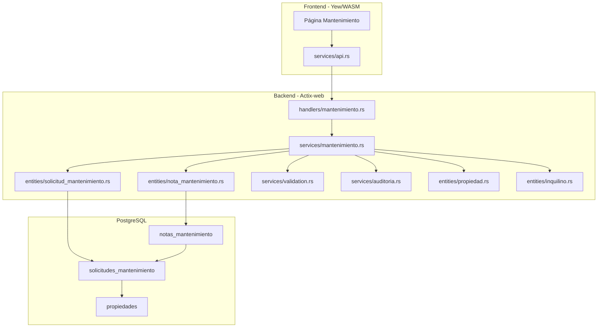
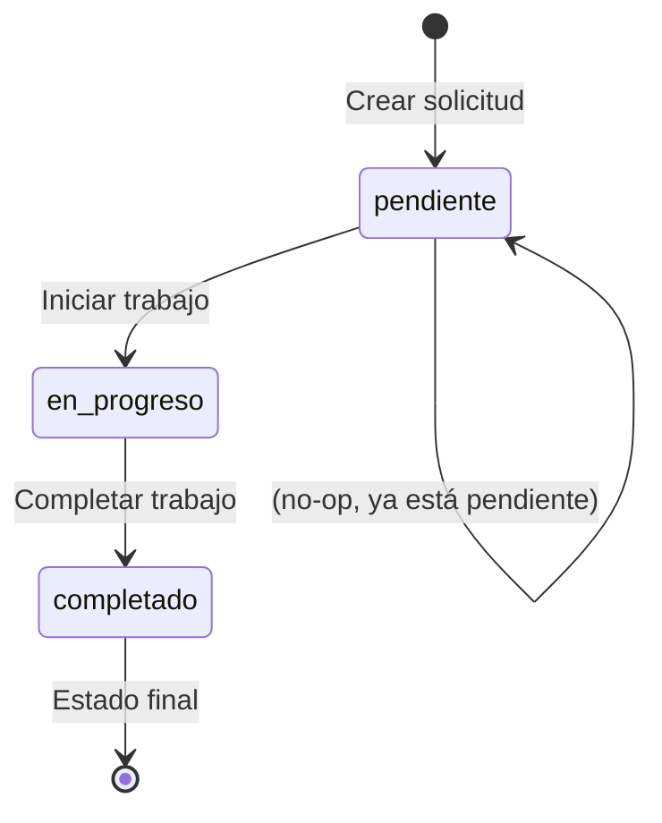
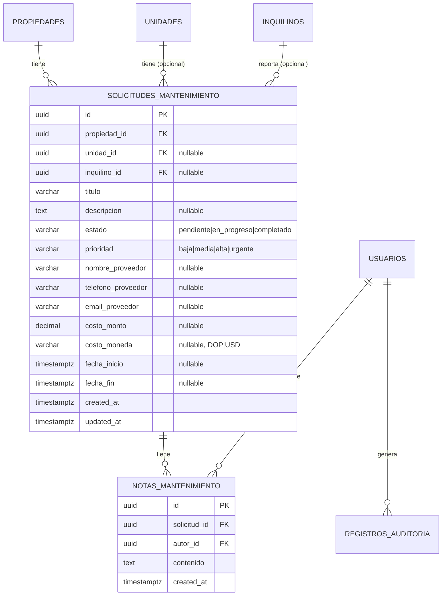

# Diseño — Solicitudes de Mantenimiento

## Overview

Este módulo agrega gestión de solicitudes de mantenimiento al sistema de administración inmobiliaria. Permite crear, listar, actualizar, cambiar estado, asignar proveedores, registrar costos, y agregar notas a solicitudes vinculadas a propiedades, unidades e inquilinos. Sigue la arquitectura existente: handlers → services → entities, con auditoría integrada y UI en español.

El diseño introduce dos nuevas tablas (`solicitudes_mantenimiento` y `notas_mantenimiento`), sus entidades SeaORM correspondientes, endpoints REST bajo `/api/mantenimiento`, un servicio con lógica de máquina de estados para transiciones de estado, y una página frontend Yew con listado, formulario, y vista de detalle.

## Architecture



El flujo sigue el patrón existente:
1. El handler recibe la request HTTP, extrae Claims/WriteAccess/AdminOnly, y delega al servicio.
2. El servicio ejecuta validaciones, lógica de negocio (máquina de estados), operaciones de base de datos, y registra auditoría.
3. Las entidades SeaORM mapean directamente a las tablas PostgreSQL.

## Components and Interfaces

### Database Migrations

Dos nuevas migraciones:

**Migration: `m20250411_000001_create_solicitudes_mantenimiento`**

Crea la tabla `solicitudes_mantenimiento` con:

| Columna | Tipo | Restricciones |
|---------|------|---------------|
| id | UUID | PK, DEFAULT gen_random_uuid() |
| propiedad_id | UUID | NOT NULL, FK → propiedades(id) |
| unidad_id | UUID | NULLABLE, FK → unidades(id) |
| inquilino_id | UUID | NULLABLE, FK → inquilinos(id) |
| titulo | VARCHAR(255) | NOT NULL |
| descripcion | TEXT | NULLABLE |
| estado | VARCHAR(20) | NOT NULL, DEFAULT 'pendiente' |
| prioridad | VARCHAR(20) | NOT NULL, DEFAULT 'media' |
| nombre_proveedor | VARCHAR(255) | NULLABLE |
| telefono_proveedor | VARCHAR(50) | NULLABLE |
| email_proveedor | VARCHAR(255) | NULLABLE |
| costo_monto | DECIMAL(12,2) | NULLABLE |
| costo_moneda | VARCHAR(3) | NULLABLE |
| fecha_inicio | TIMESTAMP WITH TIME ZONE | NULLABLE |
| fecha_fin | TIMESTAMP WITH TIME ZONE | NULLABLE |
| created_at | TIMESTAMP WITH TIME ZONE | NOT NULL, DEFAULT now() |
| updated_at | TIMESTAMP WITH TIME ZONE | NOT NULL, DEFAULT now() |

Índices:
- `idx_solicitudes_mant_propiedad_id` en `propiedad_id`
- `idx_solicitudes_mant_estado` en `estado`
- `idx_solicitudes_mant_prioridad` en `prioridad`
- `idx_solicitudes_mant_unidad_id` en `unidad_id`

**Migration: `m20250411_000002_create_notas_mantenimiento`**

Crea la tabla `notas_mantenimiento` con:

| Columna | Tipo | Restricciones |
|---------|------|---------------|
| id | UUID | PK, DEFAULT gen_random_uuid() |
| solicitud_id | UUID | NOT NULL, FK → solicitudes_mantenimiento(id) ON DELETE CASCADE |
| autor_id | UUID | NOT NULL, FK → usuarios(id) |
| contenido | TEXT | NOT NULL |
| created_at | TIMESTAMP WITH TIME ZONE | NOT NULL, DEFAULT now() |

Índices:
- `idx_notas_mant_solicitud_id` en `solicitud_id`

### SeaORM Entities

**`entities/solicitud_mantenimiento.rs`**

```rust
#[sea_orm(table_name = "solicitudes_mantenimiento")]
pub struct Model {
    #[sea_orm(primary_key, auto_increment = false)]
    pub id: Uuid,
    pub propiedad_id: Uuid,
    pub unidad_id: Option<Uuid>,
    pub inquilino_id: Option<Uuid>,
    pub titulo: String,
    pub descripcion: Option<String>,
    pub estado: String,
    pub prioridad: String,
    pub nombre_proveedor: Option<String>,
    pub telefono_proveedor: Option<String>,
    pub email_proveedor: Option<String>,
    pub costo_monto: Option<Decimal>,
    pub costo_moneda: Option<String>,
    pub fecha_inicio: Option<DateTimeWithTimeZone>,
    pub fecha_fin: Option<DateTimeWithTimeZone>,
    pub created_at: DateTimeWithTimeZone,
    pub updated_at: DateTimeWithTimeZone,
}
```

Relaciones: `belongs_to Propiedad`, `has_many NotaMantenimiento`.

**`entities/nota_mantenimiento.rs`**

```rust
#[sea_orm(table_name = "notas_mantenimiento")]
pub struct Model {
    #[sea_orm(primary_key, auto_increment = false)]
    pub id: Uuid,
    pub solicitud_id: Uuid,
    pub autor_id: Uuid,
    pub contenido: String,
    pub created_at: DateTimeWithTimeZone,
}
```

Relación: `belongs_to SolicitudMantenimiento`.

### API Endpoints

Todos bajo `/api/mantenimiento`:

| Método | Ruta | Auth | Handler | Descripción |
|--------|------|------|---------|-------------|
| GET | `/api/mantenimiento` | Claims | `list` | Listar solicitudes paginadas con filtros |
| GET | `/api/mantenimiento/{id}` | Claims | `get_by_id` | Detalle de solicitud con notas |
| POST | `/api/mantenimiento` | WriteAccess | `create` | Crear solicitud |
| PUT | `/api/mantenimiento/{id}` | WriteAccess | `update` | Actualizar solicitud |
| PUT | `/api/mantenimiento/{id}/estado` | WriteAccess | `cambiar_estado` | Cambiar estado (máquina de estados) |
| DELETE | `/api/mantenimiento/{id}` | AdminOnly | `delete` | Eliminar solicitud y notas |
| POST | `/api/mantenimiento/{id}/notas` | WriteAccess | `agregar_nota` | Agregar nota a solicitud |

### Request/Response Models

**`models/mantenimiento.rs`**

```rust
pub struct CreateSolicitudRequest {
    pub propiedad_id: Uuid,
    pub unidad_id: Option<Uuid>,
    pub inquilino_id: Option<Uuid>,
    pub titulo: String,
    pub descripcion: Option<String>,
    pub prioridad: Option<String>,
    pub nombre_proveedor: Option<String>,
    pub telefono_proveedor: Option<String>,
    pub email_proveedor: Option<String>,
    pub costo_monto: Option<Decimal>,
    pub costo_moneda: Option<String>,
}

pub struct UpdateSolicitudRequest {
    pub titulo: Option<String>,
    pub descripcion: Option<String>,
    pub prioridad: Option<String>,
    pub nombre_proveedor: Option<String>,
    pub telefono_proveedor: Option<String>,
    pub email_proveedor: Option<String>,
    pub costo_monto: Option<Decimal>,
    pub costo_moneda: Option<String>,
    pub unidad_id: Option<Uuid>,
    pub inquilino_id: Option<Uuid>,
}

pub struct CambiarEstadoRequest {
    pub estado: String,
}

pub struct CreateNotaRequest {
    pub contenido: String,
}

pub struct SolicitudListQuery {
    pub estado: Option<String>,
    pub prioridad: Option<String>,
    pub propiedad_id: Option<Uuid>,
    pub page: Option<u64>,
    pub per_page: Option<u64>,
}

pub struct SolicitudResponse {
    pub id: Uuid,
    pub propiedad_id: Uuid,
    pub unidad_id: Option<Uuid>,
    pub inquilino_id: Option<Uuid>,
    pub titulo: String,
    pub descripcion: Option<String>,
    pub estado: String,
    pub prioridad: String,
    pub nombre_proveedor: Option<String>,
    pub telefono_proveedor: Option<String>,
    pub email_proveedor: Option<String>,
    pub costo_monto: Option<Decimal>,
    pub costo_moneda: Option<String>,
    pub fecha_inicio: Option<DateTime<Utc>>,
    pub fecha_fin: Option<DateTime<Utc>>,
    pub notas: Option<Vec<NotaResponse>>,
    pub created_at: DateTime<Utc>,
    pub updated_at: DateTime<Utc>,
}

pub struct NotaResponse {
    pub id: Uuid,
    pub solicitud_id: Uuid,
    pub autor_id: Uuid,
    pub contenido: String,
    pub created_at: DateTime<Utc>,
}
```

Todos los structs usan `#[serde(rename_all = "camelCase")]` siguiendo el patrón existente.

### Service Layer

**`services/mantenimiento.rs`**

Funciones públicas:

- `create(db, input, usuario_id)` → Valida propiedad existe, valida unidad pertenece a propiedad (si se proporciona), valida inquilino existe (si se proporciona), valida prioridad, valida moneda y monto si se proporcionan, crea con estado `pendiente` y prioridad por defecto `media`, registra auditoría.
- `get_by_id(db, id)` → Busca solicitud, carga notas asociadas ordenadas por `created_at` DESC.
- `list(db, query)` → Lista paginada con filtros opcionales por estado, prioridad, propiedad_id. Ordenada por `created_at` DESC.
- `update(db, id, input, usuario_id)` → Actualiza campos proporcionados, valida prioridad si se cambia, valida moneda/monto si se cambian, registra auditoría.
- `cambiar_estado(db, id, nuevo_estado, usuario_id)` → Implementa máquina de estados, registra auditoría.
- `delete(db, id, usuario_id)` → Elimina solicitud (CASCADE elimina notas), registra auditoría.
- `agregar_nota(db, solicitud_id, contenido, usuario_id)` → Valida solicitud existe, valida contenido no vacío, crea nota, registra auditoría.

### State Machine Logic



Transiciones válidas:
- `pendiente` → `en_progreso`: Registra `fecha_inicio = now()`
- `en_progreso` → `completado`: Registra `fecha_fin = now()`

Transiciones inválidas (retornan HTTP 422):
- `pendiente` → `completado`: "La solicitud debe pasar por 'en_progreso' antes de completarse"
- `completado` → cualquier otro: "Las solicitudes completadas no pueden revertirse"
- `en_progreso` → `pendiente`: "No se puede revertir una solicitud en progreso a pendiente"

La validación se implementa como una función pura `validar_transicion(estado_actual: &str, nuevo_estado: &str) -> Result<(), AppError>` dentro del servicio.

### Handlers

**`handlers/mantenimiento.rs`**

Sigue el patrón exacto de `handlers/pagos.rs`:
- Cada handler es una función `async` que recibe `web::Data<DatabaseConnection>`, el extractor de auth apropiado, y los parámetros de la request.
- Las operaciones de escritura usan transacciones (`db.begin()` / `txn.commit()`).
- `create` retorna `HttpResponse::Created()`.
- `delete` retorna `HttpResponse::NoContent()`.
- Los demás retornan `HttpResponse::Ok()`.

### Frontend

**Ruta:** `/mantenimiento` → `Route::Mantenimiento`

**Página:** `frontend/src/pages/mantenimiento.rs`

Componente `Mantenimiento` que incluye:

1. **Vista de listado**: Tabla paginada con columnas (Propiedad, Título, Prioridad, Estado, Proveedor, Costo, Acciones). Filtros por estado y prioridad. Badges de color para prioridad (urgente=rojo, alta=naranja, media=amarillo, baja=verde) y estado (pendiente=warning, en_progreso=info, completado=success).

2. **Formulario de creación/edición**: Modal/card con campos: propiedad (selector), unidad (selector filtrado por propiedad seleccionada), inquilino (selector), título, descripción, prioridad (selector), nombre proveedor, teléfono proveedor, email proveedor, costo monto, costo moneda (DOP/USD). Validación client-side del título requerido.

3. **Vista de detalle**: Muestra toda la información de la solicitud, botones para cambiar estado (según transiciones válidas), sección de notas con formulario para agregar nueva nota.

4. **Control de acceso UI**: Oculta botones de crear/editar/eliminar/cambiar estado para rol `visualizador` usando `can_write()` y `can_delete()` existentes.

**Tipos frontend:** `frontend/src/types/mantenimiento.rs` con structs `Solicitud`, `Nota`, `CreateSolicitud`, `UpdateSolicitud`, `CambiarEstado`, `CreateNota`.

**Componentes:** `frontend/src/components/mantenimiento/mod.rs` para componentes reutilizables si se necesitan (badges de prioridad/estado).

Todos los textos en español. Fechas en formato DD/MM/YYYY. Costos con formato de moneda (DOP/USD).

## Data Models

### Entity Relationship Diagram



### Constantes de dominio

- **Estados válidos:** `pendiente`, `en_progreso`, `completado`
- **Prioridades válidas:** `baja`, `media`, `alta`, `urgente`
- **Monedas válidas:** `DOP`, `USD`
- **Prioridad por defecto:** `media`
- **Estado inicial:** `pendiente`


## Correctness Properties

*A property is a characteristic or behavior that should hold true across all valid executions of a system — essentially, a formal statement about what the system should do. Properties serve as the bridge between human-readable specifications and machine-verifiable correctness guarantees.*

### Property 1: Creation round-trip preserves data

*For any* valid `CreateSolicitudRequest` with an existing `propiedad_id`, creating a solicitud and then retrieving it by ID should return a record where all input fields match, `estado` is `"pendiente"`, `prioridad` defaults to `"media"` when not specified, and cost fields (if provided) are included in the response.

**Validates: Requirements 1.1, 2.5, 6.4**

### Property 2: List ordering invariant

*For any* set of solicitudes in the database, listing them without filters should return records ordered by `created_at` descending — that is, for every consecutive pair `(items[i], items[i+1])`, `items[i].created_at >= items[i+1].created_at`.

**Validates: Requirements 2.1**

### Property 3: Filtering returns only matching records

*For any* filter parameter (estado, prioridad, or propiedad_id) applied to a list query, every record in the response should match the filter value. Specifically: if filtering by estado `E`, all returned records have `estado == E`; if filtering by prioridad `P`, all returned records have `prioridad == P`; if filtering by propiedad_id `X`, all returned records have `propiedad_id == X`.

**Validates: Requirements 2.2, 2.3, 2.4**

### Property 4: Update replaces provided fields and preserves others

*For any* existing solicitud and any valid `UpdateSolicitudRequest` with a subset of fields set, after updating: each provided field in the response should equal the new value, and each non-provided field should retain its previous value.

**Validates: Requirements 3.1, 5.1, 5.2**

### Property 5: Valid state transitions set timestamps

*For any* solicitud in estado `"pendiente"`, transitioning to `"en_progreso"` should result in `fecha_inicio` being set to a non-null value. *For any* solicitud in estado `"en_progreso"`, transitioning to `"completado"` should result in `fecha_fin` being set to a non-null value.

**Validates: Requirements 4.1, 4.2**

### Property 6: Invalid state transitions are rejected

*For any* solicitud in estado `"pendiente"`, attempting to transition directly to `"completado"` should return a validation error. *For any* solicitud in estado `"completado"` and *for any* target estado in `{"pendiente", "en_progreso", "completado"}`, attempting to transition should return a validation error. *For any* solicitud in estado `"en_progreso"`, attempting to transition to `"pendiente"` should return a validation error.

**Validates: Requirements 4.3, 4.4**

### Property 7: Invalid enum values are rejected

*For any* string value not in the set `{"baja", "media", "alta", "urgente"}`, attempting to use it as a prioridad in create or update should return a validation error. *For any* string value not in the set `{"DOP", "USD"}`, attempting to use it as a `costo_moneda` should return a validation error.

**Validates: Requirements 1.4, 3.3, 6.2**

### Property 8: Negative cost amounts are rejected

*For any* `Decimal` value less than zero, attempting to set it as `costo_monto` on a solicitud should return a validation error.

**Validates: Requirements 6.3**

### Property 9: Empty or whitespace-only notes are rejected

*For any* string composed entirely of whitespace characters (including the empty string), attempting to add it as a note's `contenido` should return a validation error, and the solicitud's notes should remain unchanged.

**Validates: Requirements 7.2**

### Property 10: Notes ordering invariant

*For any* solicitud with multiple notes, retrieving the solicitud detail should return notes ordered by `created_at` descending — for every consecutive pair `(notas[i], notas[i+1])`, `notas[i].created_at >= notas[i+1].created_at`.

**Validates: Requirements 7.3**

### Property 11: Cascade delete removes solicitud and all notes

*For any* solicitud with associated notes, deleting the solicitud should result in both the solicitud and all its notes being absent from the database.

**Validates: Requirements 8.1**

### Property 12: Unit-property ownership validation

*For any* `unidad_id` whose associated `propiedad_id` in the `unidades` table does not match the `propiedad_id` provided in the create request, the system should reject the creation with a validation error.

**Validates: Requirements 9.4**

### Property 13: Non-existent FK references are rejected

*For any* UUID that does not correspond to an existing record, using it as `propiedad_id` in a create request should return a not-found error. Similarly, *for any* UUID that does not correspond to an existing inquilino, using it as `inquilino_id` should return a not-found error.

**Validates: Requirements 1.2, 9.5**

## Error Handling

Todos los errores siguen el patrón existente de `AppError` en `backend/src/errors.rs`:

| Escenario | Error | HTTP Status |
|-----------|-------|-------------|
| Propiedad no encontrada | `AppError::NotFound("Propiedad no encontrada")` | 404 |
| Solicitud no encontrada | `AppError::NotFound("Solicitud de mantenimiento no encontrada")` | 404 |
| Inquilino no encontrado | `AppError::NotFound("Inquilino no encontrado")` | 404 |
| Título vacío/faltante | `AppError::Validation("El título es requerido")` | 422 |
| Prioridad inválida | `AppError::Validation("Valor inválido para prioridad...")` via `validate_enum` | 422 |
| Moneda inválida | `AppError::Validation("Valor inválido para moneda...")` via `validate_enum` | 422 |
| Monto negativo | `AppError::Validation("El monto debe ser mayor o igual a cero")` | 422 |
| Unidad no pertenece a propiedad | `AppError::Validation("La unidad no pertenece a la propiedad indicada")` | 422 |
| Contenido de nota vacío | `AppError::Validation("El contenido de la nota es requerido")` | 422 |
| Transición de estado inválida | `AppError::Validation("...")` con mensaje específico | 422 |
| Nombre proveedor requerido (cuando se proveen otros campos de proveedor) | `AppError::Validation("El nombre del proveedor es requerido")` | 422 |
| Visualizador intenta escribir | `AppError::Forbidden` via `WriteAccess` extractor | 403 |
| No-admin intenta eliminar | `AppError::Forbidden` via `AdminOnly` extractor | 403 |
| Error de base de datos | `AppError::Internal` via `From<DbErr>` | 500 |

## Testing Strategy

### Unit Tests

Tests en `backend/src/services/mantenimiento.rs` bajo `#[cfg(test)]`:

- Conversión `From<Model>` para `SolicitudResponse` y `NotaResponse`
- Función `validar_transicion`: todas las combinaciones de estado actual → nuevo estado
- Validación de monto negativo
- Validación de contenido de nota vacío/whitespace

Tests en `backend/src/models/mantenimiento.rs` bajo `#[cfg(test)]`:
- Serialización/deserialización de request/response structs

### Property-Based Tests

Librería: `proptest` (ya disponible en el ecosistema Rust, agregar a `[dev-dependencies]`).

Cada test ejecuta mínimo 100 iteraciones. Cada test referencia su propiedad del documento de diseño.

| Property | Test | Descripción |
|----------|------|-------------|
| P1 | `test_creation_round_trip` | Genera inputs válidos aleatorios, crea y recupera, verifica equivalencia |
| P2 | `test_list_ordering` | Genera múltiples solicitudes, lista, verifica orden descendente |
| P3 | `test_filtering_returns_matching` | Genera solicitudes con estados/prioridades variados, filtra, verifica coincidencia |
| P4 | `test_update_preserves_and_replaces` | Genera updates parciales aleatorios, verifica campos actualizados y preservados |
| P5 | `test_valid_transitions_set_timestamps` | Genera solicitudes, ejecuta transiciones válidas, verifica timestamps |
| P6 | `test_invalid_transitions_rejected` | Genera combinaciones de estado actual/nuevo inválidas, verifica rechazo |
| P7 | `test_invalid_enums_rejected` | Genera strings aleatorios fuera de los conjuntos válidos, verifica rechazo |
| P8 | `test_negative_cost_rejected` | Genera decimales negativos, verifica rechazo |
| P9 | `test_empty_notes_rejected` | Genera strings de whitespace, verifica rechazo |
| P10 | `test_notes_ordering` | Genera múltiples notas, recupera detalle, verifica orden |
| P11 | `test_cascade_delete` | Genera solicitud con notas, elimina, verifica ausencia |
| P12 | `test_unit_property_ownership` | Genera pares unidad/propiedad no coincidentes, verifica rechazo |
| P13 | `test_nonexistent_fk_rejected` | Genera UUIDs aleatorios inexistentes, verifica rechazo |

Tag format: `// Feature: mantenimiento, Property {N}: {title}`

Configuración: `proptest::test_runner::Config { cases: 100, .. }`

### Integration Tests

Archivo: `backend/tests/mantenimiento_tests.rs`

Tests de ciclo completo request/response contra la API:
- CRUD completo de solicitudes
- Flujo de máquina de estados (pendiente → en_progreso → completado)
- Agregar y listar notas
- Filtros de listado
- Control de acceso (WriteAccess, AdminOnly, visualizador)
- Validaciones de FK (propiedad, unidad, inquilino)
- Registro de auditoría para cada operación
