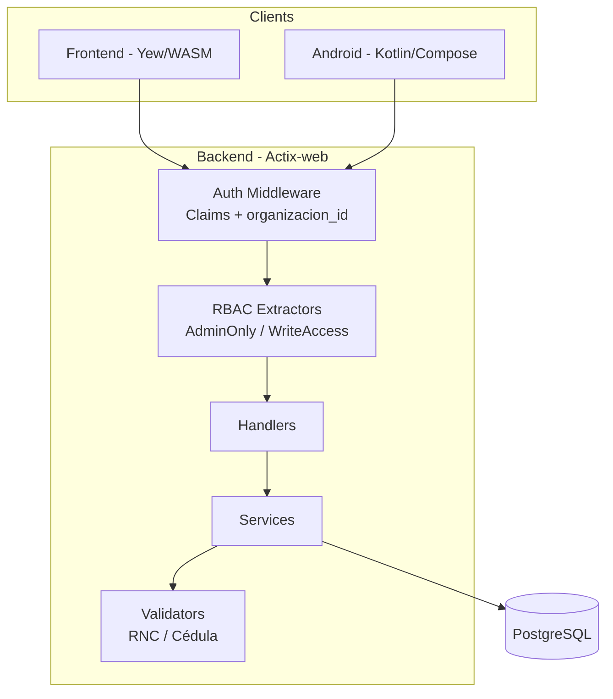
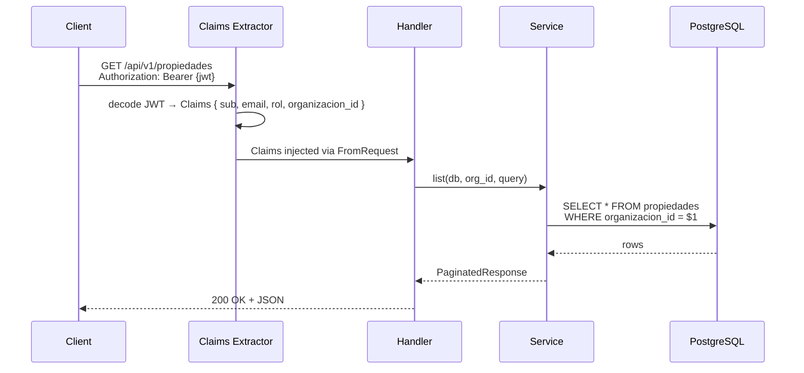
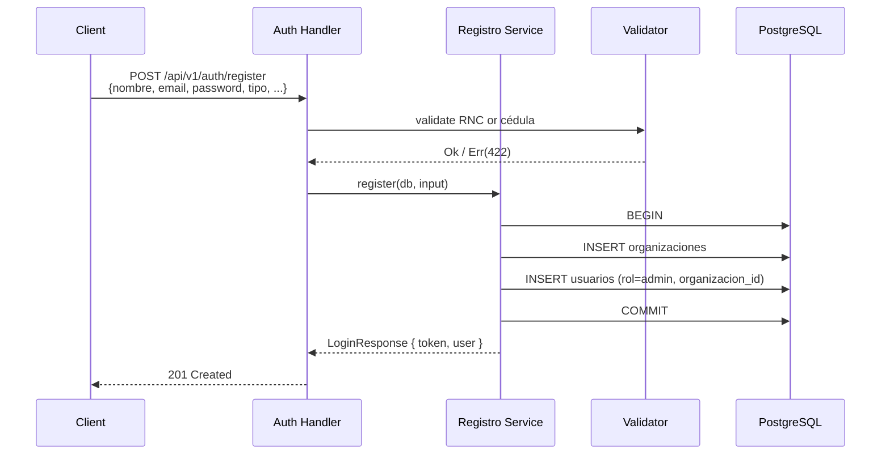
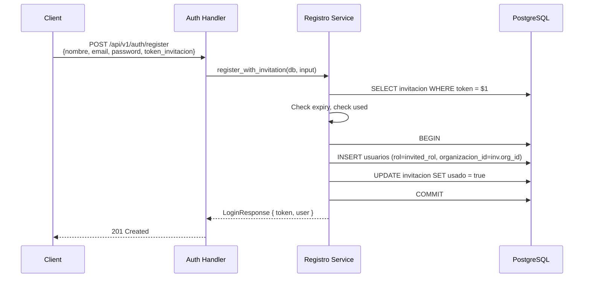

# Design Document: Multi-Tenant Organizations

## Overview

This design introduces `organizaciones` as the root tenant entity for the property management platform. Every user, property, tenant, contract, payment, expense, and maintenance request will belong to exactly one organization, achieving complete data isolation between tenants.

The design addresses the current bootstrap problem — where new users get `visualizador` and no mechanism exists to create the first `admin` — by making organization creation part of registration. The person who creates an organization automatically becomes its admin.

Organizations come in two types reflecting Dominican Republic legal structures:
- **Persona Física**: Individual property manager identified by cédula (11 digits, Luhn-validated)
- **Persona Jurídica**: Registered business entity identified by RNC (9 digits, DGII weighted modulus-validated)

### Key Design Decisions

1. **Single-org per user (v1)**: A user belongs to exactly one organization. Multi-org membership is deferred to a future version. This simplifies JWT claims, middleware, and query scoping.
2. **FK on `usuarios` table**: Rather than a separate join table, `organizacion_id` lives directly on `usuarios`. This is sufficient for single-org membership and avoids join overhead on every authenticated request.
3. **Org-scoped filtering via middleware + service layer**: The `organizacion_id` is extracted from JWT claims by the existing `Claims` extractor and passed to services. Services add `.filter(Column::OrganizacionId.eq(org_id))` to all queries. No database-level Row Level Security (RLS) — filtering is enforced in the Rust service layer for consistency with the existing architecture.
4. **Migration-time default org**: Existing data is migrated into a single default organization. The first user (by `created_at`) is promoted to admin. This is a one-time, irreversible migration.
5. **Invitation-based onboarding**: New users join existing organizations via admin-generated invitation tokens (UUID, 7-day expiry). Invited users skip org creation and join with the role specified in the invitation.

## Architecture

### System Context



### Request Flow (Org-Scoped)



### Registration Flow (New Org)



### Registration Flow (Invitation)



## Components and Interfaces

### New Entity: `organizacion`

```rust
// backend/src/entities/organizacion.rs
#[derive(Clone, Debug, PartialEq, DeriveEntityModel, Serialize, Deserialize)]
#[sea_orm(table_name = "organizaciones")]
pub struct Model {
    #[sea_orm(primary_key, auto_increment = false)]
    pub id: Uuid,
    pub tipo: String,                          // "persona_fisica" | "persona_juridica"
    pub nombre: String,                        // Display name
    pub estado: String,                        // "activo" | "inactivo"
    // persona_fisica fields
    pub cedula: Option<String>,                // 11 digits, unique
    pub telefono: Option<String>,
    pub email_organizacion: Option<String>,
    // persona_juridica fields
    pub rnc: Option<String>,                   // 9 digits, unique
    pub razon_social: Option<String>,
    pub nombre_comercial: Option<String>,
    pub direccion_fiscal: Option<String>,
    pub representante_legal: Option<String>,
    pub dgii_data: Option<Json>,               // Optional DGII lookup cache
    pub created_at: DateTimeWithTimeZone,
    pub updated_at: DateTimeWithTimeZone,
}
```

### New Entity: `invitacion`

```rust
// backend/src/entities/invitacion.rs
#[derive(Clone, Debug, PartialEq, DeriveEntityModel, Serialize, Deserialize)]
#[sea_orm(table_name = "invitaciones")]
pub struct Model {
    #[sea_orm(primary_key, auto_increment = false)]
    pub id: Uuid,
    pub organizacion_id: Uuid,
    pub email: String,
    pub rol: String,                           // "gerente" | "visualizador"
    pub token: String,                         // Unique invitation token (UUID)
    pub usado: bool,
    pub expires_at: DateTimeWithTimeZone,
    pub created_at: DateTimeWithTimeZone,
}
```

### Modified Entity: `usuario`

Add `organizacion_id: Uuid` field (non-nullable after migration).

### Modified Claims Struct

```rust
// backend/src/services/auth.rs
#[derive(Debug, Clone, Serialize, Deserialize)]
pub struct Claims {
    pub sub: Uuid,
    pub email: String,
    pub rol: String,
    pub organizacion_id: Uuid,  // NEW
    pub exp: usize,
}
```

### New Service: `organizaciones`

```rust
// backend/src/services/organizaciones.rs
pub async fn get_by_id(db: &DatabaseConnection, id: Uuid) -> Result<OrganizacionResponse, AppError>;
pub async fn update<C: ConnectionTrait>(db: &C, id: Uuid, input: UpdateOrganizacionRequest) -> Result<OrganizacionResponse, AppError>;
```

### New Service: `invitaciones`

```rust
// backend/src/services/invitaciones.rs
pub async fn crear(db: &DatabaseConnection, org_id: Uuid, input: CrearInvitacionRequest) -> Result<InvitacionResponse, AppError>;
pub async fn validar_token(db: &DatabaseConnection, token: &str) -> Result<invitacion::Model, AppError>;
```

### New Validation Module: `validacion_fiscal`

```rust
// backend/src/services/validacion_fiscal.rs
pub fn validar_rnc(rnc: &str) -> Result<(), AppError>;
pub fn validar_cedula(cedula: &str) -> Result<(), AppError>;
pub fn formato_rnc(rnc: &str) -> String;      // "1-31-24679-6"
pub fn formato_cedula(cedula: &str) -> String; // "224-0002211-1"
pub fn parse_rnc(formatted: &str) -> String;   // strip dashes/spaces → digits only
pub fn parse_cedula(formatted: &str) -> String;
```

**RNC Algorithm** (confirmed from [python-stdnum](https://arthurdejong.org/python-stdnum/doc/2.2/stdnum.do.rnc)):
- Weights: `[7, 9, 8, 6, 5, 4, 3, 2]` applied to first 8 digits
- `check = sum(weight[i] * digit[i]) % 11`
- `check_digit = (10 - check) % 9 + 1`
- Note: This is modulo 11 (not modulo 10 as stated in requirements). The design follows the actual DGII algorithm.

**Cédula Algorithm** (confirmed from [python-stdnum](https://arthurdejong.org/python-stdnum/doc/2.1/stdnum.do.cedula)):
- Standard Luhn algorithm: alternating weights `[1, 2, 1, 2, 1, 2, 1, 2, 1, 2]` applied left-to-right to first 10 digits
- If product > 9, sum the two digits (e.g., 14 → 1+4 = 5)
- `check_digit = (10 - (sum % 10)) % 10`
- The 11th digit must equal the check digit

### Modified Registration Handler

The existing `POST /api/v1/auth/register` endpoint changes from accepting `{nombre, email, password, rol}` to accepting a discriminated union based on `tipo`:

```rust
// backend/src/models/registro.rs
#[derive(Debug, Deserialize)]
#[serde(rename_all = "camelCase")]
pub struct RegisterRequest {
    // User fields
    pub nombre: String,
    pub email: String,
    pub password: String,
    // Organization type discriminator
    pub tipo: String,  // "persona_fisica" | "persona_juridica"
    // persona_fisica fields
    pub cedula: Option<String>,
    pub telefono: Option<String>,
    pub nombre_organizacion: Option<String>,
    // persona_juridica fields
    pub rnc: Option<String>,
    pub razon_social: Option<String>,
    pub nombre_comercial: Option<String>,
    pub direccion_fiscal: Option<String>,
    pub representante_legal: Option<String>,
    // Invitation flow (mutually exclusive with tipo)
    pub token_invitacion: Option<String>,
}
```

### New Routes

```
POST   /api/v1/auth/register              — Updated (org creation or invitation)
POST   /api/v1/auth/login                 — Updated (includes organizacion_id in JWT)
GET    /api/v1/organizacion               — Get current org details (all roles)
PUT    /api/v1/organizacion               — Update org details (admin only)
POST   /api/v1/invitaciones               — Create invitation (admin only)
GET    /api/v1/invitaciones               — List pending invitations (admin only)
DELETE /api/v1/invitaciones/{id}           — Revoke invitation (admin only)
```

### Modified Service Signatures

All existing org-scoped services gain an `organizacion_id: Uuid` parameter:

```rust
// Example: propiedades service
pub async fn list(db: &DatabaseConnection, org_id: Uuid, query: PropiedadListQuery) -> Result<PaginatedResponse<PropiedadResponse>, AppError>;
pub async fn get_by_id(db: &DatabaseConnection, org_id: Uuid, id: Uuid) -> Result<PropiedadResponse, AppError>;
pub async fn create<C: ConnectionTrait>(db: &C, org_id: Uuid, input: CreatePropiedadRequest, usuario_id: Uuid) -> Result<PropiedadResponse, AppError>;
```

Handlers extract `organizacion_id` from `Claims` and pass it to services:

```rust
pub async fn list(
    db: web::Data<DatabaseConnection>,
    claims: Claims,
    query: web::Query<PropiedadListQuery>,
) -> Result<HttpResponse, AppError> {
    let result = propiedades::list(db.get_ref(), claims.organizacion_id, query.into_inner()).await?;
    Ok(HttpResponse::Ok().json(result))
}
```

### Frontend Changes

- **Registration page**: Two-step form — step 1: choose tipo (persona_fisica / persona_juridica), step 2: fill org-specific fields + user fields
- **User type**: Add `organizacion_id: String` field to `User` struct
- **RegisterRequest type**: Updated to include org fields
- **Invitation acceptance**: New route `/registro/invitacion/{token}` that pre-fills org info and skips org creation

### Android Changes

- **Registration screen**: Same two-step flow as frontend
- **User model**: Add `organizacionId` field
- **Auth token storage**: No change (JWT already stored, new claim is transparent)

## Data Models

### Database Schema

```sql
-- New table: organizaciones
CREATE TABLE organizaciones (
    id                   UUID PRIMARY KEY DEFAULT gen_random_uuid(),
    tipo                 VARCHAR(20) NOT NULL CHECK (tipo IN ('persona_fisica', 'persona_juridica')),
    nombre               VARCHAR(200) NOT NULL,
    estado               VARCHAR(20) NOT NULL DEFAULT 'activo' CHECK (estado IN ('activo', 'inactivo')),
    -- persona_fisica fields
    cedula               VARCHAR(11) UNIQUE,
    telefono             VARCHAR(20),
    email_organizacion   VARCHAR(255),
    -- persona_juridica fields
    rnc                  VARCHAR(9) UNIQUE,
    razon_social         VARCHAR(200),
    nombre_comercial     VARCHAR(200),
    direccion_fiscal     TEXT,
    representante_legal  VARCHAR(200),
    dgii_data            JSONB,
    -- timestamps
    created_at           TIMESTAMPTZ NOT NULL DEFAULT now(),
    updated_at           TIMESTAMPTZ NOT NULL DEFAULT now()
);

-- New table: invitaciones
CREATE TABLE invitaciones (
    id                UUID PRIMARY KEY DEFAULT gen_random_uuid(),
    organizacion_id   UUID NOT NULL REFERENCES organizaciones(id),
    email             VARCHAR(255) NOT NULL,
    rol               VARCHAR(20) NOT NULL CHECK (rol IN ('gerente', 'visualizador')),
    token             VARCHAR(255) NOT NULL UNIQUE,
    usado             BOOLEAN NOT NULL DEFAULT false,
    expires_at        TIMESTAMPTZ NOT NULL,
    created_at        TIMESTAMPTZ NOT NULL DEFAULT now()
);
CREATE INDEX idx_invitaciones_token ON invitaciones(token);
CREATE INDEX idx_invitaciones_organizacion_id ON invitaciones(organizacion_id);

-- Alter existing tables: add organizacion_id FK
ALTER TABLE usuarios ADD COLUMN organizacion_id UUID REFERENCES organizaciones(id);
ALTER TABLE propiedades ADD COLUMN organizacion_id UUID REFERENCES organizaciones(id);
ALTER TABLE inquilinos ADD COLUMN organizacion_id UUID REFERENCES organizaciones(id);
ALTER TABLE contratos ADD COLUMN organizacion_id UUID REFERENCES organizaciones(id);
ALTER TABLE pagos ADD COLUMN organizacion_id UUID REFERENCES organizaciones(id);
ALTER TABLE gastos ADD COLUMN organizacion_id UUID REFERENCES organizaciones(id);
ALTER TABLE solicitudes_mantenimiento ADD COLUMN organizacion_id UUID REFERENCES organizaciones(id);

-- Indexes on organizacion_id for all tables
CREATE INDEX idx_usuarios_organizacion_id ON usuarios(organizacion_id);
CREATE INDEX idx_propiedades_organizacion_id ON propiedades(organizacion_id);
CREATE INDEX idx_inquilinos_organizacion_id ON inquilinos(organizacion_id);
CREATE INDEX idx_contratos_organizacion_id ON contratos(organizacion_id);
CREATE INDEX idx_pagos_organizacion_id ON pagos(organizacion_id);
CREATE INDEX idx_gastos_organizacion_id ON gastos(organizacion_id);
CREATE INDEX idx_solicitudes_mantenimiento_organizacion_id ON solicitudes_mantenimiento(organizacion_id);
```

### Migration Strategy

Three migrations in sequence:

1. **`m20250413_000001_create_organizaciones.rs`**: Creates `organizaciones` table and `invitaciones` table.
2. **`m20250413_000002_add_organizacion_id.rs`**: Adds nullable `organizacion_id` column to all 7 existing tables. Creates a default organization ("Organización Predeterminada", tipo persona_fisica). Updates all existing rows to reference the default org. Promotes the first user (by `created_at`) to admin. Alters columns to NOT NULL. Creates indexes.
3. **`m20250413_000003_create_invitaciones.rs`**: Creates `invitaciones` table with indexes.

### DTO Models

```rust
// backend/src/models/organizacion.rs
#[derive(Debug, Serialize)]
#[serde(rename_all = "camelCase")]
pub struct OrganizacionResponse {
    pub id: Uuid,
    pub tipo: String,
    pub nombre: String,
    pub estado: String,
    pub cedula: Option<String>,
    pub telefono: Option<String>,
    pub email_organizacion: Option<String>,
    pub rnc: Option<String>,
    pub razon_social: Option<String>,
    pub nombre_comercial: Option<String>,
    pub direccion_fiscal: Option<String>,
    pub representante_legal: Option<String>,
    pub created_at: DateTime<Utc>,
    pub updated_at: DateTime<Utc>,
}

#[derive(Debug, Deserialize)]
#[serde(rename_all = "camelCase")]
pub struct UpdateOrganizacionRequest {
    // Mutable fields only — tipo, cedula, rnc are immutable
    pub nombre: Option<String>,
    pub telefono: Option<String>,
    pub email_organizacion: Option<String>,
    pub nombre_comercial: Option<String>,
    pub direccion_fiscal: Option<String>,
    pub representante_legal: Option<String>,
    pub dgii_data: Option<serde_json::Value>,
}

// backend/src/models/invitacion.rs
#[derive(Debug, Deserialize)]
#[serde(rename_all = "camelCase")]
pub struct CrearInvitacionRequest {
    pub email: String,
    pub rol: String,  // "gerente" | "visualizador"
}

#[derive(Debug, Serialize)]
#[serde(rename_all = "camelCase")]
pub struct InvitacionResponse {
    pub id: Uuid,
    pub email: String,
    pub rol: String,
    pub token: String,
    pub usado: bool,
    pub expires_at: DateTime<Utc>,
    pub created_at: DateTime<Utc>,
}
```

