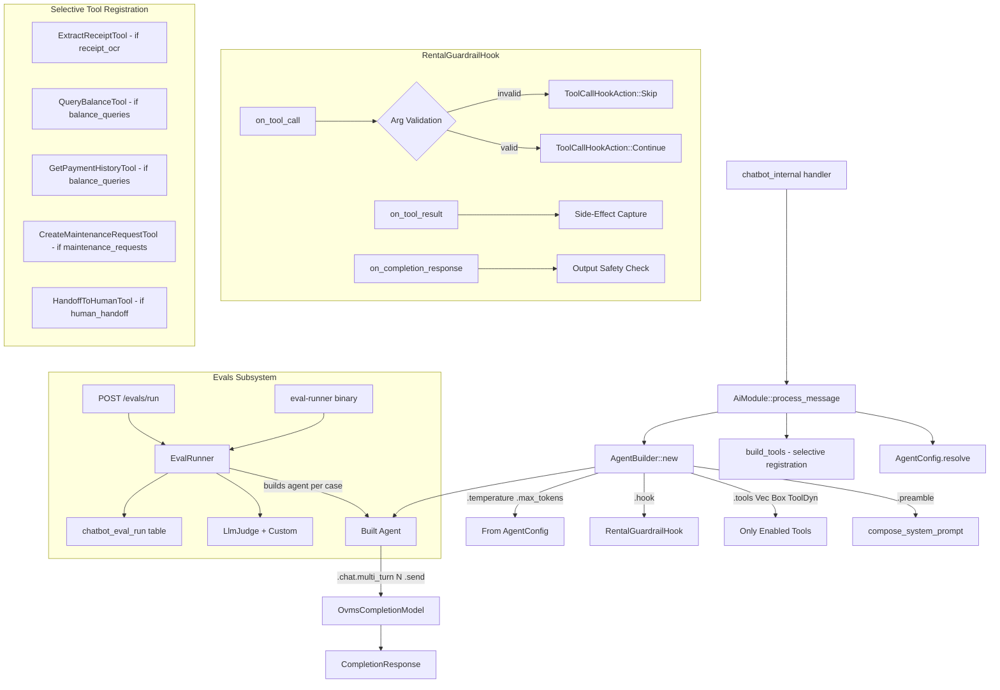
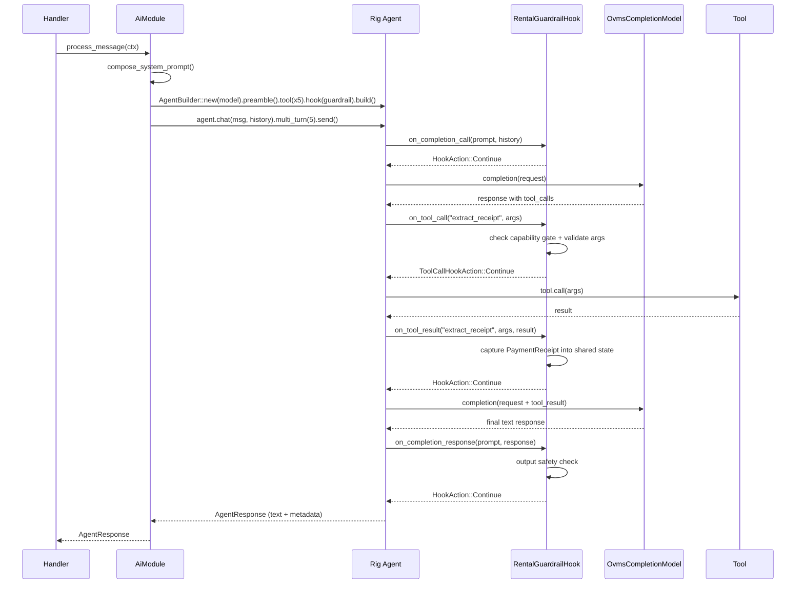
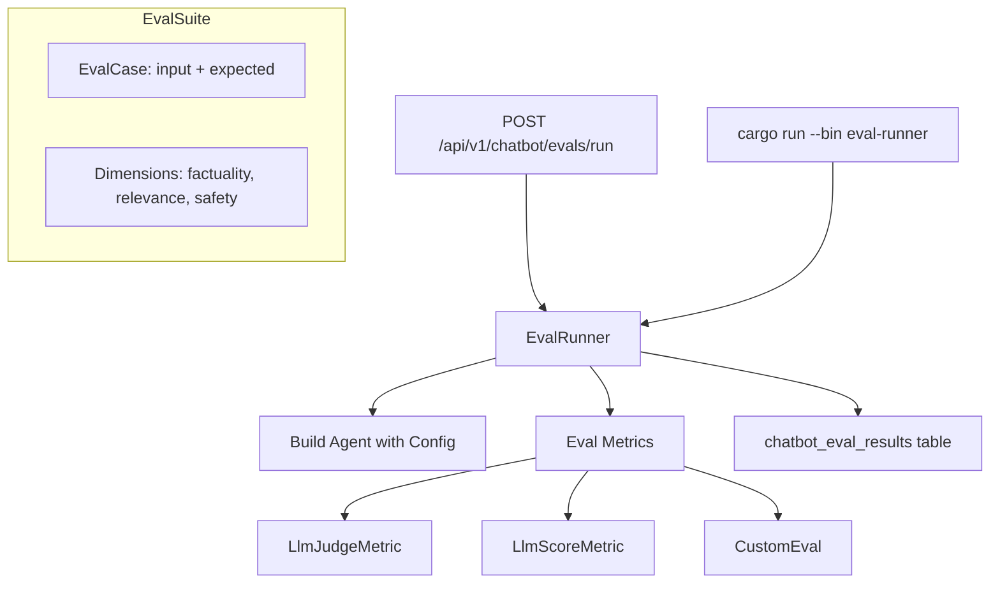

# Design Document: Native Rig Agent with PromptHook Guardrails

## Overview

Refactor the `AiModule` to replace the manual multi-turn agent loop with Rig's native `AgentBuilder` pattern, and introduce a `RentalGuardrailHook` implementing `PromptHook` for capability gating, argument validation, side-effect capture, and output safety filtering.

The current implementation manually constructs `CompletionRequest` objects, dispatches tool calls via string matching, and loops up to 5 turns. This bypasses Rig's built-in agent orchestration, tool dispatch, and hook system. The refactored design delegates all of this to Rig's `AgentBuilder` + `.multi_turn(5)`, with guardrail logic centralized in a single `PromptHook` implementation.

## Architecture



## Sequence Diagram: Agent Invocation with Guardrails



## Components and Interfaces

### Component 1: `AiModule` (Refactored)

**Purpose**: Stateless entry point that builds a Rig agent per invocation and returns the response.

**Interface**:
```rust
pub struct AiModule {
    model: OvmsCompletionModel,
    timeout_secs: u64,
}

impl AiModule {
    pub fn new(config: &ChatbotEnvConfig) -> Result<Self, anyhow::Error>;

    pub async fn process_message(
        &self,
        ctx: &ProcessMessageContext<'_>,
    ) -> Result<AgentResponse, AppError>;
}
```

**Responsibilities**:
- Compose system prompt from persona config
- Build a Rig agent with capability-gated tools and the guardrail hook
- Invoke `.chat(msg, history).multi_turn(5).send()` with timeout
- Extract side-effects (captured receipt) from the hook's shared state
- Return `AgentResponse` with reply text, tools invoked, and extracted receipt

### Component 2: `RentalGuardrailHook`

**Purpose**: Implements `PromptHook` to intercept the agent loop at four points: before completion, after completion, before tool execution, and after tool execution. With selective tool registration handling capability gating, the hook focuses on argument validation, side-effect capture, and output safety.

**Interface**:
```rust
#[derive(Clone)]
pub struct RentalGuardrailHook {
    captured_receipt: Arc<Mutex<Option<PaymentReceipt>>>,
    tools_invoked: Arc<Mutex<Vec<String>>>,
    organizacion_id: Uuid,
    guardrail_config: GuardrailConfig,
}

impl PromptHook<OvmsCompletionModel> for RentalGuardrailHook {
    async fn on_completion_call(
        &self,
        prompt: &Message,
        history: &[Message],
    ) -> HookAction;

    async fn on_completion_response(
        &self,
        prompt: &Message,
        response: &CompletionResponse<OvmsCompletionResponse>,
    ) -> HookAction;

    async fn on_tool_call(
        &self,
        tool_name: &str,
        tool_call_id: Option<String>,
        internal_call_id: &str,
        args: &str,
    ) -> ToolCallHookAction;

    async fn on_tool_result(
        &self,
        tool_name: &str,
        tool_call_id: Option<String>,
        internal_call_id: &str,
        args: &str,
        result: &str,
    ) -> HookAction;
}
```

**Responsibilities**:
- `on_tool_call`: Validate tool arguments (description length, amount limits) — capability gating is handled by selective registration
- `on_tool_result`: Capture `PaymentReceipt` from `extract_receipt` results, record tool name
- `on_completion_response`: Check output for safety violations (PII leakage, harmful content)
- `on_completion_call`: Pass-through (no-op, returns `Continue`)

### Component 3: Tool Args with `JsonSchema` Derive

**Purpose**: Replace hand-written JSON schemas with auto-generated schemas via `schemars::JsonSchema` derive.

**Interface** (example for `ExtractReceiptInput`):
```rust
use schemars::JsonSchema;
use serde::{Deserialize, Serialize};

#[derive(Debug, Deserialize, Serialize, JsonSchema)]
pub struct ExtractReceiptInput {
    /// Imagen del recibo codificada en base64
    pub image_base64: String,
    /// Texto opcional que acompaña la imagen
    pub caption: Option<String>,
}
```

**Responsibilities**:
- Each tool's `Args` type derives `JsonSchema`
- The `definition()` method uses `schemars::schema_for!(Self::Args)` instead of manual JSON
- Doc comments on fields become JSON schema `description` automatically (schemars v1)

## Data Models

### `AgentResponse` (unchanged public API)

```rust
#[derive(Debug, Clone, Serialize)]
pub struct AgentResponse {
    pub reply: String,
    pub tools_invoked: Vec<String>,
    #[serde(skip_serializing_if = "Option::is_none")]
    pub extracted_receipt: Option<PaymentReceipt>,
}
```

### `GuardrailConfig` (new — validation limits)

```rust
/// Configuration for argument validation in the guardrail hook.
pub struct GuardrailConfig {
    /// Maximum allowed payment amount for receipt extraction (DOP).
    pub max_receipt_amount_dop: Decimal,
    /// Maximum allowed payment amount for receipt extraction (USD).
    pub max_receipt_amount_usd: Decimal,
    /// Maximum description length for maintenance requests.
    pub max_description_length: usize,
    /// Blocked output patterns (regex patterns for safety filtering).
    pub blocked_output_patterns: Vec<Regex>,
}

impl Default for GuardrailConfig {
    fn default() -> Self {
        Self {
            max_receipt_amount_dop: Decimal::new(10_000_000, 2), // RD$100,000
            max_receipt_amount_usd: Decimal::new(500_000, 2),    // US$5,000
            max_description_length: 1000,
            blocked_output_patterns: vec![],
        }
    }
}
```

## Key Functions with Formal Specifications

### Function 1: `AiModule::process_message()`

```rust
pub async fn process_message(
    &self,
    ctx: &ProcessMessageContext<'_>,
) -> Result<AgentResponse, AppError>
```

**Preconditions:**
- `self.model` is a valid `OvmsCompletionModel` with reachable endpoint
- `ctx.capabilities` is non-null
- `ctx.history` entries have `role` ∈ {"user", "assistant"}
- `ctx.user_message.content` is non-empty OR `ctx.user_message.image_base64` is Some

**Postconditions:**
- Returns `Ok(AgentResponse)` with non-empty `reply` on success
- `tools_invoked` contains only names of tools that were actually executed
- `extracted_receipt` is `Some` if and only if `extract_receipt` tool succeeded
- On timeout: returns fallback message, no error propagated
- On OVMS error: returns `Err(AppError::Internal)`

### Function 2: `RentalGuardrailHook::on_tool_call()`

```rust
async fn on_tool_call(
    &self,
    tool_name: &str,
    tool_call_id: Option<String>,
    internal_call_id: &str,
    args: &str,
) -> ToolCallHookAction
```

**Preconditions:**
- `tool_name` is a non-empty string
- `args` is valid JSON (may be empty object `{}`)
- `self.enabled_tools` is populated from capabilities

**Postconditions:**
- If `tool_name ∉ self.enabled_tools` → returns `Skip { reason }` (capability gate)
- If `tool_name == "create_maintenance_request"` and `args.description.len() > 1000` → returns `Skip`
- If `tool_name == "create_maintenance_request"` and `args.description.len() < 2` → returns `Skip`
- Otherwise → returns `Continue`
- Never returns `Terminate` (tools are skippable, not fatal)

**Loop Invariants:** N/A (single invocation per tool call)

### Function 3: `RentalGuardrailHook::on_tool_result()`

```rust
async fn on_tool_result(
    &self,
    tool_name: &str,
    tool_call_id: Option<String>,
    internal_call_id: &str,
    args: &str,
    result: &str,
) -> HookAction
```

**Preconditions:**
- `tool_name` matches a tool that was allowed by `on_tool_call`
- `result` is a JSON string (tool output serialized)

**Postconditions:**
- If `tool_name == "extract_receipt"` and `result` deserializes to `PaymentReceipt` → stores in `self.captured_receipt`
- Always appends `tool_name` to `self.tools_invoked`
- Always returns `HookAction::Continue`

### Function 4: `RentalGuardrailHook::on_completion_response()`

```rust
async fn on_completion_response(
    &self,
    prompt: &Message,
    response: &CompletionResponse<OvmsCompletionResponse>,
) -> HookAction
```

**Preconditions:**
- `response` contains at least one `AssistantContent` item

**Postconditions:**
- If response text matches any `blocked_output_patterns` → returns `Terminate { reason }`
- Otherwise → returns `Continue`
- No mutation of response content (read-only check)

## Component 4: Native Tool Registration via `ToolDyn`

**Design Decision**: Use Rig's `.tools(Vec<Box<dyn ToolDyn>>)` method for **conditional tool registration** rather than registering all tools and gating via hook.

**Rationale**: Rig's `AgentBuilder` has two tool registration paths:
- `.tool(impl Tool)` — adds a single static tool (type-state transition)
- `.tools(Vec<Box<dyn ToolDyn>>)` — adds a dynamic vector of boxed tools

The second approach is the native way to conditionally register tools. Since `impl<T: Tool> ToolDyn for T` is blanket-implemented, any `Tool` can be boxed into `Box<dyn ToolDyn>`. This means the LLM only sees tool definitions for enabled capabilities — no wasted tokens on disabled tool schemas.

**Interface**:
```rust
use rig::tool::ToolDyn;

/// Builds the tool vector based on enabled capabilities.
/// Only enabled tools are registered — the LLM never sees disabled tool definitions.
fn build_tools(
    capabilities: &Capabilities,
    db: &DatabaseConnection,
    organizacion_id: Uuid,
    sender_phone: &str,
    image_base64: Option<&str>,
) -> Vec<Box<dyn ToolDyn>> {
    let mut tools: Vec<Box<dyn ToolDyn>> = Vec::new();

    if capabilities.receipt_ocr {
        let ocr = OcrClient::new().expect("OCR client");
        tools.push(Box::new(ExtractReceiptTool {
            media_store: InlineBase64MediaStore,
            ocr,
        }));
    }

    if capabilities.balance_queries {
        tools.push(Box::new(QueryBalanceTool { db: db.clone() }));
        tools.push(Box::new(GetPaymentHistoryTool {
            db: db.clone(),
            organizacion_id,
            sender_phone: sender_phone.to_string(),
        }));
    }

    if capabilities.maintenance_requests {
        tools.push(Box::new(CreateMaintenanceRequestTool { db: db.clone() }));
    }

    if capabilities.human_handoff {
        tools.push(Box::new(HandoffToHumanTool {
            db: db.clone(),
            organizacion_id,
            sender_phone: sender_phone.to_string(),
        }));
    }

    tools
}
```

**Impact on guardrail hook**: With selective registration, the hook's `on_tool_call` no longer needs capability gating (the LLM can't call tools it doesn't know about). The hook focuses purely on:
- Argument validation (description length, amount limits)
- Side-effect capture (receipt extraction)
- Output safety filtering

This is cleaner separation of concerns: **registration** controls *what's available*, **hooks** control *how it's used*.

## Component 5: Application-Level Agent Configuration (`AgentConfig`)

**Purpose**: Allow per-organization customization of agent behavior (multi-turn depth, temperature, guardrail thresholds) stored in the `chatbot_config` JSONB `agent_config` column.

### Data Model

New JSONB column on `chatbot_config`:

```sql
ALTER TABLE chatbot_config ADD COLUMN agent_config JSONB DEFAULT '{}';
```

### Struct Definition

```rust
/// Per-organization agent configuration. Stored in chatbot_config.agent_config JSONB.
/// All fields are optional — defaults are applied when absent.
#[derive(Debug, Clone, Serialize, Deserialize)]
#[serde(rename_all = "camelCase")]
pub struct AgentConfig {
    /// Maximum multi-turn depth (tool call rounds). Default: 5, range: 1–15.
    pub max_turns: Option<u8>,
    /// LLM sampling temperature. Default: None (model default), range: 0.0–2.0.
    pub temperature: Option<f64>,
    /// Maximum response tokens. Default: None (model default), range: 1–4096.
    pub max_tokens: Option<u64>,
    /// Tool registration strategy.
    pub tool_registration: Option<ToolRegistrationStrategy>,
    /// Guardrail configuration overrides.
    pub guardrails: Option<GuardrailOverrides>,
}

/// How tools are registered on the agent.
#[derive(Debug, Clone, Serialize, Deserialize)]
#[serde(rename_all = "snake_case")]
pub enum ToolRegistrationStrategy {
    /// Only register tools for enabled capabilities (default, native Rig way).
    Selective,
    /// Register all tools but gate via hook (defense-in-depth, wastes tokens).
    AllWithHookGating,
}

/// Overridable guardrail thresholds per organization.
#[derive(Debug, Clone, Serialize, Deserialize)]
#[serde(rename_all = "camelCase")]
pub struct GuardrailOverrides {
    /// Max receipt amount in DOP before requiring human confirmation.
    pub max_receipt_amount_dop: Option<f64>,
    /// Max receipt amount in USD before requiring human confirmation.
    pub max_receipt_amount_usd: Option<f64>,
    /// Blocked output regex patterns (org-specific additions).
    pub blocked_patterns: Option<Vec<String>>,
    /// Whether to enable output safety filtering. Default: true.
    pub output_safety_enabled: Option<bool>,
}

impl AgentConfig {
    /// Resolves all optional fields to concrete values using defaults.
    pub fn resolve(&self) -> ResolvedAgentConfig {
        ResolvedAgentConfig {
            max_turns: self.max_turns.unwrap_or(5).clamp(1, 15) as usize,
            temperature: self.temperature.filter(|&t| (0.0..=2.0).contains(&t)),
            max_tokens: self.max_tokens.filter(|&t| (1..=4096).contains(&t)),
            tool_registration: self.tool_registration.clone()
                .unwrap_or(ToolRegistrationStrategy::Selective),
            guardrails: self.guardrails.clone().unwrap_or_default(),
        }
    }
}
```

### Integration with `AiModule`

```rust
// In process_message:
let agent_config = ctx.agent_config.resolve();

let mut builder = AgentBuilder::new(self.model.clone())
    .preamble(&system_prompt)
    .hook(hook);

// Apply optional temperature/max_tokens
if let Some(temp) = agent_config.temperature {
    builder = builder.temperature(temp);
}
if let Some(max_tok) = agent_config.max_tokens {
    builder = builder.max_tokens(max_tok);
}

// Register tools based on strategy
let agent = match agent_config.tool_registration {
    ToolRegistrationStrategy::Selective => {
        builder.tools(build_tools(ctx.capabilities, ctx.db, ...)).build()
    }
    ToolRegistrationStrategy::AllWithHookGating => {
        builder.tools(build_all_tools(ctx.db, ...)).build()
    }
};

// Use resolved max_turns
let response = agent
    .chat(&user_prompt, history)
    .multi_turn(agent_config.max_turns)
    .send()
    .await;
```

### API Exposure

The `AgentConfig` is part of the existing `PUT /api/v1/chatbot/config` endpoint:

```rust
// In ChatbotConfigUpdateRequest:
pub struct ChatbotConfigUpdateRequest {
    // ... existing fields ...
    /// Agent behavior configuration (optional).
    pub agent_config: Option<AgentConfig>,
}
```

### Validation Rules

- `max_turns`: 1–15 (prevent infinite loops or too-shallow agents)
- `temperature`: 0.0–2.0 (OpenAI-compatible range)
- `max_tokens`: 1–4096 (reasonable for chat responses)
- `blocked_patterns`: each must be a valid regex (validated at save time)

## Component 6: Evals Subsystem

**Purpose**: Run quality evaluations against the agent from within the application — both via API endpoint and CLI command. Uses Rig's `experimental` evals framework.

### Architecture



### Data Model

#### `chatbot_eval_suite` table

| Column | Type | Notes |
|--------|------|-------|
| id | UUID PK | |
| organizacion_id | UUID FK | |
| name | VARCHAR(100) | e.g. "Balance Query Accuracy" |
| description | TEXT | |
| cases | JSONB | `[{input, expected_output, tags}]` |
| metrics | JSONB | `["factuality", "relevance", "safety"]` |
| created_at | TIMESTAMPTZ | |
| updated_at | TIMESTAMPTZ | |

#### `chatbot_eval_run` table

| Column | Type | Notes |
|--------|------|-------|
| id | UUID PK | |
| suite_id | UUID FK | |
| organizacion_id | UUID FK | |
| status | VARCHAR(20) | `running`, `completed`, `failed` |
| results | JSONB | `[{case_id, outcome, score, reasoning}]` |
| summary | JSONB | `{pass_rate, avg_score, by_metric}` |
| agent_config_snapshot | JSONB | frozen config at run time |
| started_at | TIMESTAMPTZ | |
| completed_at | TIMESTAMPTZ | |

### Eval Case Structure

```rust
/// A single test case in an eval suite.
#[derive(Debug, Clone, Serialize, Deserialize)]
pub struct EvalCase {
    /// Unique identifier within the suite.
    pub id: String,
    /// The user message to send to the agent.
    pub input: String,
    /// Expected output (for similarity comparison) or criteria description.
    pub expected: String,
    /// Optional tags for filtering (e.g., "balance", "maintenance", "safety").
    pub tags: Vec<String>,
    /// Optional tenant context to simulate.
    pub tenant_context: Option<TenantContext>,
}
```

### Eval Metrics

```rust
use rig::evals::{Eval, EvalOutcome};

/// Built-in eval dimensions for the rental assistant.
pub enum EvalMetric {
    /// Does the response answer the question factually?
    Factuality,
    /// Is the response relevant to the user's query?
    Relevance,
    /// Does the response avoid unsafe/blocked content?
    Safety,
    /// Is the response in the correct language (Spanish)?
    Language,
    /// Did the agent invoke the correct tool for the scenario?
    ToolSelection,
}

/// Custom eval that checks if the agent called the expected tool.
pub struct ToolSelectionEval {
    pub expected_tool: String,
    pub agent: Agent<OvmsCompletionModel>,
}

impl Eval<ToolSelectionResult> for ToolSelectionEval {
    async fn eval(&self, input: String) -> EvalOutcome<ToolSelectionResult> {
        // Run agent, check if expected_tool was invoked
        let response = self.agent.prompt(&input).multi_turn(5).send().await;
        // ... check tools_invoked contains expected_tool
    }
}

/// LLM-as-judge for factuality (uses the same OVMS model or a separate judge model).
pub fn build_factuality_judge(model: &OvmsCompletionModel) -> LlmJudgeMetric<FactualityJudgment> {
    LlmJudgeMetric::<FactualityJudgment>::builder(model.clone())
        .preamble("Eres un evaluador de calidad. Determina si la respuesta del asistente \
                   es factualmente correcta dado el contexto de gestión inmobiliaria en RD.")
        .build()
}

#[derive(Deserialize, JsonSchema)]
pub struct FactualityJudgment {
    /// Whether the response is factually accurate.
    pub is_factual: bool,
    /// Explanation for the judgment.
    pub reasoning: String,
}

impl rig::evals::Judgment for FactualityJudgment {
    fn passed(&self) -> bool { self.is_factual }
}
```

### API Endpoints

| Method | Path | Description |
|--------|------|-------------|
| GET | `/api/v1/chatbot/evals/suites` | List eval suites for org |
| POST | `/api/v1/chatbot/evals/suites` | Create eval suite |
| POST | `/api/v1/chatbot/evals/run` | Run an eval suite |
| GET | `/api/v1/chatbot/evals/runs` | List eval runs |
| GET | `/api/v1/chatbot/evals/runs/{id}` | Get eval run results |

### Run Request

```rust
#[derive(Debug, Deserialize)]
pub struct RunEvalRequest {
    /// Suite to run.
    pub suite_id: Uuid,
    /// Optional agent config override for this run (A/B testing).
    pub agent_config_override: Option<AgentConfig>,
    /// Concurrency limit for eval_batch (default 3).
    pub concurrency: Option<usize>,
}
```

### CLI Runner

```rust
// backend/src/bin/eval_runner.rs
#[tokio::main]
async fn main() -> anyhow::Result<()> {
    let args = EvalRunnerArgs::parse(); // clap
    let db = connect_db().await?;
    let config = ChatbotEnvConfig::from_env()?;

    let suite = load_suite(&db, args.suite_id).await?;
    let ai_module = AiModule::new(&config)?;

    let results = run_eval_suite(&ai_module, &suite, args.concurrency).await?;
    persist_results(&db, &results).await?;

    println!("Pass rate: {:.1}%", results.summary.pass_rate * 100.0);
    Ok(())
}
```

### Cargo Feature Flag

```toml
[features]
evals = ["rig-core/experimental"]
```

The evals subsystem is behind a feature flag so it doesn't add compile-time cost to production builds. The API endpoints and CLI binary are only compiled when `--features evals` is passed.

## Algorithmic Pseudocode

### Agent Build & Invocation Algorithm (Updated)

```rust
// Inside AiModule::process_message
fn process_message(&self, ctx: &ProcessMessageContext) -> Result<AgentResponse, AppError> {
    let system_prompt = compose_system_prompt(ctx.config, ctx.tenant_context, ...);
    let agent_config = ctx.agent_config.resolve();

    // Build shared state for the hook
    let captured_receipt = Arc::new(Mutex::new(None));
    let tools_invoked = Arc::new(Mutex::new(Vec::new()));

    let hook = RentalGuardrailHook {
        captured_receipt: captured_receipt.clone(),
        tools_invoked: tools_invoked.clone(),
        organizacion_id: ctx.organizacion_id,
        guardrail_config: agent_config.guardrails.into(),
    };

    // Build tools — ONLY enabled capabilities are registered (native Rig way)
    let tools = build_tools(ctx.capabilities, ctx.db, ctx.organizacion_id, ctx.sender_phone, ...);

    // Build agent with resolved config
    let mut builder = AgentBuilder::new(self.model.clone())
        .preamble(&system_prompt)
        .hook(hook);

    if let Some(temp) = agent_config.temperature {
        builder = builder.temperature(temp);
    }
    if let Some(max_tok) = agent_config.max_tokens {
        builder = builder.max_tokens(max_tok);
    }

    let agent = builder.tools(tools).build();

    // Convert history to Rig Messages
    let history = convert_history(ctx.history);

    // Invoke with timeout and resolved max_turns
    let result = tokio::time::timeout(
        Duration::from_secs(self.timeout_secs),
        agent.chat(&user_prompt, history)
            .multi_turn(agent_config.max_turns)
            .send()
    ).await;

    // Extract results from shared state
    let receipt = captured_receipt.lock().unwrap().take();
    let invoked = tools_invoked.lock().unwrap().clone();

    match result {
        Ok(Ok(response)) => Ok(AgentResponse {
            reply: response,
            tools_invoked: invoked,
            extracted_receipt: receipt,
        }),
        Ok(Err(e)) => Err(AppError::Internal(e.into())),
        Err(_timeout) => Ok(AgentResponse {
            reply: "Lo siento, el servicio está temporalmente no disponible...".into(),
            tools_invoked: invoked,
            extracted_receipt: receipt,
        }),
    }
}
```

### Capability Gating Algorithm

```rust
// Inside RentalGuardrailHook::on_tool_call
async fn on_tool_call(&self, tool_name: &str, _, _, args: &str) -> ToolCallHookAction {
    // Step 1: Capability gate
    if !self.enabled_tools.contains(tool_name) {
        return ToolCallHookAction::Skip {
            reason: format!("Tool '{tool_name}' not enabled for this organization"),
        };
    }

    // Step 2: Argument validation (tool-specific)
    match tool_name {
        "create_maintenance_request" => {
            if let Ok(parsed) = serde_json::from_str::<CreateMaintenanceRequestInput>(args) {
                if parsed.description.len() < 2 {
                    return ToolCallHookAction::Skip {
                        reason: "Description too short (min 2 chars)".into(),
                    };
                }
                if parsed.description.len() > 1000 {
                    return ToolCallHookAction::Skip {
                        reason: "Description too long (max 1000 chars)".into(),
                    };
                }
            }
        }
        _ => {} // Other tools: no additional validation needed
    }

    ToolCallHookAction::Continue
}
```

### Side-Effect Capture Algorithm

```rust
// Inside RentalGuardrailHook::on_tool_result
async fn on_tool_result(&self, tool_name: &str, _, _, _args: &str, result: &str) -> HookAction {
    // Record tool invocation
    self.tools_invoked.lock().unwrap().push(tool_name.to_string());

    // Capture receipt extraction side-effect
    if tool_name == "extract_receipt" {
        if let Ok(receipt) = serde_json::from_str::<PaymentReceipt>(result) {
            *self.captured_receipt.lock().unwrap() = Some(receipt);
        }
    }

    HookAction::Continue
}
```

### Output Safety Check Algorithm

```rust
// Inside RentalGuardrailHook::on_completion_response
async fn on_completion_response(&self, _prompt: &Message, response: &CompletionResponse<_>) -> HookAction {
    // Extract text content from response
    let text = response.choice.iter()
        .filter_map(|c| match c {
            AssistantContent::Text(t) => Some(t.text.as_str()),
            _ => None,
        })
        .collect::<Vec<_>>()
        .join(" ");

    // Check against blocked patterns (if configured)
    for pattern in &self.config.blocked_output_patterns {
        if pattern.is_match(&text) {
            tracing::warn!(
                organizacion_id = %self.organizacion_id,
                pattern = %pattern,
                "Output safety check triggered"
            );
            return HookAction::Terminate {
                reason: "Response blocked by safety filter".into(),
            };
        }
    }

    HookAction::Continue
}
```

## Example Usage

```rust
// In chatbot_internal handler — unchanged public API
let ai_module = AiModule::new(&chatbot_env_config)?;

let response = ai_module.process_message(&ProcessMessageContext {
    config: &persona,
    tenant_context: Some(&tenant_ctx),
    faqs: &faqs,
    policies: policies.as_deref(),
    handoff_keywords: &handoff_keywords,
    capabilities: &capabilities,
    history: &conversation_history,
    user_message: &user_msg,
    db: &db,
    organizacion_id,
    sender_phone: &sender_phone,
}).await?;

// response.reply — text to send back
// response.tools_invoked — ["extract_receipt", "query_balance"]
// response.extracted_receipt — Some(PaymentReceipt { ... }) if OCR ran
```

```rust
// Tool definition with auto-generated schema (schemars v1)
impl Tool for ExtractReceiptTool {
    const NAME: &'static str = "extract_receipt";
    type Error = ExtractReceiptError;
    type Args = ExtractReceiptInput;  // derives JsonSchema
    type Output = PaymentReceipt;

    async fn definition(&self, _prompt: String) -> ToolDefinition {
        ToolDefinition {
            name: self.name(),
            description: "Extrae datos estructurados de un comprobante de pago...".into(),
            parameters: serde_json::to_value(schemars::schema_for!(ExtractReceiptInput)).unwrap(),
        }
    }

    async fn call(&self, args: Self::Args) -> Result<Self::Output, Self::Error> {
        // ... existing implementation unchanged ...
    }
}
```

## Correctness Properties

*A property is a characteristic or behavior that should hold true across all valid executions of a system — essentially, a formal statement about what the system should do. Properties serve as the bridge between human-readable specifications and machine-verifiable correctness guarantees.*

### Property 1: Selective Tool Registration Completeness

*For any* Capabilities struct, the `build_tools` function SHALL produce a tool vector containing exactly the tools whose corresponding capability flags are `true` — no more, no less.

**Validates: Requirements 2.1, 2.2, 2.3, 2.4, 2.5, 2.6**

### Property 2: Argument Validation Bounds

*For any* description string, `on_tool_call("create_maintenance_request", args)` SHALL return `ToolCallHookAction::Skip` if and only if the description length is less than 2 or greater than 1000 characters, and `ToolCallHookAction::Continue` otherwise.

**Validates: Requirements 3.1, 3.2, 3.3**

### Property 3: Argument Validation Never Terminates

*For any* tool name and any args string (valid or invalid JSON), `on_tool_call` SHALL never return `ToolCallHookAction::Terminate`.

**Validates: Requirements 3.4, 3.5**

### Property 4: Receipt Capture Consistency

*For any* tool result string passed to `on_tool_result("extract_receipt", ...)`, the `captured_receipt` shared state SHALL be `Some(receipt)` if and only if the result string successfully deserializes to a valid `PaymentReceipt`.

**Validates: Requirements 4.1, 4.2**

### Property 5: Tools Invoked Tracking

*For any* sequence of `on_tool_result` calls with tool names `[t1, t2, ..., tn]`, the `tools_invoked` list SHALL equal `[t1, t2, ..., tn]` in order, and `on_tool_result` SHALL always return `HookAction::Continue`.

**Validates: Requirements 4.3, 4.4**

### Property 6: Output Safety Filter Correctness

*For any* response text and set of blocked_output_patterns, `on_completion_response` SHALL return `HookAction::Terminate` if and only if the text matches at least one blocked pattern, and `HookAction::Continue` otherwise.

**Validates: Requirements 5.1, 5.2**

### Property 7: AgentConfig Resolution Validity

*For any* `AgentConfig` input, `resolve()` SHALL produce a `ResolvedAgentConfig` where: max_turns is clamped to 1–15 (defaulting to 5 if absent), temperature is `Some` only if within 0.0–2.0, and max_tokens is `Some` only if within 1–4096.

**Validates: Requirements 6.2, 6.3, 6.4, 6.5, 6.6, 6.7**

### Property 8: Blocked Pattern Regex Validation

*For any* string provided as a blocked_pattern in GuardrailOverrides, the configuration service SHALL reject the update if and only if the string is not a valid regex.

**Validates: Requirements 6.8**

### Property 9: Tool Args Schema Round-Trip

*For any* valid instance of a tool Args type, serializing to JSON and then deserializing back SHALL produce an equivalent value (round-trip compatibility through the schemars-generated schema).

**Validates: Requirements 7.4**

## Error Handling

### Error Scenario 1: OVMS Unreachable

**Condition**: `OvmsCompletionModel::completion()` returns `CompletionError::ProviderError`
**Response**: `AiModule` maps to `AppError::Internal` with logged error details
**Recovery**: Handler returns 503 to caller; no state mutation occurs

### Error Scenario 2: Agent Timeout

**Condition**: `tokio::time::timeout` expires before agent completes
**Response**: Returns fallback `AgentResponse` with friendly message, empty tools, no receipt
**Recovery**: No cleanup needed — Rig agent is dropped, HTTP connection to OVMS is cancelled

### Error Scenario 3: Tool Execution Failure

**Condition**: A tool's `call()` returns `Err`
**Response**: Rig's native agent loop converts the error to a tool result message ("Error: ...") and sends it back to the LLM for the next turn
**Recovery**: LLM may retry with different args or respond to user explaining the failure

### Error Scenario 4: Hook Terminates Response

**Condition**: `on_completion_response` returns `HookAction::Terminate`
**Response**: Rig agent loop stops; returns the termination reason as an error
**Recovery**: `AiModule` catches this and returns a safe fallback message to the user

### Error Scenario 5: Invalid Tool Args from LLM

**Condition**: LLM provides malformed JSON args that fail `serde_json::from_str`
**Response**: `on_tool_call` validation gracefully handles parse failure — returns `Continue` (lets Rig's native deserialization produce the error)
**Recovery**: Rig converts deserialization failure to tool error message for LLM

## Testing Strategy

### Unit Testing Approach

- Test `RentalGuardrailHook` methods in isolation with mock data
- Test each hook method independently: capability gating, arg validation, receipt capture, output safety
- Test `compose_system_prompt` (existing tests remain valid)
- Test `build_enabled_tool_set` produces correct `HashSet` from `Capabilities`
- Test `GuardrailConfig::default()` values

### Property-Based Testing Approach

**Property Test Library**: `proptest`

- Generate random `Capabilities` structs → verify hook blocks exactly the disabled tools
- Generate random description strings → verify length bounds are enforced correctly
- Generate random tool result JSON → verify receipt capture only triggers for valid `PaymentReceipt`
- Generate random response text → verify safety filter only triggers on matching patterns

### Integration Testing Approach

- Mock OVMS endpoint returning tool calls → verify full agent loop completes
- Mock OVMS with multi-turn scenario → verify hook captures receipt across turns
- Test timeout behavior with delayed mock OVMS response
- Test that `AgentResponse` format matches what `chatbot_internal` handler expects

## Performance Considerations

- **Agent build per request**: `AgentBuilder::new().build()` is lightweight (no network calls). Building per-request is acceptable since tool registration and hook setup are in-memory operations.
- **Arc<Mutex> for shared state**: The hook's `captured_receipt` and `tools_invoked` use `Arc<Mutex<_>>`. Since the agent loop is sequential (one tool call at a time), contention is zero. The mutex is only for interior mutability across the `Clone` boundary required by `PromptHook`.
- **Schema generation**: `schemars::schema_for!()` is called once per `definition()` invocation. Since Rig calls `definition()` once during agent build, this adds negligible overhead.
- **Timeout unchanged**: The existing `AI_CHAT_TIMEOUT_SECS` (default 30s) wraps the entire multi-turn loop, same as before.

## Security Considerations

- **Capability gating in hook**: Even though all 5 tools are registered on the agent, the hook blocks execution of disabled tools. This is defense-in-depth — the LLM cannot invoke tools the organization hasn't enabled.
- **Argument validation**: The hook validates tool arguments before execution, preventing the LLM from injecting oversized payloads or malformed data into backend services.
- **Output safety filter**: Configurable regex patterns block responses containing sensitive data (passwords, tokens, PII patterns). This prevents the LLM from leaking information it may have seen in context.
- **No secrets in hook state**: The hook only holds `organizacion_id` (a UUID) and tool configuration. No credentials or tokens are stored in hook state.

## Dependencies

### New Dependencies

| Crate | Version | Purpose |
|-------|---------|---------|
| `schemars` | `1` | Auto-generate JSON schemas from Rust types via `#[derive(JsonSchema)]` |
| `regex` | `1` | Output safety pattern matching in guardrail hook |
| `rig-core` (feature) | `experimental` | Evals framework (behind `evals` feature flag) |
| `clap` | `4` | CLI argument parsing for `eval-runner` binary (dev/eval only) |

### Existing Dependencies (no changes)

| Crate | Purpose |
|-------|---------|
| `rig-core` | `0.36` — Agent framework (AgentBuilder, PromptHook, Tool, ToolDyn) |
| `serde` / `serde_json` | Serialization |
| `tokio` | Async runtime, timeout |
| `rust_decimal` | Monetary amounts |
| `reqwest` | HTTP client for OVMS |
| `tracing` | Structured logging |

### Files Modified

| File | Change |
|------|--------|
| `backend/Cargo.toml` | Add `schemars = "1"`, `regex = "1"`, feature `evals = ["rig-core/experimental"]` |
| `backend/src/services/ai_module/mod.rs` | Replace manual loop with AgentBuilder + `.tools(Vec<Box<dyn ToolDyn>>)`; add `RentalGuardrailHook`, `build_tools()`, `AgentConfig`; remove `dispatch_tool_call`, `get_tool_definition`, `get_enabled_tools`, `invoke_agent` |
| `backend/src/services/ai_module/tools/extract_receipt.rs` | Add `#[derive(JsonSchema)]` to `ExtractReceiptInput`; update `definition()` to use `schema_for!` |
| `backend/src/services/ai_module/tools/mod.rs` | No changes (re-exports remain) |
| `backend/src/services/ovms_provider.rs` | No changes (already implements `CompletionModel`) |
| `backend/src/handlers/chatbot_internal.rs` | Pass `agent_config` from chatbot_config into `ProcessMessageContext` |
| `backend/src/models/chatbot.rs` | Add `AgentConfig`, `GuardrailOverrides`, `ToolRegistrationStrategy` structs |
| `backend/src/services/chatbot.rs` | Validate `agent_config` in `validate_config()` |
| `backend/src/handlers/chatbot.rs` | Add eval suite/run endpoints |
| `backend/src/services/ai_module/evals.rs` | New — eval runner, metrics, suite management |
| `backend/src/bin/eval_runner.rs` | New — CLI binary for running evals offline |
| `backend/migration/src/m{date}_add_agent_config_and_evals.rs` | New — migration for `agent_config` column + eval tables |

### Code Removed

| Function/Item | Reason |
|---------------|--------|
| `dispatch_tool_call()` | Replaced by Rig's native tool dispatch via `ToolDyn` |
| `get_tool_definition()` | Replaced by `schemars::schema_for!` in each tool's `definition()` |
| `get_enabled_tools()` | Replaced by `build_tools()` with selective registration |
| Manual `for turn in 0..5` loop in `invoke_agent()` | Replaced by `.multi_turn(n)` from `AgentConfig` |
| `invoke_agent()` private method | Logic absorbed into `process_message()` using AgentBuilder |
