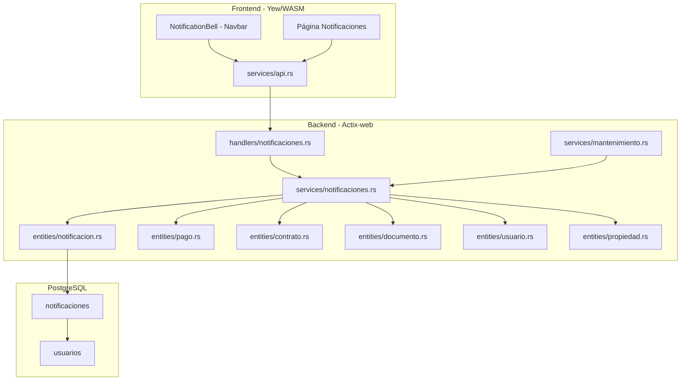
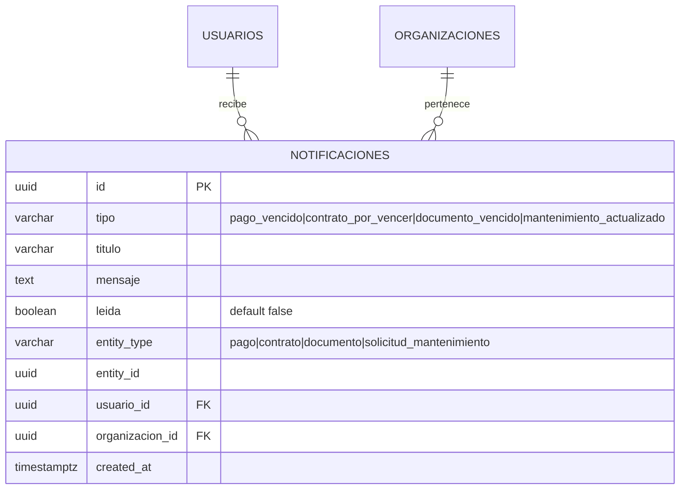

# Diseño — Sistema de Notificaciones

## Overview

Este módulo reemplaza el endpoint mínimo de notificaciones existente (GET /api/v1/notificaciones/pagos-vencidos) con un sistema completo de notificaciones persistidas. Introduce una nueva tabla `notificaciones`, endpoints REST para listar, contar no leídas, marcar como leída, marcar todas como leídas, y generar notificaciones. En el frontend, agrega una campana de notificaciones en la barra de navegación con badge de conteo y una página de listado con filtros y acciones de marcado.

El diseño introduce:
- Una tabla `notificaciones` con tipo, título, mensaje, estado de lectura, referencia polimórfica a entidad, y usuario.
- Un servicio `notificaciones.rs` refactorizado con funciones de CRUD y un `Generador_Notificaciones` que evalúa condiciones del negocio (pagos vencidos, contratos por vencer, documentos por vencer) y crea notificaciones evitando duplicados.
- Integración con el servicio de mantenimiento para generar notificaciones al cambiar estado de solicitudes.
- Componente `NotificationBell` en el navbar y página `/notificaciones` en el frontend.

## Architecture



El flujo sigue el patrón existente handlers → services → entities:

1. **`entities/notificacion.rs`** — Nueva entidad SeaORM mapeando la tabla `notificaciones`.
2. **`services/notificaciones.rs`** — Refactorizado: mantiene `listar_pagos_vencidos` existente, agrega funciones de CRUD para notificaciones y el generador que evalúa condiciones del negocio.
3. **`handlers/notificaciones.rs`** — Refactorizado: mantiene el handler `pagos_vencidos` existente, agrega handlers para listar, contar, marcar como leída, marcar todas, y generar.
4. **`services/mantenimiento.rs`** — Modificado: al cambiar estado de una solicitud, llama al servicio de notificaciones para crear notificaciones de tipo `mantenimiento_actualizado`.
5. **Frontend** — Nuevo componente `NotificationBell` en el navbar, nueva página `/notificaciones`.

### Decisiones de diseño

- **Deduplicación por (tipo, entity_type, entity_id, usuario_id)**: Antes de crear una notificación, se verifica que no exista una con la misma combinación. Esto permite invocar el generador múltiples veces sin crear duplicados.
- **Generación por organización**: Las notificaciones se generan para todos los usuarios activos de la organización a la que pertenece la entidad. Esto asegura que todos los gerentes y administradores reciban los avisos.
- **Sin scheduler**: El generador es una función que se invoca desde un endpoint o desde otros servicios. No hay tarea de fondo ni cron.
- **Endpoint legacy preservado**: El endpoint GET /pagos-vencidos se mantiene para compatibilidad. Los nuevos endpoints se agregan al mismo scope `/notificaciones`.
- **Notificaciones de mantenimiento inline**: Se generan directamente en el flujo de `cambiar_estado` del servicio de mantenimiento, no a través del generador batch.

## Components and Interfaces

### Database Migration

**Migration: `m20250501_000001_create_notificaciones`**

Crea la tabla `notificaciones` con:

| Columna | Tipo | Restricciones |
|---------|------|---------------|
| id | UUID | PK, DEFAULT gen_random_uuid() |
| tipo | VARCHAR(50) | NOT NULL |
| titulo | VARCHAR(500) | NOT NULL |
| mensaje | TEXT | NOT NULL |
| leida | BOOLEAN | NOT NULL, DEFAULT false |
| entity_type | VARCHAR(50) | NOT NULL |
| entity_id | UUID | NOT NULL |
| usuario_id | UUID | NOT NULL, FK → usuarios(id) |
| organizacion_id | UUID | NOT NULL, FK → organizaciones(id) |
| created_at | TIMESTAMP WITH TIME ZONE | NOT NULL, DEFAULT now() |

Índices:
- `idx_notificaciones_usuario_id` en `usuario_id`
- `idx_notificaciones_usuario_leida` en `(usuario_id, leida)` — para consultas de conteo de no leídas
- `idx_notificaciones_tipo_entity` en `(tipo, entity_type, entity_id, usuario_id)` UNIQUE — para deduplicación
- `idx_notificaciones_organizacion_id` en `organizacion_id`
- `idx_notificaciones_created_at` en `created_at` — para ordenamiento eficiente

### SeaORM Entity

**`entities/notificacion.rs`**

```rust
#[sea_orm(table_name = "notificaciones")]
pub struct Model {
    #[sea_orm(primary_key, auto_increment = false)]
    pub id: Uuid,
    pub tipo: String,
    pub titulo: String,
    #[sea_orm(column_type = "Text")]
    pub mensaje: String,
    pub leida: bool,
    pub entity_type: String,
    pub entity_id: Uuid,
    pub usuario_id: Uuid,
    pub organizacion_id: Uuid,
    pub created_at: DateTimeWithTimeZone,
}
```

Relaciones: `belongs_to Usuario`, `belongs_to Organizacion`.

### API Endpoints

Todos bajo `/api/v1/notificaciones`:

| Método | Ruta | Auth | Handler | Descripción |
|--------|------|------|---------|-------------|
| GET | `/pagos-vencidos` | Claims | `pagos_vencidos` | (existente) Listar pagos vencidos |
| GET | `` | Claims | `listar` | Listar notificaciones del usuario paginadas |
| GET | `/no-leidas/conteo` | Claims | `conteo_no_leidas` | Conteo de notificaciones no leídas |
| PUT | `/{id}/leer` | Claims | `marcar_leida` | Marcar una notificación como leída |
| PUT | `/leer-todas` | Claims | `marcar_todas_leidas` | Marcar todas como leídas |
| POST | `/generar` | WriteAccess | `generar` | Disparar generación de notificaciones |

### Request/Response Models

**Nuevos modelos en `models/notificacion.rs`** (se agregan al archivo existente):

```rust
#[derive(Debug, Serialize)]
#[serde(rename_all = "camelCase")]
pub struct NotificacionResponse {
    pub id: Uuid,
    pub tipo: String,
    pub titulo: String,
    pub mensaje: String,
    pub leida: bool,
    pub entity_type: String,
    pub entity_id: Uuid,
    pub usuario_id: Uuid,
    pub created_at: DateTime<Utc>,
}

#[derive(Debug, Deserialize)]
#[serde(rename_all = "camelCase")]
pub struct NotificacionListQuery {
    pub leida: Option<bool>,
    pub tipo: Option<String>,
    pub page: Option<u64>,
    pub per_page: Option<u64>,
}

#[derive(Debug, Serialize)]
#[serde(rename_all = "camelCase")]
pub struct ConteoNoLeidasResponse {
    pub count: u64,
}

#[derive(Debug, Serialize)]
#[serde(rename_all = "camelCase")]
pub struct MarcarTodasResponse {
    pub actualizadas: u64,
}

#[derive(Debug, Serialize)]
#[serde(rename_all = "camelCase")]
pub struct GenerarNotificacionesResponse {
    pub pago_vencido: u64,
    pub contrato_por_vencer: u64,
    pub documento_vencido: u64,
    pub total: u64,
}
```

### Service Layer

**`services/notificaciones.rs`** — Refactorizado:

Se mantiene la función existente `listar_pagos_vencidos` sin cambios.

Nuevas funciones públicas:

- `listar(db, usuario_id, query) -> Result<PaginatedResponse<NotificacionResponse>>` — Lista paginada con filtros opcionales por `leida` y `tipo`. Filtra por `usuario_id`. Ordenada por `created_at` DESC.

- `conteo_no_leidas(db, usuario_id) -> Result<u64>` — Cuenta notificaciones donde `usuario_id` coincide y `leida == false`.

- `marcar_leida(db, id, usuario_id) -> Result<NotificacionResponse>` — Busca notificación por `id` y `usuario_id`. Si no existe, retorna NotFound. Si ya está leída, retorna sin cambios. Si no, actualiza `leida = true`.

- `marcar_todas_leidas(db, usuario_id) -> Result<u64>` — Usa `update_many` para cambiar `leida` a `true` donde `usuario_id` coincide y `leida == false`. Retorna `rows_affected`.

- `generar_notificaciones(db, organizacion_id) -> Result<GenerarNotificacionesResponse>` — Orquesta la generación de los tres tipos batch:
  1. Llama a `generar_pagos_vencidos`
  2. Llama a `generar_contratos_por_vencer`
  3. Llama a `generar_documentos_vencidos`
  4. Retorna conteos por tipo.

Funciones internas de generación:

- `generar_pagos_vencidos(db, organizacion_id) -> Result<u64>` — Consulta pagos con `estado = "pendiente"` y `fecha_vencimiento < hoy`. Para cada pago, obtiene la propiedad vía contrato. Obtiene todos los usuarios activos de la organización. Para cada par (pago, usuario), verifica deduplicación y crea notificación si no existe.

- `generar_contratos_por_vencer(db, organizacion_id) -> Result<u64>` — Consulta contratos con `estado = "activo"` y `fecha_fin` entre hoy y hoy+30 días. Para cada contrato, obtiene la propiedad. Para cada par (contrato, usuario), verifica deduplicación y crea notificación si no existe.

- `generar_documentos_vencidos(db, organizacion_id) -> Result<u64>` — Consulta documentos con `fecha_vencimiento` no nula y `fecha_vencimiento <= hoy + 30 días`. Para cada documento, obtiene los usuarios activos de la organización. Para cada par (documento, usuario), verifica deduplicación y crea notificación si no existe.

- `crear_notificacion_mantenimiento(db, solicitud_id, titulo_solicitud, estado_anterior, estado_nuevo, organizacion_id) -> Result<u64>` — Función pública llamada desde `services/mantenimiento.rs`. Crea notificaciones de tipo `mantenimiento_actualizado` para todos los usuarios activos de la organización. No verifica deduplicación porque cada cambio de estado es un evento único (se permite múltiples notificaciones para la misma solicitud).

Función auxiliar interna:

- `usuarios_activos_organizacion(db, organizacion_id) -> Result<Vec<Uuid>>` — Consulta usuarios con `organizacion_id` y `activo == true`. Retorna lista de IDs.

- `existe_notificacion(db, tipo, entity_type, entity_id, usuario_id) -> Result<bool>` — Verifica si ya existe una notificación con la combinación dada. Usa el índice único.

### Modificaciones a servicios existentes

**`services/mantenimiento.rs` — función `cambiar_estado`**:

Después de actualizar el estado exitosamente y antes de registrar auditoría, llama a:
```rust
notificaciones::crear_notificacion_mantenimiento(
    db,
    solicitud_id,
    &solicitud.titulo,
    estado_anterior,
    nuevo_estado,
    organizacion_id,
).await;
```

Se usa un enfoque best-effort: si la creación de notificaciones falla, se registra el error con `tracing::warn!` pero no se revierte la transición de estado. Esto sigue el patrón de `auditoria::registrar_best_effort`.

### Handlers

**`handlers/notificaciones.rs`** — Refactorizado:

Se mantiene el handler `pagos_vencidos` existente sin cambios.

Nuevos handlers:

```rust
pub async fn listar(
    db: web::Data<DatabaseConnection>,
    claims: Claims,
    query: web::Query<NotificacionListQuery>,
) -> Result<HttpResponse, AppError>

pub async fn conteo_no_leidas(
    db: web::Data<DatabaseConnection>,
    claims: Claims,
) -> Result<HttpResponse, AppError>

pub async fn marcar_leida(
    db: web::Data<DatabaseConnection>,
    claims: Claims,
    path: web::Path<Uuid>,
) -> Result<HttpResponse, AppError>

pub async fn marcar_todas_leidas(
    db: web::Data<DatabaseConnection>,
    claims: Claims,
) -> Result<HttpResponse, AppError>

pub async fn generar(
    db: web::Data<DatabaseConnection>,
    access: WriteAccess,
) -> Result<HttpResponse, AppError>
```

### Rutas

En `routes.rs`, se modifica el scope `/notificaciones` existente:

```rust
.service(
    web::scope("/notificaciones")
        .route("/pagos-vencidos", web::get().to(handlers::notificaciones::pagos_vencidos))
        .route("/no-leidas/conteo", web::get().to(handlers::notificaciones::conteo_no_leidas))
        .route("/leer-todas", web::put().to(handlers::notificaciones::marcar_todas_leidas))
        .route("/generar", web::post().to(handlers::notificaciones::generar))
        .route("/{id}/leer", web::put().to(handlers::notificaciones::marcar_leida))
        .route("", web::get().to(handlers::notificaciones::listar))
)
```

Nota: Las rutas estáticas (`/pagos-vencidos`, `/no-leidas/conteo`, `/leer-todas`, `/generar`) se registran antes de las dinámicas (`/{id}/leer`, `""`) para evitar conflictos de matching.

### Frontend

**Nuevo componente: `frontend/src/components/layout/notification_bell.rs`**

Componente `NotificationBell` que:
1. Al montar, llama a `GET /notificaciones/no-leidas/conteo` para obtener el conteo.
2. Muestra un ícono SVG de campana.
3. Si `count > 0`, muestra un badge numérico sobre la campana.
4. Al hacer clic, navega a `Route::Notificaciones`.

Se integra en `Navbar` entre `NavbarSearch` y `ThemeToggle`.

**Nueva página: `frontend/src/pages/notificaciones.rs`**

Componente `Notificaciones` con:
1. **Vista de listado**: Tabla paginada con columnas (Tipo, Título, Mensaje, Estado, Fecha). Filas no leídas con fondo destacado. Filtros por tipo y estado de lectura.
2. **Botón "Marcar todas como leídas"**: Llama a `PUT /notificaciones/leer-todas` y recarga la lista.
3. **Botón por fila "Marcar como leída"**: Llama a `PUT /notificaciones/{id}/leer` y actualiza la fila.
4. **Indicadores visuales por tipo**: Íconos/colores diferenciados — pago_vencido (rojo/moneda), contrato_por_vencer (naranja/documento), documento_vencido (amarillo/archivo), mantenimiento_actualizado (azul/herramienta).

**Nuevos tipos: `frontend/src/types/notificacion.rs`** — Se agregan al archivo existente:

```rust
#[derive(Debug, Clone, Serialize, Deserialize, PartialEq)]
#[serde(rename_all = "camelCase")]
pub struct Notificacion {
    pub id: String,
    pub tipo: String,
    pub titulo: String,
    pub mensaje: String,
    pub leida: bool,
    pub entity_type: String,
    pub entity_id: String,
    pub usuario_id: String,
    pub created_at: String,
}

#[derive(Debug, Clone, Serialize, Deserialize, PartialEq)]
#[serde(rename_all = "camelCase")]
pub struct ConteoNoLeidas {
    pub count: u64,
}

#[derive(Debug, Clone, Serialize, Deserialize, PartialEq)]
#[serde(rename_all = "camelCase")]
pub struct MarcarTodasResponse {
    pub actualizadas: u64,
}

#[derive(Debug, Clone, Serialize, Deserialize, PartialEq)]
#[serde(rename_all = "camelCase")]
pub struct GenerarNotificacionesResponse {
    pub pago_vencido: u64,
    pub contrato_por_vencer: u64,
    pub documento_vencido: u64,
    pub total: u64,
}
```

**Ruta**: Se agrega `Notificaciones` al enum `Route` en `app.rs` con `#[at("/notificaciones")]`.

**Navegación**: No se agrega al sidebar (las notificaciones se acceden desde la campana en el navbar).

## Data Models

### Entity Relationship Diagram



### Constantes de dominio

- **Tipos de notificación válidos**: `pago_vencido`, `contrato_por_vencer`, `documento_vencido`, `mantenimiento_actualizado`
- **Entity types válidos**: `pago`, `contrato`, `documento`, `solicitud_mantenimiento`
- **Días de anticipación para contratos por vencer**: 30
- **Días de anticipación para documentos por vencer**: 30
- **Estado inicial de leída**: `false`

## Correctness Properties

### Property 1: Listing returns only user's notifications

*For any* authenticated user with `usuario_id = U`, listing notifications should return only records where `usuario_id == U`. No notification belonging to a different user should appear in the results.

**Validates: Requirements 2.4, 3.2**

### Property 2: List ordering invariant

*For any* set of notifications for a user, listing them without filters should return records ordered by `created_at` descending — for every consecutive pair `(items[i], items[i+1])`, `items[i].created_at >= items[i+1].created_at`.

**Validates: Requirements 2.1**

### Property 3: Filtering returns only matching records

*For any* filter parameter (leida or tipo) applied to a list query, every record in the response should match the filter value. If filtering by `leida = false`, all returned records have `leida == false`. If filtering by `tipo = T`, all returned records have `tipo == T`.

**Validates: Requirements 2.2, 2.3**

### Property 4: Unread count consistency

*For any* user, the unread count returned by `conteo_no_leidas` should equal the number of notifications for that user where `leida == false`. After marking one notification as read, the count should decrease by exactly one (if it was previously unread). After marking all as read, the count should be zero.

**Validates: Requirements 3.1, 4.1, 5.1, 5.3**

### Property 5: Mark as read is idempotent

*For any* notification that is already marked as read (`leida == true`), calling `marcar_leida` again should return the notification unchanged. The unread count should not change.

**Validates: Requirements 4.4**

### Property 6: Mark all as read updates only unread

*For any* set of notifications for a user, calling `marcar_todas_leidas` should set `leida = true` on all notifications where `leida == false`, and the returned count should equal the number of previously unread notifications. Notifications already marked as read should remain unchanged.

**Validates: Requirements 5.1, 5.2, 5.3**

### Property 7: Notification deduplication

*For any* invocation of the generator for a given organization, calling the generator twice in succession (without any state changes in between) should produce zero new notifications on the second call. The total notification count should remain the same after the second invocation.

**Validates: Requirements 6.3, 7.3, 8.3**

### Property 8: Generated notifications have correct fields

*For any* notification created by the generator, the `tipo` field should be one of the valid Tipo_Notificacion values, the `entity_type` should correspond to the tipo (pago_vencido → pago, contrato_por_vencer → contrato, documento_vencido → documento), the `titulo` should be non-empty, and the `mensaje` should be non-empty.

**Validates: Requirements 1.2, 6.2, 7.2, 8.2**

### Property 9: Cross-user isolation on mark operations

*For any* two users A and B, user A marking a notification as read should not affect user B's notifications or unread count. User A attempting to mark user B's notification should receive a not-found error.

**Validates: Requirements 4.3**

### Property 10: New notifications default to unread

*For any* notification created by the generator or by the mantenimiento integration, the `leida` field should be `false` at creation time.

**Validates: Requirements 1.3**

## Error Handling

Todos los errores siguen el patrón existente de `AppError` en `backend/src/errors.rs`:

| Escenario | Error | HTTP Status |
|-----------|-------|-------------|
| Notificación no encontrada | `AppError::NotFound("Notificación no encontrada")` | 404 |
| Notificación de otro usuario | `AppError::NotFound("Notificación no encontrada")` | 404 |
| Tipo de notificación inválido | `AppError::Validation("Tipo de notificación inválido...")` | 422 |
| Visualizador intenta generar | `AppError::Forbidden` via `WriteAccess` extractor | 403 |
| Error de base de datos | `AppError::Internal` via `From<DbErr>` | 500 |

La generación de notificaciones de mantenimiento usa enfoque best-effort: si falla, se registra con `tracing::warn!` pero no afecta la operación principal.

## Testing Strategy

### Unit Tests

Tests en `backend/src/services/notificaciones.rs` bajo `#[cfg(test)]`:

- Conversión `From<Model>` para `NotificacionResponse`
- Validación de tipos de notificación válidos/inválidos
- Función `existe_notificacion` con datos mock

Tests en `backend/src/models/notificacion.rs` bajo `#[cfg(test)]`:
- Serialización de `NotificacionResponse` produce camelCase
- Serialización de `ConteoNoLeidasResponse`, `MarcarTodasResponse`, `GenerarNotificacionesResponse`
- Deserialización de `NotificacionListQuery` con campos opcionales

### Property-Based Tests

Librería: `proptest` (ya disponible en dev-dependencies).

Cada test ejecuta mínimo 100 iteraciones.

| Property | Test | Descripción |
|----------|------|-------------|
| P1 | `test_listing_returns_only_users_notifications` | Genera notificaciones para múltiples usuarios, lista para uno, verifica que solo aparecen las suyas |
| P2 | `test_list_ordering_invariant` | Genera múltiples notificaciones, lista, verifica orden descendente por created_at |
| P3 | `test_filtering_returns_matching` | Genera notificaciones con tipos/leida variados, filtra, verifica coincidencia |
| P4 | `test_unread_count_consistency` | Genera notificaciones, verifica conteo, marca una, verifica conteo-1, marca todas, verifica 0 |
| P5 | `test_mark_read_idempotent` | Marca notificación como leída dos veces, verifica que el resultado y conteo son iguales |
| P6 | `test_mark_all_updates_only_unread` | Genera mix de leídas/no leídas, marca todas, verifica conteo retornado y estado final |
| P7 | `test_deduplication` | Genera notificaciones, invoca generador dos veces, verifica cero nuevas en segunda invocación |
| P8 | `test_generated_notifications_correct_fields` | Genera notificaciones, verifica tipo, entity_type, titulo no vacío, mensaje no vacío |
| P9 | `test_cross_user_isolation` | Genera notificaciones para dos usuarios, marca como leída del usuario A, verifica que B no cambia |
| P10 | `test_new_notifications_default_unread` | Genera notificaciones, verifica que todas tienen leida == false |

### Integration Tests

Archivo: `backend/tests/notificaciones_tests.rs`

Tests de ciclo completo request/response contra la API:
- Listar notificaciones vacías → respuesta paginada vacía
- Generar notificaciones → verificar conteos por tipo
- Listar notificaciones después de generar → verificar que aparecen
- Filtrar por tipo → solo notificaciones del tipo solicitado
- Filtrar por leida → solo notificaciones con el estado solicitado
- Conteo no leídas → verificar número correcto
- Marcar una como leída → verificar leida=true, conteo decrementado
- Marcar una que no existe → 404
- Marcar una de otro usuario → 404
- Marcar todas como leídas → verificar conteo retornado y conteo posterior = 0
- Generar como visualizador → 403
- Generar dos veces → segunda vez retorna cero nuevas (deduplicación)
- Verificar que cambio de estado en mantenimiento genera notificación de tipo mantenimiento_actualizado
- Verificar que el endpoint legacy /pagos-vencidos sigue funcionando
