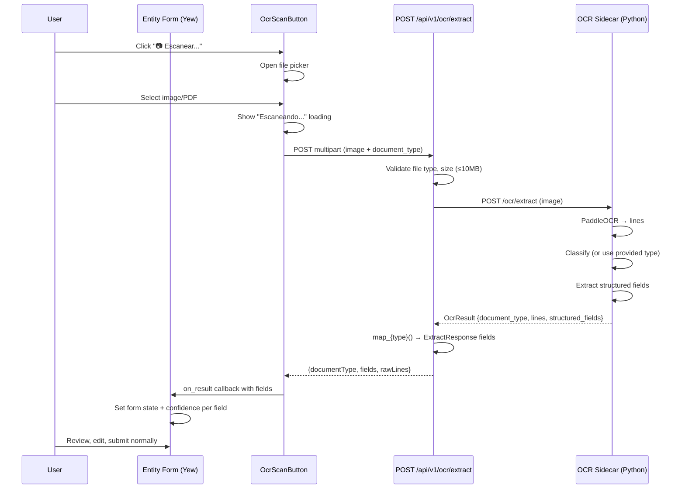
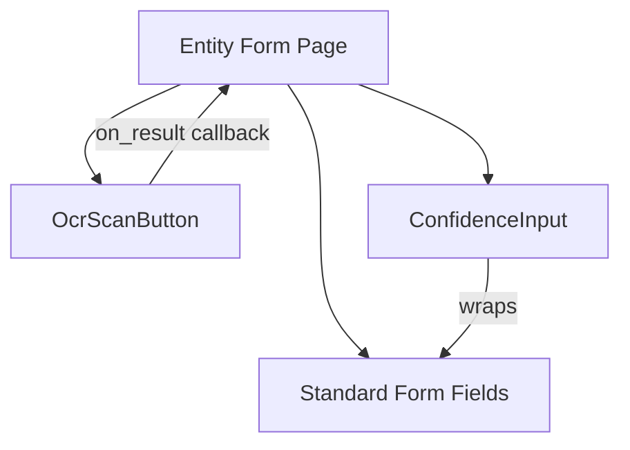

# Design Document: OCR Form Pre-fill

## Overview

This feature moves OCR extraction from the bulk import page into entity creation forms. Instead of a separate preview/confirm workflow, uploading a document photo pre-fills the form the user is already on. The user reviews pre-filled fields naturally, edits anything wrong, and saves with the existing submit button.

The architecture reuses the existing OCR sidecar (Python/PaddleOCR), `OcrClient`, and `ocr_mapping` module. A new stateless `POST /api/v1/ocr/extract` endpoint replaces the import-coupled flow — it accepts an image + optional `document_type`, calls the sidecar, maps fields, and returns them without persisting anything. The frontend uses a reusable `OcrScanButton` component that any form can embed to trigger extraction and receive mapped fields via callback.

Two new document types are added: `cedula` (tenant ID cards) and `contrato` (rental agreements). The sidecar gains classification and extraction logic for both. The backend gains `map_cedula` and `map_contrato` mapping functions alongside the existing `map_deposito` and `map_gasto`.

### Key Design Decisions

1. **Stateless extract endpoint** — The new endpoint returns fields directly without storing them in `PreviewStore`. The form itself is the "preview" — no confirm/discard round-trip needed. This simplifies the flow and eliminates server-side state management for form pre-fill.

2. **Explicit `document_type` parameter** — Forms know what document they expect (e.g., Pagos sends `deposito_bancario`). Passing `document_type` skips the sidecar's automatic classification, reducing misclassification. When omitted, the sidecar classifies automatically (backward-compatible for the import page).

3. **New response shape** — The extract endpoint returns `{ documentType, fields: [{name, value, label, confidence}], rawLines }` instead of `ImportPreview` (which includes `preview_id`). This avoids coupling to the preview/confirm flow.

4. **Reusable `OcrScanButton`** — A single component handles file picker, upload, loading state, and error display. Each form provides a `document_type` and an `on_result` callback that maps fields to form state. This keeps form-specific logic in the form and generic OCR logic in the component.

5. **`ConfidenceInput` wrapper** — A reusable wrapper component applies amber border + confidence badge styling. Confidence state is tracked per-field and cleared on manual edit.

## Architecture



### Component Hierarchy



### Backend Layer Flow

```
Handler (ocr_extract)
  → Validate multipart: file type, size ≤ 10MB
  → Extract document_type form field (optional)
  → OcrClient::extract() → sidecar HTTP call
  → match document_type:
      "deposito_bancario" → map_deposito_extract()
      "recibo_gasto"      → map_gasto_extract()
      "cedula"            → map_cedula()
      "contrato"          → map_contrato()
      _                   → return raw fields
  → Return ExtractResponse JSON
```

## Components and Interfaces

### Backend

#### New Handler: `handlers/ocr.rs`

```rust
pub async fn ocr_extract(
    _access: WriteAccess,
    payload: Multipart,
) -> Result<HttpResponse, AppError>
```

Accepts multipart with fields:
- `file` — image/PDF file (required, ≤10MB, JPEG/PNG/PDF)
- `document_type` — string (optional): `deposito_bancario`, `recibo_gasto`, `cedula`, `contrato`

Returns `ExtractResponse` JSON.

#### New Model: `models/ocr.rs` additions

```rust
#[derive(Serialize)]
#[serde(rename_all = "camelCase")]
pub struct ExtractResponse {
    pub document_type: String,
    pub fields: Vec<ExtractField>,
    pub raw_lines: Vec<String>,
}

#[derive(Serialize)]
#[serde(rename_all = "camelCase")]
pub struct ExtractField {
    pub name: String,
    pub value: String,
    pub label: String,
    pub confidence: f64,
}
```

#### New Mapping Functions: `services/ocr_mapping.rs`

```rust
pub fn map_cedula(result: &OcrResult) -> Result<Vec<ExtractField>, AppError>
pub fn map_contrato(result: &OcrResult) -> Result<Vec<ExtractField>, AppError>
pub fn map_deposito_extract(result: &OcrResult) -> Result<Vec<ExtractField>, AppError>
pub fn map_gasto_extract(result: &OcrResult) -> Result<Vec<ExtractField>, AppError>
```

`map_deposito_extract` and `map_gasto_extract` reuse the existing mapping logic but return `Vec<ExtractField>` instead of `ImportPreview` (no `preview_id`, no `Uuid`).

#### Cédula Normalization

```rust
pub fn normalize_cedula(raw: &str) -> String
```

Strips non-digit characters, then formats as `NNN-NNNNNNN-N` if 11 digits. Returns the cleaned string otherwise.

#### Route Registration

```rust
.service(
    web::scope("/ocr")
        .route("/extract", web::post().to(handlers::ocr::ocr_extract))
)
```

Added under `/api/v1/ocr/extract`.

### OCR Sidecar (Python)

#### New Classification Rules in `_classify_document`

Priority order (highest first):
1. `cedula` — keywords: CEDULA, IDENTIDAD, ELECTORAL, REPUBLICA DOMINICANA
2. `contrato` — keywords: CONTRATO, ARRENDAMIENTO, ALQUILER
3. `deposito_bancario` — existing keywords
4. `recibo_gasto` — existing keywords
5. `unknown` — fallback

#### New Extraction in `_extract_structured_fields`

**`cedula` type:**
- `cedula` — regex `\d{3}-?\d{7}-?\d` normalized to `NNN-NNNNNNN-N`
- `nombre` — positional: line after header containing name keywords
- `apellido` — positional: line after nombre

**`contrato` type:**
- `monto_mensual` — monetary amount near CANON/RENTA/MENSUAL/ALQUILER keywords
- `moneda` — RD$/US$ prefix detection
- `fecha_inicio` — date near DESDE/INICIO/VIGENCIA
- `fecha_fin` — date near HASTA/FIN/VENCIMIENTO
- `deposito` — monetary amount near DEPOSITO/GARANTIA

#### Optional `document_type` Query Parameter

The sidecar endpoint accepts an optional `document_type` form field. When provided, classification is skipped and the provided type is used directly for field extraction.

### Frontend

#### `OcrScanButton` Component (`components/common/ocr_scan_button.rs`)

```rust
#[derive(Properties, PartialEq)]
pub struct OcrScanButtonProps {
    pub document_type: AttrValue,
    pub on_result: Callback<Vec<OcrExtractField>>,
    pub label: AttrValue,
    #[prop_or_default]
    pub disabled: bool,
}
```

Behavior:
- Renders a button with the provided `label` text
- On click, opens a hidden `<input type="file" accept=".jpg,.jpeg,.png,.pdf">`
- On file selection, POSTs to `/api/v1/ocr/extract` as multipart with `file` + `document_type`
- Shows "Escaneando..." loading state while request is in flight
- On success, calls `on_result` with the extracted fields
- On error, shows inline error message below the button that auto-dismisses after 5 seconds (with cleanup closure for the timer)

#### `ConfidenceInput` Component (`components/common/confidence_input.rs`)

```rust
#[derive(Properties, PartialEq)]
pub struct ConfidenceInputProps {
    pub value: AttrValue,
    pub confidence: Option<f64>,
    pub oninput: Callback<InputEvent>,
    #[prop_or_default]
    pub input_type: AttrValue,  // defaults to "text"
    #[prop_or_default]
    pub placeholder: AttrValue,
    #[prop_or_default]
    pub class: AttrValue,       // additional CSS classes
}
```

Behavior:
- Wraps a standard `<input>` with confidence-aware styling
- confidence ≥ 0.7 or `None` → standard `gi-input` appearance
- confidence < 0.7 → amber border (`#f59e0b`), light amber background (`#fffbeb`), badge showing "Confianza: NN%"
- When user edits the field (oninput fires), the parent clears the confidence to `None`, removing the indicator

#### Frontend Type: `types/ocr.rs` additions

```rust
#[derive(Debug, Clone, Serialize, Deserialize, PartialEq)]
#[serde(rename_all = "camelCase")]
pub struct OcrExtractResponse {
    pub document_type: String,
    pub fields: Vec<OcrExtractField>,
    pub raw_lines: Vec<String>,
}

#[derive(Debug, Clone, Serialize, Deserialize, PartialEq)]
#[serde(rename_all = "camelCase")]
pub struct OcrExtractField {
    pub name: String,
    pub value: String,
    pub label: String,
    pub confidence: f64,
}
```

#### Form Integration Pattern

Each form page follows this pattern:

```rust
// Per-field confidence tracking
let confidences = use_state(|| HashMap::<String, f64>::new());

// OCR result callback
let on_ocr_result = {
    let monto = monto.clone();
    let moneda = moneda.clone();
    let confidences = confidences.clone();
    Callback::from(move |fields: Vec<OcrExtractField>| {
        let mut conf_map = HashMap::new();
        for field in &fields {
            match field.name.as_str() {
                "monto" => monto.set(field.value.clone()),
                "moneda" => moneda.set(field.value.clone()),
                // ... form-specific mappings
                _ => {}
            }
            conf_map.insert(field.name.clone(), field.confidence);
        }
        confidences.set(conf_map);
    })
};

// Clear confidence on manual edit
let input_cb_with_confidence = |state: UseStateHandle<String>, field_name: &str| {
    let confidences = confidences.clone();
    let name = field_name.to_string();
    Callback::from(move |e: InputEvent| {
        let input: HtmlInputElement = e.target_unchecked_into();
        state.set(input.value());
        let mut c = (*confidences).clone();
        c.remove(&name);
        confidences.set(c);
    })
};
```

#### Import Page Changes

The entity type dropdown in `pages/importar.rs` adds two new options:
- `<option value="pagos">{"Pagos"}</option>`
- `<option value="gastos">{"Gastos"}</option>`

These use the existing import flow (upload → preview → confirm/discard) via the existing `/api/v1/importar/pagos` and `/api/v1/importar/gastos` endpoints.

## Data Models

### Backend Response: `ExtractResponse`

| Field | Type | Description |
|---|---|---|
| `documentType` | `String` | Detected or provided document type |
| `fields` | `Vec<ExtractField>` | Mapped form fields |
| `rawLines` | `Vec<String>` | Raw OCR text lines for debugging |

### `ExtractField`

| Field | Type | Description |
|---|---|---|
| `name` | `String` | Form field name (e.g., `monto`, `cedula`) |
| `value` | `String` | Extracted value |
| `label` | `String` | Human-readable label in Spanish |
| `confidence` | `f64` | OCR confidence score 0.0–1.0 |

### Field Mappings by Document Type

**`deposito_bancario`** → Pagos form:
| OCR Field | Form Field | Label |
|---|---|---|
| `monto` | `monto` | Monto |
| `moneda` | `moneda` | Moneda |
| `fecha` | `fecha_pago` | Fecha de Pago |
| `referencia` + `cuenta` | `notas` | Notas |
| (hardcoded) | `metodo_pago` = "transferencia" | Método de Pago |

**`recibo_gasto`** → Gastos form:
| OCR Field | Form Field | Label |
|---|---|---|
| `monto` | `monto` | Monto |
| `moneda` | `moneda` | Moneda |
| `fecha` | `fecha_gasto` | Fecha de Gasto |
| `proveedor` | `proveedor` | Proveedor |
| `numero_factura` | `numero_factura` | Número de Factura |

**`cedula`** → Inquilinos form:
| OCR Field | Form Field | Label |
|---|---|---|
| `cedula` | `cedula` | Cédula |
| `nombre` | `nombre` | Nombre |
| `apellido` | `apellido` | Apellido |

**`contrato`** → Contratos form:
| OCR Field | Form Field | Label |
|---|---|---|
| `monto_mensual` | `monto_mensual` | Monto Mensual |
| `moneda` | `moneda` | Moneda |
| `fecha_inicio` | `fecha_inicio` | Fecha de Inicio |
| `fecha_fin` | `fecha_fin` | Fecha de Fin |
| `deposito` | `deposito` | Depósito |

### Cédula Format

Dominican cédula: `NNN-NNNNNNN-N` (11 digits with dashes). Input may arrive as `00112345678` or `001-1234567-8`. Both normalize to `001-1234567-8`.


## Correctness Properties

*A property is a characteristic or behavior that should hold true across all valid executions of a system — essentially, a formal statement about what the system should do. Properties serve as the bridge between human-readable specifications and machine-verifiable correctness guarantees.*

### Property 1: Cédula normalization is idempotent and format-preserving

*For any* string of exactly 11 digits (with or without dashes), `normalize_cedula` SHALL produce a string in the format `NNN-NNNNNNN-N`, and applying `normalize_cedula` again to the output SHALL produce the same result.

**Validates: Requirements 2.3, 4.4**

### Property 2: Cédula classification takes priority

*For any* set of OCR lines where the combined text contains at least one cédula keyword (CEDULA, IDENTIDAD, ELECTORAL, REPUBLICA DOMINICANA), `_classify_document` SHALL return `"cedula"` regardless of whether deposit or expense keywords are also present.

**Validates: Requirements 2.1, 2.5**

### Property 3: Contract classification takes priority over expense

*For any* set of OCR lines where the combined text contains at least one contract keyword (CONTRATO, ARRENDAMIENTO, ALQUILER), `_classify_document` SHALL return `"contrato"` regardless of whether expense keywords are also present.

**Validates: Requirements 3.1, 3.6**

### Property 4: Provided document_type is used verbatim

*For any* valid `document_type` value from the set {`deposito_bancario`, `recibo_gasto`, `cedula`, `contrato`}, when provided to the extract endpoint, the response's `documentType` field SHALL equal the provided value, regardless of the document content.

**Validates: Requirements 1.3**

### Property 5: Extract response contains required structure

*For any* successful OCR extraction, the response SHALL contain a `documentType` (non-empty string), `fields` (array where each element has `name`, `value`, `label` as strings and `confidence` as a number in [0.0, 1.0]), and `rawLines` (array of strings).

**Validates: Requirements 1.5**

### Property 6: map_cedula produces exactly the required fields

*For any* `OcrResult` with `document_type: "cedula"` and `structured_fields` containing keys `cedula`, `nombre`, and `apellido`, `map_cedula` SHALL produce exactly three fields with names `cedula`/`nombre`/`apellido` and labels `Cédula`/`Nombre`/`Apellido`, and the `cedula` field value SHALL be in `NNN-NNNNNNN-N` format.

**Validates: Requirements 4.2, 4.4**

### Property 7: map_contrato produces the required fields with graceful degradation

*For any* `OcrResult` with `document_type: "contrato"`, `map_contrato` SHALL produce fields with names `monto_mensual`, `moneda`, `fecha_inicio`, `fecha_fin`, `deposito` and their corresponding Spanish labels. If `monto_mensual` is not present in `structured_fields`, the field SHALL have an empty value and confidence 0.0.

**Validates: Requirements 5.2, 5.4**

### Property 8: Field confidence matches highest matching OCR line

*For any* `OcrResult` and any mapped field whose value appears in at least one OCR line, the field's confidence SHALL equal the maximum confidence among all lines whose text contains (or is contained by) the field value.

**Validates: Requirements 4.3**

### Property 9: Confidence threshold determines styling

*For any* confidence value, a `ConfidenceInput` with confidence < 0.7 SHALL render with amber border and background styling and display a "Confianza: NN%" badge, while confidence ≥ 0.7 (or None) SHALL render with standard styling and no badge.

**Validates: Requirements 6.6, 7.4, 8.3, 9.4, 11.1, 11.2, 11.3**

## Error Handling

### Backend Errors

| Condition | HTTP Status | Error Type | Message |
|---|---|---|---|
| No file in multipart | 422 | `validation` | "No se encontró archivo en la solicitud" |
| Invalid file type | 422 | `validation` | "Formato no soportado. Use archivos JPEG, PNG o PDF" |
| File exceeds 10MB | 422 | `validation` | "El archivo excede el tamaño máximo de 10 MB" |
| Invalid document_type value | 422 | `validation` | "Tipo de documento no válido" |
| OCR sidecar unreachable | 503 | `internal` | "Servicio OCR no disponible" |
| OCR sidecar returns error | 500 | `internal` | "Error interno del servidor" |
| Unauthorized (no token / invalid) | 401 | `unauthorized` | "No autorizado" |
| Forbidden (visualizador role) | 403 | `forbidden` | "Acceso denegado" |

The handler uses the existing `AppError` variants. The sidecar unreachable case requires a new check: if the `reqwest` call fails with a connection error, return `AppError::BadRequest` with the 503 message. This is achieved by matching on the reqwest error kind in `OcrClient::extract`.

### Frontend Errors

| Condition | Behavior |
|---|---|
| Network error during upload | Inline error below scan button, auto-dismiss 5s |
| 503 from backend | Show "Servicio OCR no disponible" inline |
| 422 validation error | Show the validation message inline |
| 401/403 | Redirect to login (handled by existing `api.rs` logic) |
| File picker cancelled | No action (no error shown) |

The `OcrScanButton` component manages its own error state. Errors display as a small red banner below the button and auto-dismiss after 5 seconds using a `Timeout` with a cleanup closure (per the Yew anti-pattern rules).

### Sidecar Errors

| Condition | HTTP Status | Response |
|---|---|---|
| Unsupported content type | 422 | `{"detail": "Formato no soportado. Use archivos JPEG, PNG o PDF"}` |
| File exceeds 10MB | 413 | `{"detail": "El archivo excede el tamaño máximo de 10 MB"}` |
| OCR engine failure | 500 | `{"detail": "Error procesando imagen"}` |
| No text detected | 200 | Empty lines array, `document_type: "unknown"`, empty fields |

## Testing Strategy

### Property-Based Tests (Rust — `proptest`)

Property-based tests validate the correctness properties defined above. Each test runs a minimum of 100 iterations with generated inputs.

**Backend PBT file:** `backend/src/services/ocr_mapping_pbt.rs`

| Property | What's Generated | What's Verified |
|---|---|---|
| P1: Cédula normalization | Random 11-digit strings, with/without dashes | Idempotence, NNN-NNNNNNN-N format |
| P4: Document type passthrough | Random valid document_type from set | Response documentType matches input |
| P5: Response shape | Random OcrResult with varying fields | All required fields present with correct types |
| P6: map_cedula output | Random OcrResult with cedula fields | Correct field names, labels, cédula format |
| P7: map_contrato output | Random OcrResult with/without contrato fields | Correct fields, graceful degradation |
| P8: Confidence propagation | Random OcrResult with known line confidences | Field confidence = max matching line confidence |

**Sidecar PBT file:** `ocr-service/test_classification_pbt.py` (using `hypothesis`)

| Property | What's Generated | What's Verified |
|---|---|---|
| P2: Cédula classification priority | Random text with cédula + other keywords | Classification = "cedula" |
| P3: Contract classification priority | Random text with contract + expense keywords | Classification = "contrato" |

**Frontend PBT:** Property 9 (confidence threshold) is best tested as a unit test with boundary values (0.0, 0.69, 0.7, 1.0) rather than PBT, since the logic is a simple threshold comparison.

### Unit Tests

**Backend:** `backend/src/services/ocr_mapping_tests.rs`
- `map_cedula` with full fields, missing fields, malformed cédula
- `map_contrato` with full fields, missing monto_mensual, unparseable dates
- `map_deposito_extract` and `map_gasto_extract` produce correct `ExtractField` vectors
- `normalize_cedula` edge cases: empty string, wrong length, already formatted
- Handler-level tests: valid request, missing file, invalid type, oversized file, sidecar down (mocked)

**Sidecar:** `ocr-service/test_main.py`
- `_classify_document` with each document type's keywords
- `_extract_structured_fields` for cedula and contrato types
- End-to-end `/ocr/extract` with `document_type` parameter

**Frontend:** Component-level tests are limited in Yew/WASM. Rely on:
- Compile-time type checking for prop interfaces
- Manual testing for UI behavior
- Integration tests via the backend for the full flow

### Integration Tests

- Full flow: upload image → backend → sidecar → mapped response
- Import page: Pagos/Gastos options trigger correct existing flows
- Authorization: verify WriteAccess enforcement on `/api/v1/ocr/extract`

### Test Configuration

- **PBT library (Rust):** `proptest` — add to `[dev-dependencies]` in `backend/Cargo.toml`
- **PBT library (Python):** `hypothesis` — already in use (`.hypothesis/` directory exists)
- **Minimum iterations:** 100 per property test
- **Tag format:** `// Feature: ocr-form-prefill, Property N: {description}`
