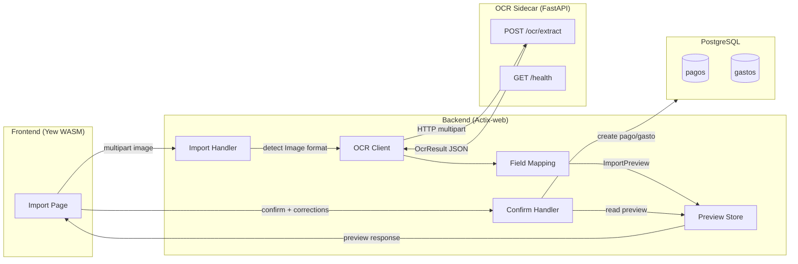

# Design Document: PaddleOCR Integration

## Overview

This feature adds OCR capability to the existing bulk import system via a Python FastAPI sidecar running PaddleOCR. Property managers upload photos of Dominican Republic bank deposit receipts and expense receipts through the same import page used for CSV/XLSX. The sidecar extracts text, the Rust backend maps extracted fields to existing data models (pagos, gastos), and the frontend presents a preview/correction step before persisting.

The system introduces three new components:
1. **OCR Sidecar** — A Python FastAPI service (`ocr-service/`) running PaddleOCR PP-OCRv5 + PP-StructureV3 on CPU, exposed via Docker Compose.
2. **OCR Client** — A Rust `reqwest`-based module (`backend/src/services/ocr_client.rs`) that calls the sidecar and deserializes responses.
3. **Field Mapping & Preview** — Backend logic that converts OCR results into pago/gasto field values, stores them temporarily, and exposes confirm/discard endpoints. The frontend renders an editable preview with confidence indicators.

The existing `POST /api/v1/importar/{entity_type}` handler and `ImportFormat` enum are extended to detect image files and route them through the OCR pipeline instead of the CSV/XLSX parsers.

## Architecture



### Request Flow

1. User selects an image file (`.jpg`, `.jpeg`, `.png`, `.pdf`) on the import page.
2. Frontend sends `POST /api/v1/importar/pagos` (or `/gastos`) with multipart file.
3. `Import Handler` detects `ImportFormat::Image` from the file extension.
4. `OCR Client` forwards the image bytes to the sidecar's `POST /ocr/extract`.
5. Sidecar runs PaddleOCR, classifies the document type, extracts structured fields, returns `OcrResult` JSON.
6. `Field Mapping` converts `OcrResult` into pago or gasto field values, attempts tenant matching for deposits.
7. Backend stores the mapped preview in an in-memory `DashMap<Uuid, ImportPreview>` with a 30-minute TTL and returns the preview to the frontend.
8. Frontend renders the editable preview with confidence highlighting.
9. User corrects fields if needed, clicks "Confirmar".
10. `POST /api/v1/importar/ocr/confirmar` reads the preview, applies corrections, persists the record.

### Technology Decisions

| Decision | Rationale |
|---|---|
| Python sidecar vs. Rust OCR | PaddleOCR has mature Python bindings; no stable Rust equivalent. Sidecar isolates the Python dependency. |
| `DashMap` for preview store | Lightweight, no DB migration needed for temporary data. TTL cleanup via a background `tokio::spawn` task. |
| `reqwest` for HTTP client | Already a well-known Rust HTTP client; `backend/Cargo.toml` doesn't have it yet but it's the standard choice for outbound HTTP. |
| PP-OCRv5 + PP-StructureV3 | PP-OCRv5 is the latest PaddleOCR text recognition model; PP-StructureV3 adds document structure parsing for field extraction. |

## Components and Interfaces

### 1. OCR Sidecar (Python FastAPI)

**Location:** `ocr-service/`

**Endpoints:**

| Method | Path | Request | Response | Status Codes |
|---|---|---|---|---|
| `POST` | `/ocr/extract` | Multipart file (`image`) | `OcrResult` JSON | 200, 413, 422 |
| `GET` | `/health` | — | `{"status": "ok"}` | 200 |

**`POST /ocr/extract` behavior:**
- Validates file format (JPEG, PNG, PDF) and size (≤ 10 MB).
- Runs PP-OCRv5 for text line recognition.
- Runs PP-StructureV3 for document structure parsing.
- Classifies document type based on keyword heuristics (e.g., "DEPOSITO", "AHORROS" → `deposito_bancario`).
- Extracts named fields into `structured_fields` based on document type.
- Returns `OcrResult` with lines, confidence scores, and structured fields.

### 2. OCR Client (Rust)

**Location:** `backend/src/services/ocr_client.rs`

```rust
pub struct OcrClient {
    base_url: String,
    client: reqwest::Client,
}

impl OcrClient {
    pub fn new(base_url: &str) -> Self;
    pub async fn extract(&self, file_data: &[u8], filename: &str, content_type: &str) -> Result<OcrResult, AppError>;
}
```

- Reads `OCR_SERVICE_URL` from environment.
- 30-second request timeout.
- Returns `AppError::Internal` on connection failure or deserialization error.

### 3. Field Mapping Module

**Location:** `backend/src/services/ocr_mapping.rs`

```rust
pub fn map_deposito(result: &OcrResult) -> Result<PreviewPago, AppError>;
pub fn map_gasto(result: &OcrResult) -> Result<PreviewGasto, AppError>;
pub fn parse_dr_date(text: &str) -> Result<NaiveDate, String>;
pub fn parse_dr_currency(text: &str) -> Result<(Decimal, String), String>;
```

- `parse_dr_date`: Handles DD-MM-YY, DD/MM/YYYY, DD-MM-YYYY, YYYY-MM-DD. Two-digit year rule: 00-49 → 2000-2049, 50-99 → 1950-1999.
- `parse_dr_currency`: Recognizes `RD$` → DOP, `US$` → USD. Strips thousands commas, parses decimal. Defaults to DOP if no prefix.

### 4. Preview Store

**Location:** `backend/src/services/ocr_preview.rs`

```rust
pub struct PreviewStore {
    previews: DashMap<Uuid, (ImportPreview, Instant)>,
}

impl PreviewStore {
    pub fn new() -> Self;
    pub fn insert(&self, preview: ImportPreview) -> Uuid;
    pub fn get(&self, id: &Uuid) -> Option<ImportPreview>;
    pub fn remove(&self, id: &Uuid) -> Option<ImportPreview>;
    pub fn cleanup_expired(&self);
}
```

- TTL: 30 minutes.
- `cleanup_expired` runs in a background `tokio::spawn` task every 5 minutes.
- Stored in Actix `app_data` as `web::Data<PreviewStore>`.

### 5. Import Handler Extensions

**Location:** `backend/src/handlers/importacion.rs`

New/modified endpoints:

| Method | Path | Description |
|---|---|---|
| `POST` | `/api/v1/importar/pagos` | Extended: detects image → OCR pipeline → returns preview |
| `POST` | `/api/v1/importar/gastos` | Extended: detects image → OCR pipeline → returns preview |
| `POST` | `/api/v1/importar/ocr/confirmar` | New: confirms a preview, persists pago or gasto |
| `DELETE` | `/api/v1/importar/ocr/preview/{preview_id}` | New: discards a pending preview |

### 6. Frontend Components

**Location:** `frontend/src/components/importacion/`

New components:
- `ocr_preview.rs` — Renders the editable preview form with confidence indicators. Fields with confidence < 0.7 highlighted in warning color (amber). "Confirmar" and "Descartar" buttons.
- `file_type_indicator.rs` — Shows icon/label for spreadsheet vs. image file type.

Modified:
- Import page (`frontend/src/pages/importacion.rs`) — Accept image file types, detect preview response, render `OcrPreview` component.

## Data Models

### OcrResult (Sidecar → Backend)

```json
{
  "document_type": "deposito_bancario",
  "lines": [
    {
      "text": "BANCO POPULAR DOMINICANO",
      "confidence": 0.97,
      "bbox": [10, 20, 300, 50]
    }
  ],
  "structured_fields": {
    "monto": "50,000.00",
    "moneda": "RD$",
    "fecha": "15/03/2025",
    "depositante": "JUAN PEREZ",
    "cuenta": "123-456789-0",
    "referencia": "DEP-2025-001"
  }
}
```

### Rust Structs

```rust
// backend/src/models/ocr.rs

#[derive(Debug, Clone, Serialize, Deserialize)]
pub struct OcrResult {
    pub document_type: String,
    pub lines: Vec<OcrLine>,
    pub structured_fields: HashMap<String, String>,
}

#[derive(Debug, Clone, Serialize, Deserialize)]
pub struct OcrLine {
    pub text: String,
    pub confidence: f64,
    pub bbox: Vec<f64>,
}

#[derive(Debug, Clone, Serialize, Deserialize)]
#[serde(rename_all = "camelCase")]
pub struct ImportPreview {
    pub preview_id: Uuid,
    pub document_type: String,
    pub fields: Vec<PreviewField>,
}

#[derive(Debug, Clone, Serialize, Deserialize)]
#[serde(rename_all = "camelCase")]
pub struct PreviewField {
    pub name: String,
    pub value: String,
    pub confidence: f64,
    pub label: String,
}

#[derive(Debug, Deserialize)]
#[serde(rename_all = "camelCase")]
pub struct ConfirmPreviewRequest {
    pub preview_id: Uuid,
    pub corrections: Option<HashMap<String, String>>,
}
```

### Frontend Types

```rust
// frontend/src/types/ocr.rs

#[derive(Debug, Clone, Serialize, Deserialize, PartialEq)]
#[serde(rename_all = "camelCase")]
pub struct ImportPreview {
    pub preview_id: String,
    pub document_type: String,
    pub fields: Vec<PreviewField>,
}

#[derive(Debug, Clone, Serialize, Deserialize, PartialEq)]
#[serde(rename_all = "camelCase")]
pub struct PreviewField {
    pub name: String,
    pub value: String,
    pub confidence: f64,
    pub label: String,
}
```

### ImportFormat Extension

```rust
// backend/src/models/importacion.rs
#[derive(Debug, Deserialize, Clone, Copy, PartialEq)]
pub enum ImportFormat {
    Csv,
    Xlsx,
    Image,
}
```

### Docker Compose Addition

```yaml
# docker-compose.prod.yml (addition)
ocr-service:
  build:
    context: ./ocr-service
    dockerfile: Dockerfile
  restart: unless-stopped
  security_opt:
    - no-new-privileges:true
  read_only: true
  tmpfs:
    - /tmp:noexec,nosuid,nodev
  healthcheck:
    test: ["CMD", "curl", "-f", "http://localhost:8000/health"]
    interval: 30s
    timeout: 10s
    retries: 3
    start_period: 60s
  environment:
    - PADDLEOCR_MODEL_DIR=/app/models
```

Backend service updated:
```yaml
backend:
  depends_on:
    db:
      condition: service_healthy
    ocr-service:
      condition: service_healthy
  environment:
    OCR_SERVICE_URL: http://ocr-service:8000
```


## Correctness Properties

*A property is a characteristic or behavior that should hold true across all valid executions of a system — essentially, a formal statement about what the system should do. Properties serve as the bridge between human-readable specifications and machine-verifiable correctness guarantees.*

### Property 1: OcrResult serialization round-trip

*For any* valid `OcrResult` value (with arbitrary document_type strings, lines containing Unicode text including accented Spanish characters á/é/í/ó/ú/ñ/ü, confidence scores between 0.0 and 1.0, bounding boxes, and structured_fields with arbitrary key-value pairs), serializing to JSON then deserializing back SHALL produce an equivalent `OcrResult`.

**Validates: Requirements 9.3, 9.4, 9.5**

### Property 2: Date parsing round-trip

*For any* valid `NaiveDate` in the range 1950-01-01 to 2049-12-31, and *for any* supported format (DD-MM-YY, DD/MM/YYYY, DD-MM-YYYY, YYYY-MM-DD), formatting the date in that format then parsing it with `parse_dr_date` SHALL produce the original `NaiveDate`. For two-digit year format DD-MM-YY, years 00-49 map to 2000-2049 and years 50-99 map to 1950-1999.

**Validates: Requirements 10.1, 10.2, 10.6**

### Property 3: Currency parsing round-trip

*For any* valid `Decimal` amount (non-negative, up to 2 decimal places) and *for any* currency prefix in {"RD$", "US$", ""}, formatting as a DR-style monetary string (comma thousands separators, period decimal separator) then parsing with `parse_dr_currency` SHALL produce the original amount and the correct currency code (RD$ → "DOP", US$ → "USD", no prefix → "DOP").

**Validates: Requirements 10.3, 10.4, 10.5, 10.7**

### Property 4: File extension detection

*For any* filename string ending in `.jpg`, `.jpeg`, `.png`, or `.pdf` (case-insensitive), `detect_format` SHALL return `ImportFormat::Image`. *For any* filename ending in `.csv`, `detect_format` SHALL return `ImportFormat::Csv`. *For any* filename ending in `.xlsx`, `detect_format` SHALL return `ImportFormat::Xlsx`.

**Validates: Requirements 3.2, 3.4**

### Property 5: Deposit receipt field mapping completeness

*For any* `OcrResult` with `document_type` equal to `"deposito_bancario"` and `structured_fields` containing keys `"monto"`, `"moneda"`, `"fecha"`, `"depositante"`, `"cuenta"`, and `"referencia"` with valid parseable values, `map_deposito` SHALL produce a `PreviewPago` where: monto equals the parsed amount, moneda is the correct currency code, fecha_pago is the parsed date, notas contains the account number and description, metodo_pago is `"deposito_bancario"`, and estado is `"pagado"`.

**Validates: Requirements 4.1, 4.2, 4.3, 4.4, 4.5, 4.8, 4.9**

### Property 6: Expense receipt field mapping completeness

*For any* `OcrResult` with `document_type` equal to `"recibo_gasto"` and `structured_fields` containing keys `"proveedor"`, `"monto"`, `"moneda"`, `"fecha"`, and `"numero_factura"` with valid parseable values, `map_gasto` SHALL produce a `PreviewGasto` where: proveedor equals the extracted vendor name, monto equals the parsed amount, moneda is the correct currency code, fecha_gasto is the parsed date, and numero_factura equals the extracted invoice number.

**Validates: Requirements 5.1, 5.2, 5.3, 5.4, 5.5**

### Property 7: Preview store TTL expiry

*For any* `ImportPreview` inserted into the `PreviewStore`, after the TTL period (30 minutes) has elapsed and `cleanup_expired` has run, `get` with the same `preview_id` SHALL return `None`.

**Validates: Requirements 6.5, 6.6**

## Error Handling

| Scenario | Error Type | HTTP Status | Message |
|---|---|---|---|
| OCR sidecar unreachable | `AppError::Internal` | 500 | "Servicio OCR no disponible" |
| OCR sidecar returns non-2xx | `AppError::Internal` | 500 | "Error del servicio OCR: {status}" |
| OCR response deserialization failure | `AppError::Internal` | 500 | "Error procesando respuesta OCR" |
| Unsupported file format | `AppError::Validation` | 422 | "Formato no soportado. Use archivos CSV, XLSX, o imágenes (JPG, PNG, PDF)" |
| Image exceeds 10 MB | `AppError::Validation` | 422 | "El archivo excede el tamaño máximo de 10 MB" |
| No recognizable amount in OCR result | Included in preview | — | Field marked with "monto no detectado" error |
| Preview not found (expired or invalid ID) | `AppError::NotFound` | 404 | "Vista previa no encontrada o expirada" |
| Confirm with invalid preview_id | `AppError::NotFound` | 404 | "Vista previa no encontrada o expirada" |
| Unknown document_type from sidecar | `AppError::Validation` | 422 | "Tipo de documento no reconocido: {type}" |
| Date parsing failure in field mapping | Included in preview | — | Field marked with "fecha no válida" warning |
| Currency parsing failure in field mapping | Included in preview | — | Field marked with "monto no válido" warning |

All error messages are in Spanish per localization requirements. Internal errors hide implementation details from the client.

## Testing Strategy

### Unit Tests (example-based)

| Test | Validates |
|---|---|
| `detect_format` returns `Image` for `.jpg`, `.jpeg`, `.png`, `.pdf` | Req 3.2 |
| `detect_format` returns `Csv`/`Xlsx` for existing formats | Req 3.4 |
| `detect_format` returns error for unsupported extensions | Req 1.5 |
| `map_deposito` sets `metodo_pago` to `"deposito_bancario"` | Req 4.8 |
| `map_deposito` sets `estado` to `"pagado"` | Req 4.9 |
| `map_gasto` returns error when monto missing | Req 5.6 |
| `parse_dr_date` parses each supported format with concrete examples | Req 10.1 |
| `parse_dr_currency` parses `"RD$50,000.00"` → (50000.00, "DOP") | Req 10.4 |
| `parse_dr_currency` defaults to DOP when no prefix | Req 10.5 |
| `PreviewStore::insert` and `get` round-trip | Req 6.2 |
| `PreviewStore::remove` deletes preview | Req 6.4 |
| `OcrClient` returns `AppError::Internal` on connection refused | Req 2.5 |
| `OcrClient` returns `AppError::Internal` on malformed JSON | Req 2.6 |

### Property-Based Tests (proptest)

Each property test runs a minimum of 100 iterations and references its design property.

| Test | Property | Library |
|---|---|---|
| `OcrResult` serialize/deserialize round-trip | Property 1 | `proptest` |
| DR date format/parse round-trip | Property 2 | `proptest` |
| DR currency format/parse round-trip | Property 3 | `proptest` |
| File extension → `ImportFormat` mapping | Property 4 | `proptest` |
| Deposit receipt field mapping completeness | Property 5 | `proptest` |
| Expense receipt field mapping completeness | Property 6 | `proptest` |
| Preview store TTL expiry | Property 7 | `proptest` |

Tag format: `Feature: paddleocr-integration, Property {N}: {title}`

### Integration Tests

| Test | Validates |
|---|---|
| Full OCR pipeline: upload image → get preview → confirm → verify DB record | Req 6.7, 6.8 |
| Tenant name matching for deposit receipts | Req 4.6, 4.7 |
| OCR sidecar health check | Req 1.7 |
| Docker Compose service definitions | Req 8.1-8.4 |

### Python Sidecar Tests (pytest)

| Test | Validates |
|---|---|
| `POST /ocr/extract` with valid JPEG returns 200 + OcrResult | Req 1.1, 1.4 |
| `POST /ocr/extract` with unsupported format returns 422 | Req 1.5 |
| `POST /ocr/extract` with oversized file returns 413 | Req 1.6 |
| `GET /health` returns 200 | Req 1.7 |
| Document type classification for deposit receipt keywords | Req 1.4 |
