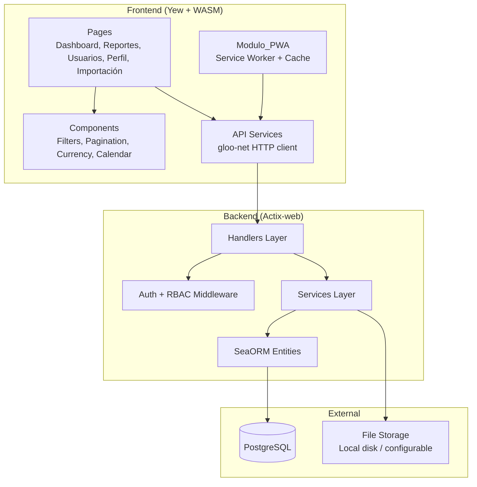

# Design Document: Platform Enhancements

## Overview

This design covers 19 enhancements to the Gestión Inmobiliaria platform, organized into functional groups:

1. **Reporting & Export** (Req 1–2): Monthly income reports with PDF/Excel export
2. **Notifications & Contract Lifecycle** (Req 3–6): Overdue payment alerts, contract renewal, early termination, expiration alerts
3. **Search & Filtering** (Req 7–9): Advanced property/payment filters, tenant search
4. **Administration** (Req 10, 12, 18): User management, audit log, user profile
5. **Payments & Documents** (Req 11, 14): Payment receipts, document uploads
6. **Frontend & UX** (Req 13, 15–17): Enhanced dashboard, pagination/sorting, multi-currency, PWA/offline
7. **Data Import** (Req 19): Bulk CSV/Excel import

All new backend endpoints follow the existing layered architecture (handlers → services → entities) with Actix-web, SeaORM, and PostgreSQL. The frontend uses Yew + WASM with Tailwind CSS. All UI text remains in Spanish.

## Architecture

### High-Level Architecture



### New Backend Services

| Service | Module | Responsibility |
|---------|--------|----------------|
| Servicio_Reportes | `services/reportes.rs` | Income aggregation, PDF/Excel generation |
| Servicio_Notificaciones | `services/notificaciones.rs` | Overdue payment detection and listing |
| Servicio_Contratos (extended) | `services/contratos.rs` | Renewal, early termination, expiration queries |
| Servicio_Busqueda | Extended in existing `services/propiedades.rs`, `pagos.rs`, `inquilinos.rs` | Advanced filtering and search |
| Servicio_Usuarios | `services/usuarios.rs` | User listing, role changes, activation/deactivation |
| Servicio_Recibos | `services/recibos.rs` | Payment receipt PDF generation |
| Servicio_Auditoria | `services/auditoria.rs` | Audit log recording and querying |
| Servicio_Documentos | `services/documentos.rs` | File upload, storage, metadata management |
| Servicio_Importacion | `services/importacion.rs` | CSV/XLSX parsing, validation, bulk insert |

### New Frontend Pages & Components

| Page/Component | Path | Description |
|----------------|------|-------------|
| Reportes page | `pages/reportes.rs` | Income report view with filters and export buttons |
| Usuarios page | `pages/usuarios.rs` | Admin user management table |
| Perfil page | `pages/perfil.rs` | User profile and password change |
| Importación page | `pages/importar.rs` | Bulk import upload UI |
| Auditoría page | `pages/auditoria.rs` | Audit log viewer (admin) |
| Pagination component | `components/common/pagination.rs` | Reusable page controls |
| CurrencyDisplay component | `components/common/currency_display.rs` | DOP/USD formatting with conversion |
| DocumentGallery component | `components/common/document_gallery.rs` | Upload/preview/download |
| SortableHeader component | `components/common/sortable_header.rs` | Clickable column sorting |

### New API Endpoints

```
# Reporting
GET    /api/reportes/ingresos?mes=&anio=&propiedad_id=&inquilino_id=
GET    /api/reportes/ingresos/pdf?mes=&anio=&...
GET    /api/reportes/ingresos/xlsx?mes=&anio=&...
GET    /api/reportes/historial-pagos?fecha_desde=&fecha_hasta=
GET    /api/reportes/ocupacion/tendencia?meses=12

# Notifications
GET    /api/notificaciones/pagos-vencidos

# Contract lifecycle
POST   /api/contratos/{id}/renovar
POST   /api/contratos/{id}/terminar
GET    /api/contratos/por-vencer?dias=90

# User management (admin only)
GET    /api/usuarios
PUT    /api/usuarios/{id}/rol
PUT    /api/usuarios/{id}/activar
PUT    /api/usuarios/{id}/desactivar

# Profile
GET    /api/perfil
PUT    /api/perfil
PUT    /api/perfil/password

# Receipts
GET    /api/pagos/{id}/recibo

# Audit log (admin only)
GET    /api/auditoria?entity_type=&entity_id=&usuario_id=&fecha_desde=&fecha_hasta=

# Documents
POST   /api/documentos/{entity_type}/{entity_id}
GET    /api/documentos/{entity_type}/{entity_id}

# Import (admin/gerente)
POST   /api/importar/propiedades
POST   /api/importar/inquilinos

# Enhanced dashboard
GET    /api/dashboard/stats              (extended)
GET    /api/dashboard/ocupacion-tendencia
GET    /api/dashboard/ingresos-comparacion
GET    /api/dashboard/pagos-proximos
GET    /api/dashboard/contratos-calendario

# Configuration
GET    /api/configuracion/moneda
PUT    /api/configuracion/moneda         (admin only)
```

### Existing Endpoints Extended with Filters

- `GET /api/pagos` — add `fecha_desde`, `fecha_hasta` query params to existing `PagoListQuery`
- `GET /api/inquilinos` — add `busqueda` query param for name/cédula search to existing list

The property list endpoint already supports `ciudad`, `provincia`, `tipo_propiedad`, `estado`, `precio_min`, `precio_max` via `PropiedadListQuery`. Only the frontend filter UI needs to be built.

### Request Flow

All new endpoints follow the existing pattern:
1. Handler receives HTTP request, extracts auth claims via `Claims`/`AdminOnly`/`WriteAccess` extractors
2. Handler calls service function with `&DatabaseConnection` and validated input
3. Service executes business logic using SeaORM queries within transactions where needed
4. Handler serializes the service result as JSON (or streams bytes for PDF/XLSX exports)

### Audit Logging Strategy

Audit logging is a service-level concern. Each service function that performs a CUD operation calls `auditoria::registrar()` within the same database transaction as the main operation, guaranteeing consistency (Req 12.5). The `registrar` function accepts a `&DatabaseTransaction` reference.

### File Storage Strategy

Documents and generated files are stored on local disk under a configurable `UPLOAD_DIR` path (env variable, default `./uploads`). The database stores relative file paths. A static file handler serves uploads. For production, this can be swapped to S3-compatible storage behind the same interface.

## Components and Interfaces

### 1. Reporting Service (Req 1–2)

**Backend: `services/reportes.rs`**

```rust
pub struct IngresoReportQuery {
    pub mes: u32,
    pub anio: i32,
    pub propiedad_id: Option<Uuid>,
    pub inquilino_id: Option<Uuid>,
}

pub struct IngresoReportRow {
    pub propiedad_titulo: String,
    pub inquilino_nombre: String,
    pub monto: Decimal,
    pub moneda: String,
    pub estado: String,
}

pub struct IngresoReportSummary {
    pub rows: Vec<IngresoReportRow>,
    pub total_pagado: Decimal,
    pub total_pendiente: Decimal,
    pub total_atrasado: Decimal,
    pub tasa_ocupacion: f64,
    pub generated_at: DateTime<Utc>,
    pub generated_by: String,
}

pub async fn generar_reporte_ingresos(db: &DatabaseConnection, query: IngresoReportQuery) -> Result<IngresoReportSummary, AppError>;
pub async fn historial_pagos(db: &DatabaseConnection, fecha_desde: NaiveDate, fecha_hasta: NaiveDate) -> Result<Vec<HistorialPagoEntry>, AppError>;
pub fn exportar_pdf(summary: &IngresoReportSummary) -> Result<Vec<u8>, AppError>;
pub fn exportar_xlsx(summary: &IngresoReportSummary) -> Result<Vec<u8>, AppError>;
```

Income report aggregation: joins `pagos → contratos → propiedades/inquilinos`, filters by month/year on `fecha_vencimiento`, groups by propiedad, sums by estado (pagado/pendiente/atrasado). Occupancy rate: `(propiedades with estado "ocupada") / total propiedades * 100`, rounded to one decimal.

PDF generation uses `genpdf` crate (pure Rust, no system deps). Excel generation uses `rust_xlsxwriter`. Both include: report title, date range, tabular data, summary totals, generation timestamp, requesting user name. Empty reports include a "Sin registros para el período" message.

### 2. Notifications Service (Req 3)

**Backend: `services/notificaciones.rs`**

```rust
pub struct PagoVencido {
    pub pago_id: Uuid,
    pub propiedad_titulo: String,
    pub inquilino_nombre: String,
    pub inquilino_apellido: String,
    pub monto: Decimal,
    pub moneda: String,
    pub dias_vencido: i64,
}

pub async fn listar_pagos_vencidos(db: &DatabaseConnection) -> Result<Vec<PagoVencido>, AppError>;
```

Overdue detection: a Pago is overdue when `estado == "pendiente"` AND `fecha_vencimiento < today`. `dias_vencido = (today - fecha_vencimiento).num_days()`. Query joins `pagos → contratos → propiedades` and `contratos → inquilinos`. Results sorted by `dias_vencido` descending. When a Pago transitions to "pagado", it naturally drops from the overdue list.

### 3. Contract Lifecycle (Req 4–6)

**Extended `services/contratos.rs`**

```rust
pub struct RenovarContratoRequest {
    pub fecha_fin: NaiveDate,
    pub monto_mensual: Decimal,
}

pub struct TerminarContratoRequest {
    pub fecha_terminacion: NaiveDate,
}

pub async fn renovar(db: &DatabaseConnection, contrato_id: Uuid, input: RenovarContratoRequest) -> Result<ContratoResponse, AppError>;
pub async fn terminar(db: &DatabaseConnection, contrato_id: Uuid, input: TerminarContratoRequest) -> Result<ContratoResponse, AppError>;
pub async fn listar_por_vencer(db: &DatabaseConnection, dias: Option<i64>) -> Result<Vec<ContratoResponse>, AppError>;
```

**Renewal** (within transaction):
1. Load original contrato, verify `estado == "activo"` (else reject)
2. Create new contrato: same `propiedad_id`/`inquilino_id`, `fecha_inicio = original.fecha_fin + 1 day`, user-specified `fecha_fin` and `monto_mensual`
3. Validate no overlap with other active contracts for the same propiedad
4. Set original contrato `estado = "finalizado"`

**Early termination** (within transaction):
1. Load contrato, verify `estado == "activo"` (else reject)
2. Verify `fecha_terminacion >= fecha_inicio` (else reject)
3. Set `estado = "terminado"`, `fecha_fin = fecha_terminacion`
4. If no other active contrato exists for the propiedad, set propiedad `estado = "disponible"`

**Expiration alerts**: query active contratos where `fecha_fin` is within N days (default 90). Frontend groups into 30/60/90-day buckets with color-coded indicators (red ≤15 days, yellow ≤30 days, green >30 days).

### 4. Advanced Filtering (Req 7–9)

Property filtering is already implemented in `PropiedadListQuery` with `ciudad`, `provincia`, `tipo_propiedad`, `estado`, `precio_min`, `precio_max`. Only the frontend filter UI needs to be built.

**Extended `PagoListQuery`** — add `fecha_desde` and `fecha_hasta`:

```rust
pub struct PagoListQuery {
    pub contrato_id: Option<Uuid>,
    pub estado: Option<String>,
    pub fecha_desde: Option<NaiveDate>,
    pub fecha_hasta: Option<NaiveDate>,
    pub page: Option<u64>,
    pub per_page: Option<u64>,
}
```

**Extended `InquilinoListQuery`** — add `busqueda`:

```rust
pub struct InquilinoListQuery {
    pub busqueda: Option<String>,
    pub page: Option<u64>,
    pub per_page: Option<u64>,
}
```

Tenant search uses `ILIKE '%term%'` on `nombre`, `apellido`, and `cedula` columns combined with OR logic. Search is skipped when the term is fewer than 2 characters.

### 5. User Management (Req 10)

**Backend: `services/usuarios.rs`**

```rust
pub async fn listar(db: &DatabaseConnection, page: u64, per_page: u64) -> Result<PaginatedResponse<UsuarioResponse>, AppError>;
pub async fn cambiar_rol(db: &DatabaseConnection, id: Uuid, nuevo_rol: &str) -> Result<UsuarioResponse, AppError>;
pub async fn desactivar(db: &DatabaseConnection, id: Uuid) -> Result<UsuarioResponse, AppError>;
pub async fn activar(db: &DatabaseConnection, id: Uuid) -> Result<UsuarioResponse, AppError>;
```

All endpoints restricted to `AdminOnly` extractor. Role validation: only "admin", "gerente", "visualizador" accepted. Login flow in `services/auth.rs` extended to check `activo == true` before issuing JWT — inactive users receive a "Cuenta inactiva" error.

### 6. Payment Receipts (Req 11)

**Backend: `services/recibos.rs`**

```rust
pub async fn generar_recibo(db: &DatabaseConnection, pago_id: Uuid) -> Result<Vec<u8>, AppError>;
```

Generates a PDF receipt with: company header, Propiedad dirección, Inquilino nombre + cédula, Contrato reference, monto, moneda, fecha_pago, método_pago, unique receipt number (UUID-based). Date formatted as DD/MM/YYYY. Currency formatted per DR conventions. Rejects with error if Pago `estado != "pagado"`.

### 7. Audit Log (Req 12)

**Backend: `services/auditoria.rs`**

```rust
pub struct CreateAuditoriaEntry {
    pub usuario_id: Uuid,
    pub entity_type: String,
    pub entity_id: Uuid,
    pub accion: String,
    pub cambios: serde_json::Value,
}

pub async fn registrar(txn: &DatabaseTransaction, entry: CreateAuditoriaEntry) -> Result<(), AppError>;
pub async fn listar(db: &DatabaseConnection, query: AuditoriaQuery) -> Result<PaginatedResponse<AuditoriaResponse>, AppError>;
```

Audit entries are inserted within the same database transaction as the originating operation. Existing create/update/delete service functions are modified to accept a transaction and call `registrar` before commit. Viewing restricted to admin role.

### 8. Document Uploads (Req 14)

**Backend: `services/documentos.rs`**

```rust
pub async fn upload(db: &DatabaseConnection, entity_type: &str, entity_id: Uuid, file_data: &[u8], filename: &str, mime_type: &str, uploaded_by: Uuid) -> Result<DocumentoResponse, AppError>;
pub async fn listar_documentos(db: &DatabaseConnection, entity_type: &str, entity_id: Uuid) -> Result<Vec<DocumentoResponse>, AppError>;
```

Files stored on local disk under `{UPLOAD_DIR}/{entity_type}/{entity_id}/{uuid}-{filename}`. Metadata stored in `documentos` table. Validation: max 10 MB, allowed MIME types: `image/jpeg`, `image/png`, `application/pdf`. Uses `actix-multipart` for upload handling. Frontend shows gallery for images, download links for PDFs.

### 9. Enhanced Dashboard (Req 13)

**Extended `services/dashboard.rs`**

```rust
pub async fn ocupacion_tendencia(db: &DatabaseConnection, meses: u32) -> Result<Vec<OcupacionMensual>, AppError>;
pub async fn ingreso_comparacion(db: &DatabaseConnection) -> Result<IngresoComparacion, AppError>;
pub async fn pagos_proximos(db: &DatabaseConnection, dias: i64) -> Result<Vec<PagoProximo>, AppError>;
pub async fn contratos_calendario(db: &DatabaseConnection) -> Result<Vec<ContratoCalendario>, AppError>;
```

Occupancy trend: for each of the last 12 months, count active contracts that overlap that month vs total properties. Income comparison: sum `monto_mensual` for active contracts (expected) vs sum `monto` for pagos with `estado = "pagado"` in current month (collected). Calendar entries color-coded: green (60–90 days), yellow (30–60 days), red (<30 days).

### 10. Frontend Pagination & Sorting (Req 15)

Reusable `<Pagination>` component with props: `total`, `page`, `per_page`, `on_page_change`, `on_per_page_change`. Renders: previous/next buttons, page numbers, page size selector (10/20/50), "Mostrando X–Y de Z" label. Applied to Propiedades, Inquilinos, Contratos, Pagos list pages.

Column sorting: `<SortableHeader>` component renders clickable headers. First click sorts ascending, second click toggles descending. Sort state (`sort_by`, `sort_order`) passed as query params to backend. Filter and search params preserved across page/sort changes.

### 11. Multi-Currency Display (Req 16)

`<CurrencyDisplay>` component formats amounts with currency prefix (DOP/USD), proper thousands separators (DR convention: periods for thousands, comma for decimals). Optional conversion display shows approximate equivalent in alternate currency. Exchange rate fetched from `configuracion` table via `GET /api/configuracion/moneda`. Admin can update rate via settings page.

### 12. PWA / Offline Mode (Req 17)

Service worker (`sw.js`) registered from `index.html`:
- Caches app shell (HTML, CSS, WASM, JS) using cache-first strategy
- Caches recently viewed entity data in IndexedDB
- Offline indicator: `<OfflineBanner>` component checks `navigator.onLine` and shows Spanish message
- CUD operations disabled when offline with "Se requiere conexión a internet para realizar cambios"
- `manifest.json` with app name "Gestión Inmobiliaria", appropriate icon, theme color

### 13. User Profile (Req 18)

**Backend: `services/perfil.rs`**

```rust
pub async fn obtener_perfil(db: &DatabaseConnection, user_id: Uuid) -> Result<UsuarioResponse, AppError>;
pub async fn actualizar_perfil(db: &DatabaseConnection, user_id: Uuid, nombre: Option<String>, email: Option<String>) -> Result<UsuarioResponse, AppError>;
pub async fn cambiar_password(db: &DatabaseConnection, user_id: Uuid, password_actual: &str, password_nuevo: &str) -> Result<(), AppError>;
```

Password change: verify current password with argon2, hash new password, update `password_hash`. Email update: validate uniqueness before saving. Frontend shows current nombre, email, rol (read-only) with editable fields for nombre, email, and password change form.

### 14. Bulk Import (Req 19)

**Backend: `services/importacion.rs`**

```rust
pub struct ImportResult {
    pub total_filas: usize,
    pub exitosos: usize,
    pub fallidos: Vec<ImportError>,
}

pub struct ImportError {
    pub fila: usize,
    pub error: String,
}

pub async fn importar_propiedades(db: &DatabaseConnection, data: &[u8], formato: ImportFormat) -> Result<ImportResult, AppError>;
pub async fn importar_inquilinos(db: &DatabaseConnection, data: &[u8], formato: ImportFormat) -> Result<ImportResult, AppError>;
```

CSV parsing uses `csv` crate. XLSX parsing uses `calamine` crate (reads first sheet). Each row validated independently; failures collected in error summary. Duplicate cédula detection for inquilinos (skip + report). Required fields validated per entity. Restricted to admin/gerente via `WriteAccess` extractor.

## Data Models

### New Database Tables

#### `registros_auditoria`

| Column | Type | Constraints |
|--------|------|-------------|
| `id` | `UUID` | PK |
| `usuario_id` | `UUID` | FK → usuarios(id), NOT NULL, INDEXED |
| `entity_type` | `VARCHAR(50)` | NOT NULL, INDEXED |
| `entity_id` | `UUID` | NOT NULL, INDEXED |
| `accion` | `VARCHAR(20)` | NOT NULL (crear, actualizar, eliminar) |
| `cambios` | `JSONB` | NOT NULL |
| `created_at` | `TIMESTAMPTZ` | NOT NULL, DEFAULT NOW(), INDEXED |

#### `documentos`

| Column | Type | Constraints |
|--------|------|-------------|
| `id` | `UUID` | PK |
| `entity_type` | `VARCHAR(50)` | NOT NULL, INDEXED |
| `entity_id` | `UUID` | NOT NULL, INDEXED |
| `filename` | `VARCHAR(255)` | NOT NULL |
| `file_path` | `VARCHAR(500)` | NOT NULL |
| `mime_type` | `VARCHAR(100)` | NOT NULL |
| `file_size` | `BIGINT` | NOT NULL |
| `uploaded_by` | `UUID` | FK → usuarios(id), NOT NULL |
| `created_at` | `TIMESTAMPTZ` | NOT NULL, DEFAULT NOW() |

#### `configuracion`

| Column | Type | Constraints |
|--------|------|-------------|
| `clave` | `VARCHAR(100)` | PK |
| `valor` | `JSONB` | NOT NULL |
| `updated_at` | `TIMESTAMPTZ` | NOT NULL |
| `updated_by` | `UUID` | FK → usuarios(id), NULL |

Seeded with: `clave = "tasa_cambio_dop_usd"`, `valor = {"tasa": 58.50, "actualizado": "2025-01-01"}`.

### Schema Modifications

```sql
ALTER TABLE inquilinos ADD COLUMN documentos JSONB DEFAULT '[]'::jsonb;
ALTER TABLE contratos ADD COLUMN documentos JSONB DEFAULT '[]'::jsonb;
```

### New SeaORM Entities

```rust
// entities/registro_auditoria.rs
pub struct Model {
    pub id: Uuid,
    pub usuario_id: Uuid,
    pub entity_type: String,
    pub entity_id: Uuid,
    pub accion: String,
    pub cambios: Json,
    pub created_at: DateTimeWithTimeZone,
}

// entities/documento.rs
pub struct Model {
    pub id: Uuid,
    pub entity_type: String,
    pub entity_id: Uuid,
    pub filename: String,
    pub file_path: String,
    pub mime_type: String,
    pub file_size: i64,
    pub uploaded_by: Uuid,
    pub created_at: DateTimeWithTimeZone,
}

// entities/configuracion.rs
pub struct Model {
    pub clave: String,
    pub valor: Json,
    pub updated_at: DateTimeWithTimeZone,
    pub updated_by: Option<Uuid>,
}
```

### New Backend Dependencies

| Crate | Purpose |
|-------|---------|
| `genpdf` | PDF generation for reports and receipts |
| `rust_xlsxwriter` | XLSX export for reports |
| `csv` | CSV parsing for bulk import |
| `calamine` | XLSX reading for bulk import |
| `actix-multipart` | Multipart file upload handling |

