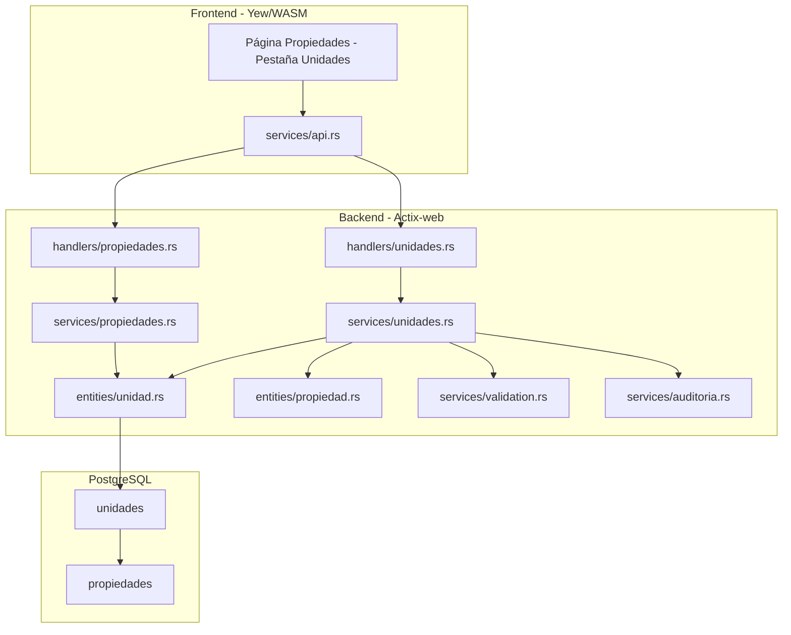
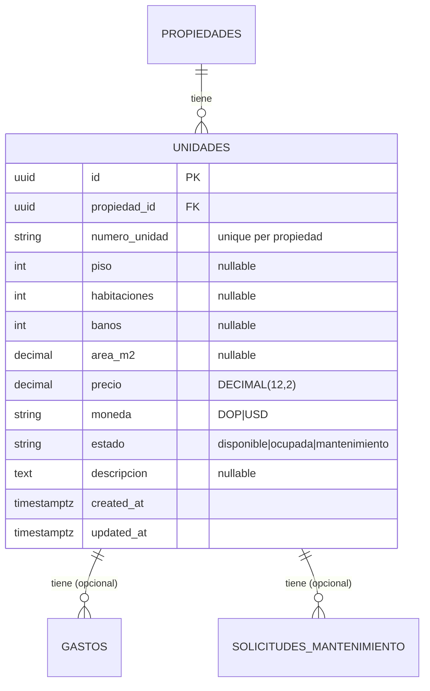

# Diseño — Gestión de Unidades

## Overview

Este módulo agrega gestión CRUD de unidades al sistema de administración inmobiliaria. Las unidades son espacios individuales (apartamentos, locales, oficinas) dentro de una propiedad multi-unidad. El módulo expone endpoints REST anidados bajo `/api/v1/propiedades/{id}/unidades`, un servicio con validación de unicidad de numero_unidad, y una pestaña "Unidades" en la vista de detalle de propiedad en el frontend. También enriquece el listado y detalle de propiedades con métricas de ocupación (conteo de unidades y tasa de ocupación).

La entidad `unidad` y su tabla `unidades` ya existen en la base de datos. No se requieren migraciones nuevas. El trabajo consiste en crear modelos request/response, servicio, handlers, rutas, y la UI frontend.

## Architecture



El flujo sigue el patrón existente:
1. El handler recibe la request HTTP, extrae Claims/WriteAccess/AdminOnly y el propiedad_id de la ruta, y delega al servicio.
2. El servicio ejecuta validaciones (propiedad existe, numero_unidad único, enums válidos, precio no negativo), operaciones de base de datos, y registra auditoría.
3. La entidad SeaORM `unidad` ya existe y mapea directamente a la tabla `unidades`.

## Components and Interfaces

### Database

No se requieren migraciones nuevas. La tabla `unidades` ya existe con las columnas: id, propiedad_id, numero_unidad, piso, habitaciones, banos, area_m2, precio, moneda, estado, descripcion, created_at, updated_at.

### SeaORM Entity

La entidad `entities/unidad.rs` ya existe con el Model, Relation (belongs_to Propiedad), y ActiveModelBehavior. No requiere modificaciones.

### API Endpoints

Todos bajo `/api/v1/propiedades/{propiedad_id}/unidades`:

| Método | Ruta | Auth | Handler | Descripción |
|--------|------|------|---------|-------------|
| GET | `/api/v1/propiedades/{propiedad_id}/unidades` | Claims | `list` | Listar unidades paginadas con filtro por estado |
| GET | `/api/v1/propiedades/{propiedad_id}/unidades/{id}` | Claims | `get_by_id` | Detalle de unidad con conteos de gastos y mantenimiento |
| POST | `/api/v1/propiedades/{propiedad_id}/unidades` | WriteAccess | `create` | Crear unidad |
| PUT | `/api/v1/propiedades/{propiedad_id}/unidades/{id}` | WriteAccess | `update` | Actualizar unidad |
| DELETE | `/api/v1/propiedades/{propiedad_id}/unidades/{id}` | AdminOnly | `delete` | Eliminar unidad |

### Request/Response Models

**`models/unidad.rs`**

```rust
#[derive(Debug, Deserialize)]
#[serde(rename_all = "camelCase")]
pub struct CreateUnidadRequest {
    pub numero_unidad: String,
    pub piso: Option<i32>,
    pub habitaciones: Option<i32>,
    pub banos: Option<i32>,
    pub area_m2: Option<Decimal>,
    pub precio: Decimal,
    pub moneda: Option<String>,       // default "DOP"
    pub estado: Option<String>,       // default "disponible"
    pub descripcion: Option<String>,
}

#[derive(Debug, Deserialize)]
#[serde(rename_all = "camelCase")]
pub struct UpdateUnidadRequest {
    pub numero_unidad: Option<String>,
    pub piso: Option<i32>,
    pub habitaciones: Option<i32>,
    pub banos: Option<i32>,
    pub area_m2: Option<Decimal>,
    pub precio: Option<Decimal>,
    pub moneda: Option<String>,
    pub estado: Option<String>,
    pub descripcion: Option<String>,
}

#[derive(Debug, Deserialize)]
#[serde(rename_all = "camelCase")]
pub struct UnidadListQuery {
    pub estado: Option<String>,
    pub page: Option<u64>,
    pub per_page: Option<u64>,
}

#[derive(Debug, Serialize)]
#[serde(rename_all = "camelCase")]
pub struct UnidadResponse {
    pub id: Uuid,
    pub propiedad_id: Uuid,
    pub numero_unidad: String,
    pub piso: Option<i32>,
    pub habitaciones: Option<i32>,
    pub banos: Option<i32>,
    pub area_m2: Option<Decimal>,
    pub precio: Decimal,
    pub moneda: String,
    pub estado: String,
    pub descripcion: Option<String>,
    pub gastos_count: Option<u64>,
    pub mantenimiento_count: Option<u64>,
    pub created_at: DateTime<Utc>,
    pub updated_at: DateTime<Utc>,
}

#[derive(Debug, Serialize)]
#[serde(rename_all = "camelCase")]
pub struct OcupacionResumen {
    pub total_unidades: u64,
    pub unidades_ocupadas: u64,
    pub tasa_ocupacion: f64,
}
```

### Service Layer

**`services/unidades.rs`**

Funciones públicas:

- `create<C: ConnectionTrait>(db, propiedad_id, org_id, input, usuario_id)` → Valida propiedad existe y pertenece a la organización, valida numero_unidad no vacío, valida unicidad de numero_unidad dentro de la propiedad, valida moneda, valida estado, valida precio >= 0, crea con estado por defecto `disponible` y moneda por defecto `DOP`, registra auditoría.
- `get_by_id(db, propiedad_id, org_id, id)` → Busca unidad, verifica que pertenece a la propiedad y organización, cuenta gastos y solicitudes de mantenimiento asociadas.
- `list(db, propiedad_id, org_id, query)` → Valida propiedad existe, lista paginada con filtro opcional por estado, ordenada por numero_unidad ASC.
- `update<C: ConnectionTrait>(db, propiedad_id, org_id, id, input, usuario_id)` → Valida unidad existe y pertenece a la propiedad, valida unicidad de numero_unidad si se cambia (excluyendo la unidad actual), valida moneda/estado/precio si se cambian, actualiza campos proporcionados, registra auditoría.
- `delete<C: ConnectionTrait>(db, propiedad_id, org_id, id, usuario_id)` → Valida unidad existe y pertenece a la propiedad, elimina, registra auditoría.
- `get_ocupacion_resumen(db, propiedad_id)` → Cuenta total de unidades y unidades con estado `ocupada`, calcula tasa de ocupación como porcentaje.

Función interna:

- `validate_numero_unidad_unique<C: ConnectionTrait>(db, propiedad_id, numero_unidad, exclude_id: Option<Uuid>)` → Busca unidades con el mismo numero_unidad en la misma propiedad (excluyendo el ID dado si es una actualización). Si existe, retorna `AppError::Conflict`.

### Handlers

**`handlers/unidades.rs`**

Sigue el patrón exacto de `handlers/propiedades.rs`:
- Cada handler es una función `async` que recibe `web::Data<DatabaseConnection>`, el extractor de auth apropiado, y los parámetros de la request.
- El `propiedad_id` se extrae del path como primer segmento.
- Las operaciones de escritura usan transacciones (`db.begin()` / `txn.commit()`).
- `create` retorna `HttpResponse::Created()`.
- `delete` retorna `HttpResponse::NoContent()`.
- Los demás retornan `HttpResponse::Ok()`.

Path parameters: Se usa un struct `UnidadPath` con `propiedad_id` y `id` para las rutas que necesitan ambos IDs.

### Route Registration

Agregar un sub-scope de unidades dentro del scope de propiedades en `routes.rs`:

```rust
.service(
    web::scope("/propiedades")
        // ... rutas existentes de propiedades ...
        .service(
            web::scope("/{propiedad_id}/unidades")
                .route("", web::get().to(handlers::unidades::list))
                .route("", web::post().to(handlers::unidades::create))
                .route("/{id}", web::get().to(handlers::unidades::get_by_id))
                .route("/{id}", web::put().to(handlers::unidades::update))
                .route("/{id}", web::delete().to(handlers::unidades::delete)),
        ),
)
```

### Enrichment of Propiedad Responses

Modificar `PropiedadResponse` para incluir campos opcionales de ocupación:

```rust
pub struct PropiedadResponse {
    // ... campos existentes ...
    pub total_unidades: Option<u64>,
    pub unidades_ocupadas: Option<u64>,
    pub tasa_ocupacion: Option<f64>,
}
```

Modificar `services/propiedades.rs`:
- En `list`: después de obtener las propiedades, hacer una consulta batch con `is_in()` para obtener conteos de unidades por propiedad_id, evitando N+1.
- En `get_by_id`: llamar a `unidades::get_ocupacion_resumen` para enriquecer la respuesta.

### Frontend

**Ruta:** No se agrega ruta nueva. Las unidades se gestionan dentro de la vista de detalle de propiedad existente.

**Componente:** `frontend/src/components/propiedades/unidades_tab.rs`

Componente `UnidadesTab` que recibe `propiedad_id` como prop e incluye:

1. **Vista de listado**: Tabla con columnas (Número, Piso, Habitaciones, Baños, Área, Precio, Estado, Acciones). Filtro por estado. Botón "Nueva Unidad".

2. **Formulario de creación/edición**: Modal con campos: numero_unidad, piso, habitaciones, baños, área m², descripción, precio, moneda (DOP/USD), estado (selector). Validación client-side del numero_unidad requerido.

3. **Control de acceso UI**: Oculta botones de crear/editar/eliminar para rol `visualizador` usando `can_write()` y `can_delete()`.

**Tipos frontend:** `frontend/src/types/unidad.rs` con structs `Unidad`, `CreateUnidad`, `UpdateUnidad`, `OcupacionResumen`.

**Integración en propiedades**: Modificar `frontend/src/pages/propiedades.rs` para agregar la pestaña "Unidades" en la vista de detalle, renderizando `UnidadesTab`.

**Métricas en listado**: Modificar la tarjeta de propiedad en el listado para mostrar "X unidades · Y% ocupación" cuando `total_unidades > 0`.

Todos los textos en español. Precios con formato de moneda (DOP/USD). Badges de color para estado (disponible=verde, ocupada=azul, mantenimiento=naranja).

## Data Models

### Entity Relationship Diagram



### Constantes de dominio

- **Estados válidos de unidad:** `disponible`, `ocupada`, `mantenimiento`
- **Monedas válidas:** `DOP`, `USD`
- **Estado por defecto:** `disponible`
- **Moneda por defecto:** `DOP`

## Correctness Properties

### Property 1: Creation round-trip preserves data

*For any* valid `CreateUnidadRequest` with an existing `propiedad_id`, creating a unidad and then retrieving it by ID should return a record where all input fields match, `estado` defaults to `"disponible"` when not specified, and `moneda` defaults to `"DOP"` when not specified.

**Validates: Requirements 1.1, 2.3**

### Property 2: Numero_unidad uniqueness within propiedad

*For any* propiedad and *for any* two distinct unidades within that propiedad, their `numero_unidad` values must differ. Attempting to create a second unidad with the same `numero_unidad` in the same propiedad should return a conflict error.

**Validates: Requirements 1.3, 5.1, 5.2**

### Property 3: List ordering invariant

*For any* set of unidades within a propiedad, listing them without filters should return records ordered by `numero_unidad` ascending — that is, for every consecutive pair `(items[i], items[i+1])`, `items[i].numero_unidad <= items[i+1].numero_unidad` (lexicographic).

**Validates: Requirements 2.1**

### Property 4: Filtering returns only matching records

*For any* estado filter applied to a list query, every record in the response should match the filter value. Specifically: if filtering by estado `E`, all returned records have `estado == E`.

**Validates: Requirements 2.2**

### Property 5: Update replaces provided fields and preserves others

*For any* existing unidad and any valid `UpdateUnidadRequest` with a subset of fields set, after updating: each provided field in the response should equal the new value, and each non-provided field should retain its previous value.

**Validates: Requirements 3.1**

### Property 6: Update preserves numero_unidad uniqueness

*For any* existing unidad, attempting to update its `numero_unidad` to a value already used by another unidad in the same propiedad should return a conflict error.

**Validates: Requirements 3.3, 5.1**

### Property 7: Invalid enum values are rejected

*For any* string value not in the set `{"disponible", "ocupada", "mantenimiento"}`, attempting to use it as estado in create or update should return a validation error. *For any* string value not in `{"DOP", "USD"}`, attempting to use it as moneda should return a validation error.

**Validates: Requirements 1.5, 1.6, 3.4, 3.5**

### Property 8: Negative prices are rejected

*For any* `Decimal` value less than zero, attempting to set it as `precio` on a unidad (create or update) should return a validation error.

**Validates: Requirements 1.7, 3.6**

### Property 9: Non-existent propiedad references are rejected

*For any* UUID that does not correspond to an existing propiedad, attempting to create a unidad under that propiedad should return a not-found error.

**Validates: Requirements 1.2, 2.5**

### Property 10: Occupancy counts are consistent

*For any* propiedad with N unidades where M have estado `"ocupada"`, the occupancy summary should report `total_unidades == N`, `unidades_ocupadas == M`, and `tasa_ocupacion == (M / N) * 100` (or 0 when N == 0).

**Validates: Requirements 8.1, 8.2, 8.3**

## Error Handling

Todos los errores siguen el patrón existente de `AppError` en `backend/src/errors.rs`:

| Escenario | Error | HTTP Status |
|-----------|-------|-------------|
| Propiedad no encontrada | `AppError::NotFound("Propiedad no encontrada")` | 404 |
| Unidad no encontrada | `AppError::NotFound("Unidad no encontrada")` | 404 |
| Numero_unidad duplicado | `AppError::Conflict("El número de unidad ya existe en esta propiedad")` | 409 |
| Numero_unidad vacío | `AppError::Validation("El número de unidad es requerido")` | 422 |
| Estado inválido | `AppError::Validation("Valor inválido para estado...")` via `validate_enum` | 422 |
| Moneda inválida | `AppError::Validation("Valor inválido para moneda...")` via `validate_enum` | 422 |
| Precio negativo | `AppError::Validation("El precio debe ser mayor o igual a cero")` | 422 |
| Visualizador intenta escribir | `AppError::Forbidden` via `WriteAccess` extractor | 403 |
| No-admin intenta eliminar | `AppError::Forbidden` via `AdminOnly` extractor | 403 |
| Error de base de datos | `AppError::Internal` via `From<DbErr>` | 500 |

## Testing Strategy

### Unit Tests

Tests en `backend/src/services/unidades.rs` bajo `#[cfg(test)]`:

- Conversión `From<Model>` para `UnidadResponse`
- Validación de precio negativo
- Validación de numero_unidad vacío

Tests en `backend/src/models/unidad.rs` bajo `#[cfg(test)]`:
- Serialización/deserialización de request/response structs con camelCase

### Property-Based Tests

Librería: `proptest` (ya en `[dev-dependencies]`).

Cada test ejecuta mínimo 100 iteraciones. Cada test referencia su propiedad del documento de diseño.

| Property | Test | Descripción |
|----------|------|-------------|
| P1 | `test_creation_round_trip` | Genera inputs válidos aleatorios, crea y recupera, verifica equivalencia |
| P2 | `test_numero_unidad_uniqueness` | Genera pares de unidades con mismo numero_unidad, verifica rechazo del segundo |
| P3 | `test_list_ordering` | Genera múltiples unidades, lista, verifica orden por numero_unidad ASC |
| P4 | `test_filtering_returns_matching` | Genera unidades con estados variados, filtra, verifica coincidencia |
| P5 | `test_update_preserves_and_replaces` | Genera updates parciales aleatorios, verifica campos actualizados y preservados |
| P6 | `test_update_uniqueness` | Genera updates que cambian numero_unidad a uno existente, verifica rechazo |
| P7 | `test_invalid_enums_rejected` | Genera strings aleatorios fuera de los conjuntos válidos, verifica rechazo |
| P8 | `test_negative_price_rejected` | Genera decimales negativos, verifica rechazo |
| P9 | `test_nonexistent_propiedad_rejected` | Genera UUIDs aleatorios inexistentes, verifica rechazo |
| P10 | `test_occupancy_counts_consistent` | Genera unidades con estados variados, verifica conteos y tasa |

Tag format: `// Feature: unidades-management, Property {N}: {title}`

Configuración: `proptest::test_runner::Config { cases: 100, .. }`

### Integration Tests

Archivo: `backend/tests/unidades_tests.rs`

Tests de ciclo completo request/response contra la API:
- CRUD completo de unidades bajo una propiedad
- Validación de unicidad de numero_unidad (create y update)
- Filtros de listado por estado
- Control de acceso (WriteAccess, AdminOnly, visualizador)
- Validaciones de enums, precio negativo, numero_unidad vacío
- Conteos de gastos y mantenimiento en detalle de unidad
- Métricas de ocupación en listado y detalle de propiedad
- Registro de auditoría para cada operación
