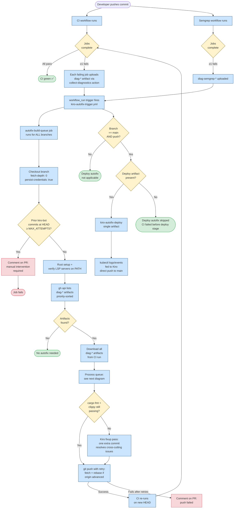
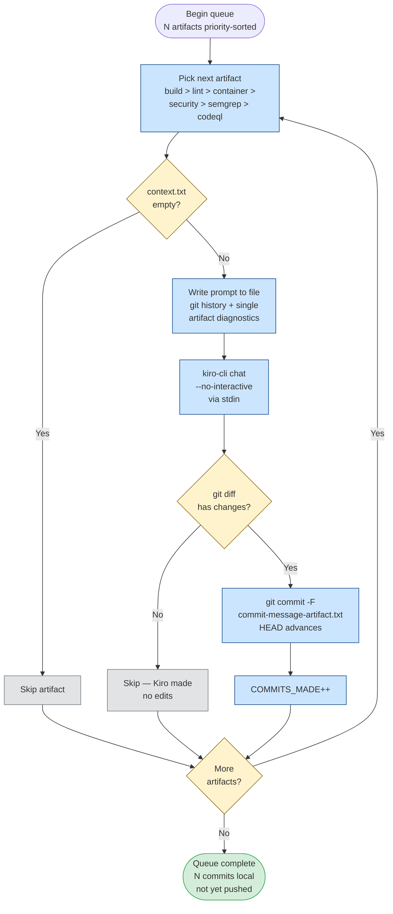
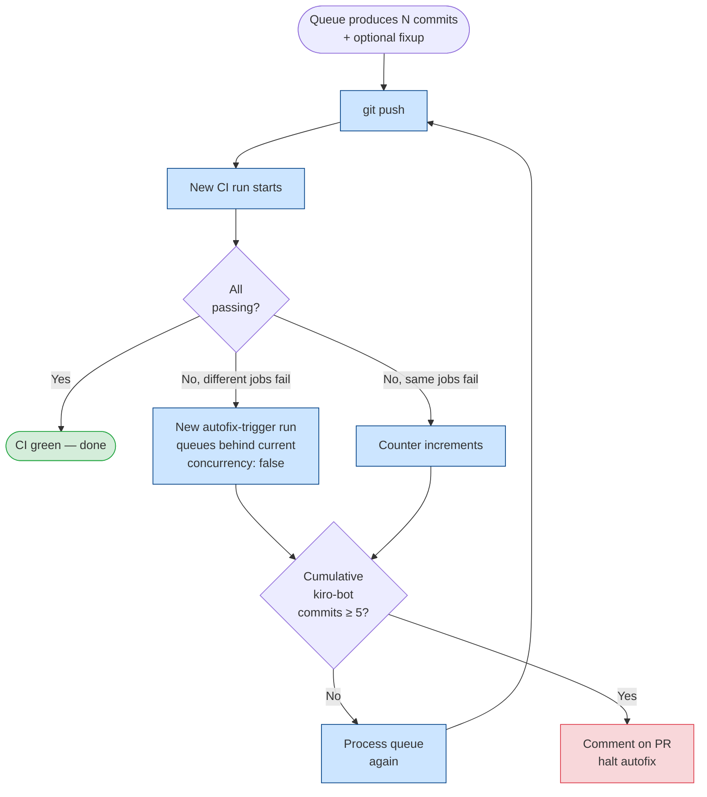

# Kiro Autofix Workflow

End-to-end flow for the autofix system. CI/Semgrep workflows complete, the
trigger workflow discovers per-job diagnostics artifacts, and a single
sequential queue produces one focused commit per failing job — pushed once
at the end.

## Overall flow



## Sequential queue (the loop body)



## Diagnostics artifact production

```mermaid
flowchart LR
    subgraph CI["CI / Semgrep workflows"]
        Backend[Backend job<br/>clippy + tests + build]
        Frontend[Frontend job<br/>clippy + tests + build]
        Lint[Lint jobs<br/>fmt, baileys-tsc]
        Container[Container jobs<br/>backend, frontend,<br/>baileys, ocr]
        Security[Security jobs<br/>cargo-deny, trivy-iac,<br/>gitleaks]
        SemgrepJob[Semgrep jobs<br/>ci, community]
        CodeQL[CodeQL jobs<br/>rust, js, python, kotlin]
    end

    subgraph Composite["collect-diagnostics composite action"]
        Build[Build context.txt<br/>job-name + step-outcomes<br/>+ tail of output files]
        Upload[Upload as<br/>diag-{suffix} artifact]
    end

    Backend -.->|on failure| Composite
    Frontend -.->|on failure| Composite
    Lint -.->|on failure| Composite
    Container -.->|on failure| Composite
    Security -.->|on failure| Composite
    SemgrepJob -.->|on failure| Composite
    CodeQL -.->|on failure| Composite

    Build --> Upload
    Upload --> Storage[(diag-build-backend<br/>diag-build-frontend<br/>diag-lint-fmt<br/>diag-container-baileys<br/>diag-security-cargo-deny<br/>diag-semgrep-ci<br/>diag-codeql-rust<br/>...)]

    Storage --> Discovery[Trigger workflow<br/>discovers via gh api]
```

## Loop protection



## Key files

- `.github/actions/collect-diagnostics/action.yml` — composite action used by every job to upload `diag-*` artifacts on failure
- `.github/workflows/kiro-autofix-trigger.yml` — the `workflow_run` listener that runs the sequential queue
- `.github/workflows/kiro-autofix.yml` — reusable workflow for the deploy stage (single artifact, no queue)
