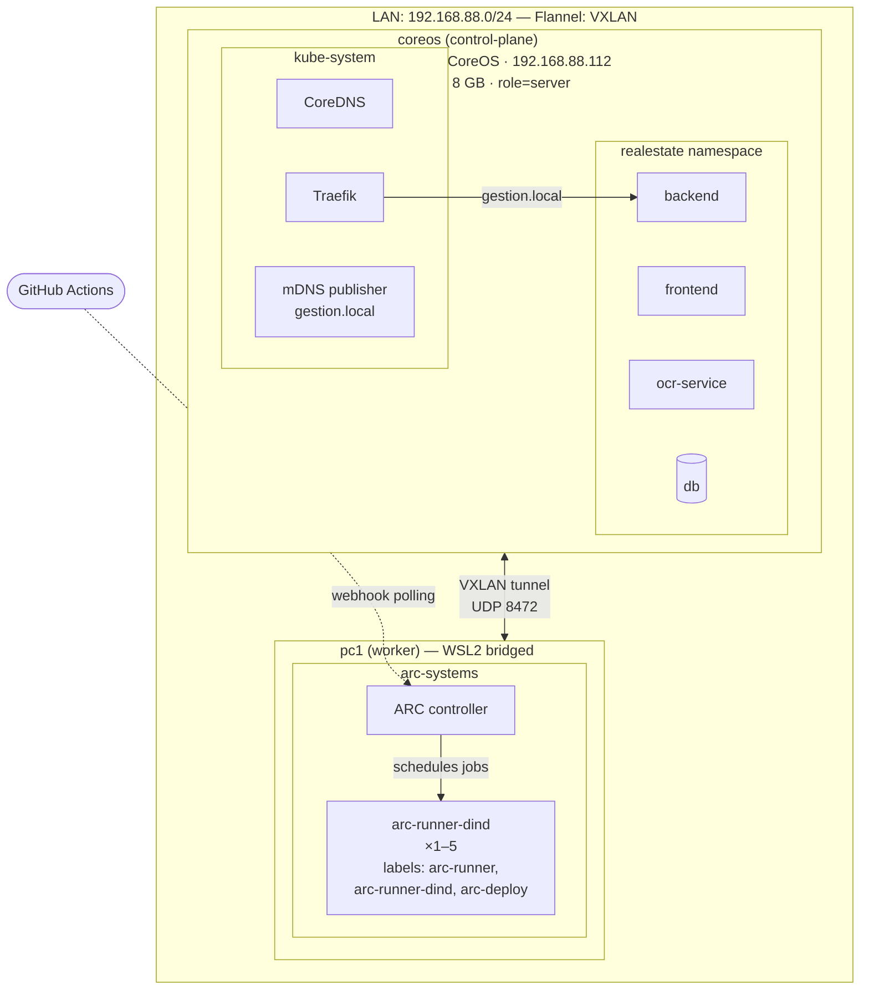
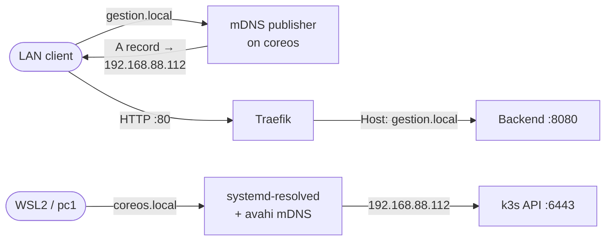

# Kubernetes Manifests (k3s)

Manifests for deploying the application to a two-node k3s cluster.

## Cluster Architecture



### DNS & Ingress Flow



## Prerequisites

- k3s cluster with Traefik ingress (default)
- `kubectl` configured to access the cluster
- GHCR image pull secret in the `realestate` namespace
- WSL2 Hyper-V switch bridged to physical Ethernet (see Networking section)

## Structure

```
k8s/
├── namespace.yml              # realestate namespace
├── mdns-publisher.yml         # mDNS responder for gestion.local
├── traefik-config.yml         # Traefik middleware and config
├── app/
│   ├── kustomization.yml      # kustomize entry point
│   ├── secret.yml             # secret templates (DO NOT commit real values)
│   ├── ghcr-secret.yml        # instructions for GHCR pull secret
│   ├── postgres.yml           # PostgreSQL deployment + PVC
│   ├── backend.yml            # Backend API deployment + uploads PVC
│   ├── frontend.yml           # Frontend (Caddy) deployment
│   ├── ocr-service.yml        # OCR service deployment
│   └── ingress.yml            # Traefik IngressRoute
└── arc-runners/
    ├── arc-runner-dind.yml               # DinD runner (labels: arc-runner, arc-runner-dind, arc-deploy; autoscaled 1-5)
    └── arc-controller-sync-period-patch.yml  # ARC controller --sync-period=10s patch
```

## Initial Setup

```bash
# 1. Create namespaces
kubectl apply -f k8s/namespace.yml

# 2. Create GHCR pull secret
kubectl create secret docker-registry ghcr-login \
  --namespace realestate \
  --docker-server=ghcr.io \
  --docker-username=<github-user> \
  --docker-password=<github-pat>

# Patch default service account to use it
kubectl patch serviceaccount default -n realestate \
  -p '{"imagePullSecrets": [{"name": "ghcr-login"}]}'

# 3. Create application secrets
kubectl create secret generic realestate-db-secret \
  --namespace realestate \
  --from-literal=username=realestate \
  --from-literal=password=<db-password>

kubectl create secret generic realestate-db-url \
  --namespace realestate \
  --from-literal=DATABASE_URL=postgresql://realestate:<db-password>@db:5432/realestate

kubectl create secret generic realestate-app-secret \
  --namespace realestate \
  --from-literal=jwt-secret=<jwt-secret>

# 4. Deploy application
kubectl apply -k k8s/app/
```

## CI/CD

The deploy workflow (`deploy.yml`) runs automatically after container images are built and attested. It:

1. Verifies image attestations via `gh attestation verify`
2. Updates secrets via `kubectl create secret --dry-run=client | kubectl apply`
3. Applies manifests via `kubectl apply -k k8s/app/`
4. Sets image digests via `kubectl set image`
5. Waits for rollout via `kubectl rollout status`
6. Runs a health check against the backend `/health` endpoint
7. Rolls back on failure via `kubectl rollout undo`

## Storage

All PVCs use `local-path` (k3s default). Data lives on the node's local disk.

## Networking

### WSL2 Bridged Networking

WSL2 is bridged to the physical Ethernet adapter, giving it a real DHCP address on the LAN (`192.168.88.0/24`). This makes WSL a direct peer to coreos — no NAT, no static routes, no IP forwarding needed.

**One-time setup** (admin PowerShell, WSL must be running so the switch exists):

```powershell
wsl --shutdown
Set-VMSwitch "WSL (Hyper-V firewall)" -NetAdapterName "Ethernet"
```

**`.wslconfig`** (`%USERPROFILE%\.wslconfig`):

```ini
[wsl2]
kernelCommandLine = cgroup_no_v1=all systemd.unified_cgroup_hierarchy=1
```

No `networkingMode` setting — the bridge overrides the default NAT. WSL gets a DHCP IP from the router on every start.

### Why not mirrored networking?

WSL mirrored networking (`networkingMode = mirrored`) was tested and does not work for k3s:
- **VXLAN fails** — the mirrored networking kernel drops TX packets on the VXLAN interface (`tx-udp_tnl-segmentation: off [fixed]`)
- **host-gw fails** — mirrored mode only mirrors traffic addressed to the host's own IPs, not routed transit traffic for pod subnets
- **Instability** — mirrored mode is prone to `0x8007054f` initialization failures requiring Windows reboots

The bridged approach avoids all of these issues.

### Flannel: VXLAN

The cluster uses the default VXLAN flannel backend. Configured in `/etc/rancher/k3s/config.yaml` on coreos:

```yaml
flannel-backend: vxlan
tls-san:
  - coreos.local
```

### k3s-lan-setup Service

On WSL start, the bridged adapter gets both an internal `172.20.x.x` IP (from WSL's built-in DHCP) and a LAN `192.168.88.x` IP (from the router). Flannel picks the first IP on eth0, which is the internal one. A systemd oneshot service runs before k3s-agent to fix this:

**`/usr/local/sbin/k3s-lan-setup.sh`** — waits for the DHCP LAN IP, removes the internal `172.20.x.x` IP from eth0, and writes the LAN IP to `/etc/rancher/k3s/config.yaml` as `node-ip`.

**`/etc/systemd/system/k3s-lan-setup.service`** — runs before `k3s-agent.service`, after `network-online.target`.

This ensures flannel always uses the LAN IP for VXLAN encapsulation.

### DNS in WSL

WSL's default DNS tunnel does not support mDNS. DNS is routed through `systemd-resolved`:

- `/etc/resolv.conf` → symlink to `/run/systemd/resolve/stub-resolv.conf`
- `/etc/wsl.conf`: `generateResolvConf = false`
- `/etc/systemd/resolved.conf.d/upstream.conf`: upstream DNS (`192.168.88.1`, `8.8.8.8`) + `MulticastDNS=yes`
- `/etc/systemd/network/10-eth0.network`: `MulticastDNS=yes`, `Domains=local`
- `/etc/nsswitch.conf`: `hosts: files resolve [!UNAVAIL=return] dns`
- Packages: `avahi-daemon`, `libnss-resolve`, `avahi-utils`

Use `coreos.local` (not bare `coreos`) for hostname resolution. The `.local` suffix is required for mDNS.

### k3s Agent URL

The k3s agent on pc1 connects to `https://coreos.local:6443` (configured in `/etc/systemd/system/k3s-agent.service.env`). The server's TLS certificate includes `coreos.local` as a SAN.

## Post-Reboot Recovery

After **coreos** reboot:
1. Verify mDNS: `ping coreos.local` from WSL
2. Restart ARC controller if runners fail: `kubectl rollout restart deployment/arc-actions-runner-controller -n arc-systems`

After **WSL** restart:
1. `k3s-lan-setup.service` runs automatically — configures the LAN IP and starts k3s-agent
2. If pc1 node is missing labels: `kubectl label node pc1 role=desktop`
3. If DNS fails: `systemctl restart systemd-resolved avahi-daemon`
4. If the Hyper-V switch bridge was lost (rare, after Windows updates): re-run `Set-VMSwitch "WSL (Hyper-V firewall)" -NetAdapterName "Ethernet"` in admin PowerShell
