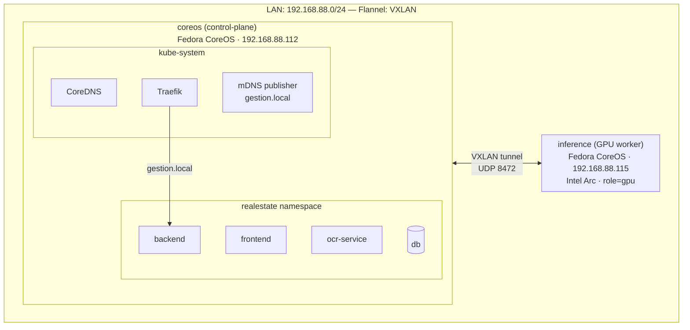
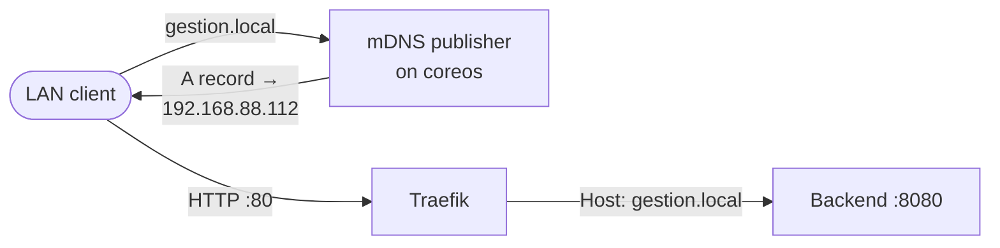

# Kubernetes Manifests (k3s)

Manifests for deploying the application to a k3s cluster (control-plane + GPU worker).

## Cluster Architecture



### DNS & Ingress Flow



## Prerequisites

- k3s cluster with Traefik ingress (default)
- `kubectl` configured to access the cluster
- GHCR image pull secret in the `realestate` namespace

## Structure

```
k8s/
├── namespace.yml              # realestate namespace
├── monitoring.yml             # Prometheus + Grafana + Node Exporter
├── alerts.yml                 # Prometheus alerting rules
├── alertmanager.yml           # Alertmanager + GitHub webhook bridge
├── logging.yml                # Loki + Alloy log collection
├── xpumanager.yml             # Intel GPU metrics
├── mdns-publisher.yml         # mDNS responder for gestion.local
├── traefik-config.yml         # Traefik middleware and config (pins version)
├── node-tuning.yml            # DaemonSet: sysctl inotify limits for Alloy
├── cleanup-orphaned-ingress.sh # One-time script: remove stale IngressRoutes
├── dashboards/
│   ├── README.md              # Dashboard management instructions
│   ├── infrastructure/        # Grafana "Infrastructure" folder
│   │   ├── grafana-xpum-dashboard.json
│   │   ├── grafana-node-exporter-dashboard.json
│   │   ├── grafana-vllm-dashboard.json
│   │   └── grafana-logs-dashboard.json
│   └── application/           # Grafana "Application" folder
│       ├── grafana-backend-api-dashboard.json
│       └── grafana-slo-dashboard.json
├── app/
│   ├── kustomization.yml      # kustomize entry point
│   ├── secret.yml             # secret templates (DO NOT commit real values)
│   ├── ghcr-secret.yml        # instructions for GHCR pull secret
│   ├── postgres.yml           # PostgreSQL deployment + PVC
│   ├── backend.yml            # Backend API deployment + uploads PVC
│   ├── frontend.yml           # Frontend (Caddy) deployment
│   ├── ocr-service.yml        # OCR service deployment
│   └── ingress.yml            # Traefik IngressRoute
```

## Initial Setup

```bash
# 1. Create namespaces
kubectl apply -f k8s/namespace.yml

# 2. Create GHCR pull secret
kubectl create secret docker-registry ghcr-login \
  --namespace realestate \
  --docker-server=ghcr.io \
  --docker-username=<github-user> \
  --docker-password=<github-pat>

# Patch default service account to use it
kubectl patch serviceaccount default -n realestate \
  -p '{"imagePullSecrets": [{"name": "ghcr-login"}]}'

# 3. Create application secrets
kubectl create secret generic realestate-db-secret \
  --namespace realestate \
  --from-literal=username=realestate \
  --from-literal=password=<db-password>

kubectl create secret generic realestate-db-url \
  --namespace realestate \
  --from-literal=DATABASE_URL=postgresql://realestate:<db-password>@db:5432/realestate

kubectl create secret generic realestate-app-secret \
  --namespace realestate \
  --from-literal=jwt-secret=<jwt-secret>

# 4. Deploy application
kubectl apply -k k8s/app/
```

## CI/CD

The deploy workflow (`deploy.yml`) runs automatically after container images are built and attested. It:

1. Verifies image attestations via `gh attestation verify`
2. Updates secrets via `kubectl create secret --dry-run=client | kubectl apply`
3. Applies manifests via `kubectl apply -k k8s/app/`
4. Sets image digests via `kubectl set image`
5. Waits for rollout via `kubectl rollout status`
6. Runs a health check against the backend `/health` endpoint
7. Rolls back on failure via `kubectl rollout undo`

## Storage

All PVCs use `local-path` (k3s default). Data lives on the node's local disk.

## Networking

### Flannel: VXLAN

The cluster uses the default VXLAN flannel backend. Configured in `/etc/rancher/k3s/config.yaml` on coreos:

```yaml
flannel-backend: vxlan
tls-san:
  - coreos.local
```

## Post-Reboot Recovery

After **coreos** reboot:
1. Verify mDNS: `ping coreos.local` from LAN
2. Check pods: `kubectl get pods -n realestate`
