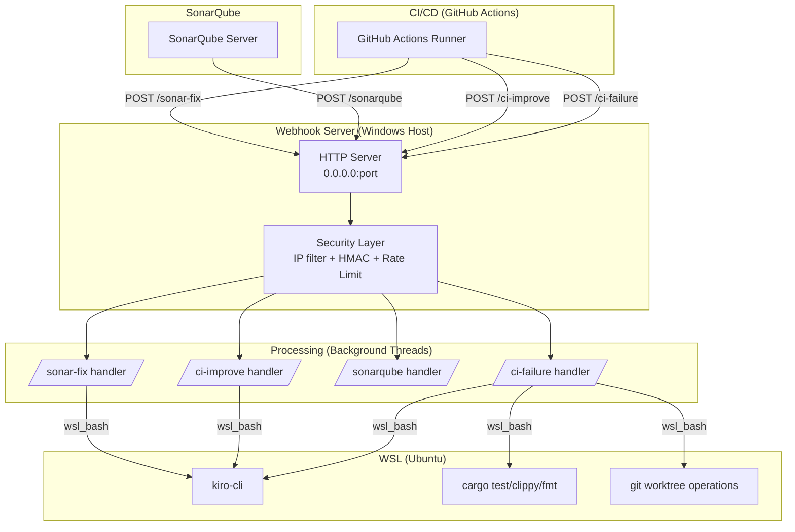
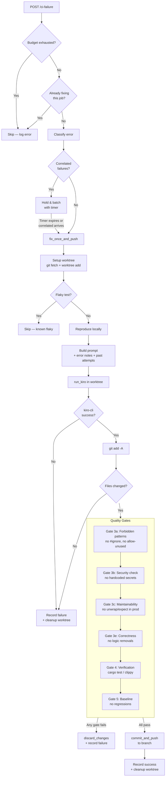
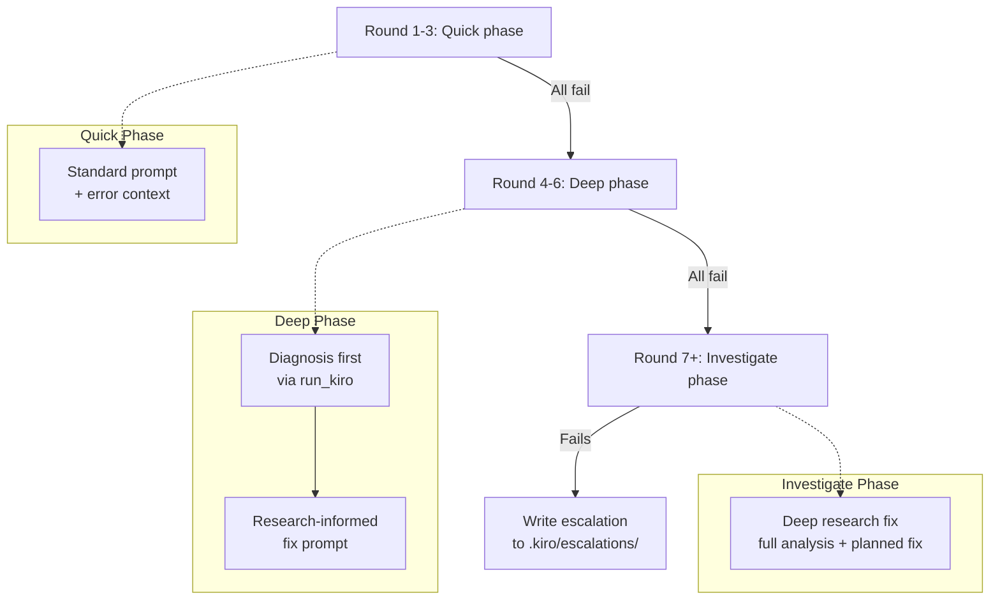
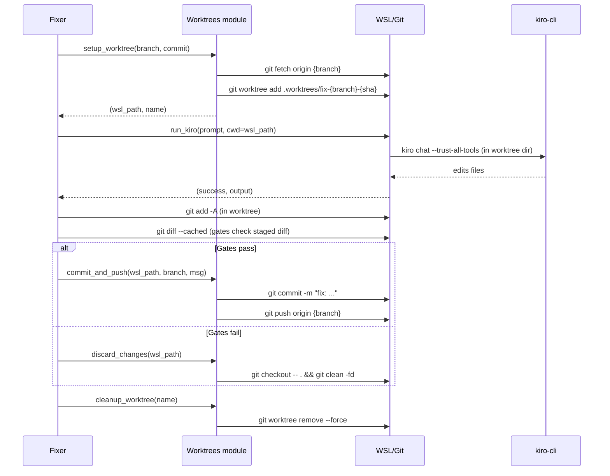
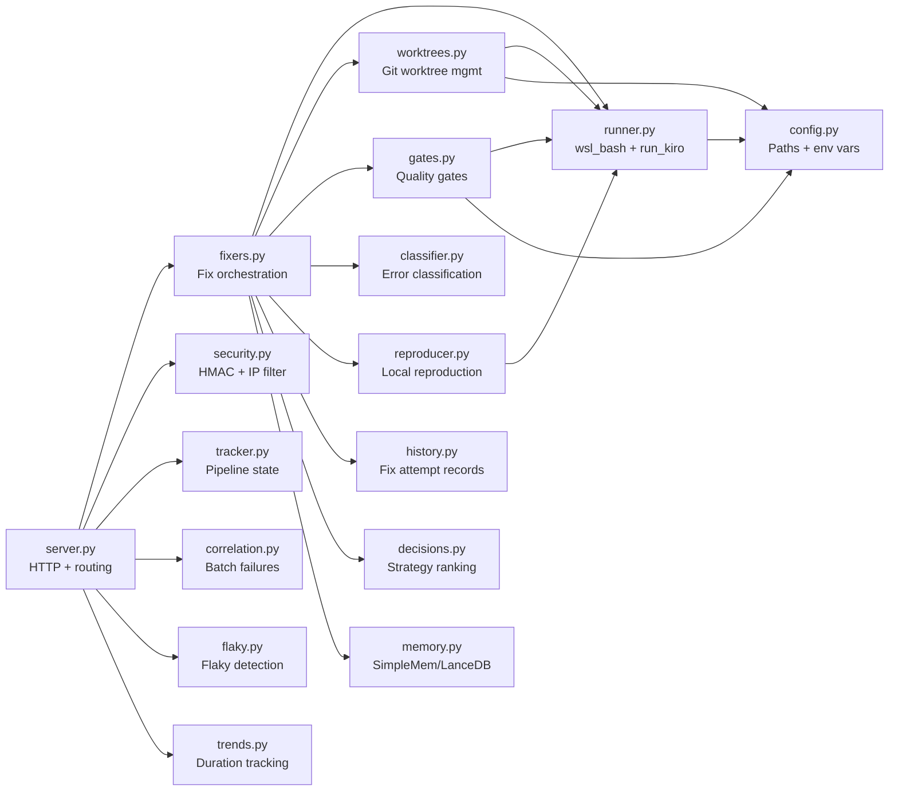
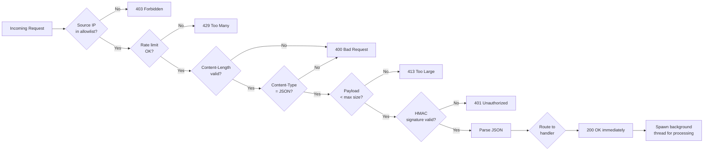
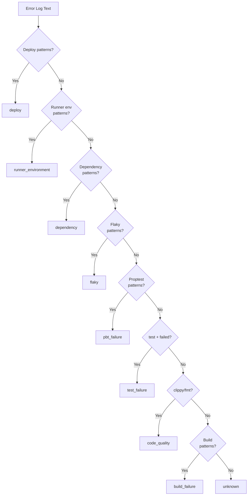

# Quality Webhook — Architecture Diagrams

## 1. System Overview

## 2. CI Failure Fix Pipeline (Primary Flow)

## 3. Retry & Escalation Strategy

## 4. Worktree Lifecycle

## 5. Module Dependency Map

## 6. Security & Request Flow

## 7. Error Classification Tree

