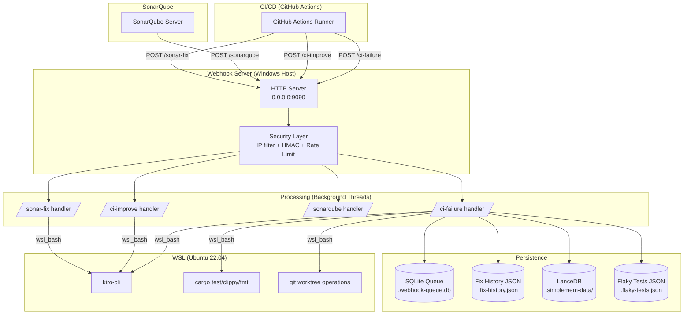
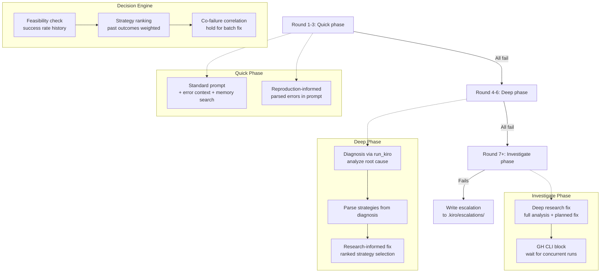
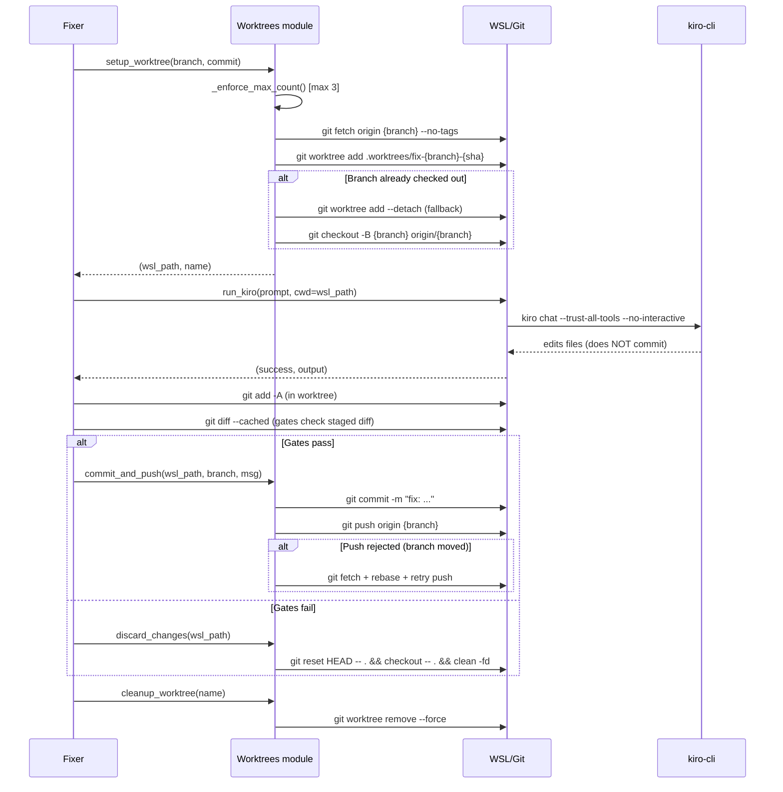
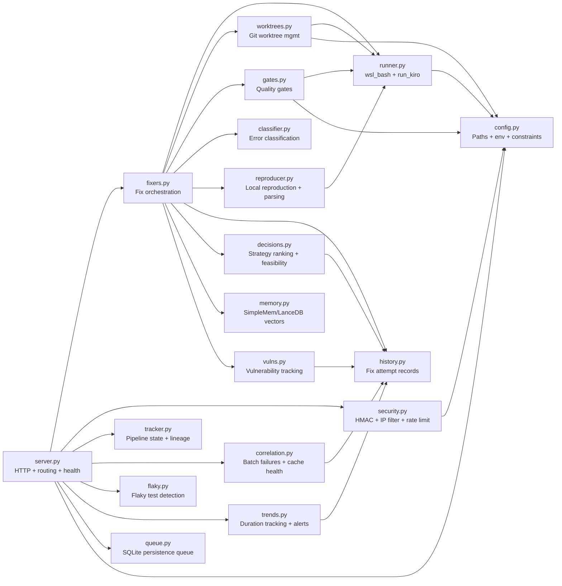
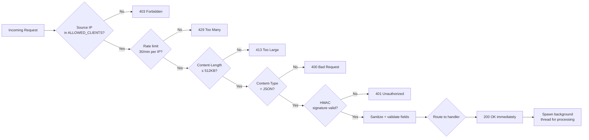
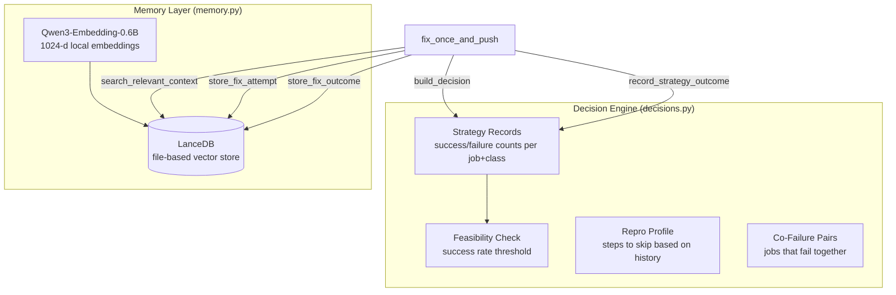
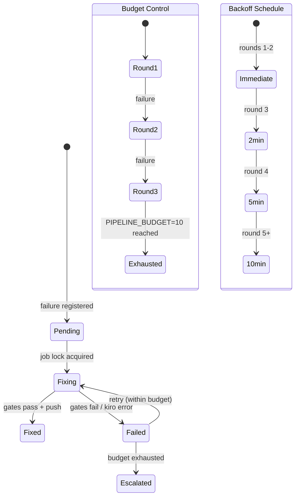
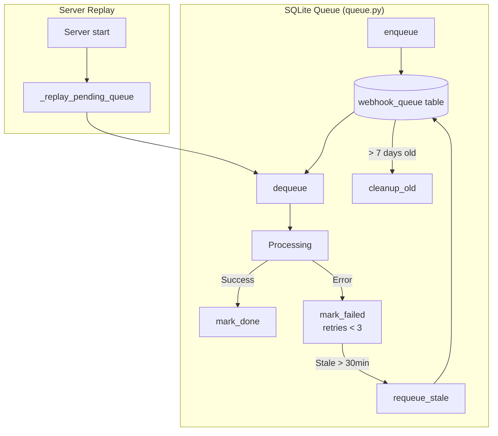
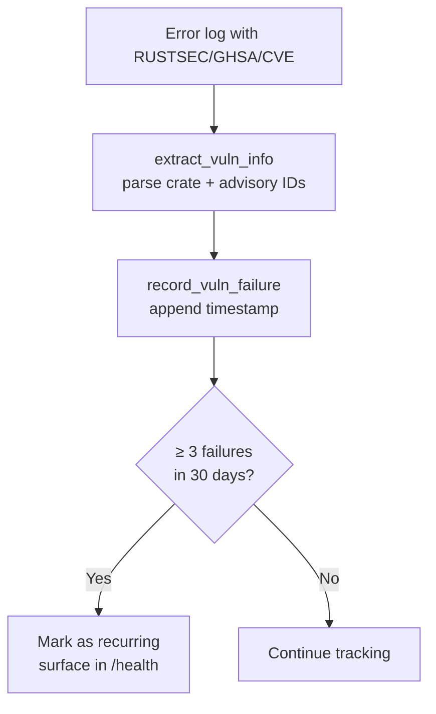

# Quality Webhook — Architecture Diagrams

## 1. System Overview



## 2. CI Failure Fix Pipeline (Primary Flow)

```mermaid
flowchart TD
    A[POST /ci-failure] --> BUD{Budget exhausted?}
    BUD -->|Yes| ESC_BUD[Write pipeline escalation]
    BUD -->|No| BACK{Backoff needed?}
    BACK -->|Yes| WAIT[Sleep backoff period]
    WAIT --> DEP_CHK{Deployed during wait?}
    DEP_CHK -->|Yes| SKIP
    DEP_CHK -->|No| LOCK
    BACK -->|No| LOCK{Job lock available?}
    LOCK -->|No| ENQUEUE[Queue pending fix]
    LOCK -->|Yes| WT[Setup worktree]

    WT -->|Failed| FAIL[Record failure]
    WT -->|OK| HEAD_CHK{HEAD matches commit?}
    HEAD_CHK -->|No| RESET[Reset to origin/branch]
    HEAD_CHK -->|Yes| CHAIN
    RESET --> CHAIN{Auto-fix chain?}
    CHAIN -->|Yes| ROLLBACK[Rollback last auto-fix]
    CHAIN -->|No| DEDUP{Preflight dedup?}

    DEDUP -->|Rejected| DEEP[Deep research fix]
    DEDUP -->|Passed| CLASS[Classify error]

    CLASS --> CORR{Correlated failures?}
    CORR -->|Yes| BATCH[Hold & batch<br/>with correlation timer]
    CORR -->|No| FLAKY_CHK{All failures flaky?}

    BATCH -->|Timer expires| FLAKY_CHK
    FLAKY_CHK -->|Yes| SKIP[Skip — known flaky]
    FLAKY_CHK -->|No| REPRO[Reproduce locally]

    REPRO --> DECIDE[Build decision<br/>ranked strategies + feasibility]
    DECIDE --> MEM[Search semantic memory]
    MEM --> PROMPT[Build prompt<br/>+ error notes + memory + past attempts]
    PROMPT --> KIRO_RUN[run_kiro in worktree]

    KIRO_RUN -->|Timeout/Error| FAIL
    KIRO_RUN -->|Success| STAGE[git add -A]

    STAGE --> DIFF{Files changed?}
    DIFF -->|No| FAIL
    DIFF -->|Yes| GATES

    subgraph GATES [Quality Gates]
        direction TB
        G3A[Gate: Forbidden patterns<br/>no #ignore, no allow-unused]
        G3B[Gate: Security check<br/>no hardcoded secrets, no unsafe without SAFETY]
        G3C[Gate: Maintainability<br/>no unwrap/expect in prod, function length]
        G3E[Gate: Correctness<br/>no logic removals, invariant preservation]
        G4[Gate: Verification<br/>cargo test / clippy / fmt]
        G4P[Gate: PBT verification<br/>proptest suite]
        G5[Gate: Baseline<br/>no regressions vs main]

        G3A --> G3B --> G3C --> G3E --> G4 --> G4P --> G5
    end

    GATES -->|Any gate fails| DISCARD[discard_changes<br/>+ record failure + store memory]
    GATES -->|All pass| COMMIT[commit_and_push<br/>via worktrees module]

    COMMIT --> OUTCOME[Store fix outcome in memory]
    OUTCOME --> CLEANUP[Cleanup worktree]
    CLEANUP --> DONE[Record success + update tracker]
```



## 3. Retry & Escalation Strategy



## 4. Worktree Lifecycle



## 5. Module Dependency Map



## 6. Security & Request Flow



## 7. Error Classification Tree

```mermaid
flowchart TD
    LOG[Error Log Text] --> DEP{Deploy patterns?<br/>health-check, compose}
    DEP -->|Yes| APP_BUG[app_bug / runner_environment]
    DEP -->|No| ENV{Runner env patterns?<br/>not found, permission denied}
    ENV -->|Yes| RUNNER[runner_environment]
    ENV -->|No| DEPN{Dependency patterns?<br/>RUSTSEC, GHSA, CVE, cargo-deny}
    DEPN -->|Yes| DEPENDENCY[dependency]
    DEPN -->|No| FLK{Flaky patterns?<br/>connection reset, broken pipe}
    FLK -->|Yes| FLAKY[flaky]
    FLK -->|No| PBT{Proptest patterns?<br/>proptest, shrunk to}
    PBT -->|Yes| PBT_F[pbt_failure]
    PBT -->|No| TST{test + failed?}
    TST -->|Yes| TEST[test_failure]
    TST -->|No| CQ{clippy/fmt?}
    CQ -->|Yes| CODE_Q[code_quality]
    CQ -->|No| BLD{Build patterns?<br/>error[E, linking, trunk}
    BLD -->|Yes| BUILD[build_failure]
    BLD -->|No| UNK[unknown]
```

## 8. Semantic Memory & Decision Engine



## 9. Pipeline Tracker & Budget



## 10. Queue & Replay



## 11. Vulnerability Tracking



## 12. Endpoint Summary

| Endpoint | Method | Handler | Purpose |
|---|---|---|---|
| `/health` | GET | `do_GET` | Health check + system stats (queue, memory, flaky, vulns, trends) |
| `/ci-failure` | POST | `_handle_ci_failure` | Fix CI failures via kiro-cli in worktrees |
| `/ci-improve` | POST | `_handle_ci_improve` | Optimize pipeline duration / fix focus areas |
| `/sonarqube` | POST | `_handle_sonarqube` | Receive SonarQube webhook (quality gate status) |
| `/sonar-fix` | POST | `_handle_sonar_fix` | Fix SonarQube issues in file groups |

## 13. Configuration Constants

| Constant | Value | Purpose |
|---|---|---|
| `PORT` | 9090 | HTTP server port |
| `BIND_ADDRESS` | 0.0.0.0 | Network binding (never change) |
| `MAX_CONCURRENT_FIXES` | 3 | Semaphore for parallel fix threads |
| `THREAD_POOL_SIZE` | 8 | Background thread pool |
| `PIPELINE_BUDGET` | 10 | Max fix rounds per pipeline lineage |
| `BACKOFF_SCHEDULE` | [0, 0, 120, 300, 600] | Seconds between retry rounds |
| `WORKTREE_MAX_COUNT` | 3 | Max simultaneous worktrees |
| `WORKTREE_MAX_AGE_H` | 4 | Auto-prune worktrees older than 4h |
| `DEDUP_WINDOW_MINUTES` | 60 | Dedup identical errors within window |
| `SONAR_PARALLEL_GROUPS` | 3 | Parallel SonarQube file group fixes |
| `KIRO_TIMEOUT` | 0 (unlimited) | kiro-cli process timeout |
| `MAX_LOG_BYTES` | 50MB | Log rotation threshold |
